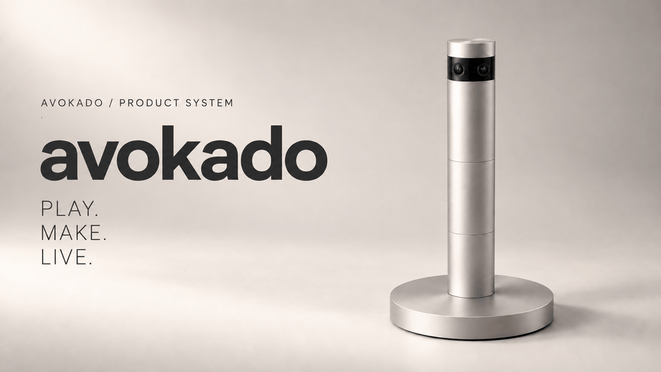

# avokado

### From playing to making. Spend less time thinking and more time creating.

A product concept that begins with games and connects creation, learning, and everyday action to enrich life as a whole. 
We are designing the compact dedicated **avocadoMini R5** device and **RockstarOS v1.0**, the current operating-system design that supports work, AI, creative assets, and permissions.
The fully recoverable and reusable small-satellite launch vehicle **rocketstar** is a separate, active design program.

[Product experience](#product-experience) · [Feature details](#feature-details) · [Current status](#current-status) · [Design library](#design-library) · [Still image](docs/brand/avokado/avokado-r5-editorial-hero.png)

> **About the image** — The R5 visual above is concept art based on the intended industrial design. The animated lines are a brand treatment, not a photograph of working hardware or proof of a spatial display.

**Open the design documents:** [avocadoMini R5 PDF](docs/avocado-mini-r5/package/avocadoMini_RockstarOS_R5_Integrated_Design.pdf) · [RockstarOS v1.0 PDF](docs/rockstaros-complete-design-v1.0.pdf) · [rocketstar R1.0 PDF](docs/rocketstar-design/outputs/rocketstar_Complete_Design_R1_0/rocketstar_Complete_Design_R1_0.pdf) · [Complete design index](#design-library)

## The business avokado is building

avokado aims to create a family of products that lets people choose their own experiences and AI teams, play, make things, and complete the work and everyday procedures they need. The business goal is **not to stop at selling a device or displaying an AI answer, but to make choosing, acting, saving, correcting, and resuming one coherent experience**.

| Audience | Intended value | Product or system |
| --- | --- | --- |
| Players and families | Play in a way that fits them—using body movement, hands, Japanese voice input, and other methods—and resume later | avocadoMini game experiences and RockstarOS |
| Creators and learners | Change rules and works, compare conditions, sources, and versions, and preserve invention candidates with evidence | Game creation, learning, Material Invention, and the Asset Registry |
| People getting work done | Find tools, ask AI teams for help, and keep track of results, costs, and failures | Sky, Zema, Tools, and Wallet |
| Tool developers and businesses | Deliver capabilities with explicit versions, permissions, execution locations, and outcomes | Sky catalog, SDK, and MCP/provider connections |

**Delivery is staged.** The web app, Linux/QEMU Developer Preview, and test-signed Pixel APK running on an existing OS are separate validation tracks. The dedicated R5 device remains at the basic-design stage and has not been approved for manufacturing, sale, or general distribution. The business goals and validation order are documented in the [product north star](docs/product-north-star-20260915.md) and [product and business strategy](docs/rockstaros-1.0-strategy.md).

### Revenue and participation

- First, we measure whether useful games, creation tasks, and work actually complete. Tool completion, delivery, revenue, and provider-confirmed payment are separate events.
- Sky is designed to charge developers and businesses neither a base fee for registering Tools nor a Sky fee on product revenue. External payment, model, cloud, and other pass-through costs are shown separately.
- **The proposed USD 8.88 user revenue fee is on hold.** No new fee will be accrued or billed until the revenue path, fee basis, calculation, cap, collection method, and consent are defined. Earlier USD 8.88 calculations are historical design and test records, not current pricing. Live billing and live payouts have not started.
- The R5 hardware price, release date, and reservation terms are undecided. Pricing from the older Tower20 E3 design does not carry over to R5.

See [Sky Tool teams and economy design](docs/sky-network-economy.md) and [Wallet/provider responsibility boundaries](docs/external-wallet-fund-provider-boundary-20260913.md).

## Product experience

| 01 — PLAY | 02 — MAKE | 03 — LIVE |
| --- | --- | --- |
| Select, move, collide, combine, and separate particles. Undo recognition errors, save, and continue later. | Edit game rules and creative work. Compare scientific-model conditions and preserve versioned invention candidates and evidence. | Extend the same interaction model to lower-risk everyday assistance such as procedures, timers, interruption and resumption, and the last observed time and location of an object. |

This is the **planned order of experience development**. It does not mean that all three stages already work on physical R5 hardware. The product is not designed to release physical particles or manufacture physical compounds.

### avocadoMini R5 — current product requirements

**R5 is the current design baseline.** It begins with a single unit capable of the basic functions.

| Area | R5 design baseline |
| --- | --- |
| Appearance | No more than 200 mm tall in use; a slim silver cylinder with a black camera band and low circular base. Final dimensions, mechanisms, and hole locations are undecided. |
| Stand-alone operation | One unit handles input, local compute, game state, storage, voice, and stopping. A separate Edge Hub, PC, or continuous internet connection is not a basic-function requirement. |
| Expansion | Additional identical minis may collaborate after owner approval, device authentication, and clock and coordinate calibration. Performance will be measured separately with one, two, and four units. |
| Power | External power is required. The current design does not use a battery. The connector, rating, and thermal design will be finalized together with the display method. |
| Display | The requirement is to show particles in the surrounding real space without glasses, but the method and safety remain research topics. Infrared sensing light, a television, AR glasses, or wall projection do not count as proof that this requirement is met. |

The [51-page integrated R5 basic design](docs/avocado-mini-r5/README.md) ([PDF](docs/avocado-mini-r5/package/avocadoMini_RockstarOS_R5_Integrated_Design.pdf) · [Word](docs/avocado-mini-r5/package/avocadoMini_RockstarOS_R5_Integrated_Design.docx) · [complete ZIP](docs/avocado-mini-r5/avocadoMini_R5_Integrated_Design_Package.zip)) contains requirements, candidate components, comparative calculations, drawings, and assembly and acceptance plans. Fourteen automated checks reproduce arithmetic and decision conditions; **zero physical-device tests have been completed, and manufacturing approval is on hold**. The “four units plus a separate hub” Tower20 E3 material still visible on the public product site is classified as a [historical design](docs/avocado-mini-tower20-e3/README.md).

## Feature details

### 1. Input, Japanese voice, and accessibility

The design translates hand and body position, short Japanese commands, and physical input into semantic operations: select, move, confirm, cancel, and stop. Nearby targets use hand position; distant targets use direction. Multiple candidates are never confirmed automatically. If tracking is lost, the system does not misinterpret the loss as a release; it cancels the hold or pauses instead.

- From first-run setup, users can choose seated operation, one-handed operation, small movements, or non-voice input. Body calibration is not a condition of participation.
- Voice validation begins with short local commands. Recognition and execution approval remain separate; an ambiguous “yes” never authorizes billing or an external action.
- Camera and microphone indicators, a physical stop control, and guest settings are part of the design. Raw image and audio storage and external transmission are off by default.

[Interaction states and error prevention](docs/avocado-mini-r5/package/integrated_design.md#17a-%E7%A9%BA%E9%96%93%E3%81%AE%E4%B8%AD%E3%81%A7%E9%81%B8%E3%82%93%E3%81%A7%E5%8B%95%E3%81%8B%E3%81%99%E6%93%8D%E4%BD%9C) / [Startup and input-selection diagram](docs/avocado-mini-r5/package/drawings/R5-U01-startup.png)

### 2. Games

The default particle sandbox uses the smallest loop of “select → move → release → collide/combine/separate → undo → save/resume.” It preserves rules, random seeds, and work versions so a state can be reproduced. Shared use accounts for clock and coordinate drift, disconnection, and one participant stopping. The author SDK receives semantic operations so a game does not automatically gain raw-image or payment authority.

**Commercial-game support is evaluated title by title.** This input design alone does not mean that games such as GTA run, can be modified, or have official integration. [Game features and acceptance conditions](docs/avocado-mini-r5/package/integrated_design.md#03-%E3%82%B2%E3%83%BC%E3%83%A0%E3%81%A8%E5%88%B6%E4%BD%9C%E3%81%AE%E5%9F%BA%E6%9C%AC%E6%A9%9F%E8%83%BD) / [Game and Wallet workstream](docs/workstreams/08-game-market-fund.md)

### 3. Creation, learning, and asset management

The concept supports editing a game's appearance, rules, and stages and saving the result as a versioned work that can be rolled back. Learning use distinguishes an interesting result from a scientifically correct one and shows the model, units, initial conditions, and limits. Before a work leaves the system, the Asset Registry records its author, source material, generation and edit history, version, license basis, cost, and publication scope. Generation completion and publication success are separate states.

### 4. Material Invention

This application track creates reproducible digital candidates from two or more materials, ratios, and processes; checks hazardous conditions and evidence; and hands candidates to simulation or Patent AI. Material Invention Core manages the candidate graph, versions, and provenance. What exists today is an **equipment-disconnected sandbox Core and an integrated design**. **The Material Invention interface and Sky connection are not implemented**; R5 physical sensors, the spatial interface, simulation providers, and external laboratories are not connected. A candidate is not proof of a material's physical performance or patentability.

[Material Invention system design](docs/rockstaros-avocado-mini-complete-design.md) / [Core design](docs/material-invention-core.md) / [Ownership and acceptance](docs/workstreams/11-material-invention-avocado-mini.md)

### 5. Everyday assistance

Short interactions learned through games are extended gradually to next/back steps, timers, interruption and resumption, and the last observed time and location of an object. Compatible device actions such as lighting are accepted individually only after checking the target device, effect, authority, and result. The product does not promise the current location of an unseen object, physical completion of household chores, medical judgment, or unattended operation of locks or heating devices.

### 6. RockstarOS / Local AI

RockstarOS centralizes user and component authentication, capabilities, approvals, work, receipts, storage, and recovery in the Platform Core and Broker. The on-device LLM is an **untrusted planner that returns plan candidates**; it does not decide whether a Tool may run. An Agent advances only through finite procedures allowed by the Broker and handles stopping, awaiting confirmation, and safe recovery after a restart. Models and runtimes are designed to be replaceable in the future, but general replacement is not complete.

[Current OS v1.0 source and appendices](#rockstaros-v10--current-os-design) / [Complete OS design](docs/rockstaros-complete-design.md) / [Shared AI-native OS architecture](docs/ai-native-os-architecture.md) / [LLM implementation and open work](docs/llm-evaluation-architecture.md)

### 7. Sky, Zema, and Tools

**Sky** is the entry point for discovering Tools and AI teams and comparing their author, version, permissions, execution location, and cost before connecting. **Zema** takes a request and manages input confirmation, planning, progress, stopping, user approval, deliverables, and history as one unit of work. Chat text and AI answers are not themselves approvals.

| Representative Tool or team | Function | Boundary |
| --- | --- | --- |
| CSV Operations | Clean CSV data, run an independent review, and generate delivery artifacts | Sales, customer sharing, and payment are separate |
| Mercari Revenue Starter | Draft listings for owned items and organize costs and expected net proceeds | The owner lists, communicates, and ships; revenue is real only after provider confirmation |
| Fashion Brand Ops | Prepare campaigns, DM and quote drafts, post-order production, and analysis | Posting, advertising, sending DMs, billing, and refunds require action-specific approval |
| Citation Organizer / Free Article | Organize URLs and produce a free introduction from the user's draft | Does not perform fact-checking, autonomous writing, or external posting |
| Legal Intake / Patent Assistant | Organize information and prepare drafts based on official sources for experts or filings | Does not make legal determinations, determine patentability, or file automatically |
| Market Scanner / Fund | Estimate prices and demand, record PAPER activity, and compare configurations against evidence | Live orders, returns, and live-fund operation require separate acceptance |

The catalog also includes Tools for checking Coconala opportunities, reconciling delivery records, and subscription advisory work. A candidate Tool is not considered operational merely because it is listed. [Complete Tool inputs, outputs, storage, and failure behavior](docs/sky-tools-complete-design.md) / [Project guide](PROJECTS.md)

### 8. External AI, IP, games, and destinations

The design does not lock creation or game destinations to a single service. Providers are selected by capability, destination, commercial terms, cost, region, and quality. Image, video, 3D, and audio generation; social publication; game submission; and reward assignment are separate effects. External transmission, publication, and purchases require owner approval that fixes the target, content, and spending limit. If the result is unknown, the system queries and stops.

Higgsfield, Roblox, YouTube, and GTA are examples of possible destinations. **This is not a list of supported products, official partnerships, or guaranteed compatibility.** [IP Studio connection contract](docs/sky-tools-complete-design.md#85-ip-studio--%E4%BA%A4%E6%8F%9B%E5%8F%AF%E8%83%BD%E3%81%AA%E5%88%B6%E4%BD%9C%E9%85%8D%E4%BF%A1%E3%82%B2%E3%83%BC%E3%83%A0%E5%B1%95%E9%96%8B)

### 9. Wallet, costs, and verified earnings

Wallet treats cost estimation, reservation, and finalization; signed Earning Receipts; and refunds and reconciliation as separate concerns. Finishing work alone does not create displayed earnings. Owner assets and external-provider payment, custody, and identity verification remain external responsibilities under the shared contract. Game-currency exchange, ATM, Fund, and live payouts each have their own gates; PAPER or fixture success is never treated as live-money acceptance.

[Wallet, billing, and provider workstream](docs/workstreams/03-wallet-billing-providers.md) / [Game-exchange boundary](docs/game-wallet-release-checkpoint-20260910.md)

## Current status

| Track | Verified | Incomplete |
| --- | --- | --- |
| avocadoMini R5 | Integrated basic design, 51 pages, eight design-study diagrams, and 14 calculation checks | Zero physical-device tests; unaided full-space display, precise 3D input, final enclosure, thermal and power design, manufacturing drawings, and safety acceptance |
| RockstarOS v1.0 | Current 41-page, 32-chapter OS/system-software design; five deployment profiles, 13 logical services, 60 requirements; 43/43 appendix structure and DDL checks | New OS image, R5 Device Profile and adapter, and physical-device, onboard, and field acceptance. Document checks are not operational tests. |
| rocketstar R1.0 | Current 44-page, 35-chapter integrated rocket design with 60 requirements and 18 system interfaces | Manufacturing drawings, physical performance, and flight certification. Comparative calculations are not final performance. |
| Web / Sky / Zema | Source for screens, catalog, work, approvals, history, and the Tool foundation | Current-version readback for each deployment, external providers, and production commercial acceptance |
| Pixel 10 GL066 | Pre-tests on an existing OS with a test-signed APK for offline planning, limited Tools, storage, and restart | Full RockstarOS image build, production signing, first flash and boot, OTA, and total-loss recovery |
| Linux / QEMU | Independent Developer Preview implementation and acceptance records | Release gates for the current artifact; not transferable to Pixel physical-device acceptance |
| Material Invention | Reproducible sandbox Core and integrated design | R5 input/display adapter, interface, physical sensors, and simulation/Patent AI connections |

R5 manufacturing approval is **on hold**, and **all four Pixel first-flash gates are failing**. Task counts are not a measure of product completion.

<!-- project-overview:start -->
Updated: 2026-09-24 / 156 tasks: 104 done, 31 in progress, 20 planned, 1 blocked
<!-- project-overview:end -->

[All task progress](project.md#%E5%85%A8task%E3%81%AE%E4%BD%9C%E6%A5%AD%E9%80%B2%E6%8D%97) / [Pixel pre-tests](docs/evidence/android-pixel-10-prefull-physical-20260916.json) / [First-flash gates](docs/android-first-flash-gate-20260916.md) / [R5 preservation and verification record](docs/avocado-mini-r5/verification.json)

## Design library

**The current device design is avocadoMini R5, the current OS/system-software design is RockstarOS v1.0, and the current rocket design is rocketstar R1.0.** Their source documents and appendices are linked below. The existence of a design document does not prove physical operation, manufacturing approval, or flight certification.

[Device R5](#avocadomini-r5--source-and-verification-materials) · [OS v1.0](#rockstaros-v10--current-os-design) · [Rocket R1.0](#rocketstar-r10--current-rocket-design) · [Design domains](#rockstaros-and-services--all-design-domains) · [Historical designs](#historical-and-alternate-research-profiles)

### avocadoMini R5 — source and verification materials

| What to read | File |
| --- | --- |
| Overview and reading order | [R5 design entry point](docs/avocado-mini-r5/README.md) / [Package guide](docs/avocado-mini-r5/package/README.md) |
| Read, edit, or download everything | [51-page PDF](docs/avocado-mini-r5/package/avocadoMini_RockstarOS_R5_Integrated_Design.pdf) / [Word](docs/avocado-mini-r5/package/avocadoMini_RockstarOS_R5_Integrated_Design.docx) / [Complete ZIP](docs/avocado-mini-r5/avocadoMini_R5_Integrated_Design_Package.zip) |
| Full text, requirements, prototypes, and acceptance conditions | [Integrated design Markdown](docs/avocado-mini-r5/package/integrated_design.md) |
| Comparative calculations | [Results](docs/avocado-mini-r5/package/calculation_results.json) / [Verification program](docs/avocado-mini-r5/package/verify_calculations.py) |
| References | [Reference index](docs/avocado-mini-r5/package/reference_index.json) / [Everyday requirements](docs/avocado-mini-r5/package/references/01-life-needs.md) / [Interaction studies](docs/avocado-mini-r5/package/references/02-interaction-studies.md) / [Compute and display](docs/avocado-mini-r5/package/references/03-platform-and-display.md) |
| Research history | [Research report](docs/avocado-mini-r5/research/README.md) / [Research audit](docs/avocado-mini-r5/research/RESEARCH_AUDIT.md) |
| Source verification | [Package SHA-256 ledger](docs/avocado-mini-r5/package/package_manifest.json) / [Preservation and verification record](docs/avocado-mini-r5/verification.json) |

The **eight design-study diagrams** are viewable as PNGs in a browser and scalable as SVGs. They explain layout and behavior; they are not manufacturing CAD or final circuit diagrams.

| ID | Subject | Open |
| --- | --- | --- |
| M01 | Overall height and envelope comparison | [PNG](docs/avocado-mini-r5/package/drawings/R5-M01-envelope.png) / [SVG](docs/avocado-mini-r5/package/drawings/R5-M01-envelope.svg) |
| M02 | Functional zones inside the device | [PNG](docs/avocado-mini-r5/package/drawings/R5-M02-functional-stack.png) / [SVG](docs/avocado-mini-r5/package/drawings/R5-M02-functional-stack.svg) |
| V01 | Camera field-of-view and depth comparison | [PNG](docs/avocado-mini-r5/package/drawings/R5-V01-camera-geometry.png) / [SVG](docs/avocado-mini-r5/package/drawings/R5-V01-camera-geometry.svg) |
| E01 | Power and independent stopping | [PNG](docs/avocado-mini-r5/package/drawings/R5-E01-power-safety.png) / [SVG](docs/avocado-mini-r5/package/drawings/R5-E01-power-safety.svg) |
| S01 | Adding identical minis and dividing regions | [PNG](docs/avocado-mini-r5/package/drawings/R5-S01-scaling.png) / [SVG](docs/avocado-mini-r5/package/drawings/R5-S01-scaling.svg) |
| U01 | Startup, input selection, and shutdown | [PNG](docs/avocado-mini-r5/package/drawings/R5-U01-startup.png) / [SVG](docs/avocado-mini-r5/package/drawings/R5-U01-startup.svg) |
| O01 | OS service architecture | [PNG](docs/avocado-mini-r5/package/drawings/R5-O01-services.png) / [SVG](docs/avocado-mini-r5/package/drawings/R5-O01-services.svg) |
| O02 | Owner approval and external jobs | [PNG](docs/avocado-mini-r5/package/drawings/R5-O02-consent.png) / [SVG](docs/avocado-mini-r5/package/drawings/R5-O02-consent.svg) |

### RockstarOS v1.0 — current OS design

The attached `RockstarOS_Complete_Design_v1.0.pdf` has the same SHA-256 as the source preserved in the repository. This **41-page, 32-chapter document is the current OS design baseline**. It covers identity, state, work, evidence, and versions shared by rocketstar, A-LINK, avokado, and a future colony. Device-specific control and independent protection remain on each device.

| What to read | File |
| --- | --- |
| Complete version and editable text | [41-page source PDF](docs/rockstaros-complete-design-v1.0.pdf) / [Editable text](docs/rocketstar-design/outputs/RockstarOS_Complete_Design_v1_0/RockstarOS_Complete_Design_v1_0.md) / [Full-text search extract](docs/rockstaros-complete-design-v1.0.txt) / [Appendix ZIP](docs/rocketstar-design/outputs/RockstarOS_Complete_Design_v1_0_package.zip) |
| What deploys where | [Five deployment profiles and 13 logical services](docs/rocketstar-design/outputs/RockstarOS_Complete_Design_v1_0/design_catalog.json) / [Architecture](docs/rocketstar-design/outputs/RockstarOS_Complete_Design_v1_0/architecture.svg) / [60 requirements and acceptance conditions](docs/rocketstar-design/outputs/RockstarOS_Complete_Design_v1_0/requirements.csv) |
| Command, storage, and connection contracts | [Seven schema types, composition examples, and five-table DDL](docs/rocketstar-design/outputs/RockstarOS_Complete_Design_v1_0/contracts/README.md) / [Command state diagram](docs/rocketstar-design/outputs/RockstarOS_Complete_Design_v1_0/command_lifecycle.svg) / [Capacity assumptions](docs/rocketstar-design/outputs/RockstarOS_Complete_Design_v1_0/capacity_example.json) |
| Verification and implementation mapping | [43/43 structure and DDL checks](docs/rocketstar-design/outputs/RockstarOS_Complete_Design_v1_0/evidence/contract_checks.json) / [Source and appendix integrity](docs/rocketstar-design/outputs/RockstarOS_Complete_Design_v1_0/manifest.json) / [Existing implementation mapping](docs/rockstaros-complete-design.md) / [Appendix guide](docs/rocketstar-design/outputs/RockstarOS_Complete_Design_v1_0/README.md) |

**Relationship to R5:** The source `EDGE-HUB-v1` material and architecture diagram retain the historical avokado E3 layout of “four units plus a separate hub.” That is not the current avocadoMini R5 envelope, unit-count, or hub requirement. R5 takes precedence: **one unit must provide basic functionality, and a separate Edge Hub is not required**. Integration of the R5 Device Profile and adapter is incomplete. The 43/43 result covers document and contract checks, not completion of a new OS image, physical-device acceptance, flight acceptance, or habitat operational certification.

### rocketstar R1.0 — current rocket design

The attached **rocketstar_Complete_Design_R1_0.pdf** has the same SHA-256 as the source preserved in the repository. R1.0 is the current 44-page, 35-chapter integrated design for uncrewed small-satellite transport with **recovery of both stages and reuse of the same vehicle**. It covers the vehicle, propulsion, thermal protection, flight dynamics, avionics, payload integration, ground systems, maintenance, and reuse.

| What to read | File |
| --- | --- |
| Complete version | [Source PDF](docs/rocketstar-design/outputs/rocketstar_Complete_Design_R1_0/rocketstar_Complete_Design_R1_0.pdf) / [Searchable and editable text](docs/rocketstar-design/outputs/rocketstar_Complete_Design_R1_0/rocketstar_Complete_Design_R1_0.md) / [All appendices ZIP](docs/rocketstar-design/outputs/rocketstar_Complete_Design_R1_0_package.zip) |
| Overview and contents | [R1.0 package guide](docs/rocketstar-design/outputs/rocketstar_Complete_Design_R1_0/README.md) / [Archive entry point](docs/rocketstar-design/README.md) |
| Requirements and interfaces | [60 requirements](docs/rocketstar-design/outputs/rocketstar_Complete_Design_R1_0/requirements.json) / [18 system interfaces](docs/rocketstar-design/outputs/rocketstar_Complete_Design_R1_0/system_interfaces.json) / [Mission profile](docs/rocketstar-design/outputs/rocketstar_Complete_Design_R1_0/mission_profile.json) |
| Inherited material and audits | [40 C3 design items](docs/rocketstar-design/outputs/rocketstar_Complete_Design_R1_0/reference_c3/design_register.md) / [13 payload interfaces](docs/rocketstar-design/outputs/rocketstar_Complete_Design_R1_0/reference_c3/payload_interfaces.md) / [Mass and performance audit](docs/rocketstar-design/outputs/rocketstar_Complete_Design_R1_0/mass_audit/mass_performance.md) |
| Diagrams and integrity | [Vehicle arrangement](docs/rocketstar-design/outputs/rocketstar_Complete_Design_R1_0/rocketstar_system.svg) / [Functional layout](docs/rocketstar-design/outputs/rocketstar_Complete_Design_R1_0/rocketstar_functional_layout.svg) / [Appendix ledger](docs/rocketstar-design/outputs/rocketstar_Complete_Design_R1_0/manifest.json) / [Complete file ledger](docs/rocketstar-design/inventory.json) / [Verification record](docs/rocketstar-design/verification.json) |
| Related communications and operations designs | [A-LINK auto-connect PDF](docs/rocketstar-design/outputs/A-LINK_Avokado_Auto_Connect_Design_v0.3.pdf) / [Receiver prototype](docs/rocketstar-design/outputs/A-LINK_Avokado_Receiver_Prototype_v0.4/README.md) / [Colony operations](docs/rocketstar-design/outputs/RockstarOS_Colony_C0_1/README.md) / [Device button design](docs/rocketstar-design/outputs/Avokado_Power_Button_Engineering_v1/README.md) |

**Current status:** Integrated system design only. Manufacturing drawings, physical performance, and flight certification are incomplete. The 618.6 t and 819.7 t values in the PDF are historical comparative calculations, not final launch capability or vehicle dimensions. Rocket R1.0 and device R5 are separate product design baselines.

### RockstarOS and services — all design domains

The [complete design portal](docs/rockstaros-design-portal.md) covers 17 domains, and the [machine-readable design index](data/design-document-index.json) lists their documents. Because the complete OS source includes the historical E3 device layout, **R5 takes precedence for avocadoMini's envelope, unit count, and hub requirements**.

| Domain | Designs, contracts, and records |
| --- | --- |
| Product requirements and business | [Product baseline](docs/product-baseline.md) / [Requirements JSON](data/product-baseline.json) / [Product north star](docs/product-north-star-20260915.md) / [Business strategy](docs/rockstaros-1.0-strategy.md) / [Product/service/system map](docs/rockstaros-product-system-map.md) |
| Complete OS source | [PDF](docs/rockstaros-complete-design-v1.0.pdf) / [Search extract](docs/rockstaros-complete-design-v1.0.txt) / [Integrity record](data/rockstaros-complete-design-v1.0.json) / [Schema, DDL, and appendix guide](docs/rocketstar-design/outputs/RockstarOS_Complete_Design_v1_0/README.md) / [Appendix contracts](docs/rocketstar-design/outputs/RockstarOS_Complete_Design_v1_0/contracts/README.md) / [Appendix ledger](docs/rocketstar-design/outputs/RockstarOS_Complete_Design_v1_0/manifest.json) |
| OS architecture and implementation mapping | [Complete design](docs/rockstaros-complete-design.md) / [Shared AI-native architecture](docs/ai-native-os-architecture.md) / [1.0 architecture](docs/rockstaros-1.0-architecture.md) |
| Platform Core and work | [Platform Core](docs/platform-core.md) / [Platform API contract](contracts/platform-api.json) |
| Web and PC | [Web architecture](docs/architecture.md) / [Backend design](docs/backend-design.md) |
| Linux and QEMU | [Native integration](docs/native-os-integration.md) / [Validation](docs/native-os-validation.md) / [Release audit](data/qemu-release-audit.json) |
| Android and Pixel | [Production OS architecture](docs/android-production-architecture.md) / [Device Preview](docs/phone-preview-20260911.md) / [Device support design](docs/device-support-architecture.md) / [Release policy](data/android-release-architecture-policy.json) |
| Local AI and memory | [Shared AI-native architecture](docs/ai-native-os-architecture.md) / [Decision Fabric](docs/jev-local-qwen-decision-fabric-design.md) / [On-device AI integration](docs/local-ai-os-integration-20260915.md) / [Runtime contract](contracts/local-ai-runtime.json) / [Provider contract](contracts/decision-provider.json) / [Decision policy](data/decision-fabric-policy.json) |
| Sky, Zema, and Tools | [Complete Tool design](docs/sky-tools-complete-design.md) / [Sky](docs/sky.md) / [Tool SDK](docs/sky-tool-sdk.md) / [Conversation and MCP control](docs/chat-mcp-control-room-20260913.md) / [Jev ecosystem](docs/jev-ecosystem-integration-design.md) / [Jev Ultrafast](docs/jev-ultrafast-integration-design.md) |
| MCP and external providers | [MCP architecture](docs/sky-mcp-architecture.md) / [MCP Connector](docs/sky-mcp-connector.md) / [External-provider boundary](docs/external-wallet-fund-provider-boundary-20260913.md) |
| Storage, backup, and recovery | [Storage boundaries](docs/data-storage-boundaries.md) / [Android backup and recovery](docs/android-backup-recovery.md) / [Recovery policy](data/android-backup-recovery-policy.json) |
| Wallet, Market, and Fund | [External-provider boundary](docs/external-wallet-fund-provider-boundary-20260913.md) / [Market and Fund](docs/everything-market-and-autonomous-fund-20260913.md) / [Wallet production rail](docs/rock-wallet-production-rail-20260913.md) |
| Safety, operations, and distribution | [Incident response](docs/security-incident-response.md) / [Release gates](docs/release-minimum-gates.md) / [Emergency-action policy](data/device-emergency-access-policy.json) / [Release decision](data/release-readiness.json) |
| Game and IP | [Game API draft](docs/game-api-contract-draft.md) / [GX01 plan](docs/gx01-contract-implementation-plan.md) / [SDK sandbox](docs/gx01-reference-sdk-sandbox-20260910.md) |
| Material Invention and spatial interaction | [Integrated design](docs/rockstaros-avocado-mini-complete-design.md) / [Core](docs/material-invention-core.md) / [XR](docs/material-invention-xr.md) / [Spatial invention](docs/avocado-mini-spatial-invention.md) / [Full-scale hardware design](docs/avocado-mini-hardware-design.md) |
| Validation and operations | [Validation policy](docs/validation.md) / [Database status](docs/database-status.md) / [Progress JSON](data/project-status.json) |

### Historical and alternate research profiles

Historical designs remain available to preserve the design history. They do not override R5 requirements.

| Track | Design material |
| --- | --- |
| Mini200 E1 | [Entry point](docs/avocado-mini-mini200-e1/README.md) / [Design text](docs/avocado-mini-mini200-e1/design.md) / [Game-to-life expansion](docs/avocado-mini-mini200-e1/game-first-life-connectivity.md) |
| Mini200 E2 | [Four-unit plus central-unit integration record](docs/avocado-mini-mini200-e2/README.md) |
| Tower20 E3 | [Four-unit plus separate Edge Hub design record](docs/avocado-mini-tower20-e3/README.md). The source PDF/DOCX is not included in this repository, so the full source document cannot be read here. |
| Alternate research profile | [Four-direction, full-scale hardware design](docs/avocado-mini-hardware-design.md) / [Spatial invention](docs/avocado-mini-spatial-invention.md) |

## Design and code entry points

| Goal | Entry point |
| --- | --- |
| Read business and product decisions | [Product baseline](docs/product-baseline.md) / [Product north star](docs/product-north-star-20260915.md) / [System map](docs/rockstaros-product-system-map.md) |
| Read avokado hardware and OS material | [Complete R5 design](docs/avocado-mini-r5/README.md) / [Searchable text](docs/avocado-mini-r5/package/integrated_design.md) / [Drawings](docs/avocado-mini-r5/package/drawings/) |
| Read the complete RockstarOS design | [Design portal](docs/rockstaros-design-portal.md) / [Complete v1.0 source PDF](docs/rockstaros-complete-design-v1.0.pdf) / [Implementation mapping](docs/rockstaros-complete-design.md) |
| Find Tools and development areas | [Complete Sky, Zema, and Tool design](docs/sky-tools-complete-design.md) / [Project guide](PROJECTS.md) / [Workstream guide](docs/workstreams/README.md) |
| Read the current rocket design | [rocketstar R1.0 source PDF](docs/rocketstar-design/outputs/rocketstar_Complete_Design_R1_0/rocketstar_Complete_Design_R1_0.pdf) / [Appendix entry point](docs/rocketstar-design/README.md) / [Public HTML reader](https://avocado-mini.kirin-999.chatgpt.site/rocket-star/design/). Manufacturing and flight acceptance are separate. |

| Source | Role |
| --- | --- |
| [app/](app/), [components/](components/), and [lib/](lib/) | Web screens, shared UI, Tools, work, and Wallet |
| [services/](services/) | Separated Sky Billing and Operator Dock services |
| [android/](android/) and [os/](os/) | Android app/Broker and Pixel configuration |
| [systems/rock-star-os/](systems/rock-star-os/) | Native OS for Linux/QEMU |
| [toolkits/](toolkits/) and [contracts/](contracts/) | SDKs, connectors, and shared contracts |
| [sites/avocado-mini/](sites/avocado-mini/) | Product-site source, distinct from a public deployment |

## Start developing

Use Node.js 22.13 or later and npm. The following starts the web app locally. Pixel, QEMU, Workers, and the product site have separate instructions and gates.

    npm ci
    npx wrangler d1 migrations apply DB --local --config wrangler.local.jsonc
    npm run dev

The public avocadoMini site is built with Astro; its reservation and payment API is staged separately as a Cloudflare Worker.

    cd sites/avocado-mini
    npm ci
    npm run dev
    npm test
    npm run build

After updating documents or progress, run the following checks. The final calculation command regenerates JSON; it does not represent physical-device acceptance.

    npm run project:update
    npm run verify
    python3 scripts/verify-avocado-r5-package.py
    python3 docs/avocado-mini-r5/package/verify_calculations.py

[Linux/QEMU](docs/workstreams/06-native-qemu-release.md) / [Android/Pixel](docs/workstreams/07-android-device-local-ai.md) / [avocadoMini](docs/workstreams/11-material-invention-avocado-mini.md)

## Safety, rights, and images

Purpose-specific permission is designed for recording, external publication, appliance operation, purchasing, and payment. Information about housemates or visitors is not stored based only on the purchaser's consent. Medical decisions, emergency monitoring, and unattended operation of locks or heating appliances are not initial targets. RockstarOS 1.0 is a Developer Preview, and the reuse license for proprietary code has not been selected. Bundled open-source software, models, and external services each have their own terms. [Distribution requirements](docs/release-minimum-gates.md) / [Sources and licenses](docs/mr-integration.md)

Images and GIFs are concept material for explaining the product. They are not product photographs or evidence of a working spatial display, manufacturing approval, or safety performance.
