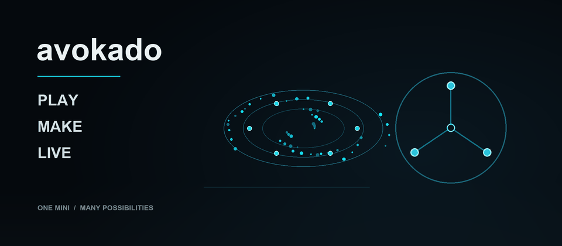
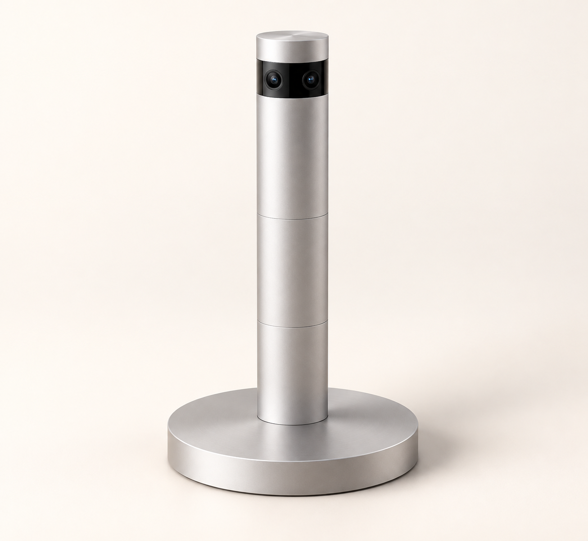
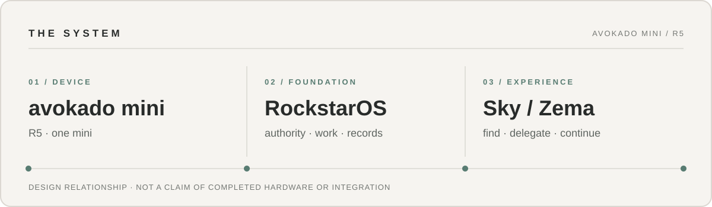
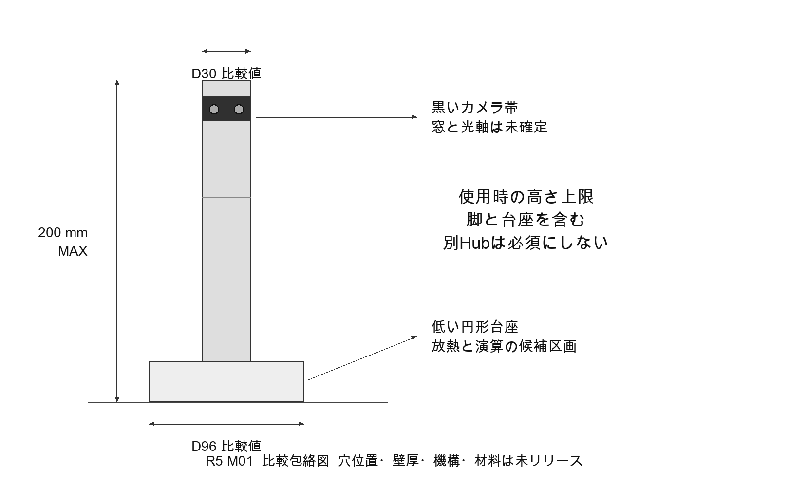
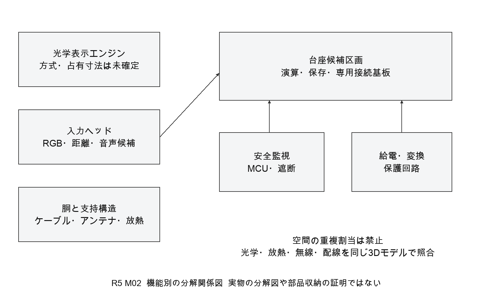
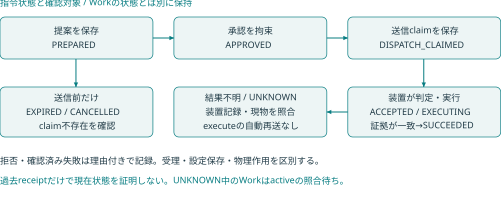
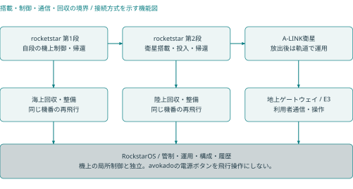

# avokado

### 遊ぶことから、つくることへ。考える時間を、つくる時間に。

ゲームを入口に、生活全体をより豊かにするため、制作・学習・日常の行動をつなぐ製品構想。 
小さな専用端末 **avocadoMini R5** と、仕事・AI・作品・権限を支える現行OS設計 **RockstarOS v1.0** を設計しています。
両段を回収・再使用する小型衛星輸送ロケット **rocketstar** は、別の現行設計系列です。

[製品体験](#製品体験) · [機能の詳細](#機能の詳細) · [現在地](#現在地) · [設計書ライブラリ](#設計書ライブラリ)

  
   
  avocadoMini R5 · 1本で基本機能を担う構成

> **画像の扱い** — 製品ビジュアルは外観を示すコンセプト画像です。ハードウェアの実機写真や、空間表示の実証映像ではありません。上のGIFはブランドの概念を表すオリジナルアニメーションです。

**設計書をすぐ開く:** [avocadoMini R5 PDF](docs/avocado-mini-r5/package/avocadoMini_RockstarOS_R5_Integrated_Design.pdf) · [RockstarOS v1.0 PDF](docs/rockstaros-complete-design-v1.0.pdf) · [rocketstar R1.0 PDF](docs/rocketstar-design/outputs/rocketstar_Complete_Design_R1_0/rocketstar_Complete_Design_R1_0.pdf) · [全設計書の一覧](#設計書ライブラリ)

## avokado が目指す事業

avokadoは、利用者が自分の体験やAIチームを選び、遊び、作品をつくり、必要な仕事や生活の手順を進められる製品群を目指します。**端末を売るだけ、AIの回答を見せるだけで終わらせず、選択・実行・保存・訂正・再開までを一つの体験にする**ことが事業上の狙いです。

| 対象 | 提供したい価値 | 製品・仕組み |
| --- | --- | --- |
| 遊ぶ人・家族 | 身体、手、日本語音声など自分に合う方法で遊び、途中から再開する | avocadoMiniのゲーム体験とRockstarOS |
| つくる人・学ぶ人 | ルールや作品を変え、条件・出所・版を残して比べる | ゲーム制作、学習、Material Invention、Asset Registry |
| 仕事を進める人 | 道具を探し、AIチームへ依頼し、結果・費用・失敗を見失わない | Sky、Zema、Tool、Wallet |
| Tool開発者・事業者 | 版、権限、実行場所、成果を明示して機能を届ける | Sky catalog、SDK、MCP／Provider接続 |

**提供形態は段階的です。** Webアプリ、Linux/QEMU Developer Preview、既存OS上のPixel向け試験署名APKはそれぞれ検証系列です。R5の専用端末は基本設計段階で、製造・販売・一般配布の承認はまだありません。事業目的と検証順序は[製品目的](docs/product-north-star-20260915.md)と[製品・事業設計](docs/rockstaros-1.0-strategy.md)に記録しています。

### 収益と参加の考え方

- まず、役立つゲーム・制作・仕事が実際に完了するかを測ります。Tool完了、納品、売上、入金は別の出来事として扱います。
- Skyでは、開発者・事業者がToolを登録する基本利用料と、その商品売上に対するSky手数料を0とする方針です。外部決済、モデル、クラウド等の実費は分けて示します。
- 利用者側の料金は、既存実装の「検証済み収益から月最大8.88 USDを回収する」契約と、検証可能な利益に対する成功報酬への変更案を区別します。**新しい率、利益の定義、上限、回収方法、開発者還元率は未確定で、実課金・実払出しは開始していません。**
- R5の本体価格、発売日、予約条件は未確定です。旧Tower20 E3の価格をR5に引き継ぎません。

詳しくは[SkyのToolチームと経済設計](docs/sky-network-economy.md)、[Walletと外部Providerの責任分界](docs/external-wallet-fund-provider-boundary-20260913.md)を参照してください。

## 製品体験

| 01 — PLAY | 02 — MAKE | 03 — LIVE |
| --- | --- | --- |
| 粒子を選び、動かし、衝突・結合・分離する。誤認識したら取り消し、保存して続きから遊ぶ。 | ゲームのルールや作品を編集する。科学モデルの条件を比べ、発明候補と根拠を版付きで残す。 | 手順、タイマー、中断と再開、最後に観測した物の場所など、危険度を絞った生活支援へ広げる。 |

これは**開発する体験の順番**です。R5の実機でこの3段階が動作済みという意味ではありません。実物の粒子を放出したり、実物の化合物を作ったりする製品でもありません。

### avocadoMini R5 — 現行の製品要求

**現在の設計基準はR5です。** 1本で基本機能を担う構成を起点にします。

| 項目 | R5の設計基準 |
| --- | --- |
| 外観 | 使用時全高200mm以内。銀色の細い円筒、黒いカメラ帯、低い円形台座。最終寸法・機構・穴位置は未確定 |
| 単体動作 | 1本で入力、ローカル演算、ゲーム状態、保存、音声、停止を担う。別Edge Hub、PC、常時インターネットを基本機能の必須条件にしない |
| 増設 | 同じminiを追加し、本人承認、機器認証、時計と座標の校正を経て共同利用する。1・2・4本で性能を別々に実測する |
| 電源 | 外部給電が必要。電池は現行構成に採用していない。給電口、定格、熱設計は表示方式と合わせて確定する |
| 表示 | 眼鏡なしで周囲の実空間に粒子が見えることを要求するが、方式と安全は研究段階。センサー用の赤外光、TV、AR眼鏡、壁投影は達成証拠にしない |

[51ページのR5統合基本設計](docs/avocado-mini-r5/README.md)（[PDF](docs/avocado-mini-r5/package/avocadoMini_RockstarOS_R5_Integrated_Design.pdf)・[Word](docs/avocado-mini-r5/package/avocadoMini_RockstarOS_R5_Integrated_Design.docx)・[一括ZIP](docs/avocado-mini-r5/avocadoMini_R5_Integrated_Design_Package.zip)）には要求、候補部品、比較計算、図面、組立と受入計画があります。14件の自動チェックは算術と判定条件の再現で、**実機試験は0件、製造承認は保留**です。公開製品サイトに残る「4本＋別Hub」のTower20 E3は[過去の設計](docs/avocado-mini-tower20-e3/README.md)として区別します。

## 機能の詳細

### 1. 入力・日本語音声・アクセシビリティ

手と身体の位置、短い日本語命令、物理入力を、選択・移動・確定・取消・停止という意味操作へ変換する設計です。近い対象は手の位置、遠い対象は方向で候補にし、複数候補があるときは自動確定しません。追跡が途切れても「放した」と誤解せず、保持を解除または休止します。

- 初回設定から、着座・片手・小さな動作・音声以外の入力を選べるようにする。身体較正を参加条件にしない。
- 音声は短いローカル命令から検証する。認識と本人の実行承認を分け、曖昧な「はい」だけで課金や外部操作を行わない。
- カメラ・マイクの状態表示、物理停止、ゲスト設定を設計に含む。生画像・生音声の保存と外部送信は初期値OFF。

[操作状態と誤操作防止](docs/avocado-mini-r5/package/integrated_design.md#17a-空間の中で選んで動かす操作) / [起動と入力選択の図](docs/avocado-mini-r5/package/drawings/R5-U01-startup.png)

### 2. ゲーム

標準の粒子サンドボックスは「選ぶ → 動かす → 放す → 衝突・結合／分離 → 取消 → 保存・再開」を最小ループとします。ルール、乱数種、作品の版を残して同じ状態を再現し、共同利用では時刻と座標のずれ、通信断、片方の停止を扱います。作者向けSDKは意味操作を受け取り、ゲームが原画像や支払い権限を無条件に得ない構成です。

**市販ゲームへの対応はタイトル別です。** GTAなどの動作、改造、公式連携を、この入力設計だけで実現済みとは表示しません。[ゲーム機能と受入条件](docs/avocado-mini-r5/package/integrated_design.md#03-ゲームと制作の基本機能) / [Game・Wallet担当分野](docs/workstreams/08-game-market-fund.md)

### 3. 制作・学習・作品の管理

ゲームの見た目、規則、ステージを編集し、前版へ戻せる作品として保存する構想です。学習用途では「面白い結果」と「科学的に正しい結果」を分け、モデル名、単位、初期条件、適用限界を示します。作品を外部へ出す際は、作者、元素材、生成・編集履歴、版、ライセンス根拠、費用、公開範囲をAsset Registryへ記録する設計です。生成完了と公開成功は別状態です。

### 4. Material Invention

二つ以上の物質・比率・工程から、再現可能なデジタル候補をつくり、危険条件と根拠を確認し、シミュレーションやPatent AIへ渡す応用系統です。候補のgraph、版、出所をMaterial Invention Coreが管理します。現在あるのは**装置非接続のsandbox Coreと統合設計**です。**Material Inventionの操作画面とSky接続は未実装**で、R5の実センサー、空間操作画面、simulation Provider、外部ラボも未接続です。候補は実材料の性能や特許性の証明ではありません。

[Material Invention全体設計](docs/rockstaros-avocado-mini-complete-design.md) / [Core設計](docs/material-invention-core.md) / [担当と受入](docs/workstreams/11-material-invention-avocado-mini.md)

### 5. 生活支援

ゲームで覚えた短い操作を、手順の次へ・戻る、タイマー、中断と再開、最後に観測した物の時刻・場所へ段階的に広げます。対応を確認した照明などの操作は、対象機器・作用・権限・結果を確認してから個別に受け入れます。見えていない物の現在位置、家事の物理代行、医療判断、施錠や加熱機器の無人運転を約束しません。

### 6. RockstarOS / Local AI

RockstarOSは、本人とcomponentの認証、capability、承認、仕事、receipt、保存・復旧をPlatform Core / Brokerに集めます。端末内LLMは**計画候補を返す非信頼のplanner**で、Toolの実行許可を決めません。AgentはBrokerが許可した有限手順を進め、停止・確認待ち・再起動後の安全な復旧を扱います。モデルとruntimeは将来交換できる設計ですが、汎用差替えが完成したわけではありません。

[現行OS v1.0の原本と付録](#rockstaros-v10--現行のos設計書) / [OS全体詳細設計](docs/rockstaros-complete-design.md) / [AIネイティブOS共通設計](docs/ai-native-os-architecture.md) / [LLMの実装と未完了](docs/llm-evaluation-architecture.md)

### 7. Sky、Zema、Tool

**Sky**はToolやAIチームを探し、作者・版・権限・実行場所・費用を比べて接続する入口です。**Zema**は依頼を受け、入力確認、計画、進捗、停止、本人確認、成果、履歴を一つの仕事として扱います。会話の文章やAIの回答は承認そのものではありません。

| 代表的なTool・チーム | 行うこと | 境界 |
| --- | --- | --- |
| CSV業務 | CSVの整形、独立検査、納品用成果の生成 | 販売・顧客共有・入金は別 |
| メルカリ収益スターター | 所有商品の出品下書き、費用と見込み手取りの整理 | 個人出品・連絡・発送は本人。実収益はProvider確認後 |
| Fashion Brand Ops | キャンペーン、DM・見積り案、受注後の制作、分析 | 投稿、広告、DM送信、請求・返金は操作別承認 |
| 出典整理・記事の無料版 | URL整理と本人の原稿からの無料紹介版生成 | 事実確認、自動執筆、外部投稿はしない |
| 法務受付・特許アシスタント | 情報整理、公式資料、専門家・出願用の下書き | 法律判断、特許性の確定、自動出願はしない |
| Market Scanner・Fund | 価格・需要の試算、PAPER記録、実績に基づく構成比較 | 実注文、利回り、実資金運用は別受入 |

ココナラ案件チェック、納品記録照合、サブスク顧問などのToolもcatalogにあります。候補Toolは掲載だけで動作済みとはしません。[全Toolの入力・出力・保存・失敗時の詳細](docs/sky-tools-complete-design.md) / [プロジェクト別ガイド](PROJECTS.md)

### 8. 外部AI・IP・ゲーム・配信先

制作先やゲーム先を一つのサービスに固定せず、能力、送信先、商用条件、費用、地域、品質でProviderを選ぶ設計です。画像・動画・3D・音声の生成、SNS公開、ゲームへの提出、報酬付与を別の作用として扱います。外部送信、公開、購入には対象・内容・費用上限を固定した本人承認が必要で、結果不明なら照会して止めます。

Higgsfield、Roblox、YouTube、GTAなどは接続先の例です。**対応済み・公式提携・動作保証の一覧ではありません。** [IP Studioの接続契約](docs/sky-tools-complete-design.md#85-ip-studio--交換可能な制作配信ゲーム展開)

### 9. Wallet、費用、検証済み収益

Walletは、費用の見積・予約・確定、署名されたEarning Receipt、返金・照合を別々に扱います。仕事が終わっただけで収益を表示しません。所有者の資産、外部Providerの決済・保管・本人確認は共通契約の外部責任として分けます。ゲーム通貨交換、ATM、Fund、実払出しはそれぞれ固有のgateがあり、PAPERやfixtureの合格を実資金の合格にしません。

[Wallet・Billing・Provider担当分野](docs/workstreams/03-wallet-billing-providers.md) / [ゲーム交換の境界](docs/game-wallet-release-checkpoint-20260910.md)

## 現在地

| 系列 | 確認できたこと | 未完了のこと |
| --- | --- | --- |
| avocadoMini R5 | 統合基本設計、51ページ、設計検討図8点、計算チェック14件 | 実機0件。裸眼全空間表示、精密3D入力、最終収納・熱・電源、製造図・安全受入 |
| RockstarOS v1.0 | 現行のOS・システムソフト設計、41ページ・32章、5配備profile・13論理service・60要求。付録の構造・DDL検査43/43 | 新OS image、R5用Device Profileとadapter、実機・機上・現地運用の受入。文書検査を動作試験としない |
| rocketstar R1.0 | 現行のロケット統合設計、44ページ・35章、60要求・18全体接続 | 製造図面、実機性能、飛行認定。比較計算値を確定性能としない |
| Web / Sky / Zema | 画面、catalog、仕事・承認・履歴、Tool基盤のsource | 配備先ごとの最新版readback、外部Provider、本番商流の受入 |
| Pixel 10 GL066 | 既存OS上の試験署名APKでオフライン計画、限定Tool、保存・再起動などの事前試験 | RockstarOS全体のimage build、正式署名、初回flash・boot、OTA、全損復元 |
| Linux / QEMU | 独立したDeveloper Previewの実装・受入記録 | 現行artifactのrelease gate。Pixel向け実機合格へ転用しない |
| Material Invention | 再現可能なsandbox Coreと統合設計 | R5入力・表示adapter、操作画面、実センサー、simulation／Patent AI接続 |

R5は**製造承認保留**、Pixelの初回flash gateは**4項目とも未合格**です。件数は製品の完成率ではありません。

<!-- project-overview:start -->
更新日: 2026-09-24 / 153 task中101 done・31 in progress・20 planned・1 blocked
<!-- project-overview:end -->

[全taskの作業進捗](project.md#全taskの作業進捗) / [Pixel事前試験](docs/evidence/android-pixel-10-prefull-physical-20260916.json) / [初回flash gate](docs/android-first-flash-gate-20260916.md) / [R5保存・検証記録](docs/avocado-mini-r5/verification.json)

## 設計書ライブラリ

**現行の端末設計はavocadoMini R5、OS・システムソフト設計はRockstarOS v1.0、ロケット設計はrocketstar R1.0です。** それぞれの原本と付録を以下から直接開けます。設計書の存在は、実機動作、製造承認、飛行認定を示しません。

[端末 R5](#avocadomini-r5--原本と検証資料) · [OS v1.0](#rockstaros-v10--現行のos設計書) · [ロケット R1.0](#rocketstar-r10--現行のロケット設計書) · [領域別の設計資料](#rockstarosサービス--全設計領域) · [旧版](#旧版別研究profile)

### avocadoMini R5 — 原本と検証資料

| 読みたいもの | ファイル |
| --- | --- |
| 概要と読み順 | [R5設計書の入口](docs/avocado-mini-r5/README.md) / [パッケージ案内](docs/avocado-mini-r5/package/README.md) |
| 閲覧・編集・一括取得 | [PDF・51ページ](docs/avocado-mini-r5/package/avocadoMini_RockstarOS_R5_Integrated_Design.pdf) / [Word](docs/avocado-mini-r5/package/avocadoMini_RockstarOS_R5_Integrated_Design.docx) / [全資料ZIP](docs/avocado-mini-r5/avocadoMini_R5_Integrated_Design_Package.zip) |
| 全文と要求・試作・受入条件 | [統合設計Markdown](docs/avocado-mini-r5/package/integrated_design.md) |
| 比較計算 | [計算結果](docs/avocado-mini-r5/package/calculation_results.json) / [再計算プログラム](docs/avocado-mini-r5/package/verify_calculations.py) |
| 参考資料 | [参考資料索引](docs/avocado-mini-r5/package/reference_index.json) / [生活上の要求](docs/avocado-mini-r5/package/references/01-life-needs.md) / [操作研究](docs/avocado-mini-r5/package/references/02-interaction-studies.md) / [計算・表示](docs/avocado-mini-r5/package/references/03-platform-and-display.md) |
| 調査の経緯 | [調査報告](docs/avocado-mini-r5/research/README.md) / [調査監査](docs/avocado-mini-r5/research/RESEARCH_AUDIT.md) |
| 原本の照合 | [パッケージSHA-256台帳](docs/avocado-mini-r5/package/package_manifest.json) / [保存・検証記録](docs/avocado-mini-r5/verification.json) |

**設計検討図8点**はPNGでブラウザ表示でき、SVGで拡大できます。これらは配置・動作を説明する図で、製造CADや確定回路図ではありません。

| 図番 | 内容 | 開く |
| --- | --- | --- |
| M01 | 全高と外形の比較包絡 | [PNG](docs/avocado-mini-r5/package/drawings/R5-M01-envelope.png) / [SVG](docs/avocado-mini-r5/package/drawings/R5-M01-envelope.svg) |
| M02 | 端末内の機能区画 | [PNG](docs/avocado-mini-r5/package/drawings/R5-M02-functional-stack.png) / [SVG](docs/avocado-mini-r5/package/drawings/R5-M02-functional-stack.svg) |
| V01 | カメラの視野・深度の比較 | [PNG](docs/avocado-mini-r5/package/drawings/R5-V01-camera-geometry.png) / [SVG](docs/avocado-mini-r5/package/drawings/R5-V01-camera-geometry.svg) |
| E01 | 給電と独立停止 | [PNG](docs/avocado-mini-r5/package/drawings/R5-E01-power-safety.png) / [SVG](docs/avocado-mini-r5/package/drawings/R5-E01-power-safety.svg) |
| S01 | 同型miniの増設と領域分担 | [PNG](docs/avocado-mini-r5/package/drawings/R5-S01-scaling.png) / [SVG](docs/avocado-mini-r5/package/drawings/R5-S01-scaling.svg) |
| U01 | 起動、入力選択、終了 | [PNG](docs/avocado-mini-r5/package/drawings/R5-U01-startup.png) / [SVG](docs/avocado-mini-r5/package/drawings/R5-U01-startup.svg) |
| O01 | OSサービス構成 | [PNG](docs/avocado-mini-r5/package/drawings/R5-O01-services.png) / [SVG](docs/avocado-mini-r5/package/drawings/R5-O01-services.svg) |
| O02 | 本人承認と外部ジョブ | [PNG](docs/avocado-mini-r5/package/drawings/R5-O02-consent.png) / [SVG](docs/avocado-mini-r5/package/drawings/R5-O02-consent.svg) |

### RockstarOS v1.0 — 現行のOS設計書

添付された `RockstarOS_Complete_Design_v1.0.pdf` は、リポジトリ保存済みの原本とSHA-256が一致します。**41ページ・32章の現行OS設計基準**で、rocketstar、A-LINK、avokado、将来のcolonyに共通する身元・状態・仕事・証拠・版を扱います。機器固有の制御と独立保護は各機器の側に置く設計です。

| 読みたいもの | ファイル |
| --- | --- |
| 完全版と編集本文 | [原本PDF・41ページ](docs/rockstaros-complete-design-v1.0.pdf) / [編集可能な本文](docs/rocketstar-design/outputs/RockstarOS_Complete_Design_v1_0/RockstarOS_Complete_Design_v1_0.md) / [全文検索用テキスト](docs/rockstaros-complete-design-v1.0.txt) / [付録ZIP](docs/rocketstar-design/outputs/RockstarOS_Complete_Design_v1_0_package.zip) |
| 何をどこへ配備するか | [5配備profile・13論理serviceの台帳](docs/rocketstar-design/outputs/RockstarOS_Complete_Design_v1_0/design_catalog.json) / [全体配置図](docs/rocketstar-design/outputs/RockstarOS_Complete_Design_v1_0/architecture.svg) / [60要求と受入条件](docs/rocketstar-design/outputs/RockstarOS_Complete_Design_v1_0/requirements.csv) |
| 指令・保存・接続の契約 | [7型schemaと合成例・5表DDL](docs/rocketstar-design/outputs/RockstarOS_Complete_Design_v1_0/contracts/README.md) / [指令の状態図](docs/rocketstar-design/outputs/RockstarOS_Complete_Design_v1_0/command_lifecycle.svg) / [容量計算の仮定](docs/rocketstar-design/outputs/RockstarOS_Complete_Design_v1_0/capacity_example.json) |
| 検証と実装への対応 | [43/43の構造・DDL検査記録](docs/rocketstar-design/outputs/RockstarOS_Complete_Design_v1_0/evidence/contract_checks.json) / [原本・付録の完全性](docs/rocketstar-design/outputs/RockstarOS_Complete_Design_v1_0/manifest.json) / [既存実装との対応](docs/rockstaros-complete-design.md) / [付録の読み方](docs/rocketstar-design/outputs/RockstarOS_Complete_Design_v1_0/README.md) |

**R5との関係:** 原本の `EDGE-HUB-v1` と全体配置図には旧avokado E3の「4本＋別Hub」が残っています。これは現行avocadoMini R5の外形・台数・Hub要件ではありません。R5の**1本で基本機能が動き、別Edge Hubを必須にしない**要求を優先し、R5用Device Profileとadapterの統合は未完了として扱います。43/43は文書・契約の検査で、新OS imageの完成、実機受入、飛行・居住設備の運用認定を示しません。

### rocketstar R1.0 — 現行のロケット設計書

添付された **rocketstar_Complete_Design_R1_0.pdf** と、リポジトリ保存済みの原本はSHA-256が一致します。R1.0は、無人の小型衛星輸送と**第1段・第2段の回収・同じ機体の再使用**を対象とする、44ページ・35章の現行統合設計です。機体、推進、熱防護、飛行力学、電装、衛星搭載、地上設備、整備、再使用を扱います。

| 読みたいもの | ファイル |
| --- | --- |
| 完全版を読む | [原本PDF](docs/rocketstar-design/outputs/rocketstar_Complete_Design_R1_0/rocketstar_Complete_Design_R1_0.pdf) / [検索・編集できる本文](docs/rocketstar-design/outputs/rocketstar_Complete_Design_R1_0/rocketstar_Complete_Design_R1_0.md) / [全付録ZIP](docs/rocketstar-design/outputs/rocketstar_Complete_Design_R1_0_package.zip) |
| 概要と収録範囲 | [R1.0パッケージ案内](docs/rocketstar-design/outputs/rocketstar_Complete_Design_R1_0/README.md) / [アーカイブ入口](docs/rocketstar-design/README.md) |
| 要求と接続 | [60要求](docs/rocketstar-design/outputs/rocketstar_Complete_Design_R1_0/requirements.json) / [18全体接続](docs/rocketstar-design/outputs/rocketstar_Complete_Design_R1_0/system_interfaces.json) / [mission profile](docs/rocketstar-design/outputs/rocketstar_Complete_Design_R1_0/mission_profile.json) |
| 継承資料と監査 | [C3の40設計項目](docs/rocketstar-design/outputs/rocketstar_Complete_Design_R1_0/reference_c3/design_register.md) / [衛星との13接続](docs/rocketstar-design/outputs/rocketstar_Complete_Design_R1_0/reference_c3/payload_interfaces.md) / [質量・性能監査](docs/rocketstar-design/outputs/rocketstar_Complete_Design_R1_0/mass_audit/mass_performance.md) |
| 図と完全性 | [全機配置図](docs/rocketstar-design/outputs/rocketstar_Complete_Design_R1_0/rocketstar_system.svg) / [機能構成図](docs/rocketstar-design/outputs/rocketstar_Complete_Design_R1_0/rocketstar_functional_layout.svg) / [付録台帳](docs/rocketstar-design/outputs/rocketstar_Complete_Design_R1_0/manifest.json) / [全ファイル台帳](docs/rocketstar-design/inventory.json) / [照合記録](docs/rocketstar-design/verification.json) |
| 関連する通信・運用設計 | [A-LINK自動接続PDF](docs/rocketstar-design/outputs/A-LINK_Avokado_Auto_Connect_Design_v0.3.pdf) / [受信試作](docs/rocketstar-design/outputs/A-LINK_Avokado_Receiver_Prototype_v0.4/README.md) / [colony運用](docs/rocketstar-design/outputs/RockstarOS_Colony_C0_1/README.md) / [端末ボタン設計](docs/rocketstar-design/outputs/Avokado_Power_Button_Engineering_v1/README.md) |

**現在地:** 統合システム設計まで。製造図面、実機性能、飛行認定は未完了です。PDF中の618.6t・819.7tは過去の比較計算値で、確定した打上げ能力や機体寸法ではありません。ロケットのR1.0と端末のR5は、別々の製品設計基準です。

### RockstarOS・サービス — 全設計領域

[全設計ポータル](docs/rockstaros-design-portal.md)の17領域と[機械可読の設計書台帳](data/design-document-index.json)に登録された文書を、ここから直接開けます。OS完全版原本には旧E3の端末配置が含まれるため、**avocadoMiniの外形・台数・Hub要件はR5を優先**します。

| 領域 | 設計書・契約・記録 |
| --- | --- |
| 製品要求・事業 | [製品ベース](docs/product-baseline.md) / [要求JSON](data/product-baseline.json) / [製品目的](docs/product-north-star-20260915.md) / [事業戦略](docs/rockstaros-1.0-strategy.md) / [製品・サービス・システム関係図](docs/rockstaros-product-system-map.md) |
| OS完全版原本 | [PDF](docs/rockstaros-complete-design-v1.0.pdf) / [検索用テキスト](docs/rockstaros-complete-design-v1.0.txt) / [完全性記録](data/rockstaros-complete-design-v1.0.json) / [schema・DDL・付録案内](docs/rocketstar-design/outputs/RockstarOS_Complete_Design_v1_0/README.md) / [付録の契約](docs/rocketstar-design/outputs/RockstarOS_Complete_Design_v1_0/contracts/README.md) / [付録台帳](docs/rocketstar-design/outputs/RockstarOS_Complete_Design_v1_0/manifest.json) |
| OSの構成と実装対応 | [全体詳細設計](docs/rockstaros-complete-design.md) / [AIネイティブ共通構成](docs/ai-native-os-architecture.md) / [1.0構成](docs/rockstaros-1.0-architecture.md) |
| Platform Core・仕事 | [Platform Core](docs/platform-core.md) / [Platform API契約](contracts/platform-api.json) |
| Web・PC | [Web構成](docs/architecture.md) / [バックエンド設計](docs/backend-design.md) |
| Linux・QEMU | [native統合](docs/native-os-integration.md) / [検証](docs/native-os-validation.md) / [release監査](data/qemu-release-audit.json) |
| Android・Pixel | [本番OS構成](docs/android-production-architecture.md) / [端末Preview](docs/phone-preview-20260911.md) / [対応端末設計](docs/device-support-architecture.md) / [release方針](data/android-release-architecture-policy.json) |
| Local AI・記憶 | [AIネイティブ共通構成](docs/ai-native-os-architecture.md) / [Decision Fabric](docs/jev-local-qwen-decision-fabric-design.md) / [端末内AI統合](docs/local-ai-os-integration-20260915.md) / [runtime契約](contracts/local-ai-runtime.json) / [Provider契約](contracts/decision-provider.json) / [判断policy](data/decision-fabric-policy.json) |
| Sky・Zema・Tool | [全Tool詳細設計](docs/sky-tools-complete-design.md) / [Sky](docs/sky.md) / [Tool SDK](docs/sky-tool-sdk.md) / [会話・MCP制御](docs/chat-mcp-control-room-20260913.md) / [Jev ecosystem](docs/jev-ecosystem-integration-design.md) / [Jev Ultrafast](docs/jev-ultrafast-integration-design.md) |
| MCP・外部Provider | [MCP構成](docs/sky-mcp-architecture.md) / [MCP Connector](docs/sky-mcp-connector.md) / [外部Provider責任分界](docs/external-wallet-fund-provider-boundary-20260913.md) |
| 保存・バックアップ・復旧 | [保存境界](docs/data-storage-boundaries.md) / [Android backup・復旧](docs/android-backup-recovery.md) / [復旧policy](data/android-backup-recovery-policy.json) |
| Wallet・Market・Fund | [外部Provider境界](docs/external-wallet-fund-provider-boundary-20260913.md) / [Market・Fund](docs/everything-market-and-autonomous-fund-20260913.md) / [Wallet本番レール](docs/rock-wallet-production-rail-20260913.md) |
| 安全・運営・配布 | [インシデント対応](docs/security-incident-response.md) / [配布gate](docs/release-minimum-gates.md) / [緊急操作policy](data/device-emergency-access-policy.json) / [release判定](data/release-readiness.json) |
| Game・IP | [Game API草案](docs/game-api-contract-draft.md) / [GX01実装計画](docs/gx01-contract-implementation-plan.md) / [SDK sandbox](docs/gx01-reference-sdk-sandbox-20260910.md) |
| Material Invention・空間操作 | [統合完成設計](docs/rockstaros-avocado-mini-complete-design.md) / [Core](docs/material-invention-core.md) / [XR](docs/material-invention-xr.md) / [空間発明](docs/avocado-mini-spatial-invention.md) / [Full-scaleハード詳細](docs/avocado-mini-hardware-design.md) |
| 検証・運用 | [検証方針](docs/validation.md) / [データベース状態](docs/database-status.md) / [進捗JSON](data/project-status.json) |

### 旧版・別研究profile

旧版は設計の経緯を追うために残しています。R5の仕様を上書きしません。

| 系列 | 設計資料 |
| --- | --- |
| Mini200 E1 | [資料入口](docs/avocado-mini-mini200-e1/README.md) / [設計本文](docs/avocado-mini-mini200-e1/design.md) / [ゲームから生活への展開](docs/avocado-mini-mini200-e1/game-first-life-connectivity.md) |
| Mini200 E2 | [4本＋中央ユニットの統合記録](docs/avocado-mini-mini200-e2/README.md) |
| Tower20 E3 | [4本＋別Edge Hubの設計記録](docs/avocado-mini-tower20-e3/README.md)。元PDF/DOCXはこのリポジトリに収録されておらず、ここで原本全文を読める状態ではありません |
| 別研究profile | [四方向・Full-scaleのハード詳細](docs/avocado-mini-hardware-design.md) / [空間発明](docs/avocado-mini-spatial-invention.md) |

## 設計書とコードの入口

| 目的 | 入口 |
| --- | --- |
| 事業・製品の判断を読む | [製品ベース](docs/product-baseline.md) / [製品目的](docs/product-north-star-20260915.md) / [システム関係図](docs/rockstaros-product-system-map.md) |
| avokadoのハードとOSを読む | [R5設計書一式](docs/avocado-mini-r5/README.md) / [検索できる本文](docs/avocado-mini-r5/package/integrated_design.md) / [図面](docs/avocado-mini-r5/package/drawings/) |
| RockstarOSの全体を読む | [全設計ポータル](docs/rockstaros-design-portal.md) / [完全版v1.0原本PDF](docs/rockstaros-complete-design-v1.0.pdf) / [実装との対応](docs/rockstaros-complete-design.md) |
| Toolと開発場所を探す | [Sky・Zema・全Tool詳細](docs/sky-tools-complete-design.md) / [プロジェクト別ガイド](PROJECTS.md) / [作業分野別ガイド](docs/workstreams/README.md) |
| 現行ロケット設計を読む | [rocketstar R1.0原本PDF](docs/rocketstar-design/outputs/rocketstar_Complete_Design_R1_0/rocketstar_Complete_Design_R1_0.pdf) / [全付録の入口](docs/rocketstar-design/README.md) / [公開HTML reader](https://avocado-mini.kirin-999.chatgpt.site/rocket-star/design/)。製造・飛行の受入は別 |

| ソース | 役割 |
| --- | --- |
| [app/](app/)・[components/](components/)・[lib/](lib/) | Webの画面、共通UI、Tool・仕事・Wallet |
| [services/](services/) | 分離したSky BillingとOperator Dock |
| [android/](android/)・[os/](os/) | Androidアプリ／BrokerとPixel向け構成 |
| [systems/rock-star-os/](systems/rock-star-os/) | Linux/QEMU向けnative OS |
| [toolkits/](toolkits/)・[contracts/](contracts/) | SDK、Connector、共通契約 |
| [sites/avocado-mini/](sites/avocado-mini/) | 製品Siteのsource。公開配備とは別 |

## 開発を始める

Node.js 22.13以上とnpmを使用します。次はWebアプリのローカル起動です。Pixel、QEMU、Worker、製品Siteにはそれぞれ別の手順とgateがあります。

    npm ci
    npx wrangler d1 migrations apply DB --local --config wrangler.local.jsonc
    npm run dev

資料・進捗の更新後は次を確認します。最後の計算コマンドはJSONを再生成し、実機合格を意味しません。

    npm run project:update
    npm run verify
    python3 scripts/verify-avocado-r5-package.py
    python3 docs/avocado-mini-r5/package/verify_calculations.py

[Linux/QEMU](docs/workstreams/06-native-qemu-release.md) / [Android/Pixel](docs/workstreams/07-android-device-local-ai.md) / [avocadoMini](docs/workstreams/11-material-invention-avocado-mini.md)

## 安全・権利・画像の注記

撮影・録音、外部公開、家電操作、購入、支払いには用途別の許可を設計します。同居人・来客の情報を購入者の同意だけで保存せず、医療判断、緊急監視、施錠・加熱機器の無人実行を初期対象にしません。RockstarOS 1.0はDeveloper Previewで、独自コードの再利用ライセンスは未選定です。同梱OSS・モデル・外部サービスにはそれぞれの条件があります。[配布条件](docs/release-minimum-gates.md) / [取り込み元とライセンス](docs/mr-integration.md)

画像・GIFは製品説明用のコンセプト素材です。製品写真、実際の空間表示、製造承認、安全性能の証拠として使用しません。
