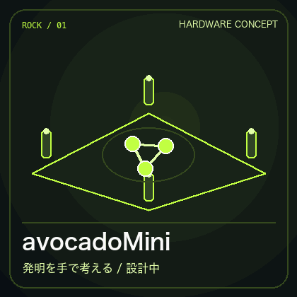

# avocadoMini — 発明を手で考える作業台

> クラウドファンディング企画ページ案。募集、決済、先行予約はまだ開始していません。

*構想参考画像です。実機写真ではありません。寸法・表示・追跡性能は試作で検証します。*

## 「やってみたい」を、手で試せる形へ

材料や工程のアイデアは、画面の中だけでは比べにくいことがあります。avocadoMiniは、物質のデジタル模型を目の前の作業面で選び、組み合わせ、別の候補と比べるための空間発明端末です。判断するのは人。RockstarOSとAIは、候補の整理、条件の確認、試した経緯の保存を支えます。

1. **選ぶ** — 物質、配合、工程条件の候補を作業面で扱う。
2. **組み合わせる** — 元の候補を残したまま、新しい仮説を分岐させる。
3. **比べる** — 安全制約、simulation、文献、実験記録を区別して次の一手を考える。

*利用場面の参考画像です。空中表示、手の追跡、触覚、実材料の性能は未実証です。最初は小型Benchと2D／AR表示から確かめます。*

## 何をつくるか

四方向のセンサー、作業面、計算部を持つハードウェアと、その上で候補を記録するMaterial Invention Studioを段階的に開発します。最初の検証は小型Benchです。四方向の校正、誤操作の防止、raw映像を既定で保存しない設計、安全上の停止、同じ候補を再現できる記録を受け入れた後、Full-scale構想へ進みます。

現在は**詳細設計段階**です。実機試作、量産、販売、配送、クラウドファンディング募集は未開始です。[ハードウェア詳細設計](avocado-mini-hardware-design.md)と[空間発明システム設計](rockstaros-avocado-mini-complete-design.md)に、構成と検証条件を記録しています。

## 支援で進めたい検証

募集条件が決まれば、集めた資金の使い道を金額とともに公開します。現時点の優先順位は次のとおりです。

| 順番 | 検証すること | 次へ進む条件 |
| --- | --- | --- |
| 1 | 小型Benchの機構、センサー、電源・熱設計 | 校正と安全停止を再現できる |
| 2 | 手の操作と2D／AR表示 | 誤操作を測り、操作を取り消せる |
| 3 | Material Invention Coreとの連携 | 候補の履歴と安全判定を再現できる |
| 4 | Full-scale構想の再設計 | 小型Benchの結果を反映できる |

実験結果や性能を確かめる前に、完成品、発送日、価格を約束しません。無料配布の対象とOS従量課金の条件も未確定です。

## 募集方法の提案

**第一候補は、日本の起案者要件を満たす場合のCAMPFIRE「All-or-Nothing」です。** まず対象を小型Bench試作と検証に絞り、支援額が最低予算に届かなければ実施しない方式を提案します。CAMPFIREの説明では、All-or-Nothingは目標未達時に不成立・返金となり、成立時の通常手数料は支援総額の17%＋消費税です。募集主体、受取口座、予算、返礼を確定してから申し込みます。[CAMPFIRE公式の方式・手数料](https://help.camp-fire.jp/hc/ja/%E3%83%97%E3%83%AD%E3%82%B8%E3%82%A7%E3%82%AF%E3%83%88%E3%83%9A%E3%83%BC%E3%82%B8%E3%81%AE%E8%A6%8B%E6%96%B9%E3%82%92%E7%9F%A5%E3%82%8A%E3%81%9F%E3%81%84)

Kickstarterで製品ハードウェアを募集する場合は、稼働する試作機と実際に動く機能の提示が必要です。現在の構想画像やGIFだけで製品機能を示す募集は行いません。Benchの受入後に、対象地域・口座要件と公開条件を確認して再検討します。[Kickstarterの製品試作ガイド](https://updates.kickstarter.com/how-to-launch-a-product-on-kickstarter-part-1-creating-your-prototype-and-manufacturing-plan/) · [画像と試作の指針](https://www.kickstarter.com/blog/pointers-for-sharing-your-prototype)

返礼は、製造・配送を約束する完成機の先行予約よりも、進捗報告や設計レビュー参加など、実際に提供できる範囲から設計する案です。個別の返礼、金額、期限は未決定です。支援を受ける前に提供条件と中止時の扱いを明示します。

## 募集前に確定すること

| 項目 | 現在の状態 |
| --- | --- |
| 募集サービスと公開URL | 未定 |
| 募集主体・受取先 | 未定 |
| 目標額・期間・資金使途の金額内訳 | 未定 |
| 支援への返礼、提供範囲、配送条件 | 未定 |
| 中止・返金・遅延時の扱い | 未定 |

上記を確定して募集ページを公開した時点で、[GitHubの製品紹介](../README.md)の最上部から直接進めるリンクを設置します。現在、この文書から支援金の支払いはできません。
