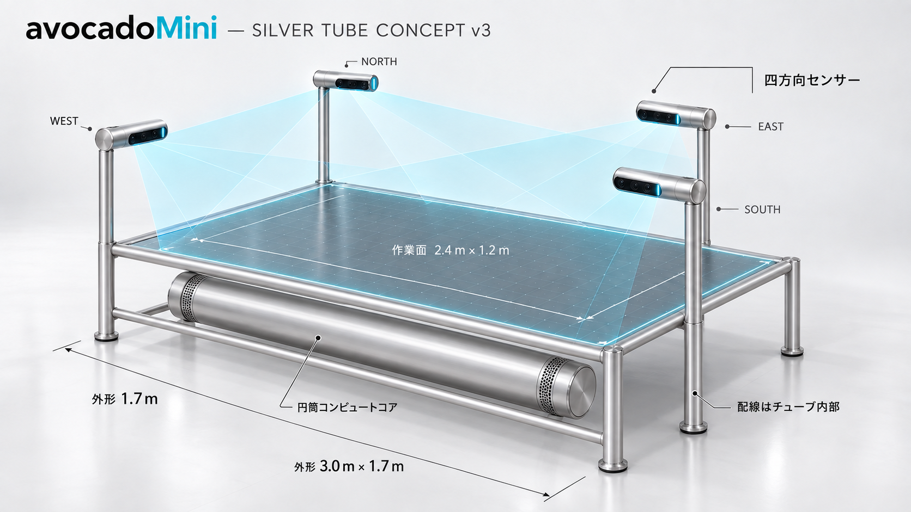
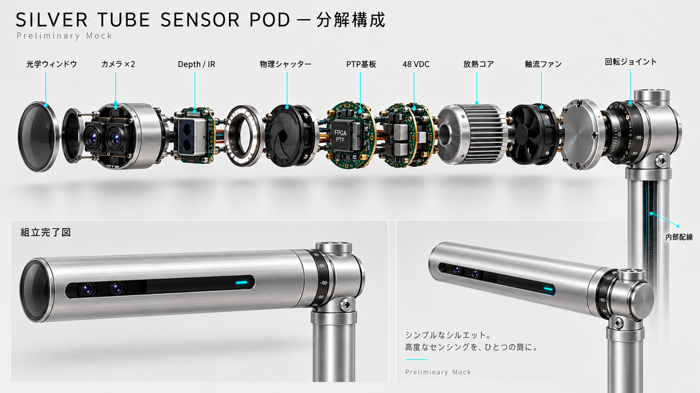
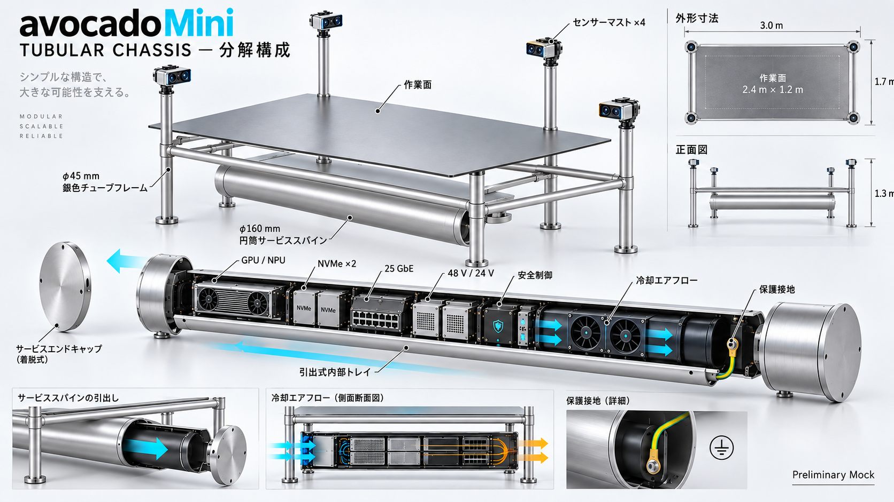
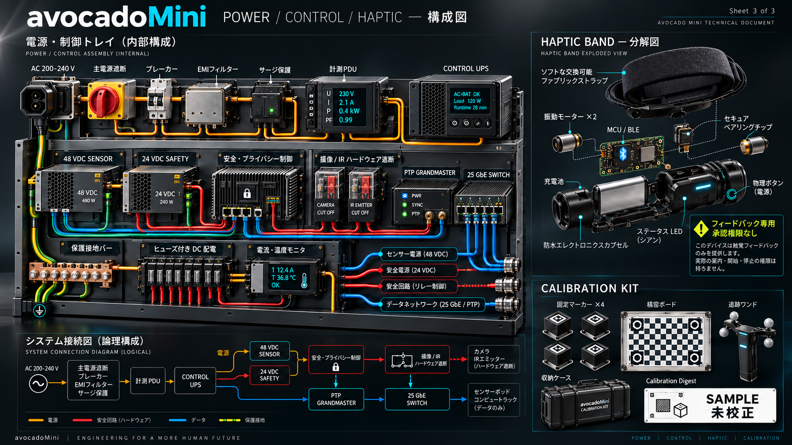

# avocadoMini Full-scale 空間発明台 — ハードウェア詳細設計書

2026-09-21の設計分岐: 本書は以前の四方向Bench／Full-scale系統の設計資料であり、新しい使用時20cmゲーム機の加工・配線仕様ではない。[Mini200 E1](avocado-mini-mini200-e1/README.md)に本体内計算機・前面3眼・日本語音声の基本設計を保存した。本書11.2の「初期BOMにmicrophoneを含めない」は本書のprofile限定で、E1は4マイク候補と新しい同意・独立物理遮断要求を持つ。旧寸法・価格・追跡条件をE1へ転用しない。

- 文書ID: `AM-HW-001`
- 版: 0.1 / 2026-09-18
- 状態: Preliminary Design。構成と受入条件を固定する設計入力であり、製造図、部品選定完了、法規適合、実機完成を意味しない。
- 対象task: `MAT04`（設計証拠）、`MAT06`（後続の実機prototype）
- 正本製品境界: [RockstarOS × avocadoMini完成設計](rockstaros-avocado-mini-complete-design.md)、[端末・interaction設計](avocado-mini-spatial-invention.md)

## 1. 目的

2026-09-20の対外表示では、利用者提供の[伸縮式センサータワー構想図](../public/rockstaros/avocado-mini-tower-concept.png)をavocadoMiniの主役とする。図は収納時850 mm、伸長時1,800 mm、ベース直径160 mm、長押し式操作、三段の伸縮を示す。これは単体タワーの構想参考値であり、本書後段の四方向配置と作業台は複数タワーを使うシステム案として区別する。機構・転倒安定性・制御・センサー性能・安全性は未検証で、製造仕様へ自動確定しない。

avocadoMiniは、物質のdigital twinを1〜2人が手で選び、接続し、分離し、比較するためのRockstarOS空間発明端末である。本書は、既存のFull-scale conceptを、試作チームが機構、光学、電気、演算、校正、安全の同じ境界で作れるハードウェア要求へ変換する。

対外的な製品構想は「考える時間を、つくる時間に」。希望参考価格は41万円とする。これは量産原価、保守、流通、税、OS従量料金を織り込んだ確定販売価格ではない。高性能LLMを搭載するRockstarOSで仕事と発明の作業をスムーズにすることを目標とし、必要な演算性能・熱・電力・費用は小型Benchと製造見積もりで検証する。

初期版が操作するのはデジタル仮説だけである。camera、hand gesture、haptic bandは、実物の材料、heater、dispenser、robot、pressure vesselその他の実験装置を制御しない。物理実験、外部共有、Patent出願、Wallet操作の承認にも使わない。

## 2. 設計入力と現在地

### 2.1 Git基準

- repository: `k999ln/rock`
- 確認branch: `codex/pixel10-compile-bringup-20260917`
- 設計開始時HEAD: `82a53f5`
- 2026-09-18に`origin`をfetch済み。作業開始時は追跡branchより1 commit先行、worktreeはcleanだった。
- 現状はMaterial Invention sandbox Coreと9 test、XR／interaction契約、Full-scale conceptまで存在する。
- 四方向sensor実機、XR runtime、裸眼立体表示、simulation／Patent AI bridgeは未実装である。

### 2.2 Concept画像


画像内の番号を次の設計対象として読む。

| 番号 | 設計上の意味 | 本書での扱い |
| --- | --- | --- |
| 1 | 二つのdigital twinの接続preview | 表示であり、物理反応ではない |
| 2 | 分離、破砕、派生候補のvisualization | simulationまたは仮説。実測ではない |
| 3、4 | 比較するmaterial candidate | Core ID、lot、版、安全状態へbindingする |
| 5 | north／east／south／westの四方向配置 | logical viewpointを四つ必須にする |
| 6 | 複数camera、depth／IR、照明、edge処理を持つpod | 交換可能なsensor moduleとする |
| 7 | GPU、storage、network、RockstarOS Coreのrack | sensor data planeとCore planeを分離する |
| 8 | wearable haptic | 補助feedbackのみ。認証や安全承認に使わない |

画像は外観、人物scale、保守方向を示すconcept renderである。空中像、追跡精度、反力、放熱、強度、EMCを証明しない。

### 2.3 部品構成モック

以下は部品の役割、組付け順、保守方向、配線分離を共有するためのPreliminary Mockである。型番、ねじ寸法、基板layout、certificate値を確定する製造図ではない。









## 3. 設計原則

1. **Coreが正本**: sensorとrendererは操作候補を作るだけで、Material Invention Coreへ直接書き込まない。
2. **四方向が揃わなければcommitしない**: north、east、south、westのlogical viewpoint、校正、時刻同期のいずれかが欠けたら、hand操作はpreviewまたは`VIEW_ONLY`へ落とす。
3. **raw映像を残さない**: raw camera、room mesh、eye、voice、身体寸法は既定で保存・外部送信しない。
4. **表示と実在を分ける**: `PREDICTED`、`MEASURED`、`BLOCKED`を色だけでなく文字と形で常時区別する。
5. **表示方式を交換可能にする**: 最初はAR headsetまたは2D monitorを使う。concept画像の自由空間hologramを必須条件にしない。
6. **安全停止をsoftwareだけに依存しない**: camera／IR emitterの電源状態とprivacy indicatorをhardwireで結び、物理session stopで撮像を止める。
7. **Benchで測ってからFull-scaleへ進む**: camera方式、FOV、baseline、照明、表面材、追跡model、閾値はBench evidenceで選ぶ。

## 4. System requirement

| ID | 要求 | 初期受入値／判定 |
| --- | --- | --- |
| HW-RQ-001 | 外形budget | 3000 W × 1700 D mm以内を目標。service部突出は図面で別記 |
| HW-RQ-002 | 作業面 | 2400 × 1200 mm級。glareとIR反射の試験に合格した材質だけ採用 |
| HW-RQ-003 | 高さ | 作業面850〜900 mm、primary commit zone上端1300 mm（床基準）の初期budget |
| HW-RQ-004 | 利用者 | 1人を基準、2人同時を独立modeで受入。hand ownerが曖昧ならcommit禁止 |
| HW-RQ-005 | viewpoint | north／east／south／westの4 logical viewpointを必須化 |
| HW-RQ-006 | optical view | Full-scaleは各pod 2〜3 optical viewpoint、全体8〜12を比較候補とする |
| HW-RQ-007 | visual response | hand motionからpreview表示までp95 100 ms以下を目標 |
| HW-RQ-008 | 誤commit | scripted 10,000 trialで誤commit 0をprototype目標とし、未達なら閾値またはinteractionを変更 |
| HW-RQ-009 | 時刻同期 | hardware timestampを使用。pod間skew 2 ms以下を設計目標、1 display frame超は`UNUSABLE` |
| HW-RQ-010 | tracking | commit zoneの3D位置誤差は中央p95 5 mm以下、端部p95 10 mm以下を候補目標とし実測で固定 |
| HW-RQ-011 | privacy | camera／emitter通電時は消せない物理indicatorを点灯。物理shutterまたは同等の遮断を持つ |
| HW-RQ-012 | raw data | 既定sessionでraw frameのpersistent writeと外部egressが0であること |
| HW-RQ-013 | fallback | tracking停止時も2D入力でproject閲覧、候補編集、停止、保存を継続できること |
| HW-RQ-014 | availability | 一つのpod、clock、calibrationの異常を1 frame以内に検出し、新規gesture commitを抑止 |
| HW-RQ-015 | physical authority | `physicalExecutionAllowed=false`、`equipmentControlAllowed=false`をhardware gatewayでも維持 |
| HW-RQ-016 | service | pod、compute、filter、power moduleを作業面を分解せず交換できる構造を目標にする |
| HW-RQ-017 | accessibility | seated mode、one-hand mode、2D fallback、色に依存しない状態表示を提供 |
| HW-RQ-018 | noise | operator位置で定常55 dBA以下を目標。未達ならcompute cabinetを外置きする |

数値は量産保証値ではなく、prototypeを採否判断するための初期値である。追跡精度より誤commit防止を優先する。

## 5. 空間・機構設計

### 5.1 座標

- floor中心をworld原点`W0=(0,0,0)`とする。
- X軸: west→east、Y軸: south→north、Z軸: floor→上方。
- nominal work surface: `Z=850〜900 mm`。
- primary commit zone: `X=±1200 mm`、`Y=±600 mm`、`Z=900〜1300 mm`。
- extended tracking zone: 手の出入りを滑らかにするためcommit zone外側へmarginを持つが、ここではcommitしない。
- pod取付けは調整railを持ち、位置と姿勢をcalibration manifestへ保存する。

既存conceptの「高さ1.3 m」は床からprimary commit zone上端までのbudgetとして解釈する。sensor optical center、mast全高、表示device高さは別寸法であり、1.3 mへ固定しない。

### 5.2 Full-scale frame

| 部位 | Preliminary構成 | 要求 |
| --- | --- | --- |
| base frame | steel welded baseまたは高剛性aluminum profile | 床の不陸調整、chassis bonding、転倒・移動防止 |
| work surface | matte compositeを基準。laminated safety glassは反射試験合格時だけ採用 | glare、IR ghost、清掃剤、傷、局所荷重を比較 |
| mast | 4本の独立交換式column | 配線を内部化し、pod落下防止secondary tetherを持つ |
| corner | rounded guardとsoft bumper | 指挟み、衣服引掛け、鋭利edgeを残さない |
| rack bay | front／rear service可能な19-inch相当module bay | hot exhaustを利用者へ吹き付けない |
| feet | leveling foot + floor restraint option | 設置後の移動をIMU／tamper switchで検出 |
| calibration marker | 四隅、中心、交換式wand | 固有ID、寸法、版、校正期限を持つ |

人がwork surfaceへ乗ることを許可しない。構造荷重、地震固定、転倒、輸送振動、材料の難燃性はmechanical engineerが計算し、concept寸法をそのまま製造へ渡さない。

### 5.3 人間工学

- 長辺2面を主操作面、短辺を補助面とする。
- 2人modeでは各人の操作領域とhand ownerを表示し、同一objectの同時commitを禁止する。
- seated user向けに独立した高さ調整2D consoleを用意し、Full-scale中央へ手を届かせることを必須にしない。
- emergency／session stop、camera shutter、2D fallbackは左右どちらの主操作位置からも到達できる。
- headset装着中でも床境界、他者、mast、退出方向を確認できるguardian表示を持つ。ただしAR境界を設備安全距離の証拠には使わない。

## 6. Sensor pod

### 6.1 Reference構成

各podを同じ交換可能moduleとして設計する。

| block | Full-scale候補 | 役割 |
| --- | --- | --- |
| tracking camera A/B | global-shutter RGBまたはmono ×2、60 fps以上 | stereo／multi-view hand pose、marker認識 |
| depth channel | depth／ToF／structured IR ×0〜1 | texture不足時の距離補助。採用は干渉試験後 |
| illuminator | eye-safe IRまたは可視補助光 | ambient不足の補助。常時点灯を既定にしない |
| pod IMU | 6-axis以上 | mast移動、衝撃、姿勢変化を検出してcalibrationを失効 |
| temperature | lens／compute温度 | drift補正とover-temperature停止 |
| edge timing | hardware timestamp、PTP対応 | frameとpod eventの共通時刻化 |
| edge compute | frame検査、必要最小限のpose前処理 | raw streamを外部へ出さず、帯域とprivacyを制御 |
| privacy hardware | power-linked LED、manual shutter | 撮像中を物理的に表示・遮断 |

2 cameraのpod内baselineは180〜300 mmを調整範囲とし、FOV 90〜120°、working distance、edge精度をBenchで比較する。最終camera数、resolution、lens、wavelength、メーカーは未選定である。

### 6.2 Optical constraints

- auto exposureだけに依存せず、全podのexposure windowを協調させる。
- rolling shutterをcommit用poseの唯一の入力にしない。
- 複数active depth／IRが干渉する場合は、時分割strobe、符号化、異なる波長、またはpassive stereoへ切り替える。
- projector、laser、IR emitterはIEC 62471／IEC 60825-1等の適用性を確認し、分類・距離・故障時出力を実測する。
- shiny surface、腕時計、黒手袋、透明材、強い日射、低照度を試験する。
- 交換したcamera、lens、firmware、mountは`SensorSetDigest`を変え、再校正なしにsessionを開始しない。

### 6.3 Sensor failure

契約上は4 logical viewpointすべてを必須とする。podが一つでも欠けた場合、Full-scale gestureはcommitしない。画面は原因と欠けた方向を表示し、2Dへ切り替える。将来、3方向でも安全にcommitできる実測が得られても、契約と安全caseを別版で更新するまでは有効化しない。

## 7. 表示・haptic

### 7.1 Display profile

| profile | 初期位置付け | Hardware |
| --- | --- | --- |
| D0 2D | 必須fallback | 4K monitorまたは操作console、keyboard／touch／mouse |
| D1 AR | 最初の空間prototype | 1〜2台のheadset／AR glasses、shared coordinate marker |
| D2 projection | 研究 | transparent screen、stereo projection、view trackingを個別比較 |
| D3 light-field／volumetric | 将来研究 | concept画像の自由空間像。製品要件へ未採用 |

全profileで同じ`SpatialSceneManifest`とsafety overlayを表示する。overlayを表示できないdeviceはview-onlyにも使用しない。

### 7.2 Haptic band

- bandは選択、境界接近、BLOCKED、commit／cancelの触覚feedbackだけを返す。
- BLE等の無線を使う場合はsession単位でpairingし、device identityとfirmwareを固定する。
- band紛失、battery切れ、通信断でCore stateを変更しない。
- 心拍等のbiometric sensorは初期版に搭載せず、身体dataを本人認証や発明判断へ利用しない。
- 強い反力は提供しない。force-feedback gloveやrobotic interfaceは別actuator systemとして独立risk assessmentを行う。

## 8. Compute・network・storage

### 8.1 Hardware partition

```text
4 Sensor Pods
  │ isolated sensor links
  ▼
Sensor Ingest / Time Sync
  │ pose + health + ephemeral frame buffer
  ▼
Fusion GPU ── Gesture Intent ──> Material Invention Core
                                      │
                                      ├─ Project Vault
                                      ├─ Spatial Renderer
                                      └─ Provider Gateway

Independent Safety / Privacy Controller
  ├─ sensor power state
  ├─ indicator state
  ├─ session stop
  └─ door / over-temperature / UPS inputs
```

### 8.2 Reference compute budget

| module | 初期budget | 備考 |
| --- | --- | --- |
| host CPU | server／workstation class、ECC対応 | Core、orchestration、storage、verification |
| fusion accelerator | 1〜2交換可能GPU／NPU | hand pose、fusion、renderer。model hash固定 |
| memory | ECC 128 GB以上を候補 | 8〜12 streamのbufferとlocal modelを計測して決定 |
| project storage | encrypted NVMe mirror 4 TB級から開始 | project、event、model、receipt。raw video常時保存は禁止 |
| ephemeral buffer | memoryまたは暗号化scratch | 数秒以下のring buffer。session終了／faultで消去 |
| trust | TPM 2.0相当 + secure boot | host、model、firmware、configuration identity |
| network core | 25 GbE uplink、podごと10 GbE級候補 | raw帯域はprototype測定。外部networkと分離 |
| time | PTP grandmaster／hardware timestamp | driftをhealth stateへ反映 |

trackingで必要なraw frameはsensor network内と揮発bufferに限定する。Provider Gatewayはpose、candidate digest、明示承認済みdataだけを外へ出せる。sensor VLANからinternetへrouteを作らない。

### 8.3 Network zones

1. `SENSOR`: pod、PTP、fusion ingest。外部egressなし。
2. `PLATFORM`: Core、renderer、project vault。owner sessionで分離。
3. `MANAGEMENT`: firmware、health、audit。利用者project内容を読まない。
4. `PROVIDER`: simulation、Patent search等の外部接続。default deny、job単位allowlist。

zone間はL3 firewallと相互認証を使う。管理port、未使用USB、rack内consoleを施錠し、任意shellを製品APIにしない。

## 9. 電源設計

### 9.1 Preliminary budget

| load | typical | peak budget |
| --- | ---: | ---: |
| sensor pods 4台 | 320 W | 480 W |
| compute／GPU | 1800 W | 3000 W |
| storage／network／control | 180 W | 300 W |
| display／headset／haptic | 250 W | 450 W |
| fan／thermal auxiliary | 250 W | 400 W |
| 合計 | 約2.8 kW | 約4.6 kW |

設置電源は200〜240 VAC、50／60 Hz、5 kVA級を初期site requirementとし、国・施設の電気工事要件へ合わせる。これは最終定格ではなく、実測後にnameplateとbranch circuitを決める。

### 9.2 Distribution

- compute系とcontrol／sensor系を別branchへ分ける。
- control、network、project flush用に1 kVA級以上のUPSを候補とし、GPU長時間運転をUPSへ要求しない。
- podは48 VDC、safety／indicatorは24 VDCを候補とし、5／12 Vはpod内で絶縁変換する。
- protective earthをbase、rack、mast、pod enclosureへbondingする。
- DC branchごとにfuse／electronic breaker、current telemetry、over-temperature cutoffを持つ。
- mains disconnectはservice用、session stopは撮像／emitter停止用として役割を分ける。

## 10. Thermal・acoustic

- peak 4.6 kWは室内へ約15,700 BTU/hの熱を放出し得るため、室空調とrack排熱をsite設計へ含める。
- rackはfront-to-back airflowとし、hot airを足元や顔へ排出しない。
- pod enclosureはlens付近の温度gradientを計測し、calibration limitを超えたらcommitを停止する。
- filter交換、fan故障、airflow blockageをhealthへ出す。
- integrated rackで55 dBAを超える場合は、外置きcompute cabinetまたは液冷／大型低速fan案を比較する。
- cooling故障時は新規計算を止め、projectを保存してcontrolled shutdownする。警告を消して継続しない。

## 11. Safety・privacy hardware

### 11.1 Physical controls

| control | Hardware action | Software action |
| --- | --- | --- |
| Session Stop | sensor emitter／capture enableをsafety relay経由で遮断 | pending gesture取消、sessionを`STOPPED`、保存flush |
| Camera shutter | lensを物理遮蔽またはpod電源を遮断 | viewpointを`UNUSABLE`、2D fallback表示 |
| Mains disconnect | 全体主電源を隔離 | controlled shutdownを保証しない。service／緊急用 |
| UPS signal | 保持時間とpower lossを通知 | provider job停止、vault flush、shutdown |
| Mast tamper／IMU | 移動を検出 | calibration失効、commit禁止 |

concept画像の赤いbuttonは、初期版では「session stop」である。ISO 13850に適合したmachine emergency stopを名乗らない。将来actuatorを接続する場合は、actuator側に独立したsafety-rated E-stop、interlock、risk assessmentが必要であり、本端末のbuttonを代用しない。

### 11.2 Privacy truthfulness

- privacy LEDはOS GPIO表示だけでなくcamera／emitter電源またはcapture-enable lineへhardwireする。
- LED故障をstartup self-testで検出できなければ撮像を開始しない。
- research raw-capture modeは物理keyまたはadmin操作、画面同意、保存期限、暗号化、容量上限、network遮断を別profileで要求する。
- microphone、eye tracking、room meshは初期BOMから除外する。必要になった場合は新しいprivacy reviewを行う。
- health logにはframe内容ではなく、pod ID、firmware hash、温度、drop数、clock drift、calibration digestを残す。

### 11.3 Applicable standards review

量産地域を決めた後、少なくとも次の適用性を専門家が確認する。

- IEC 62368-1: AV／ICT機器の電気・火災・機械安全
- IEC 62471、IEC 60825-1: LED／IR／laserの光生物学・laser safety
- IEC 61000 series、FCC／CE等: EMC immunity／emission
- ISO 12100: 機械的hazardのrisk assessment
- ISO 13850: 将来E-stopをclaimする場合
- ISO 9241-210: 人間中心設計
- 地域の電気、無線、消防、建築、耐震、廃棄物規則

本書は適合宣言ではない。

## 12. Calibration・起動

### 12.1 Calibration hierarchy

1. camera intrinsic: lens、focus、distortion、resolutionごと。
2. pod intrinsic: camera A/B/depth/IMUの相対姿勢。
3. rig extrinsic: north／east／south／westとworld座標。
4. display alignment: AR／2D表示とworld座標。
5. user/session check: hand、操作領域、座位／立位、haptic pairing。

各結果はtool版、target ID、temperature、operator、timestamp、residual、expiryを持つ署名済み`CalibrationReceipt`へ保存し、`calibrationDigest`をinteraction eventへ結び付ける。

### 12.2 Startup sequence

1. power、earth、UPS、thermal、fanをself-test。
2. sensor／firmware identityとprivacy indicatorを確認。
3. PTP lockとframe sequenceを確認。
4. mast移動、temperature、marker visibilityから校正有効性を確認。
5. 4 logical viewpointとdisplay safety overlayを確認。
6. owner、project、scene、candidate digestをbinding。
7. non-commit gestureでlatency／tracking quick check。
8. すべて合格してから`READY`。不合格は理由付き`VIEW_ONLY`または2Dへ落とす。

## 13. State・degraded mode

| Hardware state | 条件 | 許可すること | 禁止すること |
| --- | --- | --- | --- |
| OFF | mains off | なし | 全操作 |
| SAFE_IDLE | Core起動、camera off | 2D閲覧、診断 | spatial tracking |
| CALIBRATING | sensor on、校正中 | calibration UI | candidate commit |
| READY | 4 viewpoint、sync、校正、overlay合格 | previewと契約上のhypothesis commit | physical execution |
| DEGRADED | frame drop、temperature warning等 | preview、2D、保存 | gesture commit |
| VIEW_ONLY | stale scene、pod欠落、binding不一致 | 閲覧、export準備 | graph変更 |
| STOPPED | physical stop、privacy shutter | 保存済みdata閲覧 | capture、commit |
| FAULT | integrity、over-temperature、power異常 | 必要最小限のsafe shutdown | session継続 |

通信断、GPU reset、process crash、result unknownの後に操作を自動再送しない。Coreのoperation keyとevent ledgerで結果を照合する。

## 14. Preliminary BOM

メーカーと型番はBench比較後に選ぶ。

| Assembly | Item | Qty | Selection gate |
| --- | --- | ---: | --- |
| Frame | base、work surface、4 mast、guard、leveling foot | 1 set | 強度、glare、serviceability、accessibility |
| Pod | enclosure、mount、secondary tether | 4 | 温度、剛性、交換再現性 |
| Vision | global-shutter camera | 8 | FOV、latency、edge error、low light |
| Depth | depth／IR module | 0〜4 | multi-pod干渉と光学安全に合格した場合だけ |
| Pod edge | timestamp／preprocess module | 4 | PTP、drop、firmware attestation |
| Privacy | power-linked LED、manual shutter | 4 set | hardwire truth test |
| Calibration | fixed markers、board、wand | 1 set | 寸法traceability、cleanability |
| Compute | ECC host | 1 | sustained ingest、Core、failure recovery |
| Acceleration | replaceable GPU／NPU | 1〜2 | p95 latency、thermal、driver recovery |
| Storage | encrypted mirrored NVMe | 2 | power-loss、restore、wear monitoring |
| Network | 25 GbE core、pod links、firewall | 1 set | isolation、PTP、sustained bandwidth |
| Safety control | independent controller、relay、I/O | 1 | sensor cut、indicator、fault injection |
| Power | PDU、DC supplies、breaker、UPS | 1 set | 5 kVA budget、earth、shutdown |
| Display | 2D 4K console | 1〜2 | safety overlay、fallback |
| AR | headset／glasses | 0〜2 | shared alignment、comfort、privacy |
| Haptic | wrist band | 0〜4 | packet loss、battery、no-authority behavior |

## 15. Verification matrix

| Test ID | Test | 合格条件 | Evidence |
| --- | --- | --- | --- |
| HVT-01 | 4-view geometry | central／edge targetの位置誤差を記録しHW-RQ-010候補値を満たす | calibration report |
| HVT-02 | latency | motion-to-photon p95 ≤100 ms、測定系遅延を別記 | high-speed capture + timestamp log |
| HVT-03 | false commit | 遮蔽、別人、反射、暗さ、手袋を含む10,000 scripted trialで0 false commit | test dataset digest + report |
| HVT-04 | sensor loss | 任意pod／link／clockを切断し1 frame以内にcommit禁止 | fault injection log |
| HVT-05 | stale calibration | mast移動、camera交換、temperature逸脱で`VIEW_ONLY` | calibration receipt chain |
| HVT-06 | privacy | camera電源中LED offが不可能、shutterでcapture停止 | electrical test + packet trace |
| HVT-07 | no persistence | default session後にdisk、swap、backup、networkへraw frameがない | forensic scan summary |
| HVT-08 | power loss | UPS通知からvault flush、再起動後に二重eventなし | recovery report |
| HVT-09 | thermal soak | peak workload 4 hでthrottle、surface温度、noise、driftを記録 | thermal／acoustic log |
| HVT-10 | 2-person conflict | hand owner不明、同一object競合、交差時にcommitしない | interaction report |
| HVT-11 | accessibility | seated／one-hand／2Dで同じ主要flowを完了 | user test report |
| HVT-12 | security | sensor VLAN egress、未署名firmware、debug port、model hash改変を拒否 | security test report |
| HVT-13 | safety boundary | camera／gesture経路からequipment、Wallet、shellへ到達不能 | interface inventory + negative test |
| HVT-14 | service recovery | pod、GPU、storage交換後にidentity更新、再校正、restoreを完了 | maintenance report |

合格環境をBench、Full-scale、synthetic、human userで分ける。Benchの合格をFull-scale全域の合格へ転用しない。

## 16. Prototype plan

### H0 — Single-camera bench

- matte面とglass候補の反射比較
- camera／lens／exposure／hand modelの最低latency測定
- preview、cancel、2D fallbackだけを接続

Gate: raw frame非保存とfalse commit測定系が成立する。

### H1 — Four-pod Bench

- 0.45〜0.8 m volume
- logical 4 viewpoint、PTP、rig calibration、pod loss
- one-hand、two-hand、two-person synthetic pose

Gate: HVT-01〜08のBench版が合格し、未達値を記録する。

### H2 — Full-scale skeleton

- 3.0 × 1.7 m frame、work surface、mast、service rack
- 表示は2D／ARだけ。holographic displayを待たない
- 中央、四辺、四隅、Z上限、座位、2人を測定

Gate: HVT-01〜11をFull-scaleで再実行し、誤commitが0である。

### H3 — Integrated Developer Prototype

- RockstarOS Core、project vault、renderer、haptic、provider gatewayを接続
- simulationは合成receiptから開始
- Patent AIへsource-separated packetを作る

Gate: HVT-01〜14、software contract test、復旧試験が同じhardware／software versionで合格する。

### H4 — Pilot／DVT preparation

- 独立security、electrical、mechanical、optical safety review
- 調達可能性、修理、spares、firmware update、SBOM、廃棄を固定
- 法規試験用unitと製造test fixtureを設計

Gate: 量産判断者がopen decisionを閉じる。prototypeの成功だけで販売可能としない。

## 17. Risk register

| Risk | 影響 | Control／判断試験 |
| --- | --- | --- |
| 反射面でIR／poseがghost化 | 誤commit | matte surface優先、glass A/B、HVT-03 |
| 4 depth cameraの干渉 | 欠測／誤距離 | 時分割、passive stereo、wavelength比較 |
| 3 m spanの振動・mast drift | 校正ずれ | high-stiffness frame、IMU、marker quick check |
| GPU／driver reset | result unknown | Coreとfusion分離、operation key、recovery test |
| integrated rackの熱／騒音 | 疲労、drift | 外置きoption、thermal soak、55 dBA target |
| 2人のhand取り違え | 他人の候補変更 | user zone、explicit hand claim、競合時停止 |
| free-space displayへの過期待 | schedule／品質 | D0／D1を製品baseline、D2／D3は研究 |
| privacy LEDのsoftware偽装 | 撮像の誤認 | power-linked indicator、physical shutter |
| hapticを承認と誤認 | 外部作用 | feedback-only、authorityなしを契約・UIで固定 |
| 部品EOL／firmware差分 | 再現不能 | replaceable adapter、hash、spare、recalibration |
| 校正targetの汚れ／変形 | systematic error | target health check、期限、交換traceability |
| actuator後付け | 重大安全risk | interface非搭載、別system／別E-stop／別承認 |

## 18. Open decision

| ID | 未決定 | 決定者 | 決定に必要な証拠 |
| --- | --- | --- | --- |
| HWD-01 | exact work-surface高さ、commit zone Z範囲 | Product + UX + Mechanical | standing／seated user test |
| HWD-02 | RGB／mono／depth／IR構成 | CV + Optical + Privacy | H0／H1の精度、干渉、光学安全 |
| HWD-03 | camera resolution、fps、lens、baseline | CV | latency、edge error、bandwidth |
| HWD-04 | integrated rackか外置きcomputeか | Mechanical + Operations | noise、thermal、service test |
| HWD-05 | surface material | Mechanical + CV | glare、cleaning、impact、tracking |
| HWD-06 | first AR device | Product + XR + Security | alignment、comfort、support、privacy |
| HWD-07 | haptic採用有無 | UX + Accessibility | error reductionと疲労の比較 |
| HWD-08 | actual power nameplate | Electrical | H3 sustained peak実測 + margin |
| HWD-09 | 販売地域と適用規格 | Owner + Legal + Compliance | market、installation class、lab review |
| HWD-10 | 製造方法、価格、保守SLA | Owner + Manufacturing | DVT BOM、yield、repair time、supplier quotes |

## 19. 変更管理

- hardware manifestはframe、pod、camera、lens、firmware、GPU、display、calibration targetの型番・serial・hashを持つ。
- camera、lens、mount、pod firmwareの変更は`SensorSetDigest`を更新し、再校正とHVT-01〜04を必須にする。
- tracking model変更はhardware不変でもinteraction受入を再実行する。
- safety、privacy、physical authorityの境界を緩める変更は、単なるBOM代替として扱わない。
- prototype evidenceにはrepository SHA、contract version、hardware manifest、calibration digest、test dataset digestを記録する。

## 20. 完了定義

本書の完成は「試作に必要なhardware設計入力が揃った」ことを表す。`MAT06`を完了にするには、H1とH2の実機、四方向校正、誤commit、privacy、熱、電源、復旧、2D fallback、Core bindingを同一構成で受け入れる必要がある。

次はH0のsurface／camera比較fixture、H1の四方向Bench rig、`CalibrationReceipt` schema、HVT自動test harnessを作る。Full-scale筐体、部品発注、電気工事、IR／laser使用、外部Provider契約は、それぞれ設計reviewと本人の発注意思を確認してから行う。
