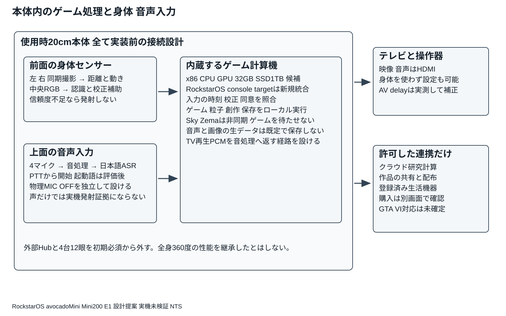
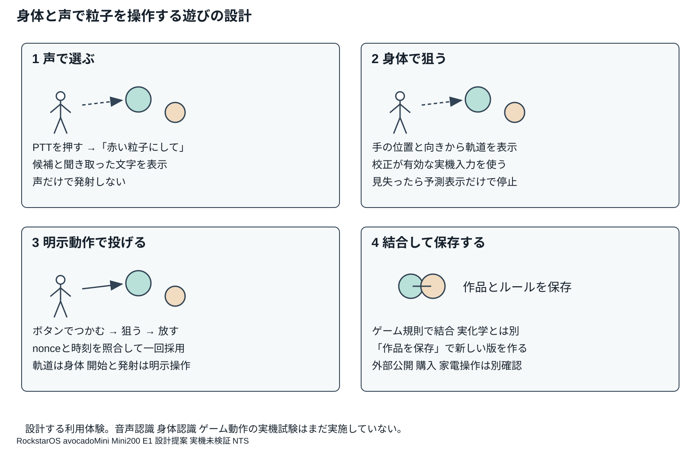
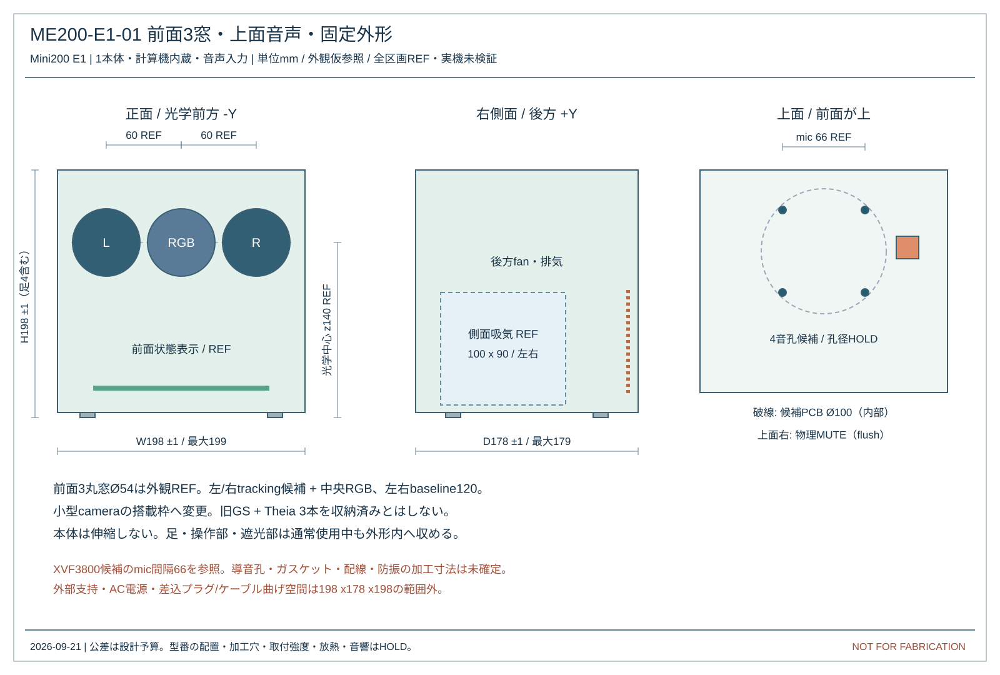
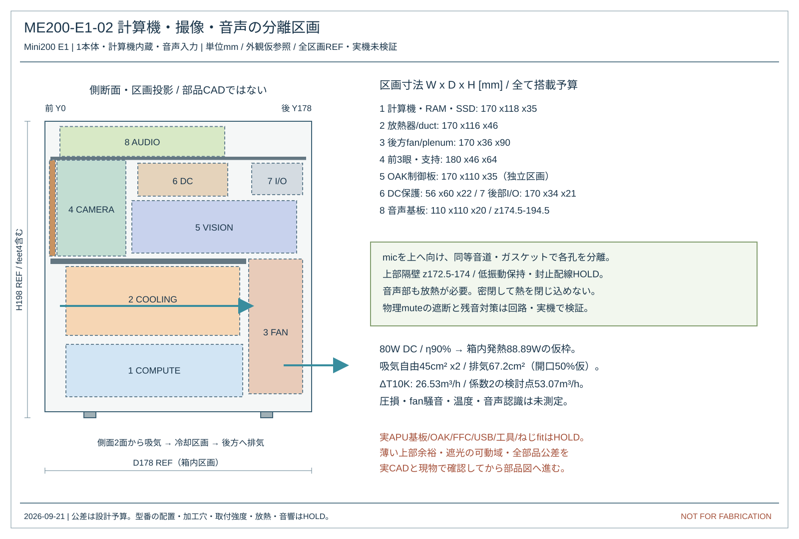
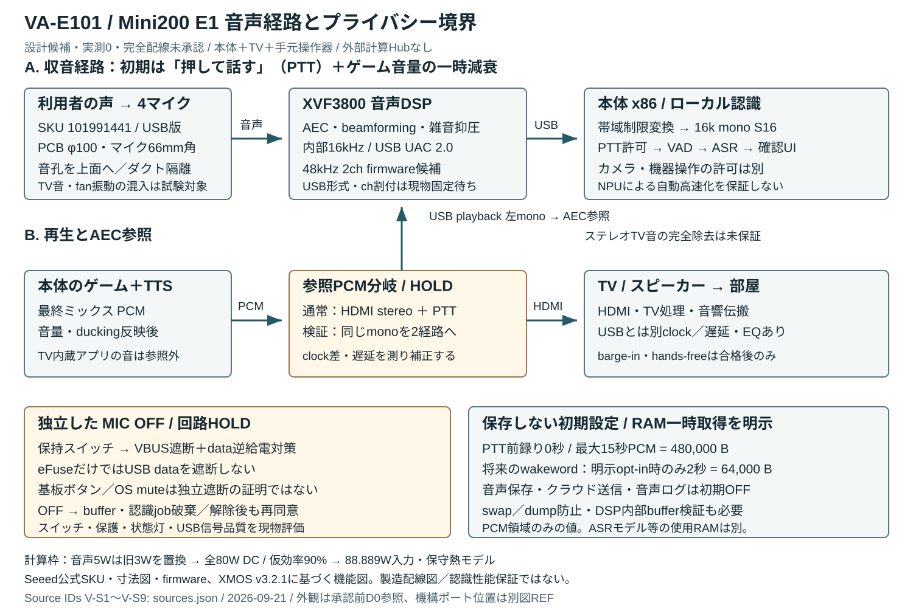
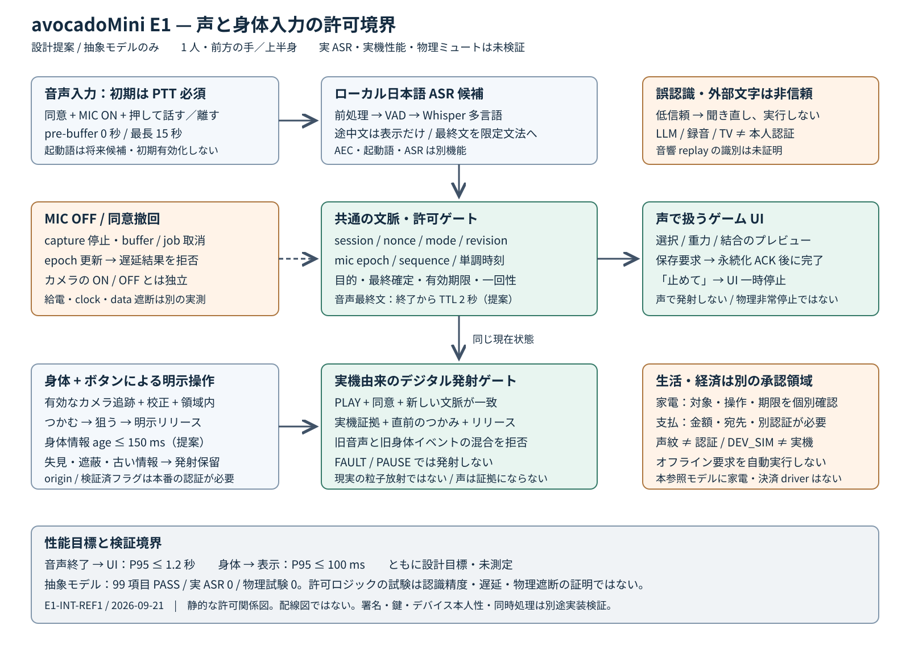
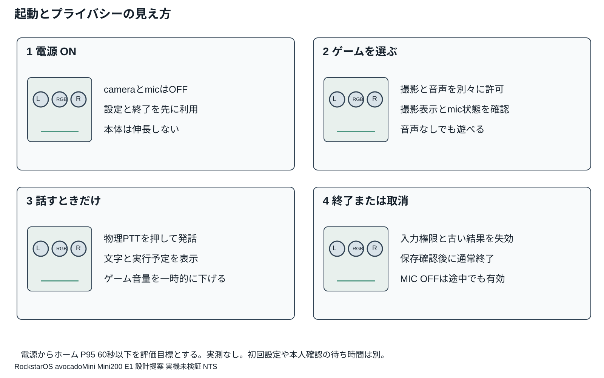

Mini200 E1   2026年9月21日

身体の動きを仮想粒子の操作に変え、ゲーム、創作、シミュレーションへつなぐ。音声は粒子の選択、設定変更、保存、作業の補助に使う。RockstarOSは、共通の入力、作品、履歴、権限、配布と生活連携を管理する。

本体内で専用ゲームを動かす構成へ改める。使用時20cm以内を要求とし、外形は幅198×奥行178×高さ198mmの提案を継承する。前面3窓の構成に、上面マイクと物理ミュート、背面排熱を加える。TV、操作器、ACアダプターは外付けであり、画面まで内蔵する携帯機ではない。

外観は前版D0の前面3丸窓を作業参照としている。今回の「あのデザイン」と一致するかは未確認であり、別の外観を意図している場合は寸法と内部配置を再調整する。

| 今回の設計 | 状態 |
| --- | --- |
| 身体操作と粒子ゲーム | 処理経路と試遊の合格条件を定義。認識性能は未測定 |
| 日本語音声 | 4マイク、音処理、ローカルASR、許可判定を設計 |
| 使用時20cmと前面3窓 | 外観と内部区画の参考図。実基板収納は未確認 |
| 起動語と会話中の割込み | 後段の評価項目。初期は押して話すPTTを使う |
| 製造と動作保証 | 回路、固定具、冷却、OS統合、実測が未完了 |

本書は統合基本設計であり、加工・配線をそのまま発注できる製造承認図ではない。実機試験、実音声の認識試験、GTA VIの動作試験は0件。前版D0の4台12眼や旧タワーの性能を、本体1台へ移したと扱わない。

# 1 残す技術と変更する構成

avocadoMiniの核は、校正した実機センサーに基づく身体操作である。声、マウス、開発用の合成入力は使えるが、それらを実機起源の粒子発射証拠に置き換えない。機器認証と鍵保護は製品化に必要で、設計したデータ欄だけでは偽装を防げない。

| 要素 | E1での設計方針 |
| --- | --- |
| ゲームの計算 | 外部Jetson Hub必須を外し、本体内にCPU GPU RAM SSDを置く |
| 前面3窓 | 左右を同期ステレオ候補、中央をRGB候補とする。3個の旧大型レンズを流用しない |
| 対応する動き | 初期は前方1人の手と上半身。座位・立位を校正。背面や遮蔽越しの追跡は約束しない |
| 音声 | 身体入力を補助。選択・設定・保存と、発射・支払いの許可を分離 |
| 開発と研究 | 同じsceneを編集・再生。ゲーム規則と科学的予測は別の計算経路 |
| 生活と経済 | メモ・予定から開始。公開・家電操作・購入は個別に確認 |

前面3窓、低い固定外形、状態表示という外観要素を引き継ぐ。材質、仕上げ、角の丸み、量産ねじ位置は未確定。身体認識を優先して、カメラの位置と開口を実測校正で調整できる内部支持を設計する。

過去のRockstarOS監査は2026年9月20日の固定commitに対する履歴である。本版は最新版コードの再監査や、x86実機への移植完了を示さない。既存のホーム、Sky、Zema、Workspace、SDK、Wallet等を新しいconsole targetへ統合する作業が残る。

# 2 本体と外部機器の接続

# 3 ゲームの体験と必要な性能

最初の専用ゲームは、粒子を選び、手で狙い、明示動作で投げ、接触によって性質が変わり、仕掛けを解く体験とする。終了後に同じ場面で規則を編集して再実行できる。声で「赤い粒子にして」と指示した後も、発射は身体入力の準備状態と操作を別に検査する。

| 評価項目 | 初期目標 | 扱い |
| --- | --- | --- |
| 描画 | 1080p 60fps | 本体で実測。GTA VIの性能目標ではない |
| 物理対象 | 同時32個から開始 | 光や煙の演出粒子と別に数える |
| 身体操作 | 動作から表示 P95 100ms以内 | camera wait、認識、game、TVを含めて計測 |
| 音声操作 | 発話終了から表示 P95 1.2秒以内 | 聞取り精度と別指標。途中結果は実行しない |
| 意図した発射 | 100回中95回以上 | 部屋・姿勢・照明ごとに記録 |
| 誤発射 | 通常30分と遮蔽復帰で0件目標 | 試験中の0件で、確率0を保証しない |

初期は画面前方で使い、追跡できない範囲には入れない。身体入力で軌道を決め、手元ボタンでつかむ／放すことを明示する。大きく腕を振らずに遊べる設定とする。ボタンだけのDEV操作も作れるが、身体を使った実機起源の発射とは区別する。ボタン不要の身振り発射は追加評価とする。

仮想粒子の結合はゲーム規則である。研究モードでは、対象物質、条件、対応する計算モデル、費用、精度を別に指定する。見た目の結合を、現実の化合物の存在・安全性・実測結果として表示しない。

# 4 身体と声を使うゲーム画面

# 5 内蔵部品と選定状況

| 部分 | 候補または割当 | 確定前の確認 |
| --- | --- | --- |
| 主計算機 | Ryzen AI 9 HX 370 Radeon 890M 搭載基板を評価候補 [H01] | 基板型番・寸法・入出力・供給寿命・Linux driver未確定 |
| RAM SSD | 32GB級共有RAM NVMe SSD 1TB | 容量は仮予算。実アプリ同時負荷と保存更新を測る |
| 撮像制御 | Luxonis OAK FFC 4P USB候補 [H02] | 実基板版・firmware・USB帯域・供給電力を固定 |
| 左右camera | OAK FFC OV9282 2個候補 [H03] | Global shutter mono、同期、120mm baselineで再校正 |
| 中央camera | OAK FFC IMX378 1個候補 [H02] | RGB rolling shutter。高速位置計測の唯一の根拠にしない |
| 音声 | ReSpeaker XVF3800 USB 4 Mic Array 101991441候補 [V01] | FWとchannel map、消費電力、物理遮断を別受入 |
| 筐体内その他 | DC変換・保護、fan、放熱器、mute、PTT、表示、camera shutter | 型番とピン配線未確定 |

ここにあるCPU名は完成した主基板の型番ではない。はんだ付け済みモジュールまたは供給可能な基板を選び、図面・コネクタ・冷却・起動試験を揃えてから採用する。旧CM4や旧24V回路の端子を、新基板へ直接つないではいけない。

本体には大型ゲーム画面、AC商用電源部、バッテリーを内蔵しない案とする。TVへ映像と音を出し、USBパッドやキーボードで設定と開発を行えるようにする。基本のゲームはクラウドや実資金サービスを起動条件にしない。

# 6 本体と内部配置の参考図

# 6 本体と内部配置の参考図

# 7 三つの窓で測る動き

左右の候補cameraはOV9282、中央はRGBのIMX378とする。左右中心間は120mmの提案で、外観の60mm間隔を継承する。OAK FFCはcamera位置を変えられる開発構成だが、取付後に内外部パラメーターを校正し、frame timestampと同期を照合する。[H02 H03 H04]

左右は1280画素幅、水平画角80度を仮定する。半画角から焦点距離を計算し、視差誤差0.5画素という仮定だけを奥行きの誤差へ伝播させる。これは手の関節の精度でも、被写体全てに成立する最大誤差でもない。

計算式 f = 1280 / (2 tan 40°) = 762.7 px

計算式 σZ ≈ Z² σd / (f B)    B = 0.120 m    σd = 0.5 px

| 距離 | 計算上の視差 | 仮定した奥行き標準偏差 |
| --- | --- | --- |
| 1m | 91.5px | 5.5mm |
| 2m | 45.8px | 21.9mm |
| 3m | 30.5px | 49.2mm |

暗所、無地や反射物、速い手、遮蔽、crop、ずれた同期は、この単純式で扱えない。単眼のRGB結果や、推測で補完した関節から確定発射を行わない。入力の信頼度が足りなければ、理由と使える操作範囲を表示する。

初期の評価距離は1〜2mを候補とし、校正した手の操作範囲だけを許可する。床置きで全身が入る保証はない。手の上下端、座位・立位、TVと本体の設置高さを測り、必要なら机・棚の保持具を設計する。1台の前面cameraでは背面や家具の裏は見えない。全身・複数人・360度の拡張は別の受入とする。

# 8 処理時間と保存容量の予算

GPUの描画、身体認識、日本語ASRを同時に無制限で動かさない。身体入力と描画を優先し、ASRは短い音声区間を処理するworkerへ分離する。重いAI生成と研究計算は一時停止・非同期処理へ回し、ゲームの次frameを待たせない。

| 予算 | 配分案 | 実測で確かめること |
| --- | --- | --- |
| RAM 32GiB | OS4 ゲーム8 描画8 認識2 音声2 余裕8 | GPUとCPUの共有メモリー。専用VRAMの保証ではない |
| SSD 1TB | 約931.3GiB。OS復旧96 app24 作品96 game512 更新96 余裕107.3 | ファイルシステムと予約領域を含む実容量、満杯時の動作 |
| 身体の遅延 | 配分合計89.67ms 目標100ms | 各段階の和でP95が証明されたとはしない |
| 声の遅延 | 発話終了後300+50+700+50+100=1200ms | 区切り待ち、待ち行列、ASR、判定、表示の配分 |

物理対象32個の全組合せは496組、256個では32640組になる。粒子数を8倍にしたとき計算量が8倍で済むと仮定しない。空間分割を導入しても密集時の負荷を別に測る。音声を認識しながらの最悪場面、熱が上がった後、保存中を含めて試験する。

GTA VIは本体の動作保証対象に含めない。既存ゲームは、CPUの種類だけでなくOS、API、配信、権利、入力方式を含めたタイトルごとの適合が必要である。RockstarOSの導入やRAM増設だけでは互換性は成立しない。

# 9 電源と熱と音の干渉

| 割当 | DC負荷案 | 根拠と制限 |
| --- | --- | --- |
| APU | 45W | 評価用設定枠。cTDPは瞬間最大入力ではない |
| 主基板とRAM | 12W | 実測前の配分 |
| SSD | 5W | 連続書込みと瞬間負荷を測る |
| cameraと撮像制御 | 8W | camera群・処理・供給の余裕を仮配分 |
| 音声基板 | 5W | 候補基板の定格ではない |
| fanと制御表示 | 5W | 採用部品で再計算 |
| 合計 | 80W | 外部TVや追加USB給電を含まない |

計算式 入力予算 = 80 / 0.90 = 88.89 W

空気の温度上昇10℃、密度1.2kg/m³、比熱1005J/kgKなら、熱収支だけの最低流量は26.53m³/h。仮係数2の検討点は53.07m³/hとなる。実fanの流量は圧損で変わるため、この値で型番の採用や静音性を保証しない。

変換効率90%を仮定した定常予算であり、製品の消費電力測定ではない。120W級の外部電源を比較枠に置く場合も、入力電圧、突入、USB peak、温度低減、余裕、地域適合が決まるまで採用しない。D0の24V電源を自動的に引き継がない。

放熱器とfanを後方へまとめ、マイクと直接つながる風路を避ける。吸排気と音響室は分離するが、吸音材を増やして流路を塞がない。耳障りな回転音だけでなく、構造伝搬する振動とマイク孔の風切り音も測る。

音声中にfanを止める制御は採用しない。温度が上がったらAI・background処理や描画品質を先に制限する。追跡品質の条件を割ったら身体操作を停止する。表面温度、部品温度、閉塞、fan故障、騒音の合格が出るまで、20cm内の冷却成立とは表示しない。

# 10 音声のために内蔵するもの

音声入力はReSpeaker XVF3800 USB 4 Mic ArrayのXIAOなし基板、SKU 101991441を評価候補とする。公式機械図のPCBは直径100mm、板厚1.2mm、4個のマイクは66mm角配置である。コネクタや部品の高さ、音孔の密閉、防振は別途確認する。[V01 V02]

| 層 | 役割 | 確認すること |
| --- | --- | --- |
| 4個のMEMSマイク | 声と周囲音を取得 | 実音孔、向き、ケースとgasketで特性が変わる |
| XVF3800の音処理 | beamforming 雑音抑制 AECを評価 | 話者の方向は本人認証には使わない |
| USB音声 | 処理済み音を主計算機へ転送 | firmware、sample format、channel mapを固定 |
| 物理MIC OFF | 給電または信号経路をhardwareで遮断 | software muteボタンだけを物理遮断と呼ばない |
| PTTと状態表示 | 押している間だけ発話を受付 | 再接続や再起動で勝手に聴取しない |

候補基板の既存ボタンは、製品として必要な物理遮断の証拠ではない。独立した保持式MIC OFFでマイク枝の給電を止め、USB data等の逆給電も防ぐ回路を要求する。表示は実遮断と連動させる。部品とピン配線は未確定。5Wは予算であり、USBから1Aを自由に取れる意味ではない。

ゲーム音声とTTSの出力は外部TVを基本にする。筐体内スピーカーは初期版へ含めない。音声処理は本体内で行うが、部屋の音を常時保存する機能は設けない。音声ログを採る試験では、別の説明・同意・保存期限を設定する。

# 11 マイクから認識までの音声経路

# 12 日本語音声認識の実装方式

ローカルASRの候補はwhisper.cppとWhisperの多言語baseまたはsmallモデルである。日本語には英語専用の.enモデルを選ばない。モデル版とhash、量子化、CPU backendを固定し、対象本体で認識精度と遅延を比べる。AMDのNPUへ自動的に処理が移る前提にはしない。[S01 S02]

| 順序 | 処理 | 実装条件 |
| --- | --- | --- |
| 1 | PTTとmic状態を確認 | 初回同意、用途、利用者sessionを照合 |
| 2 | 音処理済みPCMを受け取る | 短いRAM buffer。ディスクにraw音を残さない |
| 3 | VADと区間確定 | 無音はASRへ渡さない。最大発話長を制限 |
| 4 | 日本語へ転記 | 既定は16kHz monoへ適切に変換。実formatとtimestampを保持 |
| 5 | コマンドへ変換 | 許可された語彙と引数範囲へ限定。途中文字列は未確定 |
| 6 | 権限と現在状態を再検査 | 古いsession、mute後の結果、期限切れを拒否 |
| 7 | 画面に結果と取消を表示 | 保存失敗、未認識、実行不可を成功にしない |

音声の文字列は信頼された命令ではない。録音再生、TVのセリフ、別人、誤変換、モデルの無音時の誤出力を考慮する。文面が「管理者」「購入して」であっても、認証や購入許可へ昇格しない。自由な文章をそのままshell、家電API、Walletへ渡さない。

起動語は初期出荷の必須条件にしない。候補のopenWakeWordは公式READMEで英語対応を示し、同梱モデルの非商用条件とコードのライセンスは別である。そのまま日本語の商用起動語として採用せず、音源、モデル、ライセンス、false wakeと取りこぼしを評価する。[S03]

# 13 ゲーム音を聞き間違えないための設計

最初の利用経路はPTTとゲーム音の一時減音である。PTT押下後にゲーム音を下げ、音声の受付状態を表示する。離した後はその発話を確定し、聞き取れなければ再入力を案内する。マイクの物理OFFはPTTより優先する。

AECは、再生した音の参照PCMとマイク音を比較して残響を抑える処理である。候補XVF3800の参照条件はUSB playbackの左monoに制約があり、HDMIで出したステレオTV音の左右を、それだけで完全に取り除けるとはしない。[V03]

| 使用場面 | 初期の扱い | 後段で検査する条件 |
| --- | --- | --- |
| 本体のゲーム音 | PTTで受付、ゲーム側で減音 | HDMIとUSB参照の遅延、音量変更、左右差 |
| 本体の読み上げ | 読み上げ中は命令受付を制限 | 正規の参照を渡せる経路で割込みを測る |
| TV放送や他の機器 | 参照音を取得できるとはしない | 別音源の声を誤実行しない負例試験 |
| 声を重ねて話す | 曖昧なら実行せず聞き直す | 同時話者、位置、部屋の反射 |
| 呼びかけで起動 | 設定画面の評価機能から始める | 日本語wake、常時処理電力、誤起動率 |

PC側の再生時計、USB音声時計、TVの映像音声処理は同じとは限らない。同期補正やdrift補償を実装せず、参照を二股に分けただけでAEC完成とは呼ばない。hands freeや会話中の割込みは、TV型番・音量・距離・室内騒音の条件付き機能として受け入れる。

ゲームや声が大きくなったときに、camera shutterを開けたりmicを強制ONにする動作は設けない。「止めて」という声はゲームの停止要求に使えるが、誤認識・遅延・mic OFFがあるため物理的な非常停止の代わりにはならない。

# 14 音声でできる操作と確認

| 発話例 | 動作 | 許可と確認 |
| --- | --- | --- |
| 粒子を選択 | 粒子の選択候補を表示 | GAMEかCREATE。発射や購入はしない |
| 赤い粒子にして | 色のプレビュー | 対象と変更内容を確認 |
| 重力を弱く | ゲーム設定案を表示 | 現実の力や装置出力は変えない |
| 重力を元に戻して | ゲーム設定案を1.0倍へ | 適用前に旧操作を解除する |
| 結合モードにして | 結合プレビューへ | 実化学合成や自動発射はしない |
| 結合を解除して | プレビューの解除案 | 既存作品を破壊的に変更しない |
| ひとつ戻して | sandboxの直前操作を戻す要求 | 外部操作や決済の取消とは別 |
| 作品を保存 | ローカルに新revisionを保存要求 | 書込と検証後に保存完了。公開は別 |
| 時間を止めて | ゲームをpause | 物理非常停止ではない |
| 止めて | ゲームをpause | mic OFFや故障時は届かない |

この10文が初期の限定文法である。言い換え・メモ作成・家電操作は追加設計。「発射して」「支払って」は声だけで実行しない。抽象モデルの保存試験は要求までで、実ファイル書込みを証明しない。

「これ」「さっきの」などの対象は、同じsession内の選択対象と時刻に結び付ける。対象が変わった後に遅れて届いたASR結果は実行しない。「はい」という音声を万能の承認にしない。話者識別・声紋は、ゲームの補助と金融の本人確認を混同しない。

聞き取り文字、操作対象、取り消せる範囲を画面で確認できるようにする。文字の大きさ、字幕、色以外の状態表示を用意し、音声を使えない人も操作器で同じ基本機能へ到達できるようにする。

# 15 身体入力と音声入力の許可判定

# 16 マイクを止めるときの動作

cameraとmicの許可は独立する。MIC OFFでも、撮影が許可済みなら身体ゲームは続けられる。cameraを覆っても音声が自動的にONになることはない。mic OFFからONへ戻しただけでは、前の録音sessionを復活させない。

| 契機 | ハードウェア側の要求 | ソフトウェア側の要求 |
| --- | --- | --- |
| 物理MIC OFF | マイクの給電または取得信号を遮断。逆給電も防止 | capture停止、buffer破棄、worker取消、epoch更新 |
| 同意撤回 | 以後の新規音声取得を禁止 | 古いASR結果と未実行操作を拒否 |
| ゲームから生活へ | 用途に応じてcameraとmicを再確認 | 旧用途のsessionを失効。権限を持ち越さない |
| USB抜差しや再起動 | 既定OFF。勝手に聴取を再開しない | 新しい機器版とchannel mapを照合 |
| ASR停止や過負荷 | ゲーム停止の原因にしない構成 | 音声不可を表示、操作器入力を継続 |

RAM bufferは上限付きにし、通常運用で音声・生映像をファイルへ記録しない。GPU/worker側copyやcrash dump、swap、ログにも対策が必要で、Pythonの変数を空にするだけで全媒体の消去を保証しない。既に同意して送信した外部コピーを、ローカル取消だけで消せるとは扱わない。

クラウドASRやAIへの送信は既定OFFとする。利用する場合は送信先・目的・音声または転記の範囲・保持条件を示し、別同意を取得する。ローカルASRの失敗を理由に無断でクラウドへ切り替えない。

# 17 起動と音声の利用開始

# 18 RockstarOSへ組み込むサービス

既存のWeb機能やQEMU向けnative実装を、そのままx86本体の完成OSと扱わない。対象基板のLinux起動、GPU描画、USB camera、USB audio、入力、保存、更新・rollbackを固定版で統合する。主基板決定後にconsole targetとその再現可能なimageを作る。

| サービス | 担当する処理 | 分離するもの |
| --- | --- | --- |
| DeviceとConsent | 機器identity、校正、camera/mic用途許可 | 声紋や骨格だけの本人認証 |
| Spatial Input | 同期frame、姿勢、信頼度、発射根拠 | DEV simulatorと本番実機 |
| Voice Frontend | PTT、PCM、VAD、ASR、時刻、取消 | 文字列と実行権限 |
| Intent Router | 選択、設定、保存と現在状態の照合 | LLM出力の直接実行 |
| Game Runtime SDK | 粒子、描画、音、save、作品の再利用 | 60Hz処理とSky Zemaの非同期仕事 |
| Workspace Material | 版、モデル、入力、結果の来歴 | ゲーム演出、計算予測、実測 |
| LifeBridge Wallet | 登録先、確認、実行結果、取消 | ゲーム得点と実通貨 |

音声のcommand parserは最初は許可した定型文と有限の引数範囲を使う。自由文の相談はSkyへ渡せるが、その回答は提案として表示し、ゲーム入力の低遅延経路へ入れない。開発者SDKへ生音声や全権限を一括提供しない。

更新は署名と版適合を確認し、失敗した場合の復旧先を用意する。アプリ、モデル、camera firmware、音声firmware、校正値の組を履歴へ記録する。モデルを替えたら同じ認識精度が続くと仮定せず、回帰試験を行う。

# 19 接続と配線を確定する条件

| 接続 | 機能単位の設計 | 製造前に固定する情報 |
| --- | --- | --- |
| 左右mono＋中央RGB → OAK | 対応するメーカー純正FFCを使う | CAM socket、lane、pin数、接点面、長さ、部品版 |
| OAK → 主基板 | USB3で画像または処理結果を取得 | host controller、電力、帯域、ケーブル、起動mode |
| 4 mic基板 → 主基板 | USB captureと必要なplayback参照 | FW、descriptor、format、channel map、clockとdelay |
| 主基板 → TV | HDMI映像音声出力 | 解像度、音声mix、表示遅延、HDMIとUSB参照の差 |
| MIC OFF PTT 表示 | 独立したhardware状態とUI連動 | 遮断回路、逆給電、default off、読戻し、故障検知 |
| 外部電源 → 内部rail | 基板の要求に合うDC変換と保護 | 電圧、極性、保護、接地、突入、fan停止時 |

機能名の表はピン単位回路図ではない。基板型番と相手コネクタが未確定の状態で、存在しないpin番号を割り当てない。USBやMIPIの高速配線を手配線図だけで製造する前提も採らない。旧1392pinや494端子の配線表をE1へ移植しない。

試作では、採用候補のメーカー製基板・規定ケーブルで先に動作を測る。音声のAEC参照がmonoに限定される構成を、ステレオHDMI音にそのまま同等適用しない。回路とsoftwareの責任分界、正常時と故障時の波形・電圧・ログを揃えてから配線を承認する。

# 20 計算と参照モデルで確認した範囲

今回実行するのは、寸法区画・熱量・音声データ量等の算術と、音声と身体入力を扱う抽象的な許可モデルである。実機、マイク、ASR model、家電、資金、外部APIへ接続する試験ではない。配布packageに入力、再実行できる計算、結果をまとめる。

| 確認する範囲 | 得られる証拠 | 証明しないもの |
| --- | --- | --- |
| 機構区画と電力 | 包絡の数値、区画の重なり、80Wからの入力換算 | 実PCB収納、ねじ、光学開口、冷却、騒音 |
| 音声の算術 | sample rateとPCM量、配列伝搬時間等 | ASR精度、AEC性能、far field距離 |
| 入力の許可 | 取消、古いsession、partial結果、mute後の拒否 | 本物の認証、実回路の遮断、再起動後の永続性 |
| ゲームと容量 | RAM32の配分、SSD1TB換算、32個の組合せ | 実ゲームの60fps、実音声と描画の同時動作 |
| 架空粒子1000組 | 非弾性結合の運動量と熱台帳の式 | 実化学反応、実センサー、商用ゲーム互換 |

主計算の参照モデルは9項目に合格した。別にseedを固定した架空粒子1000組の保存則計算を含む。音声・機構・融合モデルの件数と条件は同梱の検証結果を正本とし、全てのPASSを実機合格の意味では使わない。

計算で未成立を見つけた場合は図面や要件を戻す。計算の範囲内で値が収まった場合も、試作・実測・第三者検査が不要になるわけではない。製造保留の解除は、該当する実機試験の記録と設計承認を条件にする。

# 21 実音声とゲームを同時に試す条件

| 試験 | 条件 | 初期受入目標 |
| --- | --- | --- |
| 日本語コマンド | 12話者×10文×5回×3距離×3条件＝5400発話の計画 | 1〜2m：意図正解率 quiet95%以上、SNR+10dB90%以上 |
| 文字の認識 | 固定した正解文と比較。否定や範囲外発話は別の負例試験 | CER目標 quiet10%以下、+10dB20%以下。0dBと3mはストレス条件 |
| 遅延 | 発話終了からUI反応まで計測 | P50 P95 最大値を報告。P95 1.2秒以下目標 |
| TV誤実行 | 30時間のTV・ゲーム。PTTなし、MIC OFF区間を設ける | 新規captureと実行0件目標。PTT中の別話者は別負例試験 |
| 距離と反射 | 1 2 3m。3mは拡張評価。fan低高回転、反響、複数話者 | 未達距離を対応距離と表示しない |
| 同時動作 | 粒子32個 描画60fps 身体入力 ASR 保存、30分以上 | 認識とframe time、温度、音を同時記録 |
| muteと取消 | 100回のON OFF、ASR途中、USB再接続、用途切替 | 旧結果による実行0、音声経路遮断の実測証拠 |

正解率は、ASRの文字一致率、意図と引数の一致率、実行成功率を別に出す。SNRはユーザー位置・mic位置・計測帯域を固定して記録し、「うるさい部屋」という表現だけで合否を決めない。音声モデルの自己申告値だけでconfidenceを校正したと扱わない。

発射の合否は身体入力で検査し、音声結果に混ぜない。物理muteの試験では電圧・clock・dataとOS側captureの双方を確認する。試験音声や家族の録音を、無断で学習データや公開資料に転用しない。

# 22 試作の順序と製造保留

| 順序 | 実施する作業 | 次へ進む条件 |
| --- | --- | --- |
| 1 遊びの実証 | PC上で身体入力fixture、粒子、音声commandを縦に接続 | 入力と結果を追え、保存と取消を試験できる |
| 2 実sensorと音声 | 候補基板を筐体外で接続。日本語とTV音を測る | 校正、遅延、誤入力、PTTとmuteが成立 |
| 3 計算機を決定 | 対象ゲームとASRを同時に実行し、基板を固定 | 性能、電力、driver、供給と寸法の証拠 |
| 4 20cmへ実装 | 隔壁、防振、放熱、ケーブルと開口を試作 | 閉箱で音響・光学・温度・保持が成立 |
| 5 回路と図面承認 | 実部品のpin配線、全公差、固定具、組立検査を確定 | 製造担当が追跡できる版と検査記録 |
| 6 機能拡張 | 起動語、全身、複数人、研究計算、生活連携を個別追加 | 用途別の精度、安全、同意と接続先の受入 |

現在保留しているのは、主基板型番、全コネクタと電圧、microphoneの実遮断回路、fanと放熱器、camera支持と開口、固定具、起動語の日本語modelと利用条件、OS image、実ゲームと実ASRの性能である。未承認の参考図から加工や配線を始めない。

経済機能は作品の配布・利用権から段階導入する。点数、作品の権利、実通貨を別に管理し、実資金の送信には金額・相手・本人確認と別の承認を必須とする。声や投げる動作は購入承認を兼ねない。生活もメモ・予定から始め、機器の自動操作を無条件に広げない。

# 23 一次資料と再計算

H01  AMD Ryzen AI 9 HX 370
https://www.amd.com/en/products/processors/laptop/ryzen/ai-300-series/amd-ryzen-ai-9-hx-370.html

H02  Luxonis FFC deployment guide
https://docs.luxonis.com/hardware/platform/deploy/ffc

H03  Luxonis OAK FFC OV9282
https://checkout.luxonis.com/products/oak-ffc-ov9282

H04  Luxonis manual calibration
https://docs.luxonis.com/hardware/platform/depth/manual-calibration

H05  Luxonis OAK USB deployment
https://docs.luxonis.com/hardware/platform/deploy/usb-deployment-guide

S01  whisper.cpp official repository
https://github.com/ggml-org/whisper.cpp

S02  Whisper official repository
https://github.com/openai/whisper

S03  openWakeWord official repository
https://github.com/dscripka/openWakeWord

音声の原典は次頁とengineering/voice/sources.json。全て2026年9月21日確認。メーカーの仕様と、この設計の未測定目標を区別する。

# 24 音声の一次資料と配布ファイル

V01  Seeed SKU 101991441 製品
https://www.seeedstudio.com/ReSpeaker-XVF3800-USB-Mic-Array-p-6488.html

V02  Seeed XVF3800 公式機械図
https://files.seeedstudio.com/wiki/respeaker_xvf3800_usb/respeaker_xvf3800_2d_mechanical_drawing.pdf

V03  XMOS XVF3800 datasheet v3.2.1
https://www.xmos.com/documentation/XM-014888-PC/pdf/xvf3800_datasheet_v3.2.1.pdf

V04  Seeed導入資料
https://wiki.seeedstudio.com/respeaker_xvf3800_introduction/

V05  公式USB firmware
https://github.com/respeaker/reSpeaker_XVF3800_USB_4MIC_ARRAY/tree/master/xmos_firmwares/usb

候補FWはrespeaker_xvf3800_usb_dfu_firmware_v2.1.0_48k2ch.bin。名称だけでchannel mapやsample widthは決めず、実機descriptorとhashを記録する。詳細原典一覧にメーカー頁間の不一致も残す。

このディレクトリのREADMEに従ってengineering/verify_all.pyを実行する。計算は一時フォルダーへ出し、同梱結果と比較する。追加ライブラリ不要の参照モデルであり、音声modelのdownload、録音、ネット接続、実機操作を行わない。

改訂時は、本文、図、入力JSON、部品候補、firmware、試験条件を同じ版で更新する。実測の記録欄は未記入のまま配布し、計算値を実測欄へ代入しない。
