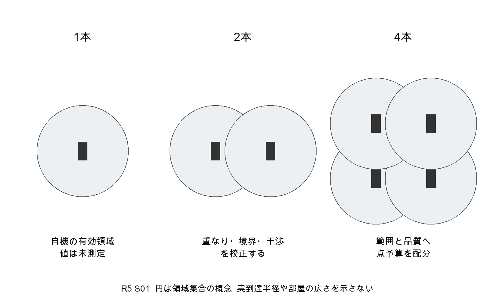
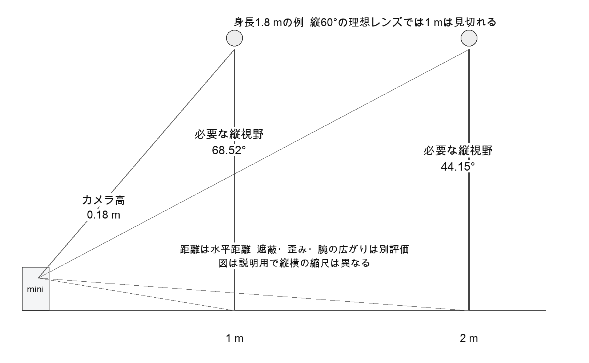
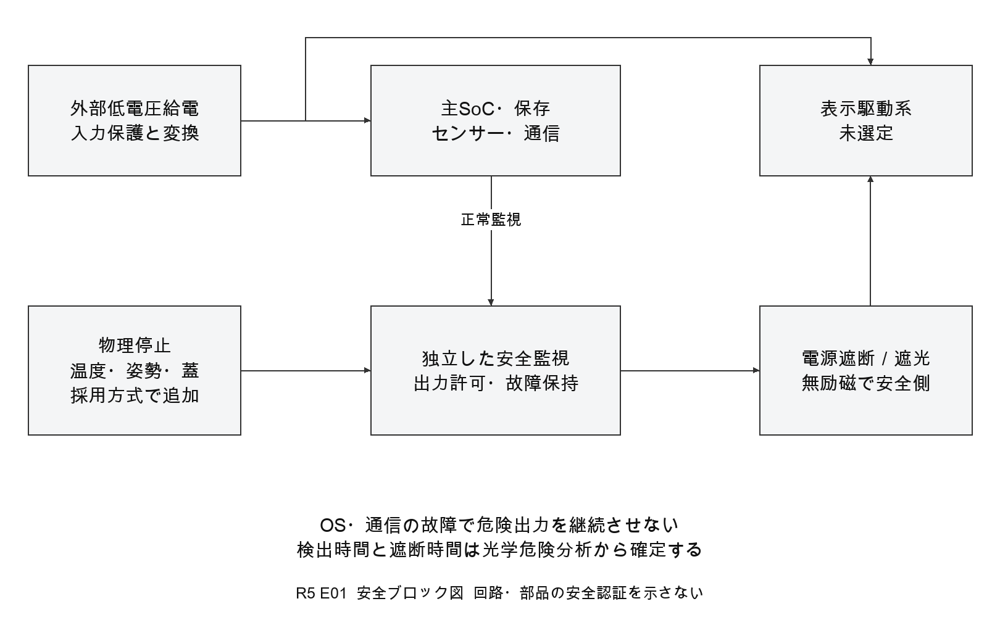
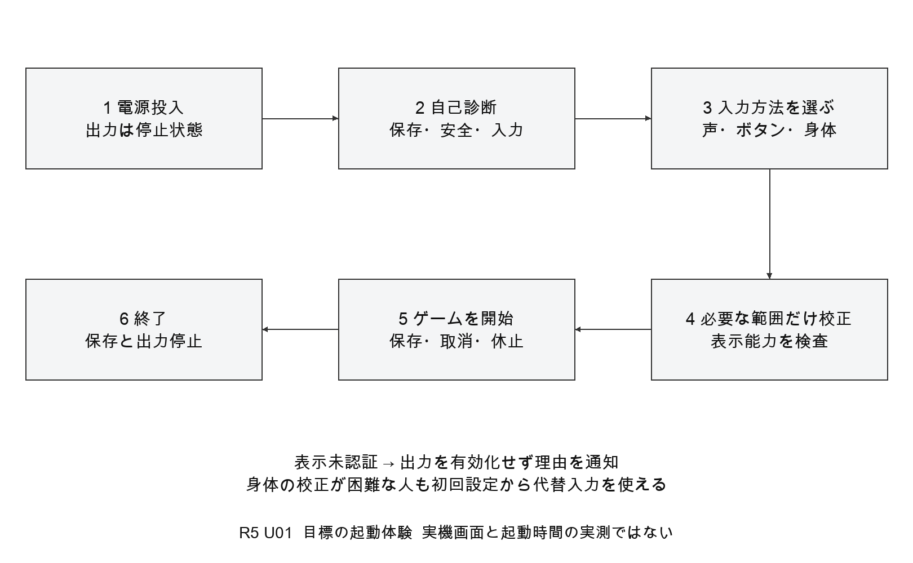
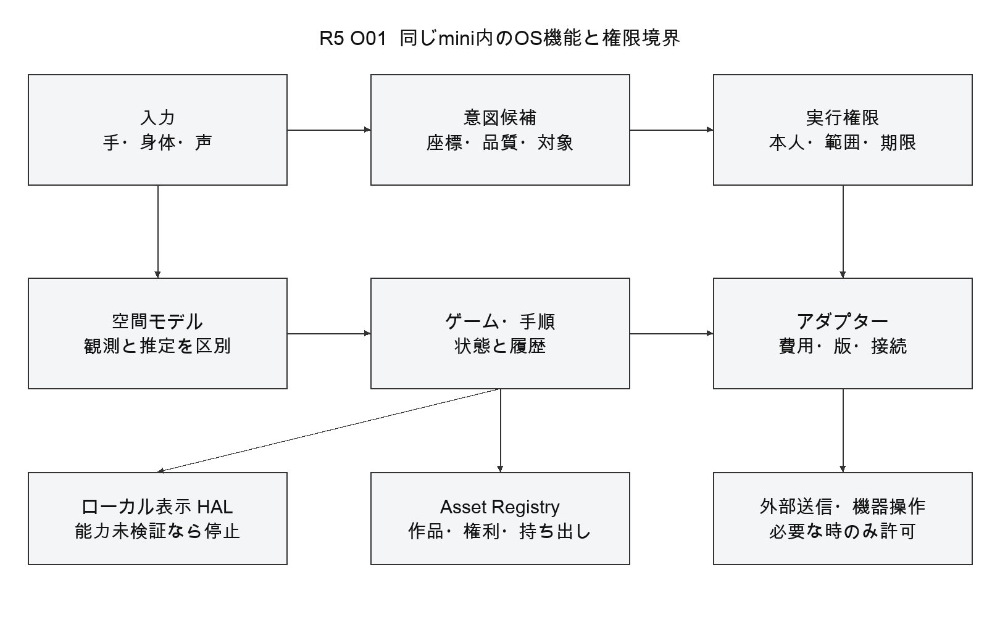
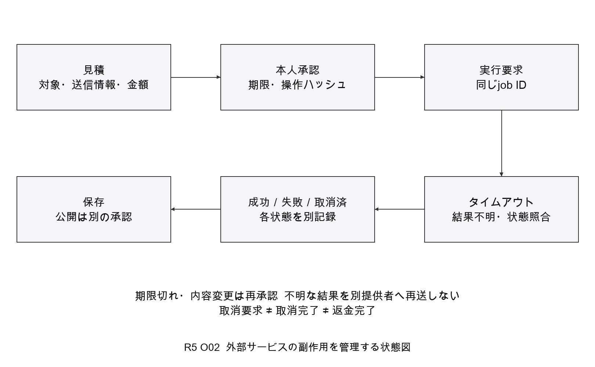

# avocadoMini RockstarOS 統合設計仕様書 R5

2026年9月24日

ゲームを入口に、制作、学習、日常の操作と作業支援へ展開する。

本書は、製品要求、システム構成、ハードウェア候補、OSの契約、計算、図面、試作・受入計画を統合する設計基準である。使用時の全高200mm以内、1本で自律動作、増設による範囲・品質の改善、眼鏡なしの周囲実空間表示を製品要求とする。

設計状態は「統合基本設計」。裸眼の全空間表示エンジン、最終収納、確定回路、製造用部品図は未承認であり、本書をそのまま加工・通電・量産の指示に使用しない。実機試験は0件。

文書番号 AM R5 SYS 001

版管理 R5が現行要求の基準。R2の固定親機構成、E3の別Hub構成、R3の当時の表示範囲確認事項は履歴として扱い、現行要求に優先させない。

## 01 文書の範囲と読み方

この設計書の読者は、製品開発、機構、電気、光学、組込み、OS、ゲーム、品質の担当者である。構成を決める根拠と、何を確認すれば製造へ進めるかを共通にする。

|区分|本書の意味|
|---|---|
|要求|利用者が確認した製品の到達点。実装済みという意味ではない|
|提案|開発側の割当や試験条件。承認・実測により変更する|
|計算|明示した仮定で再現できる数値。性能・安全の実測と分ける|
|候補|一次資料に存在する部品や方式。互換性、収納、調達の保証ではない|
|HOLD|必要な根拠が揃わず確定・製造・公開できない項目|

内容は、製品機能と要求、全体図と計算、ハードウェア詳細、RockstarOS詳細、受入と製造承認、参考資料の順に読む。見出しはWordのナビゲーションで移動できる。付属SVGは拡大可能な設計検討図で、製造CADではない。

|読みたい内容|参照する章|
|---|---|
|何ができる製品か|02から04|
|外観と入力と表示の仕組み|05から10|
|電力や通信や粒子の計算|11から16|
|空間で操作する方法|17AとOS 3からOS 4|
|型番と接続と組立|H1からH10|
|OSとAIと安全な運用|17から18およびOS 1からOS 8|
|試験と製造への残り作業|受入試験以降と未確定事項|

## 02 必須要求と設計の対応

|ID|必須要求|設計の対応と受入|
|---|---|---|
|REQ01|使用時の全高200mm以内|台座・脚・キャップを含む寸法鎖。ME01で全姿勢測定|
|REQ02|銀の細い円筒と黒いカメラ帯|M01を意匠基準に、実CADで収納・視界を照合|
|REQ03|1本で基本機能が動く|各miniに演算・入力・保存・出力安全。SYS01|
|REQ04|別Edge HubやPCを必須にしない|調整役はソフトウェア。外部給電は演算Hubとは別|
|REQ05|裸眼で周囲空間に粒子が見える|表示ゲートOP01。カメラ到達範囲で代用しない|
|REQ06|増設で範囲と鮮明さを改善|1台、2台、4台を別測定。MULTI01とOP02|
|REQ07|身体・手・日本語音声で遊ぶ|入力統合と代替操作。IN01、VO01、ACC01|
|REQ08|粒子の衝突と結合を扱う|再現可能なゲームルール。GAME01|
|REQ09|作る・保存・共有できる|SDK、版管理、権利、公開承認。ASSET01|
|REQ10|AIを交換できる|Capability Adapterと明示承認。AI01|
|REQ11|生活の負担を減らす|限定手順、照明、タイマーから。LIFE01|
|REQ12|本人が止められ管理できる|物理停止、目的別許可、退出と復旧。SAFE01等|

これらは合格済み一覧ではない。具体的な表示体積、観察位置、照度、点数、騒音、消費電力、筒径・台座径の製品値は未承認とする。

## 03 ゲームと制作の基本機能

標準ゲームの最小構成は、粒子を選ぶ、動かす、放す、衝突・結合させる、分離する、取消する、時間を止める、保存して再開する、という操作で定義する。手を大きく振る操作は選択肢であり、生活操作や初回設定で強制しない。

|体験|具体的な動作|失敗したとき|
|---|---|---|
|粒子を操作|対象を選択し、保持中だけ移動。放すと確定|追跡喪失では飛ばさず保持を解除または休止|
|衝突と結合|接触条件、速度、材料タグをルールで判定|不正な値、版不一致、計算過負荷は停止|
|協力と対戦|同じセッションの状態を同期|必要な定足数を満たさない側は共同状態の新規確定と共同出力を止める|
|つくる|粒子の見た目、規則、ステージを編集|前版へ戻せる。危険な外部操作APIは与えない|
|保存と共有|作品、ルール、乱数種、作者、版を保存|公開と生成を分離し、公開先を確認する|

最初の標準体験は自社の粒子サンドボックスとする。GTAのような世界への没入は将来の体験目標であり、GTA VIの実行、改造、操作API、権利や公式対応は本書で確認したものではない。外部タイトルの対応はタイトル別の許可と実機試験を通した機能だけを公表する。RockstarOSとRockstar Gamesの提携を意味しない。

開発用画面によるシミュレーションはゲーム・入力の検証に使用できるが、裸眼空間表示の完成判定には使わない。

## 04 日常生活への機能展開

ゲームで覚えた短い操作を、限定した生活の行動へ拡張する。需要と効果は製品仮説として検証する。家事を物理的に代行する機構や医療・緊急監視機能は含めない。

|段階|利用者ができること|設計する境界|
|---|---|---|
|制作と学習|条件を変え、結果を比べ、自作体験を保存|楽しさ、理解度、応用力を別評価。EDU1、HCI12|
|手順支援|次へ、戻る、タイマー、中断と再開|本人が選ぶ手順と現在工程。見えない物は確認。HCI5、HCI11|
|生活機器操作|対応照明、音量等を短い命令で操作|対象ID、権限、実機の状態応答。SYS3、SYS4|
|物と作業の記憶|最後に見えた時刻・場所を調べる|現在位置を保証しない。観測範囲と保存期限。SYS5|
|共同利用|本人が招待した相手と遊ぶ・作る|ゲスト、共有範囲、退出、取消できない公開。SYS6|

先行研究は、音声による自立操作の価値と、設定・誤認の壁を示している。空中操作には腕の疲労があり、学習の臨場感と理解度は同じではない。そこで、着座、片手、小さい動き、声、ボタンを初回設定から選べる仕様にする。[HCI1、HCI2、HCI3、HCI12、NEED5]

生活支援の試験は、火、刃物、鍵、支払い、緊急通報を扱わない工作手順から始める。紙やスマホより、設置、操作、訂正、片付けの合計負担が減るかを比較する。初回設定と保守の時間は独立して報告する。

## 05 単体と増設の全体構成

各miniは同じ基本能力を持ち、独立して起動・入力・ゲーム・保存・停止を扱う。別のEdge Hubを置かない設計でも、その役割である制御と接続はmini内部に必要である。家庭の通信設備と電源は演算Hubと区別する。電池内蔵は未採用で、外部給電の方式と定格はHOLDとする。



複数台ではセッション調整役を選び、座標、時刻、ゲーム状態を共有する。調整役は固定の親専用ハードではない。表示領域は各miniの有効領域の和集合であり、同じ場所への重なりは体積を増やさない。

追跡しやすくなること、表示範囲が広がること、粒子が鮮明になることを別々に試験する。増設時も個々の表示能力が未検証なら、広さを推測して有効化しない。

## 06 外観と200mmの寸法制約


図の直径30mmの軸と直径96mmの台座はR3から引き継ぐ比較寸法で、ユーザー承認済みの直径ではない。台座25mmと露出軸175mmの合計200mmは外形上限の包絡であり、公差込み加工寸法ではない。伸長や脚の使用で上限を超えてはならない。

公差の配分例は、組立後の有効長の合計197mm、5要素を各±0.4mmとしたとき、最悪積上げ199mm、上限まで1mmである。実際の要素数、継手の重なり、温度変形、脚の沈み、材料と工程が決まるまでは、この配分を部品公差へ転記しない。

必要な最終図面は、正面・側面・平面、断面、取付穴、基準面、幾何公差、継手、光学窓、アンテナ窓、吸排気、配線の屈曲、工具アクセスである。現在の図はその審査用の包絡である。

## 07 内蔵部品の空間と機構


CM5の裸基板55×40mmを水平に円へ入れるだけでも、必要内径の下限は68.007mmとなる。公式IO基板160×90mmは183.576mm必要であり、比較台座D96には入らない。専用接続基板、冷却、コネクター、ケーブルを含む実CADを設計する。[HW01]

収納できる容積を光学、電子回路、放熱器で重複して使わない。黒い帯の撮影窓に必要な光学特性と、可視表示の射出開口を混同しない。筒を金属にする場合、アンテナの周囲は無線性能を測って決める。

安定性の単純例として、質量0.5kg、支持半径48mm、高さ200mmへの水平力を仮定すると、静的な転倒限界は約1.18Nにすぎない。実重量や脚の効果は未確定である。重心、摩擦、ケーブル引張り、動的な衝突を含めて支持脚と設置条件を決める。

## 08 空間を読む光と空間へ見せる光

カメラ用照明、距離を測る赤外光、可視粒子を表示する光は、目的と到達条件が違う。距離センサーの測定距離を「その距離に裸眼で像を表示できる距離」に換算しない。

|系統|何をするか|範囲を決める条件|
|---|---|---|
|RGBと照明|色、模様、手や物体を撮る|レンズ、露出、照度、動き、遮蔽|
|ステレオと補助IR|左右の視差や模様から距離を推定|基線、画素、視差誤差、物体の反射、同期|
|ToF|戻る光から距離を測る|方式、受光量、外光、反射率、多重反射、干渉|
|可視の空間表示|裸眼で実空間中の像を観察させる|表示媒体、光路、視域、安全、明るさ、点予算|

赤外照明は暗所や模様不足の入力を補える場合がある。一方で、反射面、黒い物、透明物、外光、他機の光による限界があり、多台数で常に精度が上がるわけではない。採用方式別に干渉を評価し、必要なら時分割や出力調整を行う。

距離と表示を統合するOS上の規則は、観測できる領域、表示できる領域、人が安全に動ける領域の共通部分だけで直接的な空間操作を行うことである。停止、取消、音声や物理入力等の代替操作は、領域外や追跡喪失でも使えるようにする。カメラが見えないことを安全な無人状態と判定してはならない。

## 09 低いカメラの視野と深度精度



カメラ高0.18m、身長1.8mの理想幾何では、水平距離1mで足から頭まで68.518°、2mで44.150°の縦視野が必要である。傾きを変えてもレンズの視野角そのものは増えない。床置きと台上作業は別の校正条件として保存する。

理想ステレオの比較として、横640画素、横視野75°、基線20mm、視差誤差0.25画素なら、一次近似の深度誤差は距離1mで約30.0mm、2mで約119.9mmとなる。これは実カメラの性能ではない。細い筒に入る短い基線だけで、遠距離の指先を高精度に取得できると判断しない。

複数台の観測は遮蔽を補う候補になる。撮影時刻、カメラ姿勢、レンズ校正、人物IDを一致させ、不明な点を推定で埋めた場合は品質情報を伴わせる。

## 10 全空間表示の成立条件

本製品が求めるのは、普通の生活空間に眼鏡なしで粒子が分布して見え、利用者が操作できる体験である。調査で確認した以下の技術は研究参考であり、全要求を満たす採用品ではない。[TECH1、TECH2、OPT01からOPT03]

|方式|確認された原理や研究|製品化に残る差|
|---|---|---|
|二光路レーザー励起|Xe充填領域のセンチメートル級表示|通常の室内、20cm自律機、安全性を未証明|
|光で捕捉した実粒子|粒子を保持・移動して体積像を作る|気流、人体、広域化、収納、安全の未解決|
|音響捕捉|対向アレイ間の粒子を動かす|床置き1本から室内全域とは構成が異なる|
|動く拡散面|面を走査して体積像を作る|表示媒体と機構が必要で、自由空間とは異なる|
|空中結像プレート|光源を対称位置に結像|平面像を部屋全体の立体点群とは扱わない|

OP01の試験前に、表示体積、床からの像位置、観察者の眼の領域と人数、室内照度、点間隔、位置誤差、色、コントラスト、更新、ちらつき、人体侵入、気流、安全、電力、騒音の合否値を決める。未設定のまま「測定した」だけで合格にしない。

光学方式の選定と専門の安全審査が済むまで、開放高出力光源や実粒子放出の製作手順を発行しない。R5では表示エンジンの型番、光路寸法、ピン配線はHOLDである。

## 11 表示点と増設の計算

走査型表示の点訪問能力は、粒子数だけでなく、粒子あたりの表示点、更新頻度、色分割や反復の回数で決まる。光源の公称点数から描画できる粒子数を直接決めない。

@eq R ≥ P × K × f × m

Rは有効点訪問数毎秒、Pは粒子数、Kは1粒子の表示点数、fは更新Hz、mは各点の訪問回数毎更新である。これは走査型の下限比較で、非走査型へそのまま適用しない。

|計算例|必要な有効点訪問数|
|---|---|
|1000粒子 × 1点 × 60Hz × 1回|60000回毎秒以上|
|10000粒子 × 1点 × 60Hz × 1回|600000回毎秒以上|
|1000粒子 × 10点 × 60Hz × 1回|600000回毎秒以上|

移動や空走、点灯時間、再捕捉、輝度、安全停止の余裕を差し引いた能力で比較する。4本の能力を範囲拡張と品質改善へ二重に割り当てない。合計体積は各有効領域の和集合であり、重なり、隙間、視域、減光を反映する。

速度1m毎秒の像で時刻ずれ1msは1mm、5msは5mmの位置差に相当する。角度誤差0.1°は距離1mで約1.745mmになる。これに並進、追跡、表示固有の誤差を加える。通常の時計同期だけで光の位相同期まで得られるとはしない。

## 12 電源と熱の比較計算

電子負荷22.5Wは候補構成を検討する仮予算である。専用NPUの電力は含めておらず、採用時には増分と変換・冷却負荷を再計算する。表示負荷をP_Dとし、変換効率90%の比較で入力電力を計算する。20Vは電流換算の比較条件で、給電定格の確定値ではない。

@eq P_in = (22.5 + P_D) / 0.90

|表示負荷の仮定|入力電力|20Vでの電流|排気温度差15Kの理想風量|
|---|---|---|---|
|0W|25.00W|1.250A|2.928CFM|
|5W|30.56W|1.528A|3.579CFM|
|15W|41.67W|2.083A|4.880CFM|
|30W|58.33W|2.917A|6.833CFM|

比較形状の表面積は0.0312714m²。自然対流係数5から10W毎m²K、表面と周囲の差10Kでは1.564から3.127Wしか運べない。電子だけの25Wにも届かず、滑らかな小型外形を自然対流だけで冷却できるとはしない。

理想風量は、全入力電力を熱とする保守的比較、空気密度1.2kg毎m³、比熱1005J毎kgKで算出する。放射、床への伝導、圧損、再循環、光の持ち出し、ファン効率は別に扱う。これはファン型番の選定値でも表面温度の予測でもない。

## 13 配線と安全の境界



配線設計は電源、センサー、演算、安全、表示に分ける。停止ボタン、監視異常、蓋や姿勢など採用方式に必要な検出は、OSの正常動作を待たず出力を停止できる経路へ接続する。RP2040等を置くだけで安全回路が認証されるわけではない。

表示出力許可は初期値OFFとし、校正、自己診断、安全条件が揃ってから有効にする。電源断、再起動、制御線断線時の安全側動作を回路で定義する。再投入で自動的に危険出力へ復帰させない。

最終回路のピン表には、メーカー型番、パッケージ、信号名、端子番号、電圧、方向、既定状態、抵抗値、保護、コネクターと相手先を記載する。未選定の光学部に仮の端子番号を付けて施工可能と見せない。

## 14 通信と記録容量の計算

全台の生映像を常時共有する構成は初期案にしない。基本は各miniで前処理し、必要な座標と状態を共有する。保存と外部送信は別の許可で制御する。

|仮のデータ条件|ヘッダー等を除く計算量|
|---|---|
|深度640×480、16bit、30fps|147.456Mbps毎台|
|RGB1280×720、24bit、30fps|663.552Mbps毎台|
|上記2系統を同時送信|811.008Mbps毎台|
|25関節×7個の32bit値×60Hz|336kbps毎台|
|上記の関節情報を4台共有|合計1.344Mbps|
|上記の生深度を1時間保存|66.3552GB、十進単位|

この640×480深度は帯域の比較仮定であり、候補VL53L5CXの最大8×8ゾーンの出力ではない。1本で精密な3D入力を得る方式はOPEN05で確定する。25関節の例はH4の33関節とは別の比較で、製品の通信形式は未確定。4台合計はデータ生成量で、宛先別の複製を含まない。

圧縮率、暗号化、ヘッダー、再送、競合、画像の同時読出しは別である。無線のリンク速度を実効通信量と見なさず、金属筐体、家庭の干渉、配置、同時負荷で測る。座標情報も個人の行動を表し得るため保護する。

時計は単調時刻と校正世代を付けて扱う。期限を過ぎた操作を後からまとめて再生しない。デバイス認証、相互認証、鍵の失効、セッション退室を用意する。

ストレージ容量はOSのA/B領域、モデル、ゲーム、作品、ログ、更新用空き、寿命を合算して決める。候補eMMC32GBを最終のゲーム容量やGTA対応容量としない。現時点の容量選定はHOLDとする。

## 15 ゲーム計算と科学モデル

10000粒子の全組合せを毎フレーム調べると、1フレーム49,995,000組、60Hzで約30億組毎秒となる。空間格子等で近い粒子を絞る設計とし、密集時の最悪負荷と粒子数制限を測る。1粒子64バイトの状態を2面持つだけなら1.28MBだが、モデル、衝突構造、描画資源、OSのメモリーは別である。

@eq N_pairs = N × (N - 1) / 2

衝突ルールは時間刻み、質量、速度、半径、反発、結合条件を版固定する。高速な粒子がフレーム間に通り抜ける場合は連続衝突判定や刻みの分割を用いる。処理落ち時に勝手に反応結果を変えない。

簡単な解析テストでは、等しい仮想質量で速度が+1と-1の完全弾性衝突は速度を交換し、全運動量と運動エネルギーが保存される。同じ2粒子を完全非弾性結合させる場合は合計質量、運動量、失われた運動エネルギーの扱いを検査する。ゲームの演出として消えたエネルギーを実在の化学反応熱と呼ばない。

学習モードは、モデル名、妥当な範囲、単位、単純化、参考資料を示し、予測、条件変更、観察、説明を一組にする。粒子が結合して見えるだけのゲームルールと、物理化学的な分子シミュレーションは別の機能として登録する。[EDU1]

## 16 操作遅延と起動体験



電源投入時は表示出力を停止したまま、物理停止、記録領域、鍵、入力、温度を検査する。初回は入力方法を先に選び、必要な身体校正だけを行う。ネット接続と外部AI登録は基本操作の必須条件にしない。表示能力が未認証なら、表示の起動を中止し、その理由を音声等の利用可能な経路で知らせる。

遅延の仮配分例は、60Hz取得の待ち16.7ms、前処理5ms、追跡8ms、120Hz物理更新の待ち8.3ms、通信2ms、60Hz表示の待ち16.7msで計56.7ms。この足算は実測のp95ではない。露光、キュー、描画走査、OS競合、音声の発話待ちは条件別に測定する。

起動秒数はストレージ、OS、センサー、光学部を採用してから定める。進捗、失敗理由、再試行、記録を消さない復旧の操作を設け、待たせる間に安全状態を隠さない。

## 17 OSの共通機能と責務



RockstarOSはローカル機器の制御、空間・ゲーム状態、入力、権限、サービス接続、費用、生成物を統合する。基盤OS、ドライバー、推論・ゲームの実行環境は採用ハードの実測と更新性から選ぶ。本書のサービス名とAPIは設計契約で、rockリポジトリへの実装済み判定ではない。

センサーが読んだ文章、ゲームの台詞、外部AIの出力はデータであり、本人の許可ではない。AIが操作候補を作る経路と、実際に家電・外部サービス・公開・課金を実行する経路を分ける。

## 17A 空間の中で選んで動かす操作

操作の基本状態は、待機、候補表示、選択、保持、移動、確定、休止とする。近い粒子は手の位置、遠い粒子は指差し等の方向で候補にする。ただし視線推定を必須にせず、声や物理入力で同じ候補を順に選べる。対象を決める前に、位置と名前を確認できる方法を用意する。

|状態|入力と結果|誤操作を防ぐ条件|
|---|---|---|
|候補|手や方向から対象候補を出す|候補が複数なら選択を促し、勝手に確定しない|
|選択|つまむ、選択と言う、ボタンで選ぶ|認識の確かさと対象の安定を検査する|
|保持と移動|保持している間だけ移動量を適用|手を下ろす休止、着座、小さい動作の倍率調整|
|確定|放す、確定と言う、ボタンを押す|追跡喪失を放す操作に変換しない|
|取消と休止|一つ戻す、止める、物理停止|取消できない外部作用はゲーム経路から呼ばない|

対象の大きさは見た目だけで決めない。位置誤差の保守的な合計をEとし、選択余裕をMとすると、操作対象の直径を少なくとも2E＋Mとして比較する。例として追跡10mm、校正5mm、表示5mm、余裕10mmなら50mmとなる。これは仕様値でなく、精度を測らず小さな粒子を直接触らせる設計を避けるための計算例である。より小さい粒子は拡大、候補切替、音声選択で扱う。

選択の安定時間、つまみ判定、解除の閾値、動作倍率は入力精度と疲労の試験で決め、設定を保存する。本人の身体差を認識誤りとして隠さない。ハードウェアとして触覚を発生する機構は未選定であり、触った感触まで実現済みとはしない。

## 18 外部AIと経済圏の動作



生成の前に、送信する素材、提供者、目的、見積と上限、保存条件、権利、地域、処理時間、取消条件を確認する。本人が許した一つの要求に、期限と内容の識別値を結び付ける。内容や提供者を変えた場合は承認を取り直す。

Higgsfield、Roblox、YouTubeなどは接続先の例であり、対応済み一覧ではない。公式API、利用条件、費用、商用権利と実機試験が揃った機能からアダプターを有効にする。通信タイムアウトは失敗と断定せず、同じジョブの状態を照合する。

作品は来歴、編集、ライセンス根拠、公開範囲、費用を分けて記録する。C2PAの来歴は権利所有や真実性の保証ではない。glTF出力もゲーム動作の互換性を保証しない。[SYS8、SYS9]


## H1 単体で完結する同型ノード

各miniの使用時全高は、足、台座、筒、キャップ、突起と展開機構を含めて200mm以内。銀色の細い円筒、黒いカメラ帯、低い円形台座を意匠条件とする。各miniへ演算、保存、映像・距離入力、音声、停止と安全監視を持たせる。表示エンジンも最終的には各miniに内蔵する要求だが、周囲の実空間へ裸眼で粒子を分布させる方式は研究ゲートにある。テレビ、眼鏡、壁投影や小さな空中像面を要求達成の代用品にしない。

1本でローカル起動、入力方法の選択、ゲーム状態管理、保存、停止を行う。別筐体のHubやPC、クラウド認証を基本操作の必須条件にしない。ACアダプターは電源であり外部演算機ではないが、給電口・定格は表示方式決定後に確定する。電池内蔵は今回の成立条件に追加しない。

増設時は同じハードウェアのminiを追加し、本人承認、機器認証、共通座標と時刻の校正を行う。調整役はソフトウェアの役割であって専用親機ではない。各機は通信断でも自分の出力を停止できる。認識範囲と表示範囲を別に測定し、単体の測定前に「4本で何畳」と換算しない。

生活機能の初期対象は、タイマー、手順の再開、選んだ物の最後の観測、対応確認済みの照明等。電気機械による家事代行、現在位置の全室保証、危険な家電の自動運転をこのハードウェアから推定しない。来客にも分かる撮影・録音状態と物理停止を配置する。

## H2 部品型番を持つ比較BOM

数量は1ノード当たりの検討値。以下は購入可能性を含む比較候補であり、採用リリース済みBOMではない。公式資料の閲覧日は2026-09-24。価格・在庫・供給契約は確定していない。

| ID / 数量 | メーカー型番又はSKU | 確認した仕様と候補理由 | 採用前に残る条件 |
| --- | --- | --- | --- |
| U-COM / 1 | Raspberry Pi CM5108032、RPL SC1601 | CM5、RAM 8GB、eMMC 32GB、無線あり。55×40×4.7mmの組込比較候補 [S1][S11] | 専用carrier、性能、冷却、OS移植、無線の筐体内試験 |
| CAM / 1 | Raspberry Pi SA36VA30P | Camera Module 3 Sensor Assembly Wide。IMX708、IRカット、RAW10、水平102°・垂直67°。通常の25×24mm基板付きカメラとは別のOEM部品 [S3] | 支持回路・電源・FPC・取付・歪みと露光特性。単眼で全身3D精度を保証しない |
| U-RANGE / 1 | ST VL53L5CXV0GC/1 | 6.4×3.0×1.5mm、4×4/8×8ゾーンのToF。近傍の距離・存在補助候補 [S4] | 窓のクロストーク、照明、反射率、更新条件。64ゾーンを指・関節の精密点群としない |
| AUD-EVAL / 1 | Seeed reSpeaker Lite、SKU 107990273 | XMOS XU316、2マイク、USB/I2Sの音声フロントエンド評価候補 [S5][S6] | 35×86mmの基板を収納する形状、実高さ、MIC OFF、音響、ファームウェア固定 |
| U-MON / 1 | Raspberry Pi RP2040 | 7×7mmの監視MCU比較候補。主OSと別の監視経路にする [S7] | 周辺回路、ウォッチドッグ、停止回路、故障解析。機能安全認証品としては扱わない |
| U-KEY / 1 | Microchip ATECC608C-MAHDA-T | I2C、8パッドUDFNの鍵保護IC。メーカーはIn Productionと表示 [S8] | 鍵生成・書込・ロック・更新・回復の設計。暗号IC搭載だけで製品認証は完成しない |
| U-PROT / 必要分 | TI TPS259470LRPWR | 2.7～23V、5.5A、逆流・逆接保護のeFuse比較候補 [S9] | 入力電圧、電流閾値、突入、周辺値、PCB放熱。24V入力を直接受ける候補にはしない |

音声基板を採用品に固定せず、その回路構成と必要な音響性能を評価した上で専用化を判断する。音声フロントエンドのAEC・雑音抑制は、日本語ASR・命令理解が完成した証拠ではない。鍵保護ICの旧ATECC608Bは公式ページで新規設計非推奨のため、R5の新規候補にしない [S10]。

このBOMはCPU/GPUを持つ演算候補の比較であり、NPUを含む完成構成ではない。専用NPUは未選定で、加速器の接続、電力、冷却、メモリー、モデル互換性をOPEN03で判断する。内蔵AIの要求を満たしたとする前に、日本語音声、姿勢認識、ゲーム、表示の同時負荷を測定する。ローカル性能不足を無断でクラウド処理へ置き換えない。

未確定の必須BOMは、表示エンジン、carrier PCB、DC/DC、ACアダプター、発光・出力ドライバー、停止スイッチ、シャッター、温度監視、ファン、スピーカー、SSD、コネクター/FPC、アンテナ、筐体と脚、締結品。型番が空欄なのは省略可能という意味ではない。各欄へ代替条件、状態、根拠文書版、数量、実装面、許容代替メーカーを追記してから調達する。

## H3 全高と収納を同じ座標系で判定する

図面のD30×露出H175mmの円筒＋D96×H25mm台座は、R3由来の収納比較ケースである。175＋25＝200mmは公差なしの外形包絡で、製造公称寸法ではない。製造図面では各寸法の最大偏差、足とキャップ、傾斜や組立隙間、展開途中の包絡を加えた最悪値が200mm以下になるよう、公称値に余裕を設ける。RSS計算だけで絶対上限を保証しない。

| 比較対象 | 裸部品・包絡の計算 | 判定の限界 |
| --- | --- | --- |
| CM5水平配置 | sqrt(55²＋40²)＝68.007mm | 本体のみ。carrier、端子、配線、冷却は含まない |
| CM5公式IO基板 | sqrt(160²＋90²)＝183.576mm | D96台座へそのまま収納不可。専用carrierが必要 |
| SA36VA30P光学ヘッド | 10.8mm角、光学側厚さ8.3mm。幅と厚さの包絡対角13.621mm | 頭部とFPC・支持回路を混同しない。公式図ではFPC側へ7.3mmの延長がある |
| 音声評価基板 | sqrt(35²＋86²)＝92.849mm | D96・壁厚2mmと仮定した内径92mmに、長方形の裸包絡でも不足 |

音声基板の斜め・縦置きや独自基板化は別の検討であり、計算だけで不可能一般論にはしない。同時に、外観図へ小さく描き込んで収納合格ともしない。CM5ヒートシンクは約41×56×12.7mmだが、モジュールや嵌合コネクターとの共通基準がないまま高さを単純合算して採否を決めない [S2]。

SA36VA30Pの公式寸法図と型番表はページ画像を見て確認した。センサー組立品には支持部品の参照回路/BOMが用意されるが、自由にコネクターを延長できるという意味ではない [S3]。FPC曲げ、レンズの可動域、黒窓の透過と反射、マイク孔、アンテナ、放熱路を同じ3D配置へ入れる。座標基準は台座下面、円筒中心軸、前面基準マークの三つとし、カメラ外部パラメーターと校正番号を対応付ける。

## H4 入力精度と増設通信の計算

単体入力は広角RGBと粗いToFの組合せを比較するが、これを精密な全身3D方式に確定しない。人の裏側、家具による遮蔽、画面外は観測できない。ToFの最大距離と最大更新速度を、任意の反射率・照度・8×8設定で同時達成するとはしない。眼鏡なし表示の光源と、940nm測距光と、ゲーム内の粒子は別の機能である [S4]。

床置きでは低いカメラ位置、作業面では近距離と手の遮蔽が問題になる。広角カメラの視野角だけで人体精度は求まらない。例えばステレオ化を追加検討する場合、距離誤差の一次式は σZ≒Z²σd/(fB)。Z＝2m、f＝800pixel、基線B＝0.060m、視差誤差σd＝0.5pixelなら約41.7mm。この数値は仮定の感度計算であり、SA36VA30P単眼に適用した達成値でも、60mm基線を収納できた証拠でもない。

センサーの公式一般モード1080p50とRAW10を帯域検討の例にすると、1920×1080×50×10＝1.0368Gbps、129.6MB/s。これはMIPIリンクのブランキング、パケット、画像処理コピーを含まない。16bitへ展開したRAM上のフレームは4.1472MBであり、RAW10 packedの2.592MBとは違う。生映像を連続保存すると1台で466.56GB/時となるため、常時保存を基本にしない。

複数台では各機で特徴・姿勢を計算し、必要な状態だけ共有する方針を検討する。例として33関節×16byte×60Hz＝31,680byte/s/台、4台合計の送信生成量は1.01376Mbps。これは時刻・機器ID・暗号化・再送や受信先数を含まない下限で、全相互送信ならネットワーク負荷はさらに増える。生映像を全台集約しても通信も演算も不要になるわけではない。

1m/sの動きに1msの時刻誤差なら1mm、距離1mで姿勢角0.1°の誤差なら約1.745mmの位置差となる。時刻同期、露光時刻、座標校正、表示遅延へ誤差を配分する。CM5のIEEE1588対応PHYは、ネットワーク全体の精度保証でも光学位相同期でもない [S1]。

## H5 電源予算と熱の一次判定

次の数字は1ノード当たりの部品選定用割当であり、採用品の最大消費電力を積算した完成表ではない。CM5は公式資料の5V・最大2.5Aを考慮する電源設計指針を比較枠とする。それ以外は提案値。表示エンジンの負荷P_Dは不明のまま残し、旧版の光源12Wや親機49Wを転用しない [S1]。

| 電子負荷 | 比較割当 |
| --- | ---: |
| 演算モジュール | 12.5W |
| RGB支持回路を含む入力 | 1.5W |
| 距離センサー系 | 0.5W |
| 音声入力と出力 | 2.0W |
| データ保存拡張 | 3.0W |
| carrier・監視・鍵・ネットワーク周辺 | 2.0W |
| ファンと状態表示 | 1.0W |
| 電子負荷合計E | 22.5W、表示を含まない |

CM5内蔵無線は演算枠、周辺枠は外付け回路として二重計上を避け、実BOMではIC・動作モード・起動ピーク別に積算する。効率η＝0.90なら入力P_IN＝(22.5＋P_D)/0.90。P_D＝0でも25W、変換損失2.5Wとなる。表示未決のため製品定格ではない。各機の入力と電源保護は独立に検討する。

R3比較形状で、底面を除き、円筒上面と台座の円筒接触部分を相殺した表面積は、A＝π×0.030×0.175＋π×0.096×0.025＋π×0.096²/4＝0.0312714m²。仮に表面と周囲の温度差10K、自然対流係数5～10W/(m²K)なら、hAΔTは1.564～3.127W。25Wの電子系比較値だけでも熱収支が合わず、受動冷却合格とはできない。放射・伝導・フィン・流路は未算入で、この式は表面温度を予測したものではない。

全25Wを空気へ移す理想下限は、Qair＝25/(1.2×1005×ΔTair)。排気温度上昇10Kなら約4.392CFM、15Kなら約2.928CFM。空気密度1.2kg/m³、比熱1005J/(kgK)は比較仮定。ファンの自由空間風量では選定せず、圧力損失とファン曲線、再循環、フィルター、マイクへの雑音を測る。排気温度と接触表面温度は同一ではない。

進む条件は、必要性能を保った電力削減、台座の熱経路と能動冷却、表示方式を含む実負荷測定。測る前にファン径、回転数、許容表面温度、騒音を合格値として発明しない。CM5の85°C付近のサーマル制御は製品外装の安全温度ではなく、カメラ組立品の0～50°C動作条件も別に守る [S1][S3]。

## H6 接続ICDとピンを確定する境界

ICDはインターフェース管理表であり、そのまま配線できる完成回路図ではない。各接続に版番号、送受信、電気規格、電源ドメイン、起動時状態、故障時状態、コネクターとpin 1の見方向、ケーブル、テスト点、検証記録を持たせる。

| ICD ID | 境界と設計方針 | 確定するための不足 |
| --- | --- | --- |
| PWR-01 | 電源入力→保護→変換→電子系／表示系を分離 | 表示の負荷・突入・電圧、ヒューズ協調、変換器、ケーブル末端電圧 |
| CAM-01 | カメラ組立品→専用支持回路→CM5のCSI | メーカー参照回路照合、FPC品番、差動配線、クロック、電源順序 |
| RNG-01 | ToF→I2C等→入力処理 | V0/V9等の版確認、電源とIOレベル、窓材、校正、複数機干渉 |
| AUD-01 | マイク・前処理→USB又はI2S→ローカル認識 | Firmware版、サンプル形式、AEC参照音、物理MIC OFFの遮断対象 |
| NET-01 | 各機のEthernet又はWi-Fi→相互認証 | 有線の磁気部品・ESD、無線アンテナ、PTP対応経路、再接続仕様 |
| SAFE-01 | 物理停止・監視→出力許可 | 主OS停止時もOFFを維持する回路、独立タイムアウト、自己診断 |
| DISP-01 | 能力記述・時刻→表示エンジン | 方式未選定。光源電圧・駆動端子・トリガpinを空欄のままHOLD |

メーカー端子の例として、CM5のpin 92はPWR_Button、pin 99はPMIC_Enable。公式表ではそれぞれ5Vへの内部プルアップがあり、通常の3.3V GPIO出力と同一には扱わない。pin 16はFan_Tacho、pin 19はFan_PWMであり、CM4の同じ番号の用途をコピーしない。これらは公式端子名の確認であって、R5の監視MCUへの配線指定ではない。バッファ、起動・停止順序、全電源pinとGND、しきい値を照合した回路で決める [S1]。

配線図が承認される前に、GPIOを適当に割り振ったり、未選定表示装置へTTLトリガ入力があると仮定したりしない。既存ケーブルの色からpinを決めず、機器側とケーブル側の見方向を記載する。筐体を開けないと触れない整備端子と、利用者が挿す端子を分ける。CM5の2本のUSB 3系統を4本の独立端子と数えない。

## H7 入力停止と生活環境の安全

電源投入時は出力許可をOFFとし、シャッター・MIC OFF・物理停止の状態を読み取る。主OSからの正常通知があるだけで自動的に未知の表示エンジンを起動しない。表示能力と校正、温度、停止経路を検査し、本人が開始した機能だけを有効化する。物理遮断はソフトウェアで解除しない。

表示系の停止はローカルで完結させ、通信断、OS固着、再起動、校正失効、過熱時の既定状態をOFFにする。タイムアウトの数値、残留エネルギー放電、停止後に再開できる条件は表示方式の危険解析で決める。監視MCU、eFuse、暗号ICのいずれか一つを付ければ安全が完成するとはしない。

ToFセンサーの不可視測距光と、研究中の可視空間表示を別の光安全評価対象にする。裸の高出力光源、実粒子散布、特殊ガス設備を家庭用組立手順へ含めない。回路保護ICの認証を製品全体の電気安全・光安全・EMC・無線認証へ転用しない。適用市場、材料、使用環境を決めて専門審査を行う。

生活空間では転倒、引っ掛かる電源線、指挟み、清掃、液体、熱源、子供や来客の操作を考慮する。料理や工作支援は情報提示から始め、防水・防塵・耐熱等級が未試験の段階で水場や加熱機器の近傍使用を保証しない。マイク孔・カメラ窓・吸排気は機能しつつ、見て状態が分かる配置にする。

## H8 組立と校正を段階に分ける

これは設計審査・試作計画であり、現時点で工場へ渡せる組立指示ではない。電源を外してESD対策を行い、承認された部品と基板版だけを使う。半導体の実装・鍵書込・光学調整は作業者の技能、設備と検査を指定する。

1. **受入**：型番、リビジョン、ロット、外観、寸法、FPC方向、部品の代替可否を照合。不可逆な鍵ロックをまだ行わない。
2. **基板試験**：主モジュールや高価な光学部を載せる前に、短絡・絶縁・各電源を検査。電流制限下で電源順序と故障出力を確認。
3. **演算と監視**：carrierへ演算部、監視と鍵保護を実装。単独起動、物理停止、電源断復旧、署名検証を試験。鍵の投入・ロックは承認手順と検証結果を残して行う。
4. **入力と音声**：センサー支持具・シャッター・窓・マイク・スピーカーを取付。FPCを挟まない。締付トルク・接着剤・硬化時間は材質と締結品確定後の指定値を使用する。
5. **熱と筐体**：放熱接触、ファン流路、配線逃げ、アンテナ周辺、足と転倒安定を確認。全高を最大状態で測る。設計図の公称200mmだけで受け入れない。
6. **校正**：カメラ内部・筐体外部パラメーター、距離窓補正、音声、時刻を個別に校正し、筐体・基板・センサーの製造番号に結び付ける。
7. **表示**：表示エンジンの安全審査と単体成立後にのみ組込工程を発行。現時点の完成手順からは保留し、開発用モニター試験を完成表示と扱わない。

不良を修正した時は校正のどこが無効になるかを記録する。モジュール交換後に古い外部パラメーターを無条件に再使用しない。交換後の鍵・所有者・保存データの移行も別手順とする。

## H9 試験と製造リリースの不足一覧

| Gate | 必要な証拠 | R5の状態 |
| --- | --- | --- |
| G-DISPLAY | 単体の表示体積・視方向・照度・位置誤差・ちらつき・安全・電力・寸法 | 未成立研究ゲート。主要BOMと回路を確定できない |
| G-FIT | 全実部品CAD、断面、光路、配線、組立公差、展開包絡、最大200mm検査 | 比較幾何まで。音声基板等に収納課題あり |
| G-INPUT | 単体の距離／姿勢／手精度、遮蔽、照明、動き、誤認、ロスト検知 | 候補仕様のみ。精度と全身方式未確定 |
| G-RUNTIME | 日本語音声、ゲーム、保存、入力、通信、表示の同時負荷 | CPU/AI/ゲーム性能、遅延、安定性の実証なし |
| G-POWER | 動作モード別電力、突入、短絡、逆流、電源断、ケーブル電圧降下 | 割当予算のみ。AC・DC部品と閾値HOLD |
| G-THERMAL | 周囲条件、内部・外装温度、騒音、通風阻害、長時間負荷 | 一次熱収支のみ。自然対流で合格とはしない |
| G-MULTI | 2台で領域・品質・同期・干渉、次に4台以上、減設と調整役交代 | 台数による改善は未実証 |
| G-RELEASE | 確定BOM、PCB/Gerber、ネットリスト、pin図、機械加工図、組立・検査・認証・更新支援 | 全てを揃えた製造承認なし |

要求精度や時間の合格値は、ゲーム体験・生活操作・光学方式の要求から先に配分し、試験後に都合よく決めない。平均値だけでなく分位値、失敗条件、再起動と訂正の負担、代替入力を記録する。初期試験は1本の基本機能→1本の表示→2本の協調→4本以上の順とする。大型研究設備での表示成功は20cm内蔵の合格ではない。

最終図書には部品表だけでなく、製造者と版、図面の基準と公差、全コネクターのpin対応、ケーブル仕様、PCB製造・実装・試験データ、ファームウェアの再現可能なビルド、鍵投入、校正、サービス・更新・廃棄手順が必要。現段階では研究・試作発注のための不足が分かる資料であり、「このまま量産できる設計書」と表示しない。

## H10 検算台帳と一次資料

計算は倍精度の独立算術で再実行した。合格とは数式・単位の再現であり、物理試験ではない。

| 検算 | 再計算結果 |
| --- | ---: |
| CM5包絡対角／音声基板包絡対角 | 68.0073525mm／92.8493403mm |
| 底面を除く比較筐体面積 | 0.0312714133m² |
| h＝5/10、ΔT＝10Kの自然対流比較 | 1.5635707W／3.1271413W |
| 電子系22.5W、効率90%の入力／変換損 | 25.0000W／2.5000W |
| 25W、空気ΔT＝10/15Kの理想風量 | 4.3923715CFM／2.9282477CFM |
| 1080p50 RAW10の生データ／1時間保存 | 1.0368Gbps／466.56GB |
| 33関節×16byte×60Hz×4台 | 126,720byte/s＝1.01376Mbps |
| ステレオ仮定の距離標準偏差 | 0.0416667m |

資料の部品仕様・販売状態は閲覧時点のもの。製造前に最新版のデータシート・PCN・供給条件を再確認する。型番の存在と、R5への適合は別の判断である。

- **S1** Raspberry Pi CM5公式データシート。型番CM5108032/SC1601、電源、熱、端子、寸法の根拠。 https://pip-assets.raspberrypi.com/categories/944-raspberry-pi-compute-module-5/documents/RP-008180-DS-4-cm5-datasheet.pdf?disposition=inline
- **S2** Raspberry Pi公式Compute Module hardware。carrier 160×90mm、冷却部品と接続の根拠。 https://www.raspberrypi.com/documentation/computers/compute-module.html
- **S3** Camera Module 3 Sensor Assembly Product Brief。MPN、図面、光学と動作条件、支持回路/BOM案内。 https://pip-assets.raspberrypi.com/categories/786-raspberry-pi-camera-module-3/documents/RP-009789-MM-1-Camera%20Module%203%20Sensor%20Assembly%20Product%20Brief.pdf
- **S4** ST VL53L5CX公式製品資料。MPN、距離ゾーン、寸法、測距光と電源候補。 https://www.st.com/en/imaging-and-photonics-solutions/vl53l5cx.html
- **S5** Seeed reSpeaker Lite公式製品ページ。閲覧時SKU107990273、XU316と2マイク。 https://www.seeedstudio.com/ReSpeaker-Lite-p-5928.html
- **S6** Seeed公式Wiki。35×86mm、USB/I2S、5V給電、音声前処理の仕様。 https://wiki.seeedstudio.com/reSpeaker_usb_v3/
- **S7** Raspberry Pi RP2040公式製品資料。7×7mm MCUと設計資料への入口。 https://www.raspberrypi.com/products/rp2040/
- **S8** Microchip ATECC608C公式製品ページ。生産状態、型番ATECC608C-MAHDA-T、I2C/UDFN。 https://www.microchip.com/en-us/product/atecc608c
- **S9** TI TPS259470LRPWR公式型番ページ。動作電圧・保護・パッケージ。 https://www.ti.com/product/TPS25947/part-details/TPS259470LRPWR
- **S10** Microchip ATECC608B公式ページ。旧候補のNot Recommended for new designsの確認。 https://www.microchip.com/en-us/product/ATECC608B
- **S11** Raspberry Pi CM5公式製品ページ。公表外形55×40×4.7mmとインターフェース。製造時の基板・嵌合高さはS1とCADで別照合する。 https://www.raspberrypi.com/products/compute-module-5/

参照した現行要求はR4 README・requirements.json、比較形状はR3、生活機能の境界は生活研究20260924のREADMEと接続・信頼・表示台帳。これらの過去資料は根拠・履歴であり、本書に記載していない型番、配線、合格結果を自動継承しない。


## OS-1. 製品境界と実行構成

RockstarOSは、ゲーム・創作・限定した生活支援を同じ入力、権限、作品、履歴で扱うソフトウェア基盤とする。専用Edge Hub、外部PC、インターネットを基本動作の必須条件にしない。mini自身に計算、保存、入力、通信、安全管理の能力を持たせる。ただし、**このOS設計だけで200mm筐体への部品・電力・冷却の収容や空間表示が成立するわけではない。**

基盤候補は署名更新可能なLinux系OSと隔離プロセス群。特定SoC・Linux版・推論モデルは、必要ドライバー、更新期間、ライセンス、メモリ、温度上昇の試験後に固定する。安全MCUは別ファームウェア・別監視経路とし、汎用OSや生成AIの正常動作に安全を依存させない。

| 構成要素 | 責任と禁止事項 |
|---|---|
| Device Supervisor | 起動、プロセス隔離、資源上限、機能有無の診断。アプリへデバイス全権を渡さない |
| Sensor Service | カメラ・深度・マイクの許可取得、時刻付与、品質評価。センサー型番はハード章で選定 |
| World Service | 部屋・物体・手・身体の観測状態。見えない場所を「空いている」と推測して確定しない |
| Input Broker | 選択した入力を意味操作へ変換。認識結果と本人の実行意思を区別 |
| Game / Learning Runtime | ゲーム状態、仮想粒子、教材、保存、再開。購入・実機操作は直接実行しない |
| Display Runtime / HAL | 可視表現を表示装置の能力へ割り当てる。未選定方式の能力を捏造しない |
| Policy / Consent / Adapter Broker | 権限・本人承認・費用上限を検査し、対応済み接続先だけ実行 |
| Asset Registry / Vault | 作品・版・出所と秘密情報を分離管理。APIキーはVault参照にし、READMEやログに保存しない |
| Safety MCU | 物理停止、異常監視、出力許可の最終遮断。OS・ゲーム・クラウドから安全制限を解除不可 |

アプリ・モデル・アダプターにはCPU/GPU/NPU時間、メモリ、保存量、通信先の上限を割り当てる。ゲーム入力と停止通知を生成処理より優先し、過負荷時は生成の延期、任意表現の削減、ゲームの一時停止の順で縮退する。実在しないGPU/NPUをソフトウェア仕様で内蔵済みと扱わない。

## OS-2. 1本動作と対等複数ノード

1本では入力、世界状態、ゲーム、作品、許可済みローカル機能を自機で実行する。複数本では同じ基本能力のminiが参加し、セッションごとに一時的な調整役を選ぶ。調整役は交換可能なソフトウェア上の役割であり、固定の親機ではない。増設は観測・処理・表示能力の追加候補であって、単純なGPU合体や半径の比例拡大を意味しない。

参加は物理操作等で所有者が確認し、機器証明書による相互認証、機種・ファームウェア・能力・権限の照合を行う。未知の近隣miniへ画像や作品を自動送信しない。外部回線がなくても、承認済み機器間のローカル通信を成立させる通信構成をハード側へ要求する。

**確定状態と連続観測を分離する。** 所属、セッション開始、ゲームの確定操作・チェックポイント、権限、外部実行台帳は整合性を優先する。画像・姿勢の連続更新は期限付きの揮発データとし、全フレームを合意ログに保存しない。合意アルゴリズムを自作せず、検証されたRaft等の実装を選定・障害試験する。[Raft原著、§5-6](https://raft.github.io/raft.pdf)

| 構成 | 確定に必要な応答 | 通信分断時の設計 |
|---|---:|---|
| 1本の独立セッション | 1 | 自機で継続。自機故障時の無停止継続はできない |
| 2本の共同セッション | 2 | 片方を失うと共同状態の新規確定を停止。片方ずつ勝手に同じセッションを継続しない |
| 3本／4本の共同セッション | 2／3 | 過半数側だけ新規確定。少数側は共同出力を停止 |

台数変更は所属変更手続きとして合意する。「今見える台数」で勝手に過半数を再計算しない。各命令には`session_epoch`、確定ログ位置、期限を付け、古い調整役からの命令を拒否する。分断検出は瞬時とは限らないため、出力許可は期限付きとし、新たな合意が得られなければ延長しない。未確定操作の成功表示を禁止する。復帰機は確定状態へ追従してから再参加する。孤立機で遊び直す場合は同じ共同セッションを装わず、本人が別の単独セッションを開始する。

光学的な重畳・干渉・位相同期は、ネットワーク合意とは別問題。複数台表示の安全条件が未承認なら、OS上の参加成功だけで共有空間への出力を許可しない。

## OS-3. センサーからゲーム・表示までの契約

```text
許可済みセンサー → 時刻・品質検査 → World Service（観測＋不確かさ）
                                    ↓
物理入力・音声・身体入力 → Input Broker → 意味操作 → Game Runtime
                                                      ↓
                           表示計画 → Display HAL［方式未選定］
                                                      ↓
                             独立Safety MCUの許可 → 物理出力

外部公開・課金・実機操作 → Policy / Consent → Adapter Broker → 実行結果
```

座標はm、角度はrad、右手系とし、軸方向、原点、重力方向、外部座標への変換を`frame_id`に対応する記録へ格納する。較正の更新で`calibration_id`を変更し、異なる版の座標を無条件に混合しない。各機器の単調増加時計と`boot_id`で時刻を識別し、セッション時計への変換と誤差上限を保持する。壁時計の修正で物体を瞬間移動させない。

共通イベント封筒の必須項目：`schema_version, event_id, type, source_node_id, boot_id, sequence, session_id, session_epoch, mono_time_ns, clock_domain, time_uncertainty_ns, payload`。空間イベントには`frame_id, calibration_id`、本人・権限に関わるイベントには`actor_pseudonym, consent_ref`を追加する。未知の版・範囲外数値・順序逆転・期限切れを検査し、重複`event_id`で副作用を再実行しない。

| イベント例 | payloadの主要項目 | 利用規則 |
|---|---|---|
| `world.hand.updated` | `track_id, joints_m, covariance, confidence, last_observed_ns, occluded` | 手のIDは本人認証ではない。古い位置を新しい観測に見せない |
| `world.tracking.lost` | `track_id, reason, since_ns` | 操作対象を解放／保留。手が消えたことを決定ジェスチャーに変換しない |
| `input.intent.proposed` | `intent, target_id, arguments, modality, confidence, interaction_id` | 例：選択、移動、確定、取消、停止。AI提案と承認済み命令を区別 |
| `game.command.committed` | `command_id, tick, state_version, rule_version, result` | 再生・復旧は同じ版と乱数seedを使用。外部操作の再送に流用不可 |
| `display.plan` | `plan_id, capability_profile_id, frame_id, commit_index, expires_after_ms, primitives, excluded_regions` | 許可領域外・期限切れ・能力不一致は出力しない |
| `safety.fault` | `fault_code, latched, output_inhibited, diagnostic_ref` | アプリ表示より独立停止を先行。自動的に異常解除しない |

表示planの期限は受信時からではなく、生成イベントの単調時刻から計算する。時計変換の誤差を含めた最悪経過時間で判定し、誤差上限が不明なら出力しない。ネットワーク再送で寿命を延ばさない。

Display HALは`unavailable / lab_only / validated`を返す。能力記録には表示方式・校正版、承認された表示体積、観察位置、環境光条件、表現容量、更新条件、除外領域を持たせる。**現時点の製品用空間表示は`unavailable`であり、数値は未確定。** 画面・投影・VRを使う開発プレビューは、ソフトウェア検証用と明示し、要求された裸眼・部屋全体表示の達成に数えない。

安全MCUは、電源投入時・OS停止時・監視期限切れ時に出力不許可を初期状態とする。停止入力、必要な温度・駆動監視・インターロックを独立に評価する。具体的な遮断回路、許容光量、温度、停止時間は、選定方式の危険分析と実測で決める。未定の値を「安全」と宣言しない。復帰は原因除去、自己検査、必要な再較正、本人の再開操作を要求する。

## OS-4. 起動・初回体験・日常の戻り方

起動状態は`OFF → SAFE_BOOT → SELF_TEST → SETUP_REQUIRED / READY_LIMITED → READY → RUNNING`。任意状態から`SAFE_STOP`または`RECOVERY`へ遷移可能とする。`READY_LIMITED`は入力・音声・保存など一部のみ利用できる状態で、空間表示の準備完了と混同しない。

| 順序 | 利用者に起きること | OSの確認 |
|---|---|---|
| 1. 電源投入 | 最小限の状態通知。「起動中／停止中」が分かる | 署名、保存状態、安全MCU通信、出力不許可を確認 |
| 2. 入力を選ぶ | 言語、声・物理入力・片手・着座等を選択 | **身体較正を参加条件にしない**。最初から戻る・停止・支援経路を用意 |
| 3. 使用範囲を選ぶ | ゲスト／個人、カメラ・マイク、保存の有無を確認 | 初期値は生画像・生音声の保存なし、外部送信なし |
| 4. 必要な較正だけ行う | 選んだ入力と安全確認に必要な範囲を案内 | 観測不能・較正不良を表示。不要な身体姿勢を強制しない |
| 5. 遊びを選ぶ | 1本／共同、入力、ルール、できない範囲を確認 | 未成立の表示は利用不可を通知し、偽の完了画面を出さない |
| 6. 遊ぶ・止める・戻る | 選択→移動→確定、取消、休止、続きから再開 | 休止時に作品・ルール・入力設定を保存。安全停止後は自動再開しない |

この導入には、空間表示に依存しない最小限の状態通知と操作手段をハードウェアに要求する。具体的なボタン、触覚、音声、対応補助入力の実装はアクセシビリティ試験で固定する。音声だけでは聴覚・発話の条件を満たせない。スマートフォンは任意の補助とし、単独miniの必須条件にしない。[W3C XAUR、入力・較正・代替操作の利用者要求](https://www.w3.org/TR/xaur/)

例：「粒子を選ぶ」→小さな手動作、声、スイッチ等で対象を選ぶ→移動→確定→ゲーム内衝突を計算→選択済み表示機構へ結果を渡す。誤認識なら取消、手を下ろしたら保持を要求し続けない。科学教材の場合はゲームとは別のモデル名・単位・適用範囲を示す。

## OS-5. 交換可能なAI・作品・本人承認API

以下は設計上の論理APIであり、未認証のLAN向けHTTPとして公開しない。アプリ間は権限付きIPC、機器間は相互認証通信とする。

| API | 入出力の最低項目 |
|---|---|
| `Adapter.register(manifest)` | `adapter_id, version, api_version, capabilities, provider, offline_supported, allowed_destinations, input_types, output_types, auth_ref, permission_scopes, pricing_ref, terms_ref, commercial_use_constraints, status_query_supported, idempotency_supported` |
| `Operation.prepare(request)` | 入力：`capability, target, input_asset_ids, parameters, requested_provider`。出力：`operation_id, operation_hash, destinations, data_classes, effects, irreversible, quote{amount,currency,expires_at}, timeout_policy` |
| `Consent.issue(review)` | `grant_id, user_id, operation_hash, allowed_actions, target_ids, destinations, data_classes, cost_cap, currency, max_uses, issued_at, expires_at, session_binding, nonce, revocation_id, signature` |
| `Operation.execute(...)` | `operation_id, operation_hash, grant_id, idempotency_key`。応答：`status, provider_operation_id, committed_at, result_asset_ids, actual_cost, error_code` |
| `Operation.status/cancel(...)` | `operation_id`。取消は`cancel_requested`と実際の`cancelled`を区別。取消不能の理由を返す |
| `Asset.put/get/export/delete(...)` | `asset_id, content_hash, mime_type, version, parent_asset_ids, creator_pseudonym, provider_model_version, provenance, license_evidence, commercial_constraints, cost_record, consent_refs, retention_policy` |

処理順序は「準備→送信先・内容・費用・不可逆作用の表示→承認→再検査→実行→結果照会→台帳確定」。承認対象の入力・パラメーター・送信先が変わればハッシュが変わり、承認を取り直す。サービスの文章、ゲーム内台詞、画像内文字、生成AIの回答は、権限を与える命令として解釈しない。

承認の期限、残回数、取消、費用上限は**送信直前にも**検査する。上限制御不能な有料サービスは初期対応に含めない。時計が信頼できない場合は期限付き外部実行を保留する。期限内でも、曖昧な音声や身体認識だけで課金・外部公開・重要機器操作を承認しない。本人に利用可能な認証済み確認手段を別に用意する。秘密情報はVaultで暗号化し、アダプターには必要最小限の一時的アクセスだけを渡す。

承認消費と実行待ち記録は原子的に永続化する。再起動後も同じ`operation_id / idempotency_key`を保持する。状態は`prepared / pending_approval / queued / sent / succeeded / failed / unknown / cancel_requested / cancelled`。**送信後のタイムアウトは失敗と断定しない。** 外部側の冪等キーまたは状態照会がない不可逆操作は自動再試行せず、`unknown`として利用者へ提示する。ローカルの重複排除だけで外部作用の「厳密に1回」を保証しない。

不可逆な公開・購入には、確認時に「戻せない／第三者に残る可能性」を明示する。取消可能な操作も、要求受付と完了を分ける。公開後のコピー回収、外部サービスの課金取消、アカウント解約までOSが必ず実行できるとは約束しない。

作品の出所、版、権利証拠、費用を保存し、接続先を替えても本人が持ち出せる形式を用意する。出所記録の存在は内容の真実性・著作権・商用利用許可の保証ではない。規約・権利の未確認は`unknown`を残し、許可済みに推定しない。

## OS-6. 日本語音声・家庭内プライバシー・保守

音声は起動検出、音声認識、意図解釈、実行確認、音声応答を分離する。短いローカル命令（停止、次へ、戻る、保存、タイマー等）を優先し、自由会話・大規模生成は別経路にする。固定命令方式が軽量であることは、日本語対応や現機器での性能の証明ではない。[Home Assistantのローカル音声設計例](https://www.home-assistant.io/blog/2025/02/13/voice-chapter-9-speech-to-phrase/)

日本語検証はモデル名・版、対象命令、距離、部屋反響、照度、ゲーム音・ファン音、複数話者、発話速度・方言・声の特徴を記録する。文字誤り率だけでなく、意図の正答率、誤実行、聞き直し、取消到達、応答時間、無発話時の誤起動を別々に測る。「はい」の対象が曖昧なら確認する。認識困難な人を試験から除外して成功率を上げず、代替入力の完了率も報告する。

家庭では購入者の許可と、同居人・来客を記録する許可を同一視しない。ゲストモード、撮影・録音の分かる状態表示、誰でも使える停止、用途別の許可、保存範囲・期間、削除、閲覧者制限を設ける。カメラ停止時に音声や物理入力まで不要に停止しない。生データの保存は初期値OFF、推論用一時バッファは使用後解放し、クラッシュダンプへ混入させない。生データを保存しなくても、行動・時刻・作品のメタデータは機微情報になり得る。

| 状況 | 継続・復旧の規則 |
|---|---|
| インターネット断 | ローカル能力内のゲーム・保存・手順・タイマーを継続。外部生成へ無断フォールバックしない |
| 再起動・停電 | 未完了状態と最終保存を復元。過去の機器操作を自動再送しない。停電中の通知到達は保証しない |
| 更新 | 署名・機種・MCU互換を確認したA/B更新を基本候補とする。能動出力中は更新しない |
| 更新失敗 | 検証済み旧版へ戻す。DB移行前の復旧点と読み取り互換を準備し、不可逆移行は別ゲート |
| 複数台更新 | 合意と互換性を保てる順に実施。2本構成で1本停止すると共同動作を止めることを通知 |
| ログと診断 | 秘密値を除くイベントID・版・理由・遅延を上限制で保存。本人が明示許可した診断だけ持ち出す |

更新署名、機器識別、保護された設定、アクセス制御、状態把握の要求はIoT製品の保守設計に組み込む。信頼の起点と鍵保管の実装部品はハード側で未確定であり、認証取得済みとは扱わない。[NIST IR 8259 Rev.1](https://csrc.nist.gov/pubs/ir/8259/r1/final)

## OS-7. ゲーム・SDK・生活への拡張

最初のゲームは選択、移動、衝突、結合、分離、保存、協力を少数ルールで実装する。SDKは`select / move / confirm / cancel / pause`等の意味操作を受け取り、各入力方式との対応を宣言する。ゲームは原画像を標準権限で取得せず、必要なら別許可を申請する。アセット読込・スクリプト・プラグインは隔離し、版固定と互換テストを行う。

ゲーム内粒子の結合は仮想ルールであり、実物の粒子散布や化学反応ではない。科学教材は対象モデル、単位、初期条件、適用限界を提示し、保存則・解析解・既存計算との比較試験を行う。楽しさ・臨場感・知識・別課題への応用は別の評価項目にする。GTA等の市販ゲームは公式対応、API、権利、性能、入力制約の個別確認が必要で、このSDKやセンサーだけで対応済みとはならない。

生活拡張は①ゲームと作品保存、②ルール編集・学び、③低危険度の手順・タイマー・中断再開、④確認済み照明等の対応機器の順で検証する。鍵、加熱、医療判断、無人監視、金融取引は初期の自動実行対象にしない。物探しは「最後に観測した場所・時刻」であり、視野外の現在位置を保証しない。AIが工程を見誤った場合は本人が訂正して戻れることを要求する。

### 機能ごとの承認境界

OS単体、1本統合、裸眼表示、複数台表示、家庭用途、外部連携を別々に承認する。OSの合格や画面上のシミュレーションを、表示・安全・筐体・製造可能性の証拠にしない。根拠はR4要求と生活研究・HCI1-12台帳。

## OS-8. 受入試験とリリース判定

以下の数値は**提案する初期試験条件／目標**であり現性能ではない。対象ハード、モデル版、負荷、環境、標本数を固定してから実施する。安全数値と光学性能は別の承認済み試験計画ができるまで未確定とする。

| 試験 | 条件と合格判定 |
|---|---|
| 単独・オフライン | 外部PC／Hub／回線なしで起動、入力選択、較正、ローカル状態保存・復元を完了。表示未成立は明示したまま |
| 入力の包摂 | 身体較正前に入力変更が可能。着座・片手・音声困難等の条件で開始／取消／停止／再開を確認。できない利用者・工程を記録 |
| 期限・再実行 | 同一要求10回、再起動、承認取消、期限切れ、費用超過、送信後切断を注入。二重副作用なし、未知結果を成功扱いしない |
| 複数台整合性 | 1／2／4台構成で調整役停止、分断、遅延、順序逆転、再接続を注入。確定ログの分岐なし、少数側の新規共同実行なし |
| 世界状態 | 手の遮蔽・退出・較正変更・時刻ずれを注入。古い手で押下・確定しない。不確かさと無効範囲を利用者へ通知 |
| 表示・安全分離 | HAL未選定、期限切れplan、OS停止、MCU通信喪失で能動出力を許可しない。実機遮断性能は別途計測し未測定を合格にしない |
| 日本語音声 | 初期形成試験18-24人を目安に静音／ゲーム音あり・複数距離で評価。固定命令の意図正答率95%以上、発話終了から応答P95 1秒以内を候補目標とし、層別の失敗も報告 |
| 音声誤起動 | 無発話・テレビ・ゲーム音の各条件を記録し件数/時を測る。重要作用は音声誤認識だけでは実行されないことを検証。小標本で安全性を保証しない |
| プライバシー・更新 | ミュート、ゲスト、削除、未承認通信、秘密値混入、破損更新を試験。停止と許可が保たれ、旧版に復旧できる |
| 生活価値 | 手順支援を紙／スマホ、声だけ、選択式入力と比較。初期設定、作業、誤操作回復、後片付けを別記し、総負担・完了率・疲労・継続意向を測る |

18-24人は形成試験用で、製品・市場・健康効果を証明する検出力計算ではない。家庭評価は希望する10-15世帯、基準1週＋利用4-6週を候補とし、安全・同意・分析計画と人数・期間を実施前に承認する。カメラの便益がなければ必須にせず、機器管理の負担も評価する。


## 受入試験と要求の追跡

未測定の性能に合格印を付けない。各試験は、試料と構成版、条件、測定器と校正、人数、手順、ログ、失敗例、判定者を記録する。仮の試験値は製品保証値とは分け、試験を始める前に承認する。

|試験ID|対象要求|手順と判定の根拠|
|---|---|---|
|ME01|REQ01、02|脚を含む全使用姿勢で200mm以内。寸法鎖と個体測定|
|SYS01|REQ03、04|外部PC・別Hub・インターネットを切り、基本操作と保存・停止を確認|
|OP01|REQ05|1本の有効表示領域、視域、照度、明るさ、精度、安全、収納を実測。未決基準はHOLD|
|OP02|REQ06|1、2、4台を同条件で比較。体積と鮮明さを独立に評価|
|IN01|REQ07|単体3D方式を確定し、基準器に対する指・関節誤差、範囲、遮蔽、p95遅延を測る。床置き、台上、着座、手の交差、複数人も評価|
|VO01|REQ07|日本語の命令成功、誤起動、訂正、停止を生活音と自己音の中で測る|
|ACC01|REQ07、12|最初の設定から声・物理入力等を選べる。身体校正ができなくても必要操作を完了|
|GAME01|REQ08|衝突、結合、取消、保存復元、同じ版と乱数での再現|
|MULTI01|REQ06、08|分断、時計ずれ、再起動、古い出力命令、所属変更中の分断を検査。2台中1台喪失で共同確定なし。4台は過半数側のみ継続、少数側は期限切れで共同出力停止|
|AI01|REQ10、12|期限切れ、内容変更、取消、課金不明、再送で承認外実行がない|

## 信頼性と生活価値の受入

|試験ID|対象要求|手順と判定の根拠|
|---|---|---|
|ASSET01|REQ09、12|生成・編集・公開の版と権利を追跡し、作品を書き出せる|
|SAFE01|REQ12|OS停止、通信断、過熱、姿勢変化、物理停止で所定時間内に出力停止。時間基準は危険分析で決める|
|PRIV01|REQ12|入力・保存・外送の停止と表示が一致。来客も認証なしに物理停止できる。所有者の許可だけで来客を記録せず、取消を参加ノードへ反映|
|SEC01|REQ12|不正な機器、署名不正更新、権限不足、秘密情報のログ漏洩を拒否|
|REC01|REQ03、12|更新中停電、容量不足、破損から安全復旧。副作用を重複実行しない|
|THERM01|REQ01、03|同時最大負荷、周囲条件、吸気閉塞等で温度・電圧・騒音・性能低下を記録|
|LIFE01|REQ11|工作手順、タイマー、模擬照明を従来方法と比較。総負担と自立完了を測る|
|EXIT01|REQ09から12|外部連携停止、データ出力、削除、譲渡消去を本人が実行できる|

生活の形成的評価は18から24人程度を候補とするが、効果検出力を計算済みの人数ではない。紙・スマホ、声のみ、声と作業状態、自由な入力を、本人が実施できる条件で順序を入れ替えて比較する。新しい機器の準備・訂正・保守の負担を除外しない。

精度や完了率の平均だけでは合格にしない。失敗しやすい身体条件、音声、照明、同居状況を記録する。生活価値の合否は従来方法の分布と意味のある改善幅を先に確認して設定する。健康改善、孤独解消、万能家事代行の効果はこの試験から宣伝しない。

## 試作と組立の進め方

開発は入力・OSの評価系と光学研究系を並行させる。ベンチ上の大型基板、PCや研究光学装置を使った成果は、20cm製品の収納・自律動作の合格とは分ける。

1. まず要求、表示の試験条件、安全分析を承認し、部品のメーカー資料と版を凍結する。
2. 低電圧の入力・演算評価系で、映像、音声、ゲーム、保存を同時実行して電力・遅延を測る。
3. 光学担当が表示媒体と方式、人体と眼への影響、気流、出力制限、収納見通しを評価する。未審査の放射源へ通電しない。
4. 実寸3D部品を置き、光路、熱、無線、ケーブル、工具、脚の機構と干渉を確認する。ここで筒径と台座径を確定審査する。
5. 回路CADの電源、信号、保護、ピン対応と基板配線を照合する。レビュー済み回路の版だけを製作へ渡す。
6. 光源を無効にした状態で組み、極性、抵抗、接地、電源、入力遮断、安全停止を順番に確認する。
7. 承認された条件と設備で表示出力を評価し、温度、電流、タイミング、安全停止、見え方を記録する。
8. 1台を合格させてから2台、4台へ進み、出荷設定、校正データ、個体鍵、検査記録を保存する。

締付トルク、接着剤、シール材、基板の締結順、FFCの向き、電源投入電圧は、採用品と回路・部品図が決まってから作業票へ転記する。未決の値を埋めて作業指示書としない。

## 製造承認に必要な成果物

|成果物|必要な内容|R5の状態|
|---|---|---|
|製品仕様|全機能と定量的な合否条件|要求整理済み。表示等の数値はHOLD|
|光学設計|方式、媒体、光路、開口、視域、出力、安全|研究段階|
|確定BOM|メーカー型番、代替、数量、版、調達、価格|候補表。調達・価格未確認|
|回路と基板|ピン全件、電源、保護、netlist、配線、製造データ|接続契約と候補情報。製造版なし|
|機構図面|3D CAD、寸法・公差・材料・仕上げ・穴・継手|包絡・関係図。加工図面なし|
|組立作業票|治具、トルク、配線、検査、個体追跡|手順構成。数値確定待ち|
|OSとゲーム|ビルド、署名、配布物、互換表、SDK、復旧|設計契約。R5実装監査は未実施|
|検証報告|入力・光学・安全・熱・無線・耐久・ユーザー評価|算術検証。実機試験0件|
|出荷と運用|規制審査、説明、保証、更新期間、修理、消去|地域と実装決定後に確定|

製造リリースは全必須項目の証拠を品質担当が確認し、設計責任者が承認して成立する。OSのデモ、概念画像、部品単体の認証、計算プログラムの成功を、その代わりにしない。

## 未確定事項の担当と閉じ方

|ID|未確定事項|担当分野と必要な証拠|
|---|---|---|
|OPEN01|全空間裸眼表示|光学・安全。単体表示、通常室内、収納と安全の試験|
|OPEN02|最終直径と部品の収納|機構・電気・光学。実CAD、熱、無線、配線の照合|
|OPEN03|演算とNPUの構成|組込み・AI。日本語音声、認識、ゲームの同時負荷|
|OPEN04|電源と冷却|電気・熱。表示負荷を含む電流、温度、騒音、保護|
|OPEN05|単体の精密3D取得と光干渉|視覚。方式選定、指・関節の誤差、範囲、遮蔽、p95遅延、外光、多台数の測定|
|OPEN06|安全停止と規制|安全・品質。危険分析、故障注入、販売地域別審査|
|OPEN07|対応AIと外部ゲーム|連携・権利。公式接続条件、費用、権利、実機結果|
|OPEN08|生活への実際の価値|製品・UX。当事者の比較試験と長期負担|

担当は必要な専門分野の割当であり、契約済みの担当者を示さない。OPEN01が未解決の間もOSと入力の研究は進められるが、最終製品が完成したという発表や製造承認は保留する。

## 計算検証の記録

R5の再現計算は、包絡、公差例、カメラ視野、理想ステレオ誤差、電力と熱の感度、通信、粒子点数、同期、静的安定性、遅延配分を含む。14件の自動チェックで、算術の再現、収納できない例、判定フラグを確認した。実機試験の合格件数ではない。

比較条件は機械可読の計算結果にも保存する。単位はmm、m、秒、W等を明記し、通信と容量は十進単位で計算する。表示範囲、部品の実電力、カメラ認識精度、日本語音声精度、実測遅延、騒音、表面温度、安全適合の実測値は含まない。

ハードウェアの合否を計算だけで閉じられない理由は、未選定の表示方式と実部品の相互作用が支配的だからである。計算は誤った収納や電力の割当を除外し、必要な試験を定量化するために使用する。

R5は要求を縮小せず、実装へ渡す責務と判断材料を整理した基準版である。製造用の完全な回路・加工図一式は、OPEN01からOPEN06の解決後に次版へ追加する。


## 参考資料一覧

調査・閲覧日2026年9月24日。生活研究32項目を保持する。統計、研究、仕様を混同せず、製品への適用は設計上の推論として扱う。原著の対象、方法、限界は付属の研究台帳に記載する。ハードウェアのS1からS11はH10、合意・OSの資料は各該当節にもリンクする。

**NEED1** 総務省統計局『令和3年社会生活基本調査 生活時間及び生活行動に関する結果 結果の概要』、2022-08-31公表。[NEED1の資料](https://www.stat.go.jp/data/shakai/2021/pdf/gaiyoua.pdf)

**NEED2** 消費者庁『令和5年版消費者白書』第1部第2章第1節(2)、図表I-2-1-7。元データは2022年度消費者意識基本調査。[NEED2の資料](https://www.caa.go.jp/policies/policy/consumer_research/white_paper/2023/white_paper_122.html)

**NEED3** 内閣府『生涯学習に関する世論調査（令和4年7月調査）』問4。文部科学省2024-04-18参考資料でも再掲。[NEED3の資料](https://survey.gov-online.go.jp/r04/r04-gakushu/3_chosahyo.html)

**NEED4** WHO, “Assistive technology”, 2024-01-02。[NEED4の資料](https://www.who.int/en/news-room/fact-sheets/detail/assistive-technology)

**NEED5** W3C, XR Accessibility User Requirements, Working Group Note, 2021-08-25。[NEED5の資料](https://www.w3.org/TR/xaur/)

**NEED6** 内閣府『人々のつながりに関する基礎調査（令和7年）』2026-04-14公表。[NEED6の資料](https://www.cao.go.jp/kodoku_koritsu/torikumi/zenkokuchousa/r7/pdf/tyosakekka_point.pdf)

**NEED7** OECD (2025), Trends in Adult Learning: New Data from the 2023 Survey of Adult Skills, chapter “Why is participation not more common?”, 2025-07-08。[NEED7の資料](https://www.oecd.org/en/publications/trends-in-adult-learning_ec0624a6-en/full-report/why-is-participation-not-more-common_73893b53.html)

**NEED8** 消費者庁『令和5年度消費者意識基本調査 調査結果の概要』問9、図2-9、本文p18（PDF12枚目）。[NEED8の資料](https://www.caa.go.jp/policies/policy/consumer_research/research_report/survey_002/assets/consumer_research_cms201_240614_15.pdf)

**HCI1** Pradhan, Mehta & Findlater (2018), *“Accessibility Came by Accident”: Use of Voice-Controlled Intelligent Personal Assistants by People with Disabilities*, CHI。[HCI1の資料](https://doi.org/10.1145/3173574.3174033)

**HCI2** Pradhan, Lazar & Findlater (2020), *Use of Intelligent Voice Assistants by Older Adults with Low Technology Use*, TOCHI 27(4), Article 31。[HCI2の資料](https://doi.org/10.1145/3373759)

**HCI3** Hincapié-Ramos et al. (2014), *Consumed Endurance: A Metric to Quantify Arm Fatigue of Mid-Air Interactions*, CHI。[HCI3の資料](https://doi.org/10.1145/2556288.2557130)

**HCI4** Tang et al. (2003), *Comparative Effectiveness of Augmented Reality in Object Assembly*, CHI。[HCI4の資料](https://doi.org/10.1145/642611.642626)

**HCI5** Jaber et al. (2024), *Cooking With Agents: Designing Context-aware Voice Interaction for Complex Tasks*, CHI。[HCI5の資料](https://doi.org/10.1145/3613904.3642183)

**HCI6** Staiano et al. (2018), *Home-based exergaming among children with overweight and obesity: a randomized clinical trial*, Pediatric Obesity 13,724-733。[HCI6の資料](https://onlinelibrary.wiley.com/doi/10.1111/ijpo.12438)

**HCI7** Baranowski et al. (2012), *Impact of an Active Video Game on Healthy Children’s Physical Activity*, Pediatrics 129,e636-e642. DOI 10.1542/peds.2011-2050。[HCI7の資料](https://pubmed.ncbi.nlm.nih.gov/22371457/)

**HCI8** Lau, Zimmerman & Schaub (2018), *Alexa, Are You Listening? Privacy Perceptions, Concerns and Privacy-seeking Behaviors with Smart Speakers*, PACM HCI 2(CSCW),102。[HCI8の資料](https://doi.org/10.1145/3274371)

**HCI9** ASRの平均精度だけを見ない。[HCI9の資料](https://pmc.ncbi.nlm.nih.gov/articles/PMC7149386/)

**HCI10** 誤起動は実測すべき独立項目。[HCI10の資料](https://petsymposium.org/popets/2020/popets-2020-0072.php)

**HCI11** 2026年の調理支援研究も、まだ人間代行を使用。[HCI11の資料](https://aclanthology.org/2026.iwsds-1.15/)

**HCI12** 没入感と理解度・転移を別々に測る。[HCI12の資料](https://www.sciencedirect.com/science/article/pii/S0959475217303274)

**SYS1** Home Assistant, *Speech-to-Phrase brings voice home*, 2025-02-13。[SYS1の資料](https://www.home-assistant.io/blog/2025/02/13/voice-chapter-9-speech-to-phrase/)

**SYS2** OHF-Voice/speech-to-phrase、閲覧時READMEのSupported languages。[SYS2の資料](https://github.com/OHF-voice/speech-to-phrase)

**SYS3** Connectivity Standards Alliance, *Matter FAQ*。[SYS3の資料](https://csa-iot.org/all-solutions/matter/matter-faq/)

**SYS4** Home Assistant, *Matter*。[SYS4の資料](https://www.home-assistant.io/integrations/matter)

**SYS5** Ego4D, *Episodic Memory*。[SYS5の資料](https://ego4d-data.org/docs/benchmarks/episodic-memory/)

**SYS6** Bernd, Abu-Salma & Frik (2020), *Bystanders' Privacy: The Perspectives of Nannies on Smart Home Surveillance*, FOCI 20。[SYS6の資料](https://www.usenix.org/conference/foci20/presentation/bernd)

**SYS7** NIST IR 8259 Rev.1, *Foundational Cybersecurity Activities for IoT Product Manufacturers*, 2026-04。[SYS7の資料](https://csrc.nist.gov/pubs/ir/8259/r1/final)

**SYS8** C2PA, *C2PA and Content Credentials Explainer*, 2.2版。[SYS8の資料](https://spec.c2pa.org/specifications/specifications/2.2/explainer/Explainer.html)

**SYS9** Khronos, glTF 2.0 Specification, §2.1。[SYS9の資料](https://registry.khronos.org/glTF/specs/2.0/glTF-2.0.html)

**TECH1** Kumagai et al. (2026), *Dual-Path Holographic Laser-Excited Volumetric Display*, ACM TOG 45(5),174。[TECH1の資料](https://doi.org/10.1145/3816042)

**TECH2** Smalley et al. (2018), *A photophoretic-trap volumetric display*, Nature553,486-490。[TECH2](https://www.nature.com/articles/nature25176)

**EDU1** Wieman, Adams & Perkins (2008), *PhET: Simulations That Enhance Learning*, Science322,682-683。[EDU1の資料](https://phet.colorado.edu/phet-dist/publications/PhET_Simulations_That_Enhance_Learning.pdf)

**HW01** Raspberry Pi Compute Module 5 公式製品仕様。寸法と接続の比較根拠。S11と同じ資料。[HW01の資料](https://www.raspberrypi.com/products/compute-module-5/)

**OPT01** Hirayama et al. 2019 A volumetric display for visual tactile and audio presentation using acoustic trapping。[OPT01の資料](https://www.nature.com/articles/s41586-019-1739-5)

**OPT02** FlexiVol CHI 2025 弾性拡散面による体積表示。著者所属機関の公開論文。[OPT02の資料](https://academica-e.unavarra.es/bitstreams/416dec8f-ee2d-4e88-8385-f0fec0b1e50e/download)

**OPT03** ASKA3D 空中結像の原理。平面像と体積表示を区別する根拠。[OPT03の資料](https://aska3d.com/ja/technology.html)

