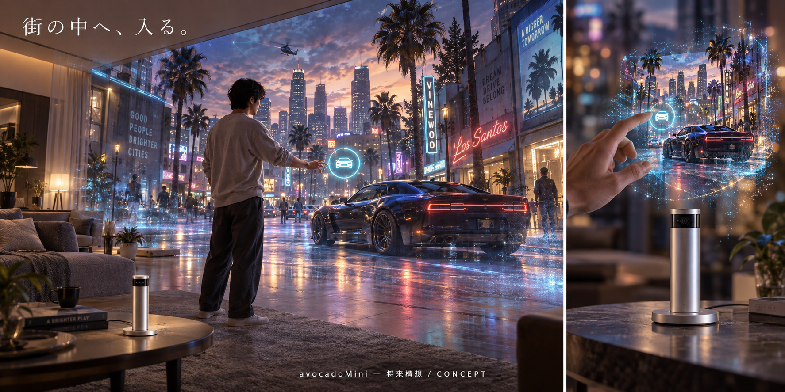

# 没入型GTA — 技術調査と将来構想

調査日: 2026-09-30。保存作業日: 2026-10-05。主担当: Material Invention / avocadoMini。資料保存はROCK / MAT14、光学・実機の共同検証はJOINT / MAT15。

**この資料は調査時点の記録です。GTA接続、裸眼空間表示、Mini実機の完成・動作を証明しません。** 元のHTMLと調査証拠JSONはバイト列を保持しています。2026-10-05の利用者指示「mainにあげて」に基づく保存で、製品仕様の変更や公開サイトへの配備ではありません。

## 保存したもの

- [調査レポート（HTML）](immersive-gta-research-2026-09-30.html): 資料66件、表示技術12方式、環境比較、計算欄、8週間の検証計画。取得してブラウザで開くと計算・絞り込みを利用できます。GitHubのファイル表示ではHTMLアプリとして実行されません。
- [調査証拠（JSON）](research-evidence.json): 調査対象SHA、資料URL、限定的な試験、当時のブラウザ確認。9/9合格は切り出したPR #43のhost fixtureであり、保存先mainの全体試験や実機試験ではありません。
- [保存時の検証記録](archive-validation.json): ファイルハッシュと今回の検証範囲。

調査対象mainは `b3e2676abd8ae2a0b3f78f48483e067b429d9bc8`、PR #43 headは `78638565bd042defe9bec1ffb8d26c8b6cca48b6`。本文の「現在」「未マージ」は2026-09-30時点の表現です。その後のmain・PR状態を上書きしません。今回の保存作業開始時mainは `996b19552d1f3b8b1d8bc6f00da57b8c15aab475`。

## 調査からの判断

ゲーム実行・身体入力・会話NPCは既存技術を使って段階的に試作する候補があります。一方、使用時200mm以下・単体自律・別Hub不要・全空間裸眼表示を同時に満たす完成技術は今回の調査では確認できませんでした。光学研究とゲーム体験の試作を分け、片方の成功をもう片方の実証へ換算しません。

外部Windows PCはゲーム互換性を調べるための実験環境案です。本体自律の製品要求を外部PC必須へ変更するものではありません。眼鏡・パネル・大型体積表示による比較試験も、R5要件を満たした製品とは扱いません。

## 画像の意味

**以下はAI生成の将来構想で、実機写真、光学シミュレーション、実現性の証拠ではありません。** 小型Miniから部屋全体へ不透明で高精細な街を表示できるという裏付けはありません。左右は同じ構想の全体像と拡大像です。描かれた寸法比やカメラ配置は確定部品・製造仕様ではありません。Rockstar Gamesの公式製品・提携を示しません。

## 次に実証する順序

1. 最新main上の既存契約を確認し、自作の小さな3D街・車、操作、保存・再開、表示adapterをPC上で試作する。GTA実行や物理表示の成功とは別に測る。
2. 光学の専門家と表示原理を選び、まず小さな立体を安定して見せられるかを実験する。粒子捕捉・ホログラフィーは候補であり採用済みではない。
3. 明るさ、見える範囲、描画密度、応答、遮蔽、気流・手の侵入、消費電力と安全条件を測る。発光点を足すだけでは背景を隠せないため、不透明な街の再現には別途遮蔽の課題が残る。
4. 観察範囲・表示体積を広げられる証拠が出た後に、200mm以下への収納・熱・電源・単体演算を評価する。
5. GTAの版・実行環境・入力と描画の取得範囲を固定して接続試験する。画面映像の転送だけを任意視点の3D表示と呼ばない。

8週間は実現性を判断するための検証計画で、製品完成の納期ではありません。実機の購入・製造・光学実験は今回行っていません。MAT15はplannedのままです。

## 確認方法

`npm run project:check`、`npm run baseline:check`、`npm run verify`と保存物のSHA-256照合を使います。今回の実行結果・未完了条件は[保存時の検証記録](archive-validation.json)に残します。9月30日のHTML操作確認は過去の同一ファイルに対する記録で、今回の全体CI成功とは別です。

保存時の検査: 原本ハッシュ・出典66件・新規導線・MAT15状態・baseline:checkは合格。既存参照ファイルの取得がディスク容量不足で失敗し、project:updateと全体verifyはSIM01の参照不足で停止した。全体合格とは記録しない。進捗表のMAT14参照だけ手動同期し、件数・他taskの状態は保持した。
