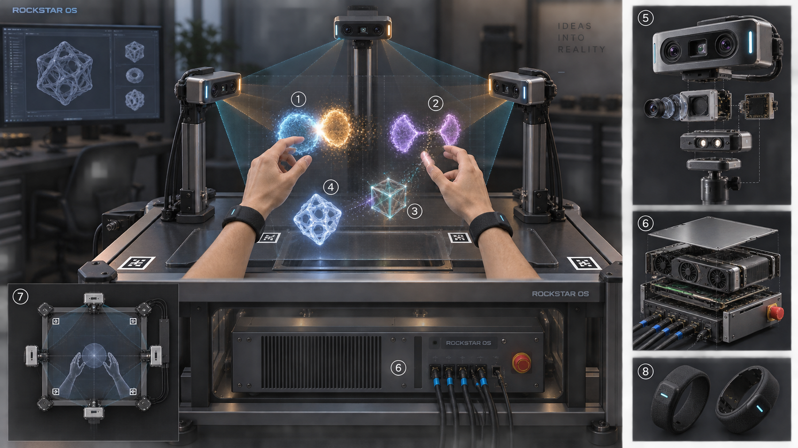
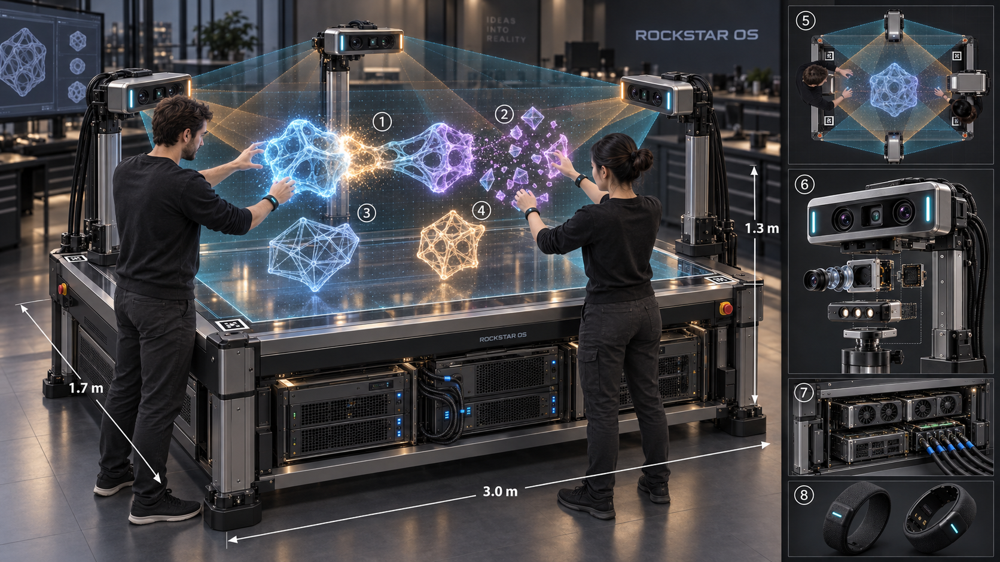
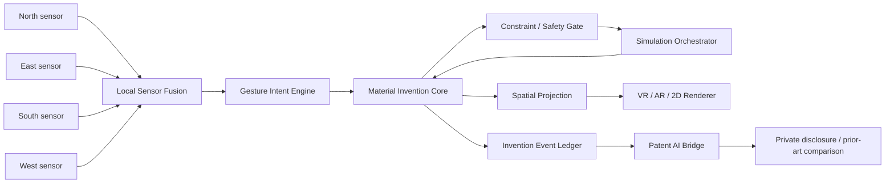

# avocadoMini — 四方向センサーで物質候補を操作するRockstarOS発明端末

状態: 製品・hardware・interaction設計。2026-09-18に机上検証機とビリヤード台規模のFull-scale機を分け、概念画像と寸法budgetを追加した。`avocadoMini`はRockstarOSを搭載する空間発明端末の名称であり、OSの正式名をavocadoOSへ戻すものではない。筐体、sensor、camera、hand tracking、XR表示、simulation接続、Patent AI連携、実機prototypeは未実装・未選定。

## 製品定義

avocadoMiniは、四方向にsensor／cameraを配置し、その中央を`Invention Volume`として使うRockstarOS端末である。検証は小型Bench機から始めるが、製品目標はビリヤード台ほどの幅を持つFull-scale機とし、利用者が台上の広い空間へ両手を入れて物質の**デジタルツイン**を選び、近付け、接続し、離し、工程条件を変えられるようにする。これはMaterial Invention Coreの中身を人が直接扱う標準製品体験で、別の後付けXR機能ではない。各操作をMaterial Invention Coreの候補graphへ安全な仮説として反映し、制約検査と交換可能なsimulationを再実行する。得られた発明過程を既存のSky Patent AIへ渡し、発明開示、先行技術候補、差分整理、専門家向けpacketの作成を支援する。

四方向cameraが物理物質を直接変化させるわけではない。初期版は仮想候補だけを操作し、robot、dispenser、heater、pressure vessel等のactuatorを持たない。将来の物理設備は別Provider、別資格、別承認、別停止系として独立受入する。

## 体験の一周

1. 利用者がprojectを開き、目的特性と禁止条件を選ぶ。
2. 四方向sensorがhand poseを端末内で統合し、Coreに結び付いた物質digital twinをInvention Volumeへ表示する。
3. pinchで物質を掴み、二つを近付けると`connect preview`が出る。commit gesture後だけ新しい`HYPOTHESIS` branchを作る。
4. Coreが物質lot、単位、危険分類、工程上限を検査する。blocked候補は接続表示できても物理実行へ進めず、警告を常時表示する。
5. Simulation Orchestratorが、その候補を処理できる接続済みmodelを選ぶ。model、version、入力digest、適用範囲、予測誤差を結果に固定する。
6. 利用者が物質を離すと元候補を削除せず、関係を外した別branchを作る。undo／redoもevent logから再現する。
7. 有望な候補を並べ、予測と既知データを比較する。新規性はここでは確定しない。
8. Patent AIが人の操作、AI提案、simulation、既知資料を別sourceとして発明開示へ整理する。公式DB検索候補とclaim chartを作るが、特許性、発明者、権利帰属、侵害回避、出願を自動確定しない。

## Hardware構成

### 二つの筐体段階

| 段階 | 外形／操作領域の初期budget | 目的 |
| --- | --- | --- |
| Bench prototype | 一辺0.45〜0.8 mの操作領域 | 追跡、誤commit、安全停止、scene bindingを低コストで測る |
| Full-scale concept | 本体約3.0 m × 1.7 m × 高さ0.9 m、操作領域約2.4 m × 1.2 m × 高さ1.3 m | 1〜2人が広い空間で候補を比較・接続・分離する製品目標 |

Full-scaleの数値は利用者が指定した「ビリヤード台規模」を設計budgetへ変換したもので、製造図、公差、荷重、熱、EMC、光学安全、法規適合を確定した値ではない。Bench prototypeの合格後に、人間工学、camera baseline、display方式、触覚方式、保守空間を含めて固定する。

#### 概念画像

初期の四方向構成:

ビリヤード台規模のFull-scale構成:

画像は製品意図、人物とのscale、配置、serviceabilityを共有するためのconcept renderであり、実機完成、裸眼立体表示、追跡精度、触覚性能を実証する証拠ではない。

### 四方向Sensor Ring

`north`、`east`、`south`、`west`の四方向podをInvention Volumeへ向ける。Full-scaleでは「四方向」をcamera四台だけとは解釈せず、各podへ2〜3の光学viewpointをまとめ、全体8〜12視点を初期候補にする。podの具体的なRGB、depth、IR、event sensor構成はprototype比較で選び、設計段階では固定しない。

| component | 責任 | fail-closed条件 |
| --- | --- | --- |
| 4 sensor pods | 各方向2〜3視点を候補とし、手、marker、物体を全体8〜12視点で取得 | 2方向未満、遮蔽過多、device identity不一致 |
| calibration target | intrinsics／extrinsics、volume原点、scaleの校正 | calibration digest不一致、期限超過、移動検知 |
| local sensor hub | frame同期、timestamp、端末内前処理 | clock drift、欠落frame、順序逆転 |
| hand tracking engine | 左右hand、joint、confidence、gesture候補 | confidence不足、hand identity曖昧、volume外 |
| secure compute | Core、projection、tracking、local AI、暗号化project vault | integrity失敗、model hash不一致 |
| display adapter | headset、AR glasses、stereo display、2D monitor | safety overlayを表示できないdevice |
| physical stop／exit | session停止、camera停止、local data flush | UIから到達不能ならsession開始不可 |

四方向の目的は遮蔽を減らし、正面一台より安定したhand poseを得ること。sensor数だけで精度、安全、化学的正しさを保証しない。各podは固有identityとfirmware hashを持ち、rig全体の`SensorSetDigest`へ固定する。

### 提案性能budget

以下はprototypeを比較するための初期目標であり、実測済み仕様ではない。

- Bench interaction volume: 一辺0.45〜0.8 mの机上領域を候補にする。
- Full-scale interaction volume: 約2.4 m × 1.2 m × 高さ1.3 mを初期budgetとし、全域の誤commit率、遮蔽、端部精度を実測して縮小または分割する。
- end-to-end visual response: p95 100 ms以下を目標。simulation完了を待たずgesture previewを返し、予測値は非同期更新する。
- committed gesture confidence: 0.85以上を初期候補とし、誤操作試験後に固定する。閾値未満はpreviewのみ。
- camera synchronization: 1 display frame以内を目標にし、ずれをcalibration receiptへ記録する。
- offline: hand操作、候補branch、Core安全検査、local annotationを継続し、外部simulation／検索は`WAITING_FOR_PROVIDER`にする。

数値を満たしても医療、危険作業、設備安全の認定には使わない。

### 表示と触覚の現実的な段階

- 最初の実装はAR headsetまたは2D大型monitorで共有座標を確認する。これを裸眼3D表示完成とは呼ばない。
- 透明screen、多方向投影、視点追跡、light-fieldは別display adapterとして比較する。3 m級の自由空間へ全方向から同じ像を見せる方式は研究項目として扱う。
- 手首bandまたは指輪型hapticは接触、選択、警告を返す補助入力とする。
- 超音波arrayは限定されたinteraction zoneの触感候補であり、硬い物体の反力を保証しない。
- 強い反力が必要ならforce-feedback glove、cable機構、robotic interfaceを別の危険なactuator Providerとして扱い、sensor／LLMから直接駆動しない。

## Software構成

四方向frameは端末内でSensor Fusionへ集約し、外部Providerへraw camera streamを直接渡さない。Material Invention CoreとSafety Gateが中心であり、simulation、renderer、Patent AIはいずれもCoreを迂回して候補を確定できない。

| service | 入力 | 出力 |
| --- | --- | --- |
| Sensor Fusion Service | 校正済み4-view frame | timestamp付きpose、tracking confidence、frame hash |
| Gesture Intent Engine | pose stream、scene binding | preview／commit／cancelのinteraction event |
| Matter Digital Twin | MaterialRecord、candidate graph、scene manifest | 操作可能な物質・候補・工程object |
| Constraint／Safety Engine | proposed graph operation | allowed hypothesis、blocked、review required |
| Simulation Orchestrator | candidate digest、model manifest、budget | version付きSimulationResult |
| Spatial Renderer | scene、pose、safety overlay | VR／AR／2D表示 |
| Invention Event Ledger | gesture、graph diff、human／AI source、digest | append-only invention history |
| Patent AI Bridge | selected event range、candidate、evidence | private disclosure draft、prior-art search intent、difference chart |

Core以外は交換可能componentとする。Gesture Intent Engineはgraphへの直接書込み権限を持たず、[`contracts/avocado-mini-spatial-interaction.json`](../contracts/avocado-mini-spatial-interaction.json)のeventをCoreへ提案する。Coreはscene digest、project、owner、対象binding、confidence、gesture phase、operation scopeを再検査する。

## Hand interaction language

| gesture | 意味 | Core operation |
| --- | --- | --- |
| pinch + hold | digital twinを選択 | なし |
| two-object approach | 接続候補をpreview | なし |
| hold-together + commit | 組合せ／interface／工程関係を提案 | 新`HYPOTHESIS` branch |
| pull-apart + commit | 選択関係を外す | 別branch。元候補は保持 |
| wrist rotate | orientation／工程parameterを探索 | preview、明示commit後だけ版更新 |
| two-hand spread／compress | 表示scaleまたは比率を変える | mode表示必須。実寸と配合を混同しない |
| timeline scrub | 工程前後を移動 | なし |
| air tap on evidence | 根拠を開く | なし |
| palm stop | pending操作をcancel | なし |
| undo／redo gesture | eventを戻す／再適用 | 新event。履歴削除なし |

「くっつける」は、組成、界面、積層、混合、接触工程など複数の意味を持つ。Coreは利用者またはAIにrelation typeを確認し、単なる近接を化学結合として記録しない。「離す」も、分離可能性や可逆性をsimulation・実験済みとは扱わない。

## 再計算loop

commitされた操作ごとに、候補全体を無条件に高コスト再計算せず、変更部分と依存先を特定する。

1. interaction eventの署名対象bytesとscene digestを検査する。
2. graph diffを仮適用し、schema、単位、禁止条件、安全情報を検査する。
3. invalidならbranchを作らず理由を返す。危険候補はsandbox branchとして保持できても物理実行はfalse。
4. changed node、edge、process parameterから影響範囲を作る。
5. compatibleなsimulation Providerとmodel versionを選び、入力digest、費用、実行先、privacy範囲を提示する。
6. local／費用0で許可済みの計算だけ自動開始できる。外部送信、有料計算、秘密条件共有は承認を要求する。
7. 途中結果を`PREDICTED`としてsceneへ差分反映し、古い結果はstale表示にする。
8. 完了、失敗、cancel、結果不明をreceiptとして残し、Patent AIへsource種別付きで渡す。

同じcandidate digest、model、version、parameter、providerで再利用可能な結果だけcacheする。別lot、別工程版、別modelの結果を流用しない。

## Patent AIとの接続

既存のSky特許出願アシスタントは発明情報の手入力から準備packetを作れるが、現在はMaterial Invention CoreやXR履歴へ未接続である。avocadoMiniでは`Patent AI Bridge`を追加し、次を支援する。

- 選択した候補branchとevent範囲から、課題、構成、操作、技術的効果、代替案、失敗例を発明開示draftへ変換する。
- 人が行った操作、Local AIが提案した関係、simulation予測、文献、supplier、実験receiptを別sourceとして明示する。
- 四方向sensor、gesture intent、candidate graph、incremental simulation、安全gate、spatial provenanceというsystem発明と、探索で得た材料候補の発明を混ぜずに整理する。
- 既存Toolの公式情報源限定検索を利用し、候補文献、分類、claim element対比を作る。
- 公開前にGit、demo、動画、共同room、export、展示の記録を確認し、秘密保持と公開状況を利用者へ確認する。
- 専門家へ渡す時点のcandidate digest、scene digest、event range、model version、引用URL、取得日時をpacketへ固定する。

Patent AIは「新しい」「特許になる」「侵害しない」「この人が法的発明者」と断定しない。hash chainやtimestampは履歴の改変検知を助けるが、発明日、発明者、優先権、権利帰属の法的証明を単独で保証しない。出願、電子署名、料金支払は現在の安全境界どおり自動実行しない。

## Invention provenance

各commit eventは次を追記する。

- project／owner、session、scene／candidate digest
- 4-view sensor set、calibration digest、tracking model／version、confidence
- gesture、対象binding、提案したgraph diff、Coreの判断
- human direct manipulation、human-confirmed AI proposal、AI-only suggestionの区分
- simulation provider／model／version／input digest／result receipt
- annotation、公開／共有範囲、Patent AI packetへ含めたevent range

raw cameraは既定保存せず、eventはframe内容ではなく必要最小限のpose／hash／confidenceを保持する。再現にraw dataが必要な研究modeは、対象、保存期間、暗号化、利用目的、共有先を別同意する。

## Safety・Privacy・Security

- low-confidence gesture、二つのhand候補が競合、sensor pod欠落、calibration stale、scene stale、別project bindingはcommitしない。
- 子ども、第三者、背景、部屋、画面、書類がcameraに入る前提で、on-device segmentationとraw frame非保存を既定にする。
- camera LED／物理shutter／session indicatorをhardware要件にする。camera停止中をsoftware表示だけで偽装しない。
- voice、eye、hand、body、room meshは機微な空間dataとしてcategory別同意、目的、保存期間、削除を持つ。
- scene内のprompt、material名、marker、remote annotationを命令として実行しない。Tool呼出しは署名済みcapabilityとZema仕事境界を通す。
- gestureはWallet、出願、外部共有、物理実験の最終承認に使わない。正確なdigestを表示する別確認を必須にする。
- actuator追加時もcamera／gesture serviceへ包括制御権限を与えず、one-shot approval、量、設備、時間、停止条件、qualified reviewerを別契約にする。

## Prototype段階

1. **Digital fixture**: 保存映像ではなく合成pose streamでconnect／separate／undoを検証する。
2. **One-camera interaction**: 非危険fixture、画面表示、raw非保存でgesture誤操作を測る。四方向完成とは扱わない。
3. **Four-view tabletop rig**: calibration、遮蔽、同期、sensor欠落、別人hand、volume外を試験する。
4. **View-only XR**: Matter Space、Process Tunnel、安全overlayをheadset／2Dで比較する。
5. **Simulation fixture**: 合成model receiptでincremental recompute、stale、cancel、結果不明を検証する。
6. **Patent packet fixture**: event provenanceからprivate draftを生成し、人／AI／simulation sourceが混ざらないことを確認する。
7. **External Provider**: 実材料DB、simulation、特許検索、labは個別に接続・契約・受入する。

## avocadoMini合格条件

- 4 viewpointのidentity、校正、同期状態をsession開始前と実行中に検査する。
- 片手・両手、遮蔽、別人、反射、低照度、手袋、volume外の誤commit率を測り、閾値を実測で固定する。
- connect／separate／undoが決定的eventとなり、同じevent列から同じ候補branch digestを再現する。
- 物質を近付けただけではcommitせず、低confidenceや曖昧なrelation typeを確認なしに保存しない。
- 操作ごとに安全検査が先に走り、simulationやPatent AIがCore gateを迂回しない。
- simulationのmodel、version、input、誤差、失敗を保持し、実験証拠へ昇格しない。
- Patent AI packetが人、AI、simulation、文献、実測を分離し、特許性・発明者・出願完了を断定しない。
- raw camera、room mesh、biometric streamが既定保存・外部送信されない。
- XRなしの2D fallbackで同じ候補graph、履歴、安全状態、Patent AI引継ぎを操作できる。
- prototype成功を物理新材料、実設備安全、特許登録、量産成功として表示しない。
