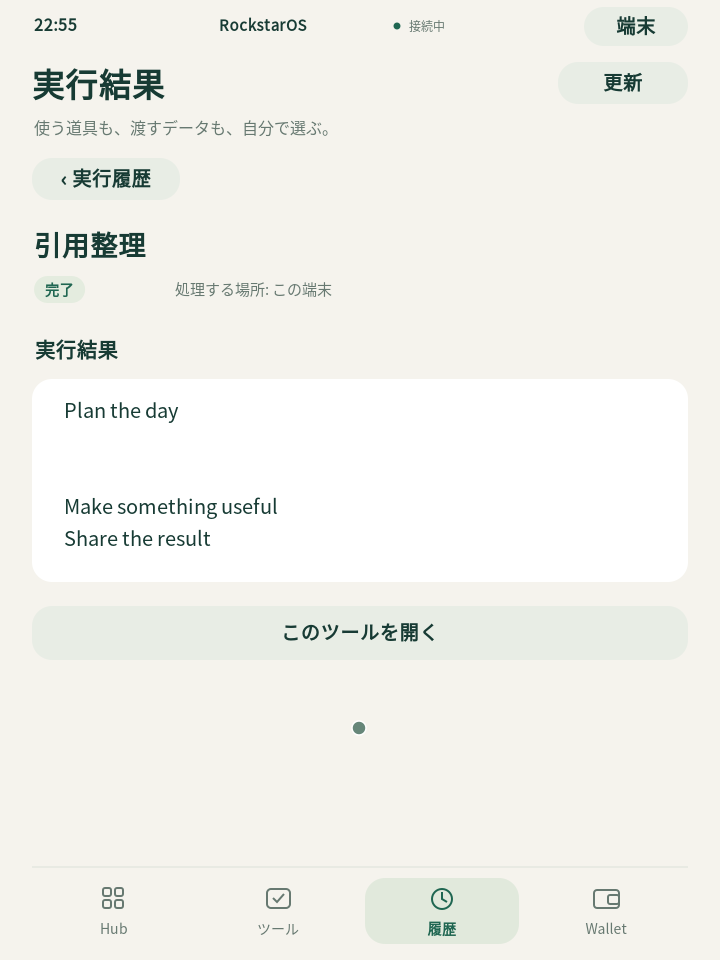
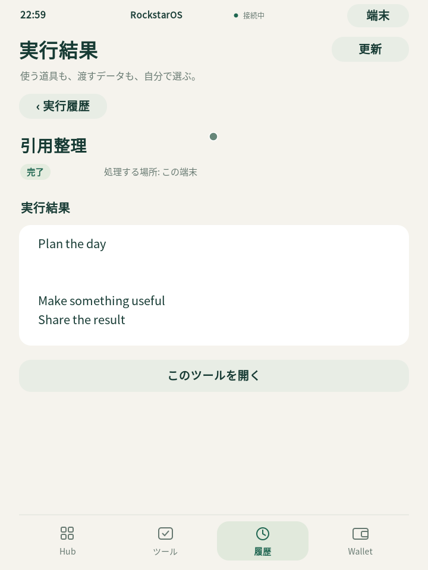

# Mac 試用端末の実行・再開確認

Mac の表示画面から「引用整理」を導入・許可して実行し、保存結果を同じ端末の次の起動で開けました。実処理は1件、応答記録は3件で、再開による重複はありません。

2回目の終了監視は300秒の期限を超えて **FAIL** となりました。この記録は保持しています。その後に画面から通常終了した同じセッションを別途読み取り検査し、保存内容と正常終了記録を確認しました。別検査の成功で、元の期限超過を成功へ変更していません。

| 確認 | 結果 |
| --- | --- |
| 初回の実処理・通常終了 | PASS |
| 2回目の期限内終了監視 | FAIL（300秒の期限超過、停止操作は送信せず） |
| 2回目の終了後検査 | PASS（同じセッションを別途検査） |
| 保存データ | 6 DB、電源以外の43表・構造・内部連番が初回と一致 |
| 電源記録 | 古い記録を保持し、異なる起動に対する正常電源操作1件のみ追加 |
| 停止と健全性 | 対象PID不在、ソケットは不在または接続拒否、読み取り専用のファイルシステム検査成功 |
| 検査による変更 | A/Bと保存データの検査前後ハッシュが一致、入力・電源操作・修復なし |

## 初回の実画面

## 同じ端末を再び開いた実画面

画像はQEMUの実フレームバッファから保存した原画像です。画面には公開された試験用の文章だけがあり、接続用資格情報は含まれません。

この報告は、frozen b8287bc の開発用ARM64仮想端末についての限定的な試用証拠です。2回目のQMP終了イベントは監視終了後のため未観測です。60分連続試験、実機導入、バックアップ復元、MetaMaskや実資金の取引は、この報告の対象ではありません。Walletと会員状態は空のままで、非空の金融台帳の保持を主張しません。

細かな表ごとの件数・ハッシュ、元証拠との対応、除外範囲は同梱の `mac-trial-acceptance.json` に記録しています。

## 最終起動と配布入口の確認

所有プロセスの待受を確認する修正済みlauncherで3回目の実起動を行い、Chrome上の実OS画面で保存結果を開いた。通常終了のQMP eventを観測し、停止後に全非電源データ・3 receipts・1 jobと以前の電源2件の一致、新しい電源1件、e2fsck終了0を確認した。観測は29.774秒で終了した。これは2回目の元監視FAILを変更しない。[最終記録](final-mac-trial.json) と [実画面](final-result.png)。
