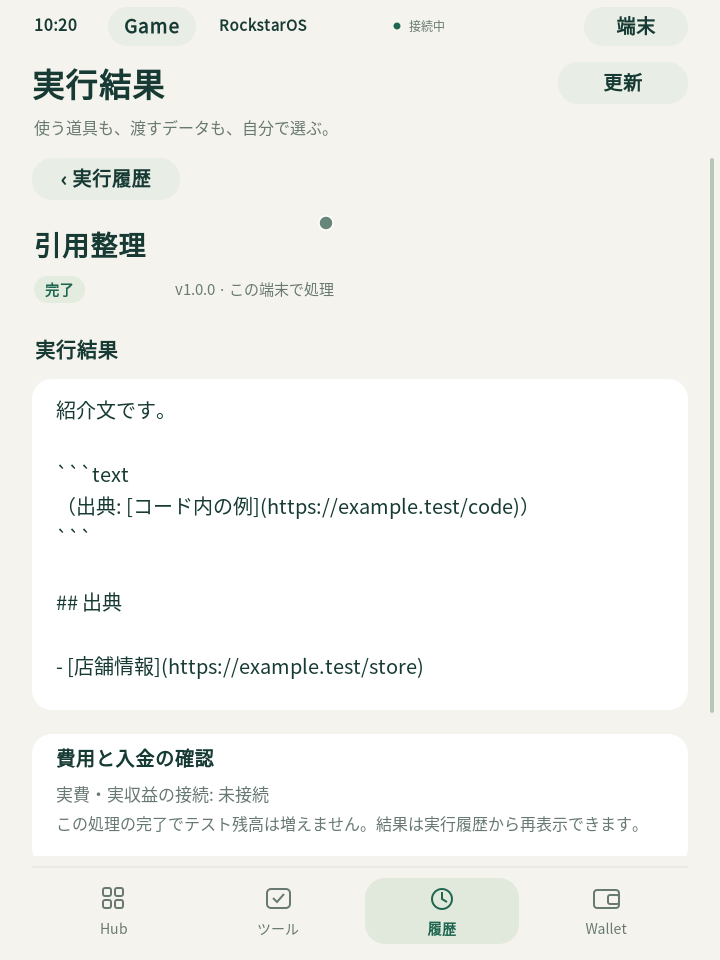

# rc2 — 導入・保存・再起動・復旧の実測

2026-09-11、最新版 `1.0.0-preview.20260911-rc2` の新規導入、3回の実OS起動、保存結果の再表示、同一VMでの中断復旧を確認した。**内部動作確認はPASS。正式署名・一般配布の完成判定ではない。**

## 対象を固定

- Native source / 同梱host tools: `b7d819cd291b653d165aa124f25a52b9898bfb2e`
- archive: `rockstaros-1.0.0-preview.20260911-rc2-macos-arm64.tar.gz`、1,003,224,286 bytes
- archive SHA256: `5ce072f65fc4e24212ff6acc6887cbb03f3e7f664b50d574756738892e4ed95e`
- candidate-index SHA256: `0440543f5846cf634f5131533eff522f66f4e42507a22173812a19f53198f941`
- GitHub Draft: tag `v1.0.0-preview.20260911-rc2`、release ID `386933271`。全8資産を実ダウンロードし、サイズ・SHA256を生成元とGitHubメタデータへ照合した。
- macOS 15.7.4 / Apple Silicon / Lima 2.2.0、専用の新規Debian 13 VM。Buildroot 2026.08 / Linux 6.18.50。

二回の未署名exportは全ファイルが同じbytesだった。新規導入にはローカル生成archiveを使用し、その後のGitHub実ダウンロードで同一bytesと独立確認した。導入後のhost・guest各716ファイル、各1,389,403,103 bytesも、全サイズ・ハッシュ・権限がcanonical manifestに一致した。

正式鍵は未設定のため、同一archiveに別置きの公開試験鍵manifestを用意して動作確認した。変更はtrust表記とその試験署名だけで、未署名候補のarchive/member/sourceは変更していない。`PUBLIC_RFC8032_DEVELOPMENT_ONLY` の試験署名は、正式な配布元認証の証明には使わない。候補は `NOT_CLEARED / CANDIDATE` のまま。

## 実際に確認した流れ

| 操作 | 結果 |
| --- | --- |
| 新規導入・初回起動 | 専用保存先へ導入成功。実OSのHubを操作できた。 |
| 保存 | 引用整理v1.0.0を導入・許可し、同梱150-byte入力を1回実行。151-byteの結果と履歴1件を保存。 |
| Wallet / Game | 公開試験登録・認証・Wallet条件を明示操作。試験残高100ドルを1回追加し、Game Aで1回だけ10 COIN_Aへ交換。元本100 cents＋手数料3 cents、残高9,897 cents・保留0。Game Bは未接続。 |
| 正常終了・再起動 | OSの電源操作から終了し、同じ保存先を起動。元の保存結果、履歴1件、Game受取り10、Wallet9,897 cents・保留0を再表示。 |
| 全体backup | 停止したOSのA/B/dataと独立Wallet/Game/接続台帳を保存。Macへの外部コピー19ファイル・1,074,564,436 bytesと受領記録が一致。 |
| 復旧の中断・再開 | authorityのコピー後、最初のOSコピー16 MiB時点でテスト子プロセスのみをSIGKILL。PENDING中はhost・authority・元OSの起動を全て拒否。同じ要求の再開で完了。 |
| 復旧後の起動 | 新端末`recovered`で3回目の起動。保存結果・履歴1件・10 COIN_A・9,897 cents・保留0を再表示し、正常終了。 |

GUI操作はCUAから実QEMU画面で行った。画像取得だけを行う既存QMP機能で、画面の原本も別途保存した。試験用PINは公開値0000、残高・交換は全て合成値。月額条件への同意、ATM引出し、実資金取引は行っていない。

## 停止後の独立確認

既存observerを条件変更なしで使い、停止ディスクと台帳を直接読んだ。

- 引用整理は成功1件、150→151 bytes。出典URLと変更しないコード内の引用を保持。出力SHA256は `e5e655f1c0c3008fd895f0eba61f206cf83035d376ab63d76846bf0636840fa7`。
- 入金1回、Game A付与1回、Game B付与0回、月額請求0、引出し0、保留0。貸借の合計は0。
- 同じ復旧receiptを使用し、両Game issuerのepochは2、復旧receiptは各1回。復旧を二重実行せず、元端末の起動拒否も確認。
- 復旧先の起動前に3ディスクが元と完全一致。起動後は既存の業務データ比較を通過し、元の正常終了記録2件を保持して新しい正常終了1件だけを追加。
- 再起動前後の5 DB / 71テーブル、復旧先起動前後の7 DB / 122テーブルは、既存`index-identity-maximum-time-only/1`ポリシーでPASS。時刻以外の型付き行・schema・sequence・identityは不変。D6標準の完全不変ポリシーは変更していない。
- 3本のboot.log全てに`UI_HEALTH_READY`、`AB_HEALTH_CONFIRMED`、`Power down`。原本をMacへ回収し、読み返したハッシュも一致。

[機械可読結果・入力ハッシュ・原本参照](evidence/rls01/final-b7-rc2/acceptance-result.json)。詳細な台帳snapshot、受領記録、配布物、元FAILは私有作業領域`work/acceptance-20260911`に保持し、Gitへ秘密値やOSディスクを追加しない。

[復旧後のGame](evidence/rls01/final-b7-rc2/boot3-game.png) / [復旧後のWallet](evidence/rls01/final-b7-rc2/boot3-wallet.png)

## 検出した制限と残件

最初の台帳比較は、hostで作った確認用JSONが0644だったため拒否された。内容を保ち0600へ限定後、一回の再実行でPASS。元の失敗を削除せず記録した。VNCへの貼付けではPINが入らず、既存ガイドどおりキー入力で完了した。

この確認は、同じ所有VMでのcurrent-copy復旧に限定される。VM消失後の別VMへの再投入は未対応。最新候補のD0〜D6全体、SDK全体、削除、実機、実資金の受入を、この3回起動から合格扱いにしない。

正式署名、所有者による製品ライセンス・配布条件の確定、元Sites接続の復旧、CMの確定掲載、一般公開の最終承認は別の残件。[公開導線・署名設定の現状](release-verification-20260911.md)。
