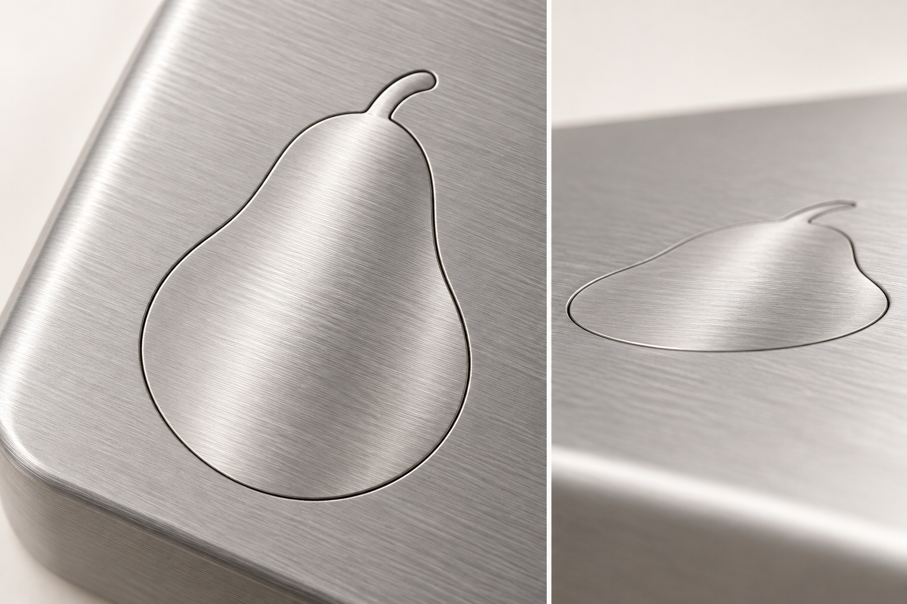

# avokado フィット電源ボタン — 設計変更 v1.0

2026-09-24 / AVO-PWR-FIT-01

電源ボタンを、提供された銀色の洋ナシ形へ変更する。通常時はボタンの表面と筐体の表面がぴったり揃い、押したときだけ内側へ動く。外周の細い継ぎ目で輪郭を見せる。

## 確定する外観と操作方式

| 項目 | 変更仕様 |
| --- | --- |
| 形 | 参照画像の洋ナシと曲がった軸の輪郭を使う。葉や別のマークを追加しない |
| 表面 | 平らな銀色のヘアライン仕上げ。参照画像の丸い膨らみはボタンに付けない |
| 筐体との関係 | 非押下時の基準面差0mm。ボタン・軸・縁を外へ突出させない |
| 押し方 | 指で押す物理式。内側への短い動作で入力し、離すと面一へ戻る |
| 継ぎ目 | 洋ナシの輪郭に沿う細い隙間。盛り上がった枠を設けない |
| 対象 | 既存E3で電源入力を持つEdge Hub。取り付け面・座標は機構図で決める |

取り付けイメージはボタン周辺の拡大図とし、Hub全体の形や取り付け位置を新たに確定する図にはしない。4本のMotion Towerへ独立した電源ボタンを追加する変更でもない。

## 内側の構造

薄い金属の押し面を裏側の保持部品で支え、ガイドに沿って内側へ動かす。軸の細い部分も同じ面として裏側から支え、単独で曲がる片持ちの突起にしない。復帰は選定するスイッチまたはばねで行い、押し込みの終端は機構側のストッパーで受ける。輪郭の端を押しても傾き・引っ掛かり・押されたままの状態が生じない構造へ詰める。

非押下時の面差0mmは設計基準。寸法公差、塗膜、熱変化、摩耗を含む許容差は製造図で割り当てる。押下量、押下力、全体寸法、隙間の数値は選定スイッチと筐体の厚さに合わせて決める。

## 電源入力との接続

既存E3の常開・無電圧・一時押下の電源入力方式を引き継ぐ。押し面を変えても、AIや衛星回線を電源操作の成立条件にしない。短押し・長押しの時間と動作は、選定基板のファームウェアとRockstarOSの設定に合わせて別途受入する。

MIC OFF、押して話す操作、入力停止はそれぞれの機能を保つ。このボタンはavokado本体の電源操作であり、rocketstarの飛行操作やコロニー設備の停止指令には結び付けない。

## 確認項目

- 表面と軸が筐体から出ず、側面からも面が揃って見えること。
- 中央・端・軸付近から押しても、傾きや引っ掛かりがなく復帰すること。
- 誤って押されたままにならず、選定機器の電源入力条件を満たすこと。
- 摩耗、汚れ、静電気、必要な防塵・防滴条件を試作で確認すること。

本書は外観・機構方式の変更仕様。画像は完成イメージであり、実物の試験写真ではない。既存E3の詳細資料に対するボタン形状の補遺として扱い、過去のOS・模型試験をこのボタンの耐久試験へ読み替えない。

## 付属ファイル

- `pear_shape_reference.png`：利用者が指定した原画像。
- `fit_button_concept.png`：今回の面一ボタンの取り付けイメージ。
- `button_spec.json`：設計判断と機構受入項目。
- `generation_prompt.txt`：内蔵画像生成ツールへ渡したプロンプト。
