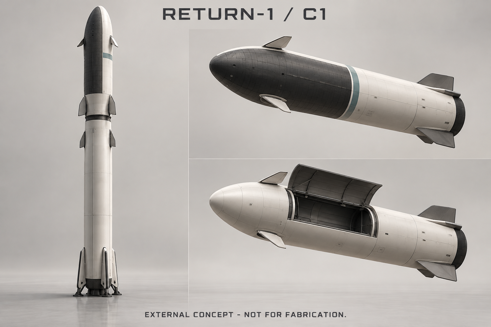
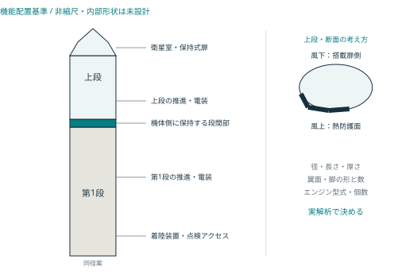
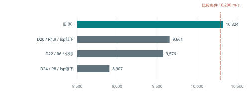
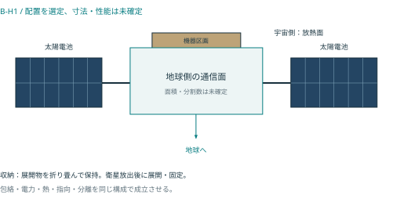
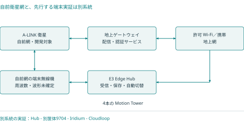

# RETURN-1 C1 / 統合設計基準書

2026-09-23 / 外観・方式の選定、必要設計の台帳、成立性の再評価

## 01 本版で決めたこと

RETURN-1 は小型通信衛星を地球低軌道へ運び、第1段と第2段を回収し、点検・整備後に再飛行させる無人2段式ロケットとする。衛星は軌道上で運用する。地上の avokado 本体は搭載しない。

本版 C1 は外観と開発を進める構成を一本化する設計基準である。材料、板厚、接合、推進系、製造図面、実機の性能まで確定した製造承認版ではない。従来の数値には成立性の余裕が不足する条件があり、そのまま製造仕様に移行しない。

| 区分 | 本版の決定 | 根拠の範囲 |
| --- | --- | --- |
| 要求として固定 | 小型衛星輸送・無人・両段回収と再使用 | ユーザーが指定した目的 |
| 方式を選定 | 2段式、両段の垂直着陸、LOX／液体メタン共通系、保持式衛星扉 | 今後の解析・開発をそろえる設計判断 |
| 外観を選定 | 淡色の同径胴体、上段の暗色風上面、風下面の搭載扉、青緑の識別色 | 意匠と機能配置。寸法・材料性能は別途評価 |
| 搭載品の基準 | A-LINK B-H1 配置を採用して検討、500 kg級2機を参照搭載条件とする | 実部品の重量・収納・通信性能は未確定 |
| 性能値の扱い | 旧618.6 t案を比較点B0へ限定。再計算と未解決条件を記録 | 理想式の計算結果。軌道・実機の証明はない |
| 製造・飛行への移行 | 未承認。全必要分野と解除条件を台帳で管理 | 適合図面・部品データ・試験記録が必要 |

本書の優先順位は、ユーザー要求、C1 の明示した変更、同梱台帳、旧版の変更されていない検討内容の順とする。画像と文章が食い違う場合は本文と台帳を優先する。C1 を旧版の全数値の追認に使わない。

## 02 外観デザイン C1

| 意匠要素 | C1 の選定 | 固定しない要素 |
| --- | --- | --- |
| 全体 | 一体感のある細長い2段、共通径を比較設計の出発点とする | 全長、直径、段ごとの比率、重心 |
| 上段 | 丸みのある先端、風上面を暗色、反対側に保持式搭載扉 | ノーズ曲率、扉の開口、蝶番、熱防護の厚さ |
| 下段 | 滑らかな淡色胴体、格納する操舵面と着陸脚 | 面数、脚数、寸法、取付荷重、展開機構 |
| 表面色 | アイボリー #E7E6E0、グラファイト #26343A、青緑 #0C8B88 | 塗装材、表面処理、放射率、熱耐性 |
| 表記 | RETURN-1 と機体番号を読みやすく配置 | 飛行規定や設備上の標示位置 |

画像は意匠確認用の生成図である。脚・フラップ・配管・扉などの具体形状、個数、収納状態を設計根拠にしない。描かれた比率から寸法を採らない。実機外表面の材料色と必要な表面処理が優先し、色のために熱制御性能を変えない。

## 03 機体の機能配置

機能配置図。寸法・タンク境界・翼面形状を定義する製造図ではない。

風上面の熱防護を連続させ、衛星扉は風下面に置く。これは再突入時の開口周辺の負担を検討しやすくする配置判断であり、熱が問題なく処理できることを示さない。内部では衛星室、流体系、電装区画、推力を受ける構造を分け、接続部の荷重・熱・振動を追跡する。

上段は搭載品を放出して扉を閉じた状態を通常帰還の基準にする。扉未閉鎖、衛星1機残留、2機残留は別の異常ケースとし、そのまま着陸できるとは扱わない。段間部と衛星側でない分離部品は回収機体側に帰属させる。

## 04 構成の決定記録

| ID | 本版で選ぶ構成 | 選定理由と見直し条件 |
| --- | --- | --- |
| D01 | 無人2段式・両段回収／再使用 | ユーザー要求。片段使い捨てへ無断変更しない |
| D02 | 両段とも LOX／液体メタンを使う系統を検討基準にする | 供給設備・整備体系を共通化する判断。エンジンの型式や性能は未選定 |
| D03 | 第1段は飛行方向下流の海上、第2段は指定陸上区域へ垂直着陸 | 参照運用を一本化。射場・帰還経路・海象／地上条件の不成立時は再検討 |
| D04 | 衛星収納扉と段間構造を通常飛行で保持する | 回収対象を明確化。投棄式フェアリングを標準構成にしない |
| D05 | 上段の風上面に熱防護、反対側に衛星扉 | 機能配置をそろえる。空力・熱・構造・収納の同時成立が必要 |
| D06 | 点検・交換へのアクセスと個体履歴管理を要求 | 着陸しただけで再使用可としない。部品寿命と損傷を照合する |
| D07 | 衛星は B-H1 の平面通信面・側方太陽電池・宇宙側放熱面 | 通信・電源・熱の作業基準を統一。展開数・面積・実寸は未確定 |
| D08 | avokado は Tower20 E3 の4塔＋Edge Hubへ統合 | 通信管理・保存をHubに集約。衛星試験ポッドは別筐体 |

D02以降は本検討の方式選定であり、実機で成立した証明ではない。エンジンの個数、推力、燃焼圧、供給回路の設定値、タンク板厚、熱防護材の仕様、脚とフラップの個数は本版で製造仕様として固定しない。

## 05 ミッションと飛行段階

衛星500 kg×2機、高度550 kmの円軌道、傾斜角53度を旧案との比較条件として使う。重量と軌道はユーザーが確定した数値ではない。初期2機は通信実証用であり、全球常時接続の配置数ではない。

| 段階 | 達成する機能 | 次段階へ進むための確認 |
| --- | --- | --- |
| 地上準備 | 衛星搭載、機体・地上設備・通信の準備 | 図面との一致、接続、環境、禁止状態、飛行区域 |
| 上昇・分離 | 目標投入状態へ向かい、段を安全に分離 | 推進・航法・構造の状態、分離可能条件 |
| 第1段帰還 | 指定された海上回収区域へ戻る | 残量、姿勢、再着火、着陸区域と回収設備の条件 |
| 軌道投入・放出 | 放出前条件を確認し、衛星を分離する | 軌道・姿勢・電気的禁止・分離確認・再接触回避 |
| 第2段帰還 | 収納扉閉鎖、軌道離脱、大気減速、垂直着陸 | 扉、質量・重心、熱防護、推進・航法の帰還適合 |
| 回収・整備 | 個体状態を記録し、再飛行の可否を判定する | 損傷検査、寿命消費、部品交換、地上再確認 |

ここに燃焼開始時刻、姿勢角、分離速度、着陸設定値などの実行可能な飛行シーケンスはない。これらは発射場・エンジン・空力・機体の実データを結合して求める。

発射国・射場・回収地点は未回答である。これらが決まるまで射向、許容軌道、帰還可能な時間、地上支援設備、必要性能を凍結しない。仮の53度軌道を維持するために飛行区域の制約を無視しない。

## 06 質量と性能の再判定

旧案B0は第1段445 t、第2段172.6 t、衛星1 t、合計618.6 t。第2段の乾燥18 t、上昇用150 t、帰還用4 t、未使用0.6 tという仮定で、理想速度増分は約10,324 m/sとなる。[S1]

第1段445 tの内訳は乾燥40 t、上昇用380 t、帰還用24 t、未使用1 tである。乾燥40 tと18 tには、それぞれ旧配分32＋8 t、14.4＋3.6 tの成長余裕25%が既に含まれる。下表の上段乾燥20／22／24 tは、その余裕を含む18 tからさらに増加する場合であり、25%を二重に加算しない。帰還用と未使用量は上昇中に消費しない条件で計算する。

本版は質量と比推力を組み合わせて再計算した。以下は上段上昇用150 tを維持し、帰還用増量は追加搭載する場合。必要速度増分10,080／10,290 m/sも、旧仮定9,600／9,800へ5%を加えた比較条件であり、実際の飛行経路の解析結果ではない。

| 上段乾燥／帰還用 | 比推力 第1／第2段 | 理想速度増分 | 10,290との差 |
| --- | --- | --- | --- |
| 18／4.0 t：旧B0 | 330／370 s | 10,324 m/s | +34 m/s |
| 18／4.9 t | 330／370 s | 10,199 m/s | -91 m/s |
| 20／4.9 t | 320／360 s | 9,661 m/s | -629 m/s |
| 22／6.0 t | 330／370 s | 9,576 m/s | -714 m/s |
| 24／8.0 t | 320／360 s | 8,907 m/s | -1,383 m/s |

仮定からの理想速度増分。横軸の起点は8,500 m/s。帰還成立の確認は含まない。

表には帰還用が不足する条件も含み、上昇性能の比較だけで帰還成立とは判定しない。軌道離脱150 m/s（比推力360 s）と終末降下・着陸600 m/s（同320 s）だけを順に与え、着陸時質量を乾燥質量＋未使用0.6 tとする説明用計算でも、必要な帰還用は乾燥18 tで4.896 t、20 tで5.423 t、22 tで5.949 t、24 tで6.476 tとなる。乾燥20 t・帰還4.9 tはこの2燃焼だけで約0.523 t不足する。4.9 tを全ケース共通の解決値にせず、実際の離脱・姿勢遷移・着陸経路と未配分消耗分を含めて決める。

## 07 数字を増やすだけでは閉じない

必要な推進剤量を理想式から逆算しても、タンク、構造、推力、熱防護の質量が変わる。上昇と帰還を別々に最適化して、それぞれの良い結果だけを合わせない。

| 同じ比較条件での逆算 | 上段上昇用 | 上段乾燥 | 打上げ質量 |
| --- | --- | --- | --- |
| 乾燥質量を22 tに固定 | 253.8 t | 22.0 t | 728.4 t |
| 追加推進剤1 tで乾燥0.03 t増加と仮定 | 339.3 t | 27.7 t | 819.7 t |

比較条件は帰還6 t、比推力320／360 s、要求10,290 m/s。上段上昇用をP、帰還用をR、乾燥質量をDとして、増加モデルは D＝22＋α×max(0, P＋R−154) とした（質量単位はt）。0.03 t/tは実物の設計則ではなく、仮の感度係数αである。0.06 t/tの仮定では、上段上昇用0～2,000 tの探索内に要求との交差がなかった。この結果は設計全般の不可能性を証明するものではない。

この逆算は帰還用を6 tに固定しており、乾燥成長に伴う帰還必要量の増加までは解いていない。乾燥約27.7 tとなる819.7 tの比較例では、第06章の説明用2燃焼だけで帰還用が約7.46 t必要となり、6 tでは約1.46 t不足する。この例も帰還成立案ではない。帰還分を追加すればタンク・乾燥質量・上昇性能が再び変わるため、反復して同時に整合させる必要がある。

この逆算値を新しい機体仕様として採用しない。確定に向けて、射場・軌道・帰還地点、部品重量とタンク体積、上昇／帰還経路、空力・加熱、推力・運転範囲を同時に整合させる。余裕に使った値と部品そのものの質量を分け、姿勢制御、再着火、冷却、蒸発、ベント、加圧などの消耗も計上する。

同梱資料には96条件の順計算、192条件の乾燥固定逆算、144条件の仮の乾燥成長逆算を収録した。質量保存・旧基準の再現・逆算残差を確認済み。これは式の実装確認であり、機体の成立確認ではない。

## 08 構造・推進系に必要な設計

| 分野 | 図面・データとして閉じるもの | C1 の判断と確認方法 |
| --- | --- | --- |
| 全機配置 | 全長・径・基準座標・収納容積・重心・慣性・接近空間 | 共通径を比較基準にする。実部品CADで収納・整備・分離を確認 |
| 主構造 | 荷重経路、支持構造、継手、剛性、強度、座屈、疲労 | 材料・板厚は未選定。圧力・加速度・振動・熱を結合して解析／試験 |
| タンク | 流体の分離、容積、断熱、支持、液面変動、残留量 | LOX／メタンという流体だけ選定。温度・圧力・配管仕様は部品と荷重から決める |
| エンジン | 型式、個数、推力範囲、質量、比推力、再着火、寿命 | 上昇・帰還・着陸での運転条件を同時に満たす候補を評価 |
| 供給・加圧 | 系統図、機器表、計測点、隔離、漏洩検知、保守境界 | 具体的な弁や調圧値を仮置きで発注仕様へ昇格させない |
| 分離系 | 段間・衛星保持、解除状態の判定、衝撃、離隔 | 機体に残る部品を明記。代表質量の試験と運動解析を結合 |

製造へ渡す図面には部品番号・改訂・寸法・公差・材料規格・処理・接合・検査・適用範囲が必要になる。形だけのCADを作っても、これらの根拠が欠ける限り製造承認とはしない。既存エンジンを選ぶ場合も実際の供給条件・運転領域・取付条件と整合させる。

## 09 熱防護・帰還・着陸

| 対象 | 採用する機能 | 設計を閉じるための情報 |
| --- | --- | --- |
| 上段熱防護 | 風上面を中心に再使用できる保護系を設ける | 熱流束・圧力・時間履歴、接合・段差・端部、裏面温度、損傷許容 |
| 扉と隙間 | 帰還前に閉鎖状態を独立して把握し、熱・荷重を連続して受ける | 開口補強、シール、ラッチ、熱変形、閉鎖検出と故障条件 |
| 空力姿勢制御 | 大気減速中の姿勢と着陸への遷移を制御する | 空力係数、可動面の実効、重心移動、動作荷重、遷移の余裕 |
| 帰還推進 | 軌道離脱・再着火・終末着陸を必要残量内で行う | 推進剤の捕捉、運転可能条件、最低推力、残量誤差、劣化 |
| 着陸装置 | 接地荷重を受け、転倒を防ぎ、整備できる | 質量・重心、速度分散、脚の動的応答、地盤／甲板、滑り、風 |
| 回収後 | 熱防護・構造・推進系の状態を次便へ引き継ぐ | 損傷判定基準、検査方法、交換条件、残存寿命の根拠 |

再使用する熱防護は材料の耐熱性だけで決まらない。取り付け、温度差、空力荷重、損傷、点検性を含める。[S2] 図に描いた黒い表面を、選定済みの材料や厚さとみなさない。

垂直着陸という方式選定は、着陸可能性の証明ではない。第1段の海上帰還と、軌道速度から戻る第2段の帰還では条件が異なる。試験結果を相互に代用しない。

## 10 航法・電装・ソフトウェア

| 系統 | 設計上の責務 | 必要な成果と評価 |
| --- | --- | --- |
| 航法 | 機体の位置・速度・姿勢を推定し、利用可能性を報告 | センサー候補、誤差モデル、融合、時刻、喪失時の挙動 |
| 誘導・制御 | 目標経路、機体姿勢、可動面・推進の操作を調整 | モデルに基づく設計、余裕、飽和、遅延、故障と分散評価 |
| 電源 | ミッション全段階へ給電し、異常を分離 | 単線結線、負荷・過渡・待機予算、電池、保護、接地 |
| 電子回路 | センサー・操作系・計算機を接続し、状態を判定 | 回路図、部品表、ハーネス、全端子、絶縁・環境・EMC |
| 飛行ソフト | 状態遷移と実行条件、記録、異常時処置を扱う | 要求と実装・試験の対応、時刻、再起動、独立した異常監視 |
| 地上通信・記録 | 管制に必要な状態を伝達し、便ごとの履歴を保存 | 送受信系、見通し、受信局、欠落扱い、録画／計測の時刻整合 |

通常シーケンスから異常状態へ移る条件、復帰を許す条件、復帰しない条件を明示する。単一の曖昧な「正常」信号で、衛星分離・再突入・再着火を許可する設計にはしない。具体的な冗長数と部品構成は故障解析と要求から導く。

既存の avokado 通信試作で確認した71項目は、認証・保存・再配信等のソフトウェア検証である。RETURN-1 の飛行制御、ロケットの実機、無線の実環境、衛星網の成立を検証したものではない。

## 11 地上設備と再使用の設計

| 成果物 | 内容 | 再使用へつなぐ管理 |
| --- | --- | --- |
| 発射場設備仕様 | 運搬・起立・支持・接続・供給・計測・作業区域 | 機体と地上設備の接続責任、図面改訂、作業記録 |
| 海上回収仕様 | 回収船／甲板、着陸条件、位置把握、固定・運搬 | 海象、接地後状態、塩分・腐食・損傷の評価 |
| 上段回収区域仕様 | 回収域、進入条件、接地面、支援・搬送 | 飛行分散、環境、帰還時の残留物と状態 |
| 整備手順と検査基準 | 便前後の目視・計測・非破壊検査、交換、再確認 | 検査箇所、方法、許容値、証跡、合否責任 |
| 寿命管理 | 構造・熱防護・エンジン・弁・脚・電池等の寿命消費 | 個体番号、製造ロット、便数、負荷・温度履歴、修理履歴 |
| 再飛行判定記録 | ミッション適合、残存寿命、修理・試験の完了 | 同じ機体を再び使えるという便単位の判断 |

目標再使用回数、回収後の整備時間、交換可能な範囲、1便当たり費用は、現時点の保証値を置かない。まず計測できる定義を持たせ、部品評価と実飛行で裏付ける。着陸回数と、衛星を運んで再使用できた回数を別に記録する。

NASA の設計レビューの考え方でも、基本設計の確認と製造へ移るための設計確認は段階が異なる。[S3] 本計画がそのレビューを受けた、あるいは適合認定されたという意味ではない。

## 12 衛星の外観・機能配置

非縮尺。アンテナ・パネル・放熱面の面積と収納包絡は未確定。

B-H1 を以後の作業用配置として選定する。地球側に通信面、側方に展開する太陽電池、宇宙側に放熱面を置く。収納中の保持と、分離後の展開・固定を別の状態として扱う。各面の向きが通信・発電・放熱・姿勢制御で両立するかを評価する。

| 配分 | 仮の質量 | 扱い |
| --- | --- | --- |
| 通信 | 100 kg | アンテナ・RF機器の候補選定前 |
| 構造・機構 | 65 kg | 展開物・分離部を含む境界を確定する |
| 電源／姿勢制御 | 85／35 kg | 発電、食中電力、姿勢要求から再計算 |
| 軌道制御／熱 | 55／25 kg | 推進剤・寿命・放熱を結合して評価 |
| 電算・管制／配線 | 25／10 kg | 回路・機器表から積み上げる |
| 成長余裕 | 100 kg | 実部品と区別。合計500 kgは仮枠 |

衛星1機の1 kWは定常電力の比較点であり、発電保証やRF送信出力ではない。電池、食、寿命末期の劣化、再充電、ピークと放熱を閉じる。アンテナの形から通信速度・対象地域・常時接続を保証しない。

## 13 衛星搭載の接続条件

衛星500 kgは放出する衛星全体と衛星側の分離部を含む仮の質量枠とする。上段に残るアダプターや扉は上段乾燥質量に計上する。機体と衛星の両方に同じ部品を数えない。

| 接続条件 | 確定する項目 | 主な合格証拠 |
| --- | --- | --- |
| 質量・機械 | 座標、質量、重心、慣性、取付、剛性、荷重、包絡 | 承認CAD、計測、結合荷重解析、機械試験 |
| 電気・情報 | 給電の有無、接地、端子、時刻、分離許可と状態 | 系統図、全端子表、切離し・過渡・故障試験 |
| 熱・環境 | 温度、熱流、清浄度、減圧、汚染、地上待機 | 熱解析、熱真空・熱平衡、環境条件との照合 |
| 保持・分離 | 解除、衝撃、離隔、再接触、片側残留、扉閉鎖 | 代表質量の機構試験、分離運動解析、故障注入 |
| RF・運用 | 送信禁止、解除、EMC、無線共存、搭載時作業 | 周波数表、EMC試験、禁止状態と解除条件の検証 |

同梱の payload_interfaces.md／.json に13件の接続条件と6件の地上試験を記録する。数値の未記入は「制約なし」ではなく未確定である。各条件は機体・衛星双方の同じ改訂へ反映して初めて閉じる。環境試験の水準は予測環境と適用範囲を決めて設定する。[S4]

## 14 avokadoへ電波を届ける構成

自前衛星網と既存衛星サービスでの実証を区別した構成図。

現行端末は使用時高さ200 mmのMotion Tower 4本と別体Edge Hubという E3 基準に合わせる。通信制御・認証・保存はHubへ集約する。旧一体型Mini200の電力・収納条件は現行設計へ流用しない。

自前A-LINK衛星に対応する無線機、周波数、波形、地上ゲートウェイは未確定。初回の端末実証用RockBLOCK 9704はIridiumサービスを使う別系統であり、自前衛星へ接続できるモデムとは扱わない。メーカー指定の見通し・アンテナ設置・他送信機との筐体分離条件を適用する。[S5]

「電源がつけばどこでも受信」という希望は、利用可能な許可Wi-Fi、契約済み携帯、衛星小データへ自動接続する方針として実装を進める。地下や金属で遮られ、全経路が届かない場所では受信待ちになる。この条件はロケットの設計変更では解消しない。

衛星2機で全球常時接続とはならない。透明中継の自前網には端末と地上局の同時可視が必要で、衛星内蓄積中継や衛星間通信を追加済みとはしない。対象地域・遅延・容量を決め、衛星配置と両方の無線区間を閉じる。

## 15 設計を確定する判定順序

| 段階 | そろえる根拠 | 現在の判定 |
| --- | --- | --- |
| G0 要求・配置 | ミッション、射場・回収地点、サービス範囲、制約 | 一部選定。射場と性能要求に未決あり |
| G1 成立性 | 質量・電力・熱・通信・軌道・収納を相互に整合 | 未完。旧ロケット案は不確かさへの余裕が不足 |
| G2 詳細設計 | 全製造図面、部品表、回路、解析、接続条件、試験仕様 | 未完。C1の意匠図で代用しない |
| G3 製造・地上評価 | 実部品、工程記録、圧力・構造・熱・推進・電装の試験 | 未着手または証拠なし |
| G4 飛行・回収実証 | 承認された区域・運用、機体状態、飛行・回収記録 | 未実証 |
| G5 再飛行適合 | 回収後検査、寿命・交換、再試験、次便への適合 | 未実証 |

本版の計算やソフト試験を、G3以降を通過した証拠にしない。試験ごとに構成・条件・測定器・校正・誤差・合否基準・結果・逸脱処置を記録し、要求IDに結び付ける。実験用機体と運用機体の違いも残す。

変更が衛星重量、上段熱防護、帰還燃料、軌道、通信面積、電源へ及ぶ場合は、影響する要求・台帳・解析・図面・試験をまとめて改訂する。ECSS の設計根拠文書という考え方を参考に、結論と裏付けを一緒に管理する。[S6]

## 16 必要設計の台帳

台帳は40項目。要求固定2、方式選定6、解析仮定4、未確定28、認定証拠あり0。製造・飛行の承認はない。

状態は「要求固定」「方式選定」「解析仮定」「未確定」「認定証拠あり」を分ける。要求固定・方式選定は、製造承認・性能保証・法的認証を意味しない。担当欄は必要な専門分野であり、実在の担当者が配属済みとはしない。

| 台帳ID | 設計項目 | 状態 | 必要成果物の例 |
| --- | --- | --- | --- |
| RDR-001 | 両段回収・同一機番の再飛行要求 | 要求固定 | システム要求仕様書／両段再使用の成功判定定義 |
| RDR-002 | 基準ミッション・軌道・運用範囲 | 解析仮定 | 基準ミッション書／発射・回収場所と軌道の入力データセット |
| RDR-003 | 二段式・保持式扉・段間部の構成 | 方式選定 | 製品構成図／分離・保持物一覧 |
| RDR-004 | 質量・重心・慣性・消耗品の統合予算 | 解析仮定 | 部品別質量台帳／全状態の重心・慣性表 |
| RDR-005 | 上昇・軌道離脱・帰還の同時成立 | 未確定 | 統合飛行解析報告／分散・誤差込み性能予算 |
| RDR-006 | 図面番号・リビジョン・設計構成管理 | 未確定 | 図面/仕様書/解析モデルの総索引／変更管理台帳 |
| RDR-007 | 機体外形・内部配置・製造図 | 未確定 | 全体組立図/3D形状／断面配置図 |
| RDR-008 | 材料・許容値・腐食/環境適合 | 未確定 | 材料選定表／許容応力/低温靱性/疲労/破壊特性データ |
| RDR-009 | タンク・溶接・接合の詳細設計 | 未確定 | タンク製造図／接合/溶接工程仕様・工程認定記録 |
| RDR-010 | 全飛行荷重・強度・座屈・振動 | 未確定 | 荷重条件台帳／構造解析モデル/解析報告 |
| RDR-011 | 段分離・保持扉・ラッチ・機構 | 未確定 | 分離/扉/ラッチ組立図とBOM／駆動・状態検知回路 |
| RDR-012 | 着陸脚・吸収部・接地安定性 | 未確定 | 脚/取付部製造図／吸収特性/展開/ロック仕様 |
| RDR-013 | LOX/液体メタンの共通化方式 | 方式選定 | 推進系方式選定書／機体/地上系の推進剤境界定義 |
| RDR-014 | 主推進・上段着陸推進の採用仕様 | 未確定 | エンジン要求・選定/調達仕様／組立図/BOM/機体取付接口 |
| RDR-015 | 配管・加圧・弁・ベント・計測 | 未確定 | 流体系図/配管計装図／配管製造図/弁・継手BOM |
| RDR-016 | 再始動・残液・着陸用供給 | 未確定 | 推進剤保持/供給方式選定／残液/スロッシング/沈降モデル |
| RDR-017 | 上段再突入方式・熱防護ゾーン | 方式選定 | 再突入方式選定書／熱防護区域・機体面の機能図 |
| RDR-018 | 空力加熱・TPS材料・取付・機内熱 | 未確定 | 空力/加熱データベース／TPS区画図・材料/厚み/取付図 |
| RDR-019 | 軌道離脱前のTPS損傷評価 | 未確定 | 損傷検出方式/検出限界仕様／離脱前健全性判定設計 |
| RDR-020 | 航法・操舵の機能構成 | 方式選定 | 航法/操舵ブロック図／センサー/アクチュエーター機能分担図 |
| RDR-021 | 座標・時刻・航法誤差・センサー仕様 | 未確定 | 座標/時刻/原点定義／センサー選定・配置・校正仕様 |
| RDR-022 | 飛行制御・姿勢遷移・着陸設計 | 未確定 | 制御則/モード遷移要求／検証済み機体/液体/操舵モデル |
| RDR-023 | 独立飛行安全機能と故障評価 | 未確定 | 飛行安全要求/独立性図／危険分析/FMEA/共通原因分析 |
| RDR-024 | 回路図・電源配分・電子機器BOM | 未確定 | 電源単線図/回路図／基板設計・部品BOM |
| RDR-025 | ハーネス・端子・EMC・接地 | 未確定 | 配線図/ピン定義/ハーネスBOM／配索/固定/分離面接口図 |
| RDR-026 | 帰還・待機・安全化までの蓄電 | 未確定 | 飛行段階別電力/エネルギー予算／電池選定/取付/熱管理/保護仕様 |
| RDR-027 | 飛行ソフト・端末通信の権限分離 | 方式選定 | ソフト機能/権限アーキテクチャ／機上状態遷移要求 |
| RDR-028 | 飛行ソフト実装・ビルド・検証 | 未確定 | ソフト要求と設計記述／ソース/再現ビルド/構成パラメーター管理 |
| RDR-029 | 回収方式と運用場所の境界 | 方式選定 | B1洋上/S2指定回収場の運用構成／発射/回収窓の定義 |
| RDR-030 | 発射・整備・充填設備の詳細設計 | 未確定 | 地上配置/設備組立図／支持/固定/アンビリカル図 |
| RDR-031 | 回収設備・安全化・固定・輸送 | 未確定 | 海上甲板/固定機構/上段着陸場の要求図／安全化状態定義と手順 |
| RDR-032 | 衛星質量・包絡・分離条件 | 解析仮定 | ペイロード要求書／質量/重心/包絡/環境表 |
| RDR-033 | 機体・衛星・地上・端末のICD | 未確定 | IF-01〜06の値入りICD／座標/時刻/電気/流体/機械接口一覧 |
| RDR-034 | 機番・部品・履歴の追跡要求 | 要求固定 | 構成/機番/シリアル台帳の仕様／飛行/検査/交換/修理記録の必須項目 |
| RDR-035 | 回収検査・非破壊検査・修理判定 | 未確定 | 部位別検査図/手順／検出能力/欠陥許容値 |
| RDR-036 | 寿命・交換周期・整備日数 | 解析仮定 | 機体/部品寿命割当／損傷蓄積/退役基準 |
| RDR-037 | 再飛行許可と両段再使用実証 | 未確定 | 機番別再飛行判定書／構成/寿命/修理/試験証拠パッケージ |
| RDR-038 | 検証マトリクス・試験設備・認定計画 | 未確定 | 要求→検証→合否→証拠のマトリクス／試験品/設備/計測/誤差管理 |
| RDR-039 | 部品BOM・調達・製造工程・品質記録 | 未確定 | 設計/製造BOM／部品・材料の調達仕様と受入基準 |
| RDR-040 | 運用適合・飛行/再突入/射場リリース | 未確定 | 適用国/規則/射場要求の一覧／運用・教育・整備文書 |

各項目の必要根拠、不足情報、確認方法、依存関係は同梱 design_register.md／.json／.csv を参照する。今後、追加した部品や運用に固有の項目が出た場合は台帳へ追加する。項目数だけで設計の完備を宣言しない。

## 17 納品物と根拠

本書、意匠画像、機能配置図、設計台帳、搭載品の接続条件、再現可能な質量計算を C1 パッケージへまとめた。画像は image_gen による生成図で、プロンプトを同梱する。機能図とグラフは本検討で作成した。いずれも未試験の実機の写真ではない。

旧版は履歴として保持する。RETURN-1 v0.1の数値は比較点として参照し、A-LINK v0.3の旧端末条件はE3へ更新する。v0.4通信試作は既存成果として参照し、本パッケージをロケットの飛行ソフトとみなさない。

### 公式資料

[S1] [NASA Glenn / Ideal Rocket Equation](https://www1.grc.nasa.gov/beginners-guide-to-aeronautics/ideal-rocket-equation/)：理想速度増分の関係。機体数値は本計画の仮定。

[S2] [NASA / Reusable Thermal Protection Materials](https://www.nasa.gov/general/thermal-protection-materials-branch-reusable-materials/)：再使用熱防護の検討範囲。

[S3] [NASA Systems Engineering Handbook](https://www.nasa.gov/wp-content/uploads/2018/09/nasa_systems_engineering_handbook_0.pdf)：設計段階・技術レビュー・検証の考え方。

[S4] [NASA GSFC-STD-7000B / GEVS](https://standards.nasa.gov/node/791)：予測ミッション環境に対する環境検証の参照。

[S5] [Ground Control / RockBLOCK 9704 Installation](https://docs.groundcontrol.com/iot/rockblock-9704/installation)、[Antenna Options](https://docs.groundcontrol.com/iot/rockblock-9704/antenna)：実証ポッドの設置条件。

[S6] [ECSS-E-ST-10C Rev.1 / System Engineering](https://ecss.nl/standard/ecss-e-st-10c-rev-1-system-engineering-general-requirements-15-february-2017/)：要求と設計根拠の文書化。

公式資料は設計方法の参照であり、本機の性能、製造、運用の承認ではない。現地設備、適用規則、機器データ、試験結果の代替として使わない。確認日2026-09-23。

### ローカルの設計履歴

RETURN-1_Avokado_Link_Design_v0.1、A-LINK_Avokado_Auto_Connect_Design_v0.3、A-LINK_Avokado_Receiver_Prototype_v0.4。端末の最新基準は2026-09-22版 avocadoMini_Tower20_E3_package の README.md、hardware_design.md、os_design.md、RELEASE_GATES.md。C1が変更する対象と、引き継ぐ参照内容を本文に区別した。
