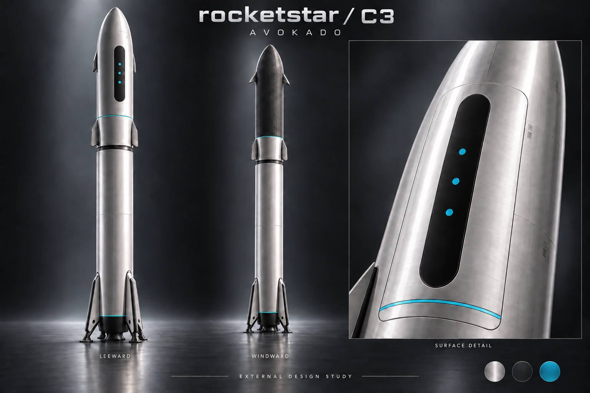
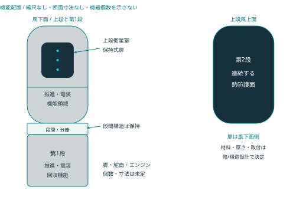
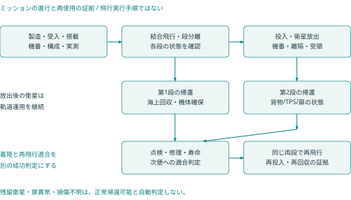

# rocketstar ロケット完全版設計書 R1.0

2026-09-24 / 両段再使用・無人小型衛星輸送 / 統合システム設計

## 01 本書の範囲と現在の設計状態

**rocketstarは、小型衛星を低軌道へ運び、第1段・第2段を回収して同じ機体を再使用する無人ロケットである。** 本書はロケット本体を中心に、機体・搭載品・飛行用システム・地上設備・回収整備を一つの設計基準へまとめた完全版R1.0。RockstarOSの設計書とは別の機体システム設計書とする。

名称は小文字のrocketstar。機上と地上の運用基盤はRockstarOS、初期搭載品はA-LINK衛星、地上操作製品はavokadoを参照する。過去のRETURN-1という名称は履歴だけに残す。

「完全版」は収録する設計分野と追跡範囲を表す。製造図面、実部品、飛行可能な質量・軌道・帰還の組合せ、飛行許可まで確定した意味ではない。根拠のない値を埋めて製造仕様にせず、未設定値・責任・依存関係・受入条件を同じ文書に置く。

| 区分 | 本版の扱い | 到達した証拠 |
| --- | --- | --- |
| 利用者要求 | 小型衛星輸送、無人、両段回収・同一機番再使用 | 要求として固定。達成済みではない |
| 方式選定 | 2段式、LOX/液体メタン、保持式扉、両段垂直着陸 | C3の設計判断を継承。実機適合前 |
| 外観選定 | avokadoの銀色・黒い縦面・小さいシアン3点 | 意匠基準。合金・板厚・装備の確定ではない |
| 計算確認 | 既存の質量感度・理想式・帰還の説明用比較 | 計算の再現。実飛行能力の確認ではない |
| 製造・飛行・再使用 | 各々の解除条件を定義 | 全て未リリース、実機の認定証拠なし |

適用の優先順位は、利用者の明示要求、R1.0の明示した変更、同梱の要求・接続・設計台帳、C3から継承した内容、過去の比較資料。図と数値が衝突した場合は本文と台帳の区分を優先し、出典を残して修正する。本版で物理的な部品を変更・製造したわけではない。

## 02 ミッションと成功判定

ミッションは、搭載衛星を合意した投入状態へ引き渡し、両段を回収し、整備後に次のミッションへ再使用すること。衛星は軌道で運用を続け、地上のavokado本体は搭載しない。有人輸送、月・火星への直接輸送、コロニーへの着陸能力は今回の要求へ追加しない。

| 成功段階 | 判定する対象 | 必要な証拠 |
| --- | --- | --- |
| M1 投入 | 各衛星の投入状態と引渡し | 軌道と誤差、分離状態、衛星側の受領・初期健全性 |
| M2 第1段回収 | 第1段の指定区域への帰還と確保 | 機番、接地後状態、搬送可能な判定 |
| M3 第2段回収 | 上段の帰還・着陸と確保 | 機番、扉と搭載室の状態、熱・構造・推進系の記録 |
| M4 再飛行適合 | 回収した各段の次便への適合 | 点検、寿命、修理、交換、地上確認と判定 |
| M5 両段再使用実証 | 同じ第1段・第2段を用いた再打上げと再回収 | 両便の同一機番・構成差分・投入と回収の記録 |

着陸しただけではM4/M5を満たさない。新品の段へ交換した便を、交換前の段の再使用回数に数えない。交換可能部品と機体個体を区別し、構造のどこを交換すると別個体とみなすかも構成管理で定義する。

参照条件は衛星500kg×2機、高度550km、傾斜角53度。利用者が確定した性能要求ではなく、旧案との比較点として保持する。射場、帰還地点、投入誤差、打上げ時期、可用率、再使用回数、整備時間、予算は未設定であり、mission_profile.jsonにnullとして記録する。

## 03 システム分割と開発の責任

衛星が軌道で運用を続け、ロケット両段が帰還する。管制通信と利用者通信は別仕様。

機体の基準構成を次の製品群へ分ける。部品表ではなく、設計・調達・試験の責任範囲である。担当は必要な専門領域を示し、実在の担当者が配置済みという意味ではない。

| 構成ID | 製品群 | 管理する範囲 |
| --- | --- | --- |
| RS-S1 | 回収式第1段 | 構造・推進・電装・機上制御・着陸・個体履歴 |
| RS-S2 | 回収式第2段 | 軌道投入、衛星室、扉、熱防護、帰還と着陸 |
| RS-INT | 段間・分離・搭載品接続 | 結合面、部品帰属、解除・離隔、電気切離し |
| RS-FSW | 機上ソフトと構成 | 各計算機の版、機器profile、時間・状態・試験 |
| RS-GND | 発射・整備支援設備 | 支持、搬送、供給、電力、計測、接続責任 |
| RS-REC | 両段の回収・搬送設備 | 海上/陸上の受入、確保、環境、輸送と整備引渡し |
| RS-OPS | 管制・通信・記録 | 操作資格、観測、mission構成、便の証拠 |
| RS-PL | 搭載品の受入 | A-LINKの重量・包絡・環境・保持・分離条件 |

全体設計責任は、各分野が使う同一のミッション・質量・構成・環境条件を揃えること。各分野の個別最適を、そのまま全機の成立へ足し合わせない。例えば上段推進剤の増量は、収納、構造、初期加速度、熱防護、帰還質量、地上設備を同時に再評価する。

## 04 外観と機能の対応

C3の外観基準を引き継ぐ。上図は保存済みの生成意匠参考で、R1.0の実機写真でも寸法図でもない。風上熱防護の連続性は次章の機能配置を基準とし、画像の反射や銀色表現から材質を決めない。

| 要素 | デザインの指定 | 工学上の境界 |
| --- | --- | --- |
| 主面 | 銀色サテン調、#B8C0C5を表示基準にする | 合金、皮膜、放射率、耐熱性は未選定 |
| 黒い縦面 | 風下面の扉外面に細長い角丸の#111619 | 非開口の意匠。窓・センサー穴を追加しない |
| シアン3点・細線 | #19C8E4、小さい平面3点と細い周方向線 | 発光器や配線を追加した仕様ではない |
| 風上面 | 熱防護を連続させる暗色の機能面 | 材料・取付・検査・熱条件は専用設計で閉じる |
| 舵面・脚 | 簡潔な線と点検可能な配置 | 個数、実形状、収納、取付寸法は未決定 |

地上avokadoの洋ナシ形フィット電源ボタンは端末の操作部である。ロケットの機体表面へ同じ電源ボタンや、端末の1回/2回/長押し機能を追加する変更ではない。

## 05 全機配置・座標・形状の管理

設計領域の配置を示す模式図。実際の区画位置・機器数・タンク形状を確定する図ではない。

主機体は同径の2段を比較基準とし、上段に衛星室と保持式扉を置く。風上熱防護面と風下扉側を区別する。ここに描く各区画は機能の配置であり、タンクの実形状、隔壁位置、エンジン個数、重心位置を示さない。

機体CADでは、機体・各段・各搭載品・地上設備の座標系に名前と改訂を与える。軸方向、右手系、原点、姿勢の表現、単位、変換の有効状態をICDで一致させる。分離前後やセンサーの取り付け後に同じ座標が同じ意味を持つと仮定しない。画像上の中心線を製造基準面にしない。

| 形状を定める入力 | 関係する設計 | 出すべき成果物 |
| --- | --- | --- |
| 衛星の収納・扉の可動範囲 | 搭載品、機構、熱 | 収納・掃引・ケーブル・工具を含む共通CAD |
| タンク・機器・支持の包絡 | 推進、構造、電装 | 部品包絡、整備アクセス、配管・ハーネス経路 |
| 飛行と着陸の荷重 | 構造、空力、熱、回収 | 荷重ケースと接続面への配分、変形後の干渉検査 |
| 放出・消耗後の質量 | 質量管理、航法、帰還 | 状態別の質量・重心・慣性、誤差の範囲 |
| 輸送と整備 | 地上設備、製造 | 支持点、搬送包絡、吊点、点検・交換経路 |

全長、直径、肉厚、扉寸法、脚のスパン、取付穴は未設定。これらを固定するには、同じ機体構成で収納、荷重、推進、上昇、帰還が同時に成立する根拠が必要である。

## 06 飛行・回収・再使用の状態

飛行・回収・再飛行の状態と証拠の関係。矢印は自動実行の許可を表さない。

本版は段階ごとの状態と証拠を定義する。燃焼時刻、射向、姿勢指令、着陸の操作値など、機体へ投入する実行シーケンスは含まない。

| 状態 | 保持する正本 | 次の段階を判断する根拠 |
| --- | --- | --- |
| 組立・地上受入 | 製造実績と接続構成 | 図面/部品/ソフト/計測器版、未処置不適合 |
| 搭載・飛行準備 | missionと衛星受入構成 | 実重量、環境、禁止状態、機体と地上の接続 |
| 結合飛行・段分離 | 両段の状態と分離記録 | 独立した状態確認、切離し、離隔、機体条件 |
| 第1段帰還・回収 | 第1段の機上記録と回収側観測 | 推進・姿勢・残量・接地後の状態 |
| 投入・衛星放出 | 上段と各衛星の状態 | 投入条件、保持解除、離隔、搭載品の残留状態 |
| 上段帰還・回収 | 搭載室/扉/TPSと帰還構成 | 放出後質量、扉、熱防護、帰還に必要な機能 |
| 点検・再飛行判定 | 同じ機番の負荷・損傷・修理 | 寿命、検査範囲、交換、次便missionへの適合 |

通信受信が途切れても機上の局所制御と必要な故障処置が成立する構成を要求する。管制側は受信できない状態を「正常」や「機体消失」と断定せず、欠測・時刻品質・不確かさを表示する。状態名だけで危険な遷移を許可せず、機体に対して定義された条件の組を使う。

## 07 機体・地上・搭載品の接続仕様

| ICD / 接続 | 両側・管理責任 | 確定する内容 |
| --- | --- | --- |
| RSI-001 段間機械・分離 | 第1段・段間構造 ↔ 第2段構造 / 機体システム責任者／機構設計責任者 | 取付面・共通座標・荷重・変形の受渡し・保持物の所属・分離前後の包絡・保持・解除・離隔の観測・故障時に確認できない状態 |
| RSI-002 段間電力・データ切離し | 第1段電装 ↔ 第2段電装 / 電装責任者 | 段別電源所属・段間コネクタ・端子・接地・絶縁境界・切離し前後のデータ所有者・切離し状態の識別・分離後の自律・時刻・記録 |
| RSI-003 推進機器と機体取付 | 推進機器 ↔ 主構造・熱・電装 / 推進設計責任者／構造設計責任者 | 取付面・質量特性・荷重・変位の受渡し・供給条件の適用範囲・熱・振動環境・状態信号と故障意味・保守・交換アクセス |
| RSI-004 タンク・供給・加圧系 | タンク ↔ 供給・加圧・計測機器 / 推進設計責任者 | 流体と材料適合・系統接続点・識別・圧力・温度の条件出典・残留・使用不能量の定義・保護・排出の責任・漏洩・状態の観測 |
| RSI-005 タンクと荷重支持構造 | タンク・断熱部 ↔ 主構造 / 構造設計責任者／熱設計責任者 | 構造負担の分界・支持・接合位置・温度・変形履歴・流体状態と荷重条件・材料・接合仕様の版・検査アクセス |
| RSI-006 熱防護と機体・扉 | TPS・継目・取付部 ↔ 主構造・保持式扉・内部機器 / 熱設計責任者／機構設計責任者 | 領域と外形版・加熱・圧力履歴・取付・隙間・熱膨張・構造へ渡る温度・扉固定・変形条件・損傷検知・修理可能範囲 |
| RSI-007 航法・操舵観測と飛行計算 | センサー・操作系状態観測 ↔ 段別飛行計算系 / 飛行電装責任者／制御設計責任者 | 観測識別・単位・座標・観測時刻と品質・測定誤差・遅延・状態・故障の意味・設定版と適用対象・欠落・矛盾時の扱い |
| RSI-008 独立飛行安全の境界 | 独立飛行安全系 ↔ 飛行電装・地上設備 / 飛行安全責任者 | 機能責任と独立性・共有資源・共通原因・観測・状態の受渡し・認可された管理者・構成識別・安全審査で必要な証拠 |
| RSI-009 段別電源と搭載負荷 | 段別蓄電・電源配分 ↔ 飛行電装・機構・搭載負荷 / 電装責任者 | 系統・端子・極性・負荷状態と電力予算・保護・監視境界・帰還後の供給責任・温度・劣化の適用条件・地上電源との切替・切離し |
| RSI-010 衛星の取付・保持・離隔 | 上段搭載区画・保持物 ↔ 搭載衛星・衛星側分離部品 / 搭載物統合責任者／衛星側責任者 | 機別質量・重心・慣性・部品質量の所属・取付面と収納・掃引包絡・保持・解除・離隔条件・取扱い・環境条件・残留・再接触の評価対象 |
| RSI-011 衛星電力・データ・禁止状態 | 上段電装・搭載物管理 ↔ 衛星電装・通信機器 / 電装責任者／衛星側責任者 | 地上・飛行中の給電有無と責任・接続・切離し条件・健康状態と識別・時刻・品質とデータ意味・展開・送信禁止と許可責任・接地・電磁適合 |
| RSI-012 放出・扉の状態証拠 | 保持・区画内有無・扉位置・固定の観測 ↔ 上段状態管理・地上記録 / 搭載物統合責任者／機構設計責任者 | 信号源と観測対象・保持と離隔の区別・位置と固定の区別・品質・時刻・構成・矛盾・欠落・不明の表現・異常構成への対応付け |
| RSI-013 機体通信と地上受信 | 段別通信・飛行テレメトリー ↔ 認可された地上局・ゲートウェイ / 通信設計責任者／地上運用責任者 | 対象機番と通信相手・通信方式・周波数の決定責任・データ種別・優先度・認証・完全性・期限・断絶・欠落・輻輳の扱い・受信証拠と実行結果の区別 |
| RSI-014 地上ゲートウェイとOps Core | 機体通信ゲートウェイ ↔ 地上Ops Core・証拠保管 / 地上ソフト責任者／情報保護責任者 | 機器身元と人の認証・許可対象・構成・期限・要求全体の同一性・受領・受理・実行・結果状態・重複防止と結果照合・記録・時刻品質・保管責任 |
| RSI-015 Ops Coreとavokado・通信サービス | 地上Ops Core・サービス側API ↔ avokado端末・A-LINKサービス / 地上ソフト責任者／端末サービス責任者 | 表示データと権限境界・サービス経路と飛行系の分離・端末操作イベントの宛先・最終更新時刻・情報品質・保存・再送・受領の意味・回線契約と未接続表示 |
| RSI-016 発射・整備設備と機体 | 地上支持・電力・流体・データ設備 ↔ 機体地上接続点 / 地上設備責任者／機体システム責任者 | 支持と取付条件・電力・流体・接地の境界・接続点・誤接続防止・接続状態と引渡し条件・設備構成・適用機番・設備検査・校正の証拠 |
| RSI-017 回収・固定・輸送と機体 | 海上・陸上回収設備と輸送支持 ↔ 着陸機体・許可支持点 / 回収運用責任者／構造設計責任者 | 機番・位置・姿勢・電源・残留物・損傷状態・接地面・支持・固定条件・許可吊点と輸送荷重・確認不能事項の継承・管理責任の引渡し |
| RSI-018 整備証拠と次便リリース | 機番・部品・検査・修理・寿命台帳 ↔ 次便構成と再飛行審査 / 整備責任者／品質責任者／機体システム責任者 | 前便からの個体連続性・交換・修理の旧新部品・検査範囲・測定値・校正・残存寿命と未処置逸脱・次便の構成・ミッション適合・独立確認とリリース証拠 |

各接続の正本は一つのICDとし、接続する両側が同じ改訂を使う。少なくとも座標、単位、値と許容差、全状態での意味、故障時、保守時、試験方法、変更責任を含める。NASAのInterface Requirements Documentの構成も、責任、座標、数値、機械・電気・流体・データ・環境の境界を扱う。[RS-S01](https://www.nasa.gov/reference/appendix-l-interface-requirements-document-outline/)

R1.0の全体接続台帳と、C3由来の衛星用13件の接続台帳を別に保持する。前者が後者の具体的な数値を埋めたわけではない。空欄・nullは「制約なし」ではなく未定。機器接続を実行する側は、未確定の対象構成を運用profileへ採用しない。

## 08 質量・性能の位置付けと再現監査

### 結論と数値の位置付け

既存C3の質量表、理想上昇性能、逆算表は再現した。数式の誤りを直して機体性能が成立する状態ではなく、実部品質量、推進性能、飛行経路、帰還消耗量をまだ一つの機体構成で確定できていない状態である。618.6tの旧比較点B0も、乾燥成長を仮定して逆算した約819.7tの比較も採用済み性能にしない。

上昇・帰還・熱・構造・推進・電力・貨物状態を同時に満たした証拠がそろうまで、打上げ能力、外径、全高、乾燥質量、推進剤量を製造承認値へ移さない。両段を回収し、同じ機番を再使用する要求は維持する。

### 再現性と監査結果

`outputs/rocketstar_C3_package` の `mass_study.py`、`mass_study.json`、`mass_study.md`、`design_register.json` を読取対象とした。原本スクリプトを本監査の `replay/` へ複製して実行し、別に実装した質量・理想速度増分の式と照合した。原本4ファイルの実行前後SHA-256は一致した。

| 確認対象 | 結果 | 解釈 |
| --- | --- | --- |
| 隔離再生成したJSON | 原本とバイト一致・値一致 | 入力・実装・保存結果を再現 |
| 隔離再生成したMarkdown | 原本とバイト一致 | 表示数値の生成を再現 |
| 順計算 | 96行、異なる入力組は84組 | 帰還4tでは2種類の充填方針が同じ入力になるため12行が重複 |
| 乾燥固定逆算 | 192行 | 物理寸法を固定した成立解析ではない |
| 仮乾燥成長を含む逆算 | 144行 | 成長係数は物理的なタンク設計則ではない |
| 逆算336行の内訳 | 交差290行、探索範囲内交差なし46行 | 交差なしも計算結果。実機不可能の証明ではない |
| 独立式照合 | 上昇・逆算等434行＋帰還表4行、4,790数値項目 | 最大絶対差約3.64×10⁻¹²。質量保存・区分も一致 |
| 設計台帳 | 40項目、認定済み0、製造・飛行リリースともfalse | 状態件数・参照先を再集計し一致 |

数値照合件数は実機試験の件数ではない。推力、材料、熱防護、再始動、飛行経路、回収の性能試験は本監査に含まれない。

## 09 質量区分と状態別の重量

### 質量区分を一意にする

各部品・流体・余裕は、どの飛行状態に存在するかと、どの質量区分へ入るかを一つに定める。未配分の流体を「その他余裕に含まれているはず」と扱わない。

| 区分 | 旧比較点の扱い | 完全版での管理規則 |
| --- | --- | --- |
| 第1段乾燥 | 40t＝32t配分＋8t成長余裕 | 構造・エンジン・脚・舵面・電装等を積み上げ、余裕を別列管理 |
| 上段乾燥 | 18t＝14.4t配分＋3.6t成長余裕 | TPS、収納扉、機体側保持・分離アダプターを含む |
| 上昇使用可能推進剤 | 第1段380t、上段150t | 帰還用と分け、流用したケースは別性能として表示 |
| 帰還使用可能推進剤 | 第1段24t、上段4t | 実際の必要量ではなく旧比較用配分 |
| 非使用残量 | 第1段1t、上段0.6t | 接地まで質量として運び、推進能力へ加えない |
| 放出貨物 | 500kg級衛星2機、計1t | 衛星側接口・搭載推進剤を含む参照値。機体側アダプターを重複計上しない |
| 他の消耗品 | 未配分 | 姿勢制御、加圧、冷却、再始動、ベント、蒸発等を状態別に計上 |
| 損失と余裕 | 複数の仮定が存在 | 成長余裕、不可用残量、性能差、測定/モデル不確かさを別の量として追跡 |

40t・18tには旧25%成長余裕が既に入っている。これへさらに25%を一括加算して同じ余裕を二度数えない。乾燥20/22/24tの感度は、余裕を含んだ18tからさらに増えた条件である。将来追加する余裕が必要なら、その根拠と対象を新しい管理項目として示す。

質量台帳の各行には、品名、数量、乾燥/流体/貨物区分、測定または見積りの出典、版、見積り成熟度、成長余裕、不可用量、消費する区間、残留先を持たせる。部品の重量を実測した際には、その部品の見積りと余裕を同時更新し、実測値に古い余裕が紛れ込まないようにする。

### 旧比較点B0の質量遷移

単位はt。衛星を全て正常放出する場合である。

| 状態 | 第1段側 | 上段側 | 衛星 | 合計・関係 |
| --- | --- | --- | --- | --- |
| 打上げ前 | 445.0 | 172.6 | 1.0 | 618.6 |
| 第1段の上昇用消費後、分離前 | 65.0 | 172.6 | 1.0 | 238.6 |
| 分離直後の上段＋衛星 | 別帰還へ | 172.6 | 1.0 | 173.6 |
| 上段の上昇用消費後 | 別帰還へ | 22.6 | 1.0 | 23.6 |
| 衛星全放出後、上段帰還開始 | 別帰還へ | 22.6 | 0 | 22.6 |
| 帰還用を全て消費した接地側 | 41.0 | 18.6 | 0 | 各段を別に評価 |

充填推進剤と残量の合計559.6t、両段乾燥58t、衛星1tを足すと618.6tになる。この算術的一致は、未配分の加圧・姿勢制御・冷却等が物理的に不要であることを示さない。

## 10 理想上昇性能と帰還量の照合

### 理想上昇性能が示す範囲

上段乾燥D、上昇用P、帰還用R、上段＋衛星の上昇開始質量Uを置く。すべてtで扱う。

`U = D + P + R + 0.6 + 1.0`

`Δv = g0 Isp1 ln[(445+U)/(65+U)] + g0 Isp2 ln[U/(D+R+1.6)]`

`g0 = 9.80665m/s²`

比推力330/370秒、D=18、P=150、R=4のB0では合計10,323.645m/s。仮の10,080m/sに対して+243.645m/s、10,290m/sに対して+33.645m/sである。9,600/9,800m/sと、それぞれへの5%追加は比較条件であり、実射場から求めた所要速度増分でも信頼度保証でもない。

この式は質量比と一定比推力による理想増分を比較する。推力、燃焼時間、タンク体積、重力・抗力・操舵損失、空力荷重、熱、制御余裕はモデル化していない。第1段の445tを固定して上段だけ増量した場合も、増加荷重、離昇推力、分離条件、帰還状態を自動的に満たすわけではない。式の原理は[NASA Glennの理想ロケット方程式](https://www1.grc.nasa.gov/beginners-guide-to-aeronautics/ideal-rocket-equation/)を参照し、本機の質量・比推力は独自の仮定として扱う。

### 上昇だけの合格を帰還までの合格にしない

既存順計算は、上段乾燥18/20/22/24t、帰還4/4.9/6/8t、比推力330/370・320/360・310/350秒、次の2つの充填方針を組み合わせる。

| 充填方針 | 条件 | 変更の意味 |
| --- | --- | --- |
| 上昇用150tを維持 | P=150、Rを追加搭載 | 帰還分を増やすほど打上げ質量も増える |
| 上段総充填154.6tを維持 | P=154−R、残量0.6 | 帰還分を増やすほど上昇用が減る |

今回、全96行について上昇条件に加え、上段の既存の説明用帰還2区間を満たすかを横断判定した。この帰還判定は上段だけであり、第1段の帰還成立は評価していない。両段回収の合格件数ではない。

| 仮上昇条件 | 上昇式のみを満たす行 | 説明用帰還も満たす行 |
| --- | --- | --- |
| 10,080m/s | 4 / 96 | 2 / 96 |
| 10,290m/s | 2 / 96 | 0 / 96 |

10,080m/sで残る2行はいずれも乾燥18t・帰還4.9t・比推力330/370秒で、上昇用150tまたは149.1tのケース。説明用帰還量4.896384tとの差は約3.62kgにすぎず、他の消耗品と誤差を確保した帰還余裕ではない。0/96は今回の離散入力集合での結果であり、全ての機体設計が不可能という証明ではない。

## 11 逆算値・衛星残留の比較

### 819.7tという逆算値を採用しない理由

仮の乾燥成長則は `D=22+0.03×max(0,P+R−154)`。R=6t、比推力320/360秒、上昇条件10,290m/sへ最初に達する交差を探した比較である。係数0.03は経験則や部品仕様から得た値ではない。

| 逆算結果 | 値 |
| --- | --- |
| 上段上昇用推進剤 | 339.316t |
| 上段乾燥 | 27.739t |
| 全打上げ質量 | 819.656t |
| 理想上昇増分 | 10,290m/s |
| 固定した帰還用 | 6.000t |
| 同じ説明用2区間で必要な帰還用 | 7.460t |
| 帰還差 | −1.460t |

上昇の式を満たした際に乾燥質量が増え、帰還量も増えるが、逆算では帰還6tが固定されている。したがって帰還成立案ではない。帰還を増やすなら質量・上昇用・タンク・乾燥質量を再び結合して解き直す。上段を増量した分の第1段の推力・構造・回収能力も未検証である。

逆算の探索範囲は上段上昇用0〜2,000t、0.5t刻みで交差区間を見つけて二分する。範囲内に交差がない場合に「どれだけ大型化しても不可能」と結論しない。交差があった場合にも製作可能なタンクや機体寸法が得られたとは結論しない。

### 衛星・貨物が残った場合を独立ケースにする

旧上昇モデルは衛星1tを運び、旧帰還モデルは全放出後を仮定する。今回、上段乾燥18t・不可用残量0.6tを共通に、貨物残留C=0/0.5/1tを追加した。説明用の必要増分150/600m/sと比推力360/320秒は同じ仮定に固定する。

`R例 = (18 + 0.6 + C) × {exp[150/(g0×360) + 600/(g0×320)] − 1}`

| 放出結果 | 帰還する貨物C | 接地側質量 | 説明用帰還必要量 | 旧帰還4tに対する不足 |
| --- | --- | --- | --- | --- |
| 2機とも正常放出 | 0t | 18.6t | 4.896t | 0.896t |
| 1機を保持 | 0.5t | 19.1t | 5.028t | 1.028t |
| 2機を保持 | 1.0t | 19.6t | 5.160t | 1.160t |

これは貨物重量だけの条件比較であり、実際の帰還要求が150/600m/sだと決めたものではない。扉・ラッチ状態、残留貨物の固定、重心・慣性、空力、再突入熱、着陸推力下限、接地荷重、地上取扱いは別に確認する。「衛星を放出できなくても、そのまま帰還可能」を既定の機能にしない。片側だけ残る状態は、質量0.5tだけでなく非対称配置として扱う。

上段に戻す回収貨物、軌道上で受け取る貨物、別軌道へ運ぶ貨物は現参照ミッションに含まれない。将来追加する場合は出発/帰還両方の質量・インターフェース・飛行条件を改訂する。

## 12 性能を確定する条件と監査記録

### 同時に閉じる入力と凍結条件

| 関連する入力 | 同時に必要な根拠 | 主な台帳項目 |
| --- | --- | --- |
| 射場・射向・投入軌道・回収場所・待機時間 | 実地理とミッションから上昇/帰還条件を一体化 | RDR-002、005、029 |
| 構造・TPS・扉・脚・タンク・衛星接口 | 部品積上げ、収納、荷重、熱、実重心・慣性 | RDR-004、007、009、018、032 |
| 推進性能・使用可能量・不可用残量 | 運転点ごとの推力/Isp、供給、消費、全流体の台帳 | RDR-014、015、016 |
| 帰還状態・貨物・電力 | 放出成否、待機・再突入・着陸の状態別消費と能力 | RDR-005、022、024、026、032 |
| 分散・劣化・測定誤差・モデル誤差 | 校正済みモデルと要求値の関係、最悪条件の余裕 | RDR-005、021、022、038 |

凍結条件は、同じ構成・同じミッション・同じ誤差条件で投入条件と両段帰還条件を満たし、質量・電力・熱・荷重・供給・制御の不足がないこと。候補入力を変えたときには、影響する全予算を再評価する。一定比推力を増やす、残量を減らす、乾燥成長を固定するなど一つの仮定だけを都合よく変更して不足を消さない。

### 台帳との整合と再現方法

C3台帳のRDR-004は質量の解析仮定、RDR-005は上昇と帰還の同時成立未完、RDR-014は推進仕様未完、RDR-016は再始動・供給未完、RDR-032は衛星質量の解析仮定である。今回の数式監査でこれらを「認定済み」へ変更しない。

原本は旧称RETURN-1と当時の実行パスを保存している。これは履歴として保持し、現在の本文ではrocketstarへ統一する。本監査フォルダーの `run_audit.py` を実行すると、原本を読み取って `replay/` だけで旧計算を再生成し、`audit.json` を更新する。実装はPython標準ライブラリーのみを使用する。原本が変わった場合はハッシュと版を追跡し、新しい監査結果として扱う。

証拠：原本4ファイルのSHA-256、実行環境、再生成一致、独立式の差、入力行数、逆算残差、貨物残留ケース、関連台帳状態は `audit.json` に保存した。今回の完全版が示すのは、質量・性能の判断根拠と未確定条件が追跡できる状態であり、製造・飛行可能な機体の完成ではない。

## 13 構成の正本と設計責任

無人二段式、両段LOX／液体メタン、第1段は下流の海上設備、第2段は指定陸上区域への垂直着陸を基準とする。上段の衛星収納扉と段間構造は通常飛行で保持し、上段風上面を中心に再使用型熱防護を配置する。銀色、黒い縦面、シアンの意匠を機器・材料・開口の指定として扱わない。

機体システム責任者が機体構成表の正本を管理する。各専門分野は自分のモデルと図面に責任を持ち、質量、空力、熱、推進、制御のどれかだけを更新して機体の成立扱いを変えない。

| 正本 | 必須内容 | 受け渡す先 |
| --- | --- | --- |
| 構成・形状基準 | 機番、部品番号・版、座標、組立階層、保持物、交換部品、適用便 | 構造、熱、空力、製造、整備 |
| 質量特性台帳 | 状態別の質量・重心・慣性、実測／推定、誤差、余裕、消耗と残留 | 統合性能・帰還・着陸解析 |
| 接続条件書ICD | 両側の責任、単位・方向、許容範囲、状態、出典、版 | 構造、推進、電装、衛星、地上設備 |
| 検証台帳 | 要求ID、構成版、方法、合否値、実測、逸脱、承認者 | 機体リリースと個体ごとの再飛行判断 |

図面変更は影響するICDと解析・試験を列挙して承認する。値が未設定の欄は未確定のまま扱い、ゼロ・制約なし・従来品同等へ置換しない。NASAの要求検証マトリクスを追跡方法の参考にする。[VR-S6](https://www.nasa.gov/reference/appendix-d-requirements-verification-matrix/)

## 14 主構造・タンク・取付部

構造設計責任者は、搭載衛星と上段から段間、第1段、支持設備までの荷重経路を組立モデルで示す。帰還後は着陸装置から機体へ入る荷重経路を別条件として評価する。タンクを荷重支持へ使う範囲、主構造と断熱材の境界、扉開口の補強、エンジン・可動面・脚の取付構造は実形状が必要な設計項目とする。

構造側の入力は、推進側の取付反力と運転環境、空力側の分布荷重、熱側の温度履歴、搭載品の慣性、地上・海上設備の支持条件である。出力は許容荷重、変形・剛性、振動特性、質量特性、損傷許容と検査アクセス。流体量、圧力、温度、飛行状態が異なる荷重を、理由なく一つの最大値へ合成しない。

開発成果物は部品CAD、組立図、材料・接合・検査仕様、結合荷重解析、強度・座屈・疲労評価、振動モデルと相関試験。合格条件は、採用した荷重・係数・寿命条件に対して必要な余裕を満たし、変形が配管、扉、操作機構、衛星の機能限界を超えず、試験で生じた損傷が承認範囲内であること。材料、板厚、締結、公差、係数、許容損傷は未確定である。

NASA-STD-5001は構造設計・試験・寿命の係数を扱う参照資料である。本機への適用条件を決めずに、規格名や一つの係数だけで強度成立としない。[VR-S1](https://standards.nasa.gov/standard/NASA/NASA-STD-5001)

## 15 推進系と機体の接続

推進設計責任者は、両段の酸化剤・燃料の貯蔵、供給、状態管理、加圧・排出、機器保護、漏洩検知、地上接続を機能系統図で管理する。流体を共通化してもエンジン型式、配管、機器、運転範囲が両段共通になるとは仮定しない。エンジンは要求された運転範囲と寿命を満たす候補を評価し、構築方法や運転パラメーターを本章で作らない。

| 接続先 | 推進側が受け取る情報 | 推進側が確定して返す情報 |
| --- | --- | --- |
| 機体・構造 | 質量・収納枠、姿勢環境、取付位置と変位 | 実重量、取付荷重、熱・振動、保守空間 |
| 統合性能 | 上昇・帰還・待機を合わせた要求 | 使用可能量、使用不能量、条件付き性能、計測誤差、消耗 |
| 飛行電装 | 適用モードと機器状態の取得要求 | 状態信号、故障分類、許可・禁止条件、応答の仕様 |
| 地上設備 | 接続責任、環境、設備の適用構成 | 接続点・識別、整合確認、残留状態の確認に必要な情報 |

採用機器の供給条件、再始動能力、最低運転範囲、劣化と寿命は供給者データと対象構成の試験で確認する。仮の比推力や燃料量からエンジンが選定済みとはしない。上昇に割り当てる量と帰還・待機・機器作動・未使用分を同じ台帳へ積み上げ、帰還用だけを別会計にしない。

成果物は系統図、機器表、ICD、性能・資源・寿命予算、故障解析、開発試験計画と記録。合格には採用構成の要求範囲で機能・構造・寿命が同時に裏付けられることが必要。NASA-STD-5012は液体推進エンジンの強度・寿命評価を扱うが、エンジンシステム全体の試験要件を代用しない。[VR-S2](https://standards.nasa.gov/standard/NASA/NASA-STD-5012)

## 16 上段熱防護と保持式扉

熱設計責任者は外形上の各領域を、風上面、端部、可動部、扉・継目、取付部へ分けて管理する。入力は空力加熱と圧力の時間履歴、姿勢・重心の分散、内部機器の熱、繰返し使用条件。出力は材料・取付方式の候補、構造へ渡る温度、変形、検査箇所、修理・交換の許容範囲である。

TPSの合格は表面の耐熱値だけで決めない。断熱、接合、熱膨張差、隙間、吸湿・汚染、取付部の負荷、繰返し後の性質まで評価する。材料試験から継目・取付部を含む部分試験、機体熱・荷重モデルとの相関へ進める。NASAの再使用TPS説明も、材料と構成、整備を含む再飛行を扱う。紹介された材料を本機の採用品とはしない。[VR-S3](https://www.nasa.gov/general/thermal-protection-materials-branch-reusable-materials/)

保持式扉の正本は機構設計責任者が持ち、収納・開閉掃引、ヒンジ・ラッチ、シール、開口補強、熱変形、配線と検出器を一つの組立として設計する。「閉じる命令が出た」「位置検出が閉側」「荷重を受けられる固定状態」を別の意味として扱う。検出方法と独立性は故障解析で決める。

扉の合格条件は、指定の変形・温度・荷重・故障条件で意図しない開放や干渉を生じず、必要な閉鎖・固定状態を判別でき、TPSと主構造の要求を維持すること。扉が閉まらない場合の帰還可否は未確定であり、正常な閉鎖済み形状の解析で代用しない。

軌道離脱前にもTPSの状態確認を要求する（RDR-019）。設計上の取得方法、観測できる範囲、検出できる損傷、見えない箇所、許容限界を定義し、帰還構成の判定へ渡す。撮像装置や損傷検出機能を搭載済みとはしない。確認不能を健全と扱わず、観測の制約を含む承認済み条件がなければ正常帰還可能と判定しない。帰還後の目視点検は離脱前の証拠を代用しない。

## 17 分離・残留衛星の異常を扱う

衛星側と上段側は、質量、重心・慣性、保持、電気切離し、展開禁止、離隔確認をPL-M01〜PL-S02のICDで合意する。衛星側の分離部品は衛星質量、上段に残る保持物は上段質量へ計上する。分離器の型式・方式・作動値は未確定。検知信号一つから分離と離隔を同時に成功と判定しない。

| 観測された状態 | 正本へ残す内容 | 帰還判断への扱い |
| --- | --- | --- |
| 2機とも離隔確認 | 放出した機番、時刻・品質、残る部品と質量状態 | 空の搭載区画モデルが適用できるか確認 |
| 1機だけ離隔確認 | 残留機番、拘束状態、質量・偏心・電源状態 | 片側残留モデルで構造・熱・制御・性能を再照合 |
| 解除検出のみ | 分離指令と検出の証拠、離隔の未確認 | 放出完了へ昇格させず、拘束・再接触の不確実性を保持 |
| 状態が矛盾・不明 | センサー品質、確認不能な対象と根拠 | 衛星をゼロ質量扱いにしない。適用できる承認済み異常状態がなければ正常帰還可能とは判定しない |

残留衛星の帰還には、その拘束、電池等の状態、閉扉の成立、質量・重心、熱、接地荷重を含む評価が必要である。未分離だから投棄を繰り返す、あるいはそのまま帰る、という共通手順を作らない。展開や送信の許可と衛星分離の成功も別に検証する。

検証成果物は代表質量・慣性の試験、干渉・分離運動解析、状態の故障注入、残留構成の評価。試験での吊具・支持の影響を記録し、無重力環境の動きと同一視しない。ECSS機構規格は宇宙機・搭載品を主対象としており、ロケット機構への適用は本計画で判断する。[VR-S4](https://ecss.nl/standard/ecss-e-st-33-01c-rev-2-1-march-2019-space-engineering-mechanisms/)

## 18 帰還・着陸の機体成立条件

回収系責任者は、第1段の海上設備と第2段の陸上区域を別の環境仕様として管理する。入力は帰還開始状態、使用可能資源、質量特性、機器の運転範囲、気象、地形または甲板の運動・支持条件。出力は適用可能な機体構成、必要機能、接地荷重、回収設備への引渡し条件である。

上段の大気減速、姿勢遷移、終末着陸は同じ機体・同じ残量状態で整合させる。空力操作だけの成立、エンジン単体の成立、接地機構だけの成立を加算して帰還成功としない。着陸装置は接地荷重、横方向荷重、滑り、転倒、機体変形、接触面との適合を評価する。脚数・寸法・材料は意匠図から固定しない。

必要成果は統合飛行・熱・荷重解析、センサー／操作系を結んだ試験、着陸装置の代表荷重試験、回収面の適合確認。合否条件には分散・誤差と残留衛星等の適用構成を含める。第1段の試験を軌道速度から帰還する上段の証拠へ転用しない。着陸できること、回収作業へ引き渡せること、再使用できることは別の判定である。

## 19 回収・検査・整備の証拠を残す

回収開始前の引渡し記録には機番、位置・姿勢、残留物、電源・機器の状態、損傷と確認不能事項を含める。地上運用責任者が作業条件を判断し、構造側が許可した吊点・支持点・輸送条件を使う。具体的な残留処置や機器操作は、採用機器に対応する承認手順で定める。

整備責任者は到着時の状態を変更前に記録し、TPSと扉、主構造・継手、タンク・配管、エンジン、可動部・脚、電源・ハーネスを機番付きで照合する。海上回収では塩分・水分・腐食、陸上回収では地面・粉塵等の影響を条件に応じて評価する。検査方法、計測器・校正、検出できる欠陥、合否値、見えない箇所の扱いを点検項目ごとに定める。

修理は承認済み方法と範囲に限り、交換した部品の旧新番号、理由、適用図面、作業証拠を残す。交換・修理・ソフト更新後は、影響した機能と必要な環境条件を再確認する。環境試験は予想ミッション環境と組立状態から選び、GEVSの一般的な試験水準を本機へ無条件転用しない。[VR-S5](https://standards.nasa.gov/node/791)

## 20 同じ個体の再飛行を判定する

再飛行判定の正本は便別リリース記録とする。機体システム、各専門責任者、品質、運用の必要な確認を束ね、試験前に決めた合否条件で判断する。設計を作成した側とは別の確認者による重要項目の照合を要求する。手順やチェック欄が存在するだけでは合格にしない。

| 判定対象 | リリースに必要な証拠 | 不成立時 |
| --- | --- | --- |
| 個体と構成 | 前便から連続する段・主要構造の識別、交換と修理の全履歴 | 履歴不明を新造同等扱いにせず保留 |
| 残存寿命 | 飛行・試験・保管の負荷履歴、寿命モデル、未消費余裕 | 回数だけから寿命を推定せず保留 |
| 損傷と修理 | 検査範囲、測定値、検出能力、逸脱処置、修理後確認 | 未処置の逸脱を残してリリースしない |
| 次便との適合 | 衛星、軌道、帰還場所、機体・ソフト版、試験適用範囲の整合 | 変更影響の確認と必要試験へ戻す |

同一個体の判定規則は再使用実証の前に固定する。主構造を丸ごと置換した段を同じ段の再使用へ数えない。エンジン等の交換は段の履歴に残し、段の再使用と交換前エンジンの再使用を混同しない。両段再使用の実績には、同じ両段の機番が打上げ、回収、整備、次の飛行・回収まで連続する証拠を要求する。

再使用回数、整備日数、交換率は現時点の保証値を置かず、実績を同じ定義で蓄積する。本版は判定契約を定義した段階であり、再飛行リリース、両段回収・再使用の実証記録は未取得である。

## 21 空力・飛行力学・航法制御の結合設計

空力・飛行力学・航法制御は、同じ版の機体形状、質量特性、推進能力、操作系、気象・誤差条件を入力にする。空力設計責任者が特性データと適用範囲を管理し、統合飛行責任者が上昇から両段帰還までの結合モデルを管理する。飛行制御ソフトの完成を空力・機体性能の成立と同一視しない。

| 設計領域 | 作成する正本 | 成立判定に必要な証拠 |
| --- | --- | --- |
| 空力特性 | 形状・姿勢・速度域・操作面ごとの力/モーメント、誤差、適用範囲 | 解析と風洞等の相関、範囲外の明示、遷移する形状の整合 |
| 統合飛行力学 | 両段の質量・重心・慣性、機体運動、推進、流体揺動、弾性の関係 | 同じ構成による投入・熱・荷重・帰還条件の同時成立 |
| 航法・状態推定 | 座標と時間、センサー誤差・遅延、推定状態と不確かさ | 校正、欠測/偏り/矛盾の注入、観測不能条件、実機器との照合 |
| 誘導・制御の設計 | 適用モード、要求精度、操作権限、機器制約、故障時の範囲 | 安定性と追従、操作量限界、遅延・機体振動の影響、分散評価 |
| 着陸との統合 | 接地前後の状態、推進・操舵・脚・接地面の制約 | 推力下限、残量、姿勢、接地荷重、転倒等を同じ状態で確認 |

CFDは数値流体解析、HILは実機器を模型の入出力へ接続する試験を指す。CFDの一つの定常解を全飛行域へ広げず、HILの模型が欠く物理現象を合格扱いにしない。試験設備の支持、縮尺、境界条件と実機との差を記録する。

分散評価は、根拠のある入力範囲と分布、相関、使用した乱数系列、失敗判定を保存する。名目ケース一つの成功、根拠のない大量の乱数試行だけで信頼性を保証しない。残留衛星、扉状態、操作系故障を別の構成として計算し、未評価状態への外挿を運用profileへ載せない。

RDR-005、010、020、021、022の成果物は相互依存する。詳細な飛行経路、制御則、機器の応答値、合否値は未確定であり、本章は飛行実行用の設定を含まない。モデルの版と適用範囲を決め、相関誤差を性能余裕へ戻すことを受入条件とする。

## 22 各段の自律と地上運用核の分担

rocketstarは分離後の第1段、第2段、放出後の衛星を別の機体として扱う。各段は、自段に必要な給電、計算、観測、時刻、機器管理、記録を保ち、地上回線や他段の計算機がなくても承認された運用・故障処置を継続する要求とする。これらの機器の採用品、台数、容量は未確定であり、共通電源や分離配線に隠れた依存がないことを試験する。

地上RockstarOS Operations Coreは、構成、担当資格、試験、輸送仕事、飛行履歴、機体から受けた結果の正本を管理する。飛行中の現在状態は各機の観測と機上記録が根拠で、地上画面は遅延した複製である。地上Core・avokado・AIを毎周期の飛行制御に入れない。[AVP-L1][AVP-L2]

| 領域 | 管理するもの | 停止・切断時の境界 |
|---|---|---|
| 第1段の機上系 | 自段の観測、機器状態、承認済み運用、帰還記録 | 上段・地上の応答を自段の継続条件にしない |
| 第2段の機上系 | 自段の状態、搭載室、衛星引渡し、扉と帰還記録 | 衛星の通信停止を正常な放出と同一視しない |
| 各A-LINK衛星 | 自機の身元、電源・姿勢・通信管理 | 放出後は自機の計算機と電源へ依存。機体からの給電継続を前提にしない |
| 地上管制・Ops Core | 便・機番、許可された要求、監視、証拠、引渡し | 通信断を全機停止命令へ変換せず、取得不能を表示 |

機体ID、段ID、搭載衛星ID、起動世代を別に持つ。段間通信が消えた事実だけで機械分離を確定しない。正常な配線切離しと故障の識別には、機体側の分離状態、電源・接続状態、時刻品質を対応付けた証拠を使う。機器を二台に増やすだけで独立保護が完成したとはしない。

## 23 飛行ソフトの第一評価構成

**cFS＋RTEMSを第一評価候補**として継承する。cFS/cFEは共通サービスとアプリの枠組み、RTEMSは下位のタスク・割込み・入出力を扱うOSであり、同じ製品ではない。NASAの公開cFSはミッション完成品ではなく、採用側の検証が必要である。[AVP-S1](https://github.com/nasa/cFS)

機上はDevice I/O、状態推定、局所Mission Control、Command Gateway、Payload Manager、Health/Time、Recorderに責任を分ける。OSAL、PSP、RTEMS BSPと機器ドライバーの境界を固定し、機器IDと型付き情報で接続する。論理的なアプリ分割をメモリー・電源・故障の独立性の証拠にしない。

評価開始前に、各段のCPU/基板、cFS/cFE/OSAL/PSP/appの版、RTEMS/BSP、コンパイラー、ビルド設定、ドライバー、構成digestを一組で固定する。地上LinuxやQEMUでの合格は、対象BSPの入出力・締切・耐環境へ転用しない。RTEMSにBSPが存在することも対象基板の搭載適合の証明ではない。[AVP-S2](https://docs.rtems.org/docs/6.1/user/bsps/index.html)

タスクごとの周期・締切・最悪実行時間・起動ずれ・共有資源阻害、割込み、最大メッセージ長、キュー、stack、保存枠を台帳化する。数値は機体・機器モデルと実測から割り当て、本章で誘導則、燃焼指示、制御ゲイン、実行手順を作らない。通信や記録の詰まりで機上の必要処理を無期限に待たせない。起動・再起動は新世代を発行して現物を読み直し、保存済みの過去指令をそのまま再生しない。

## 24 搭載衛星・扉・放出状態の確認

A-LINKは打ち上げる通信衛星であり、地上のavokado本体を搭載する計画ではない。500kg級2機、合計1,000kg、高度550km・傾斜角53度は比較仮定で、打上げ実績や収納成立を示さない。衛星側分離部は衛星、上段に残るアダプターと保持式扉は上段へ計上する。上段から衛星へ飛行中給電するかも未決定である。[AVP-L1]

衛星ごとの保持、機械的な放出、搭載室からの離脱、衛星の自己機能、扉の位置、施錠を別チャネルで記録する。以下の名称は観測の分類であり、順に送れば作動する制御手順ではない。

| 対象 | 別々に保持する状態 | readbackと必要な根拠 |
|---|---|---|
| 各衛星の保持部 | HELD / RELEASED / UNKNOWN | 作動要求の記録と、選定機構の保持状態検出を区別 |
| 衛星の室内存在 | PRESENT / CLEAR / UNKNOWN | 搭載室・掃引包絡の離脱確認。通信線断だけでCLEARにしない |
| 衛星の自己機能 | READY / DEGRADED / UNKNOWN | 自機ID、電源、起動世代、品質付き応答。衛星無応答だけで残留/離脱を断定しない |
| 扉の位置 | CLOSED / OPEN / INTERMEDIATE / UNKNOWN | 位置検出と採取時刻。閉鎖要求の送信をCLOSEDにしない |
| 扉の固定 | LOCKED / UNLOCKED / UNKNOWN | 機構に適合する固定状態の検出。位置検出と同一の意味にしない |

readbackとは、要求を送った履歴ではなく、対象機器から得た状態読出しを指す。センサーの種類、独立性、誤判定率、判定時間、閾値は分離・扉機構の設計で確定する。矛盾、古い値、配線断、電源低下ではUNKNOWNを残し、最後の正常値で完了を装わない。

放出後の扉閉鎖・固定確認を帰還の構成確認に含める。1機残留、2機残留、扉不閉鎖、展開物未固定のいずれも、残留質量・重心・慣性・包絡・熱条件が変わるため、通常構成へ丸めない。衛星を残した帰還が可能とは未判定であり、機体システム担当が承認した異常構成だけを運用profileへ登録する。未登録状態で自動的に放出や展開を追加実行しない。

## 25 電源・データ・時刻のICD

ICDは接続両側の責任者が承認し、機体システム担当が全体整合を管理する。各欄に単位、基準座標、対象状態、許容範囲、誤差、出典、改訂、測定/推定の区別を付ける。未入力をゼロ・無制限・許可済みへ置換しない。

| 管理対象／既存ID | 必須欄 | 管理責任と閉じる証拠 |
|---|---|---|
| 衛星給電 PL-E01 | 給電有無、供給元、電圧/極性、ピーク/突入、切離し、接地、逆給電・保護 | 両機の電源担当。系統図・全端子表・負荷/切離し試験 |
| 情報・許可 PL-E02 | 信号型、送受信主体、物理層、端子、最大長、更新/応答期限、欠測、禁止状態 | 電装/飛行ソフト。値入り信号辞書・断線/固着/誤入力試験 |
| 保持・放出 PL-S01 | 機構の帰属、状態検出、証拠、作動禁止・解除の責任 | 分離系/機体。代表質量・慣性での機構・状態読出し検証 |
| 異常・扉 PL-S02 | 位置/固定、残留物、掃引包絡、状態矛盾、異常構成ID | 機体/機構/熱。干渉、閉鎖、残留構成の解析と試験 |
| RF共存 PL-RF01/02 | 利用者/衛星管制/機体管制の別、送信禁止、方式・帯域、EMC、接触条件 | RF/電装。干渉試験、両リンクの解析、禁止状態確認 |
| 段間・地上接続 | 分離前後の端点ID、信号/給電切離し、時刻変換、loss宣言、認証、記録 | 機体電装/管制。配線切離し・時刻ずれ・各段単独運用試験 |

観測は採取時刻、受信時刻、機器の単調時計、bootId、連番、時刻誤差を持つ。地上到着時刻を機上の採取時刻に置換しない。異なる時計間の対応が不明なら同時事象と断定しない。共通ICD v1の意味を機上メッセージ辞書へ対応付け、実バイナリー配置や時刻系は別の値入り仕様で確定する。地上参照用の短命権限・時計誤差値を飛行用の締切へコピーしない。

## 26 地上要求・結果照合・端末の境界

地上からの要求は専用Command Gatewayで、機体/段/対象、発行主体、機器身元、許可された操作、内容digest、構成版、世代、期限、機上状態を再検査する。公開SIM HMAC、actor文字列、通信が到達した事実は操作資格にならない。運用認証鍵、機器結果の証明、ソフト配布鍵は用途を分け、AIへ署名鍵や直接の飛行操作口を渡さない。[AVP-L2]

要求保存、送信、機器受理、実行、物理作用確認を分ける。返事消失は指令UNKNOWN、地上の仕事はactiveの照合待ちとする。照合では機器履歴と現物観測を問い合わせ、未取得の機器receiptを作らない。同一ID/同一内容は既存結果、同一ID/別内容は拒否する。作用不明の要求を新IDで送り直すことも抑止し、状態読出しや装置側IDが不足する場合は担当者へ引き継ぐ。

A-LINKの利用者通信とrocketstarの管制は別の経路・資格・容量として設計する。透明中継の衛星へBPv7の保存機能を追加済みとせず、9704/Iridium実証も自前網や飛行管制の適合証拠にしない。通信断中は機上記録を容量内で保持し、復帰後も鮮度と構成を確認する。古い地上要求をまとめて実行しない。

avokadoの洋ナシ形ボタンは、1回が製品内待機/復帰、2回がホーム、3秒以上10秒未満で解放が正常OFF要求、10秒保持がHub主電源の強制OFF要求である。これらを飛行、分離、扉、衛星送信のコマンドへ変換しない。10秒は端末の要求閾値であり、ロケットの停止期限ではない。端末停止でも機上系と別管制経路は継続する設計とする。[AVP-L3]

## 27 構成管理・試験・再使用証拠

便ID、機番/段番号、衛星ID、ハード改訂、ハーネス、ソフトimage、構成profile、校正、鍵識別、試験体、計測器を一組で記録する。本文や画面の完了表示だけで承認せず、対象構成と一致した試験結果へリンクする。帰還後は放出・扉・電源過渡・再起動・通信欠落・環境負荷の履歴を残し、再飛行前の点検・交換・再試験の範囲を決める。

| 試験 | 必須の証拠 |
|---|---|
| 各段単独・段間切離し | 地上/他段を失った条件の観測・電源・記録、誤分離判定なし |
| 衛星2機・保持式扉 | 扉と配線の干渉、保持/離脱/固定の別readback、片方残留・誤センサー注入 |
| 電装・通信 | 低電圧、突入、逆給電、断線、再接続、RF共存、誤主体・旧世代拒否 |
| ソフト/装置HIL | 対象CPU/BSPの時間と資源、UNKNOWN照合、再起動、誤要求・記録満杯 |
| 環境・再使用 | 必要な振動/音響/衝撃/熱真空/EMC後の機能と校正、個体履歴の追跡 |

環境値は結合荷重と機体/衛星の予測環境から定める。NASA GEVSは検証計画の参考であり、その表を本機の保証環境として転記しない。[AVP-S3](https://standards.nasa.gov/standard/GSFC/GSFC-STD-7000) ソフト模型、地上実機、環境試験、飛行証拠を分け、本章の完成を製造・放出・飛行の許可としない。

## 28 電力・熱・記録・通信の資源予算

各段は地上接続を外してから回収側へ引き渡すまで、自段に必要な資源を持つ。ピーク電力と総エネルギーを別に管理し、帰還前の待機や回収後の記録も積み上げる。上昇が終わった時点で収支を切らない。

| 予算ID | 積み上げる入力・出力 | 確定する根拠 |
| --- | --- | --- |
| BUD-PWR | モード別の負荷、同時動作、突入、配電損失、供給・保護 | 実機器仕様、配線、切替過渡、故障時の負荷試験 |
| BUD-ENG | モードの継続時間、電池の使用可能量、温度・劣化・残余 | 両段別の全時間帯、実電池特性、容量・劣化試験 |
| BUD-THM | 外部加熱、内部発熱、断熱、熱伝導・放射、許容温度 | 同じ形状・材質・時刻条件の熱モデルと相関試験 |
| BUD-DATA | 計測レート、最大メッセージ、欠測時間、保存・再送枠 | 最大負荷での生成・保管・読み出し、記録満杯時の動作 |
| BUD-RF | 各段/衛星/地上の視線、アンテナ姿勢、伝搬、回線容量 | 各管制経路の収支・可視解析、RF/EMCと実回線試験 |
| BUD-CPU | 周期、締切、実行時間、割込み、キュー、メモリー | 対象CPU/BSP/機器での最悪条件・異常時の測定 |

電源の比較では、負荷側エネルギーをモード別電力×継続時間の和として求め、損失・劣化・許容残余を供給側へ一度ずつ計上する。負荷のピークを平均消費へ置き換えない。電池容量、母線電圧、電線、保護器、ヒーター、機上データ量にはまだ数値を採用していない。

熱予算はTPS表面だけでなく、推進剤、電池、計算機、センサー、扉機構を含む。センサーが動く温度と校正が有効な温度を区別する。真空での放熱、地上待機、再突入、接地後で境界条件を切り替え、通風を軌道上の冷却能力へ流用しない。

管制通信は機体姿勢・遮蔽・飛行区域・待機を含む。avokadoに電源があるだけで衛星の見通しや地上経路が生まれるわけではなく、全経路が届かない場合は通信待ちとなる。A-LINKの透明中継案では利用者とゲートウェイの同時可視性が必要で、衛星2機による常時接続、衛星内蓄積や衛星間通信を実装済みとはしない。

予算の正本は構成版・状態・入力出典・不確かさ・担当を持つ。未設定は0 W、0秒、0 bitに変換しない。余裕の残る分野と不足する分野を平均せず、一つでも必須条件が閉じなければ、その構成を成立済みへ進めない。

## 29 発射・回収・輸送の地上設備

機体と地上設備は、同じ設計構成と接続面を共有する別の製品として管理する。運搬、支持、接続、地上電源、供給系、計測、通信、回収、保管までを含め、飛行機体の図面だけで運用できるとしない。

| 設備群 | 責任範囲 | 機体から受け取る入力・確認 |
| --- | --- | --- |
| 搬送・起立・支持 | 機体を所定状態で保持し接続する | 実重量、重心、支持/吊点、包絡、風・路面条件 |
| 地上供給・切離し | 流体と電力の境界、隔離、状態計測 | 機体側ICD、材料適合、清浄度、切離し時の双方状態 |
| 計測・通信 | 便と機番に対する観測と記録 | 時刻基準、計測点、校正、欠落、周波数と回線条件 |
| 海上回収 | 接地面、位置把握、確保、輸送への引渡し | 回収可能条件、甲板運動、着陸装置、塩分/腐食への対処 |
| 上段陸上回収 | 指定区域の接地・支援・搬送 | 飛行分散、地盤、周辺環境、機体の接地後状態 |
| 整備保管 | 乾燥・清浄・温湿度・治具・アクセス | 個体状態、残留物、点検と交換の手順、保管期限 |

海上・陸上とも回収先の座標と利用条件は未確定。天候・海象・設備不調で予定区域を使えない場合の扱いは、飛行可能域と機体能力を合わせて決める。回収船の甲板や整備施設が既に確保されているとはしない。

作業指示書には機体と設備の双方の状態、実施資格、計測の読み方、進めない条件、引渡し記録を含める。ここでは充填・点火・加圧の実行手順を作成しない。材料、機器、施設と機体の詳細設計が確定した段階で、現場に適用する手順へ落とす。

## 30 故障・信頼性と飛行の独立性

正常時の性能と、故障を起こしたときの処置を同じ設計構成で検証する。故障の検知、観測の確からしさ、制御権、影響の限定、復帰条件を分ける。冗長な機器を複数積むだけで、共通電源・時刻・配線・ソフトの故障に耐えるとしない。

| ケース群 | 設計へ戻す論点 | 必要な根拠 |
| --- | --- | --- |
| 共通電源・バス・時計の故障 | 同時に失う機能と独立性 | 故障木、共通原因、実配線と故障注入 |
| センサーの欠測・誤値 | 検知、残る情報、使用禁止 | 物理誤差と遅延モデル、品質フラグ、HIL |
| 状態検出の不一致 | 指令した状態と現物の差 | 独立した観測、判定保留、残留状態のケース |
| 推進・操舵の部分喪失 | 継続できる範囲と超過条件 | 機体モデル、使用可能な機器構成と許容域 |
| 連絡断・管制再起動 | 機上の継続と古い操作排除 | 機上/地上の権限境界、復旧・再接続試験 |
| 繰返し使用の劣化 | 見える損傷と見えない損傷 | 検査能力、寿命データ、個体ごとの履歴 |

機体・地上側の運用安全責任と、通常の飛行制御・管制サービスの責任を区別する。独立した飛行安全機能の実装方式、要求性能、管轄への適合は未確定であり、発射国・射場・飛行区域に基づき別途定義する。特定国の認定を取得済みとしない。

原因が未特定の異常を単なる再起動で消さず、復帰回数、失敗履歴、再開を許す根拠を機体の状態表へ記録する。飛行中の「安全な状態」は場面ごとに異なるため、全てを一律停止へ結び付けない。

## 31 製造・部品・構成管理への引渡し

R1.0は製品群の分解と必要成果物を定義する。発注可能な部品表、加工可能な製造図、溶接・接合条件、実回路図の完成品は含まない。以下のパッケージを、承認された実機構成に対して揃える。

| 成果物群 | 必須の内容 | 一致させる対象 |
| --- | --- | --- |
| 機構・構造の製造図 | 部品番号、版、寸法、公差、材料規格、処理、検査 | CAD、計算モデル、部品の実測と製造実績 |
| 部品表・調達条件 | 型式、数量、供給者、ロット、代替条件、受入 | 質量・電力・熱・環境、寿命と供給条件 |
| 電装・ハーネス | 全端子、結線、配線経路、接地、保護、識別 | 回路、相手機器ICD、試験治具と実機 |
| 製造・組立・検査 | 工程、設備・治具、資格、検査、非適合処置 | 製造ロット、校正、工程履歴、再作業の版 |
| ソフト・設定 | source、依存版、build、対象CPU/BSP、機器profile | 実機image、試験構成、復旧版、検査証拠 |
| 完成個体のデータ束 | 構成、試験、逸脱、寿命、整備・保管条件 | 便番号、機番、交換履歴、次便の適合判定 |

同じ型番でも版や材料・製造工程が変わったら影響評価を行う。部品代替は重量だけ合わせて認めず、取付、電気、熱、振動、寿命、ソフトと検査条件まで確認する。機器の購入可否・供給契約・納期は未確認である。

図面、解析、製造実績、試験対象、飛行構成、回収後構成を別の版付き記録として結ぶ。旧データを削除して最新版に見せず、何がどの機番へ適用されたかを復元できるようにする。manifestのhashはファイル同一性の確認であり、図面内容や物理性能の認定ではない。

## 32 開発段階と検証計画

| 今回確認した範囲 | 確認結果 | 証拠の限界 |
| --- | --- | --- |
| C3質量計算の再現 | JSON・Markdownが原本とバイト一致 | 入力と式の再現であり物理性能の確認ではない |
| 独立数式照合 | 4,790数値項目・最大差 約3.64×10⁻¹² | 上昇/逆算434行＋帰還表4行の算術 |
| 設計状態と参照 | C3台帳40件、認定証拠0 | 方式選定・仮定と未確定を維持 |
| R1.0本文と付録 | 章・要求・ICD・出典・ファイル同一性を検査 | 文書・データの整合性。実機・飛行の検証ではない |

機能と性能を確認する解析・試験、環境条件での設計の適合、製造された各個体の受入、運用へ移る判定は別に管理する。NASAのProduct Realizationでもこれらの対象と目的を区別している。本計画がNASAの認定を受けた意味ではない。[RS-S02](https://www.nasa.gov/reference/5-0-product-realization/)

| 段階 | 入口と出口 | 現状 |
| --- | --- | --- |
| G0 要求・配置 | ミッション・射場・回収・投入条件を共通基準にする | 一部選定。ミッション固有値は未完 |
| G1 成立性 | 同じ構成で質量・軌道・上昇・帰還・熱・収納を整合 | 未完。質量比較の不足を解消していない |
| G2 詳細設計 | 値入りICD、製造図、部品表、回路、解析、試験仕様 | 未完。表の整備だけで通過にしない |
| G3 製造・地上評価 | 実物・工程・計測による要求確認と個体受入 | 証拠なし |
| G4 飛行・回収 | 実際の投入、両段帰還、回収後状態を確認 | 未実証 |
| G5 再飛行適合・実証 | 回収個体の点検・再受入、同機番の再使用を確認 | 未実証 |

段階番号G0-G5は本計画の管理用であり、法令の許認可名ではない。構成を変えた場合は、通過済みだった分野にも必要な再確認を割り当てる。

| 試験群 | 想定する対象 | 合格証拠の条件 |
| --- | --- | --- |
| 材料・工程 | 母材、接合、処理、熱防護、試験片 | 対象lot、工程、環境、ばらつきと許容値の根拠 |
| 部品・機構 | 保持扉、分離、操作系、着陸装置 | 代表負荷、温度、劣化、異常を含む全状態 |
| サブシステム | 推進、電源、電装、通信、局所ソフト | 同じ構成と実機器での連動・故障・復旧 |
| 機体統合 | 構造・環境・機器配置・結合機能 | 共通条件、予測との差、実重量・重心・配線 |
| 飛行・回収 | 投入、帰還、接地、回収後機体 | 観測誤差・欠測、同じ機番、失敗の原因と是正 |
| 再使用 | 寿命と検査の妥当性、同機番の再便 | 点検・修理・交換・再確認を含む繰返し実証 |

各試験で、要求ID、対象構成、条件、校正、合否値、観測、逸脱と処置を保存する。試験水準を未確定の環境に合わせて勝手に置かず、解析した環境と適用範囲を基準に定める。

## 33 要求と既存設計台帳の対応

| 要求ID / 章 | 要求・確認対象 | 検証 / 段階 | 必要な実機・設計証拠 |
| --- | --- | --- | --- |
| RSR-001 / 01 | 両段を回収し、同一個体として再飛行できる無人二段式を製品要求とし、両段回収と両段再使用の実証を別に記録すること。 | 要求審査 / G0 | 要求承認記録・回収・再使用の実証定義（RDR-001, RDR-037） |
| RSR-002 / 02 | 基準ミッションの搭載物、軌道、運用範囲、射場・回収地点を版管理し、比較用仮定と採用要求を区別すること。 | 要求・運用構想審査 / G0 | 基準ミッション票・仮定・未決事項台帳（RDR-002, RDR-029） |
| RSR-003 / 02 | 上昇、搭載物放出、軌道離脱、帰還、接地までを同じ機体構成と資源台帳で整合評価すること。 | 統合成立性解析 / G1 | 統合解析報告・入力構成一覧・分散・感度評価（RDR-004, RDR-005） |
| RSR-004 / 03 | 段、段間、衛星保持物、保持式扉、熱防護、着陸装置の所属と通常飛行中に残る部品を構成表で定義すること。 | 構成審査 / G0 | 機体構成表・段別部品所属表（RDR-003, RDR-011） |
| RSR-005 / 04 | 意匠の銀色・黒い縦面・シアン表示を設計図に対応付け、意匠だけから材料、開口、発光機器、耐熱機能を指定しないこと。 | 図面・意匠整合審査 / G2 | 意匠と工学図面の対応表・変更影響記録（RDR-006, RDR-007） |
| RSR-006 / 05 | 採用外形、内部配置、収納・掃引包絡、整備アクセスを共通座標と公差付きの承認図面で管理すること。 | 図面検査・干渉解析 / G2 | 外形・組立図・包絡モデル・公差・干渉検討記録（RDR-007, RDR-032） |
| RSR-007 / 08 | 各段の乾燥質量、搭載物、消耗品、保持部品、残留物を重複なく積み上げ、状態別質量の正本を一つにすること。 | 質量台帳照合 / G1 | 状態別質量台帳・部品別計上規則・差分照合結果（RDR-004, RDR-032） |
| RSR-008 / 08 | 質量・資源の推定、実測、誤差、設計余裕を分離し、未確定値をゼロに置き換えず成立性への影響を示すこと。 | 不確かさ・感度解析 / G1 | 誤差・余裕台帳・成立性への感度報告（RDR-004, RDR-005） |
| RSR-009 / 08 | 衛星の放出状態、残留物、消耗に対応した重心・慣性を構造、熱、制御、着陸の解析へ同じ版で渡すこと。 | モデル整合審査 / G2 | 状態別質量特性モデル・解析間入力照合記録（RDR-004, RDR-010, RDR-022, RDR-032） |
| RSR-010 / 08 | 帰還、再始動、待機、安全化までに必要な推進剤・電力等を上昇と共通の資源予算に含めること。 | 資源予算解析 / G1 | 全行程資源予算・使用不能量・残留量の根拠（RDR-004, RDR-016, RDR-026） |
| RSR-011 / 06 | 打上げ前、飛行、段分離後、帰還、接地、引渡し、整備、再飛行の状態と各段の管理責任を定義すること。 | 運用状態審査 / G0 | 段別ライフサイクル図・状態と責任の対応表（RDR-001, RDR-029, RDR-031, RDR-034） |
| RSR-012 / 22 | 段分離後の各段が他段や地上通信に依存せず、必要な電源、計算、計測、時刻保持、記録の機能を持つこと。 | 機能分担解析・接続審査 / G2 | 段別機能配置図・依存関係解析・分離時ICD（RDR-021, RDR-024, RDR-026, RDR-027） |
| RSR-013 / 13 | 図面、解析モデル、ソフト、ICD、試験構成を適用機番と便に結び付け、変更時に影響先と再検証範囲を記録すること。 | 構成管理監査 / G2 | 構成識別規則・構成ベースライン・変更・適用性記録（RDR-006, RDR-034, RDR-038） |
| RSR-014 / 31 | 採用材料の許容値、調達状態、温度・腐食環境への適用性を根拠資料と対応する試験で裏付けること。 | 材料適合審査 / G2 | 材料仕様・許容値根拠・環境適合評価・材料検証計画（RDR-008, RDR-039） |
| RSR-015 / 14 | タンク、主構造、開口補強、機器取付部の荷重経路と流体・温度・圧力条件を実形状の解析へ結び付けること。 | 構造・タンク設計解析 / G2 | 構造モデル・タンク設計図・荷重・境界条件一覧（RDR-009, RDR-010） |
| RSR-016 / 31 | 接合、溶接、検査工程の適用条件を認識し、工程の承認根拠と製造個体の作業・検査記録を追跡できること。 | 工程審査・実部品検査 / G3 | 接合・溶接工程仕様・工程評価結果・個体別製造検査記録（RDR-009, RDR-039） |
| RSR-017 / 14 | 採用した飛行・熱・流体条件で強度、座屈、疲労、振動、変形が機能限界に適合することを示すこと。 | 構造解析・設計審査 / G2 | 強度・座屈・疲労解析・振動・変形評価・許容値と係数の適用根拠（RDR-008, RDR-010） |
| RSR-018 / 14 | 地上支持、吊上げ、輸送、海上・陸上回収から機体に入る荷重を飛行荷重と区別して評価すること。 | 支持・取扱荷重解析 / G2 | 支持点・吊点仕様・地上・回収荷重条件・構造適合評価（RDR-010, RDR-030, RDR-031） |
| RSR-019 / 17 | 段分離機構の保持、解除、状態検知、分離後干渉を対象構成で検証し、指令送信を分離完了と扱わないこと。 | 機構試験・故障注入 / G3 | 段分離ICD・機構試験結果・状態検知・干渉評価（RDR-011, RDR-020） |
| RSR-020 / 16 | 保持式扉の位置と固定を別に検知し、温度・荷重・変形下での保持、干渉、継目の熱防護を検証すること。 | 機構・熱構造試験 / G3 | 扉・ラッチ組立仕様・閉鎖・固定読戻し試験・熱変形・保持評価（RDR-011, RDR-018） |
| RSR-021 / 18 | 着陸装置が対象構成と支持面条件の接地・横荷重、滑り、転倒、機体変形に適合することを検証すること。 | 代表荷重試験・接地安定解析 / G3 | 着陸装置試験結果・接地面条件・安定性評価（RDR-012, RDR-029） |
| RSR-022 / 15 | 両段のLOX・液体メタン採用方針と部品共通化を区別し、共通化する範囲と段固有の要求を明記すること。 | 推進構成審査 / G1 | 推進系機能構成・共通化・専用品の区分表（RDR-013, RDR-014） |
| RSR-023 / 15 | 主推進と上段着陸推進の候補について機体への取付、性能適用範囲、熱・振動、寿命、保守条件を選定根拠に含めること。 | 機器選定・接続審査 / G2 | 候補評価・選定根拠・機器ICD・性能・寿命の根拠資料（RDR-014, RDR-016） |
| RSR-024 / 15 | 貯蔵、供給、加圧、排出、保護、計測、地上接続を機能系統図と機器ICDで管理し、未確定の作動値を確定扱いしないこと。 | 系統・接続・故障解析 / G2 | 推進系統図・機器・計測点一覧・ICD・故障解析（RDR-015, RDR-030） |
| RSR-025 / 15 | 再始動、残液、着陸用供給に関する候補機器の能力を使用条件に対応する試験で確認し、比較計算を採用根拠の代用にしないこと。 | 採用構成の機能試験 / G3 | 供給条件の適合証拠・再始動・残量評価・対象構成の試験記録（RDR-014, RDR-016） |
| RSR-026 / 16 | 上段の熱防護領域、端部、可動部、扉、継目、取付部を外形の版と対応付け、熱・圧力履歴を領域別に定義すること。 | 熱防護配置・環境解析 / G2 | TPS領域図・加熱・圧力履歴・配置と外形の対応表（RDR-017, RDR-018） |
| RSR-027 / 16 | TPS材料、断熱、取付、隙間、内部機器温度を繰返し使用条件と合わせて評価すること。 | 熱・熱構造設計解析 / G2 | 材料・取付候補の評価・機内熱モデル・繰返し使用の評価計画（RDR-018, RDR-036） |
| RSR-028 / 16 | TPSの材料試験から継目・取付部を含む部分試験へ段階を進め、機体モデルとの相関と再使用後の性質を確認すること。 | 材料・部分構造試験 / G3 | TPS試験結果・モデル相関記録・試験後検査結果（RDR-018, RDR-035, RDR-038） |
| RSR-029 / 16 | 軌道離脱前に必要なTPS状態評価の観測、判定範囲、確認不能時の扱いを定め、正常状態の仮定だけで帰還可能と判定しないこと。 | 状態評価設計・飛行証拠照合 / G4 | 状態評価仕様・飛行中観測の証拠・判断根拠と未確認事項（RDR-019, RDR-023） |
| RSR-030 / 18 | 第1段海上回収と第2段陸上帰還を別環境として評価し、帰還・着陸の成立条件を同じ質量、熱、資源、機器構成で示すこと。 | 統合帰還成立性解析 / G1 | 段別帰還条件・統合解析入力・不確かさを含む成立性報告（RDR-005, RDR-017, RDR-022, RDR-029） |
| RSR-031 / 25 | 座標系、単位、時刻系、時刻品質、測定時刻と受信時刻を区別し、航法・機構・地上記録で解釈を一致させること。 | データICD審査 / G2 | 座標・時刻仕様・単位・符号規則・時刻品質と誤差の定義（RDR-021, RDR-033） |
| RSR-032 / 22 | 航法・操舵に必要な観測の品質、故障、遅延を識別し、センサー入力を失った場合の適用可能な状態を検証すること。 | センサー統合試験・故障注入 / G3 | センサー統合試験記録・誤差・遅延評価・故障注入結果（RDR-020, RDR-021, RDR-023） |
| RSR-033 / 18 | 飛行制御、姿勢遷移、着陸機能の検証構成と対象範囲を定義し、模擬環境の結果を実飛行実績として扱わないこと。 | 統合模型・機器結合試験 / G3 | 制御機能検証計画・試験構成・条件・模型と実機の差異台帳（RDR-022, RDR-028, RDR-038） |
| RSR-034 / 30 | 故障の発生、検知、隔離、影響を段別に評価し、共通原因と単一の観測だけでは確定できない状態を特定すること。 | 故障・共通原因解析 / G2 | 故障解析台帳・共通原因評価・状態不確実性の一覧（RDR-023, RDR-027） |
| RSR-035 / 30 | 独立飛行安全機能と飛行電装、地上設備、端末の境界を定義し、依存関係と必要な独立性を対象構成で検証すること。 | 独立性審査・統合試験 / G3 | 安全機能境界図・独立性評価・対象構成試験記録（RDR-023, RDR-027, RDR-040） |
| RSR-036 / 25 | 回路図、電源配分、保護、監視、電子機器BOMを一致させ、電源系統の正本を機番と版で識別すること。 | 電装設計審査 / G2 | 回路図・電源系統図・電子機器BOM・設計照合記録（RDR-024, RDR-026, RDR-039） |
| RSR-037 / 25 | ハーネス、端子、接地、遮蔽、電磁適合を両側の接続条件として管理し、代表構成の電気・通信干渉試験で確認すること。 | ハーネス検査・電磁適合試験 / G3 | ハーネス・端子表・接地・遮蔽仕様・干渉試験結果（RDR-025, RDR-033） |
| RSR-038 / 22 | 各段の蓄電と電源供給が帰還後の待機・引渡しまで必要な負荷を支え、劣化、温度、切離し状態を含むことを確認すること。 | 電力解析・代表負荷試験 / G3 | 全行程負荷予算・蓄電能力の根拠・代表負荷・切離し試験（RDR-024, RDR-026） |
| RSR-039 / 23 | 飛行ソフトのOS、CPU、BSP、ライブラリ、コンパイラを固定して評価し、cFSとRTEMSの候補選定を搭載認定と扱わないこと。 | ソフト構成・適用性審査 / G2 | 評価構成表・互換性・適用性根拠・未解決項目台帳（RDR-028, RDR-038） |
| RSR-040 / 27 | 飛行ソフトを再現可能にビルドし、対象構成、入力、期待結果、故障注入、結果の証拠を要求へ追跡できること。 | 再現ビルド・ソフト統合試験 / G3 | ビルド環境・版・ダイジェスト・試験記録・要求と試験の対応表（RDR-006, RDR-028, RDR-038） |
| RSR-041 / 26 | 地上要求の身元、認可、対象機器、構成、期限、内容の同一性を検証し、AIや端末表示から飛行操作権限を得られないこと。 | 認可境界試験・審査 / G3 | 認証・認可設計・要求全体の結合仕様・拒否・改変試験結果（RDR-027, RDR-033） |
| RSR-042 / 25 | 時刻品質低下、再起動、期限切れ、通信断からの復帰時に要求の有効性を再評価し、過去の受領を新たな実行許可にしないこと。 | 時刻・再起動・再接続試験 / G3 | 時刻品質と有効性規則・再起動識別仕様・期限・再接続試験結果（RDR-021, RDR-027, RDR-033） |
| RSR-043 / 24 | 衛星側分離部品を衛星質量、上段に残るアダプター・保持物を上段質量へ計上し、搭載機ごとの質量特性を確認すること。 | 搭載物質量整合解析 / G1 | 機別搭載物台帳・部品所属・質量照合表（RDR-004, RDR-032） |
| RSR-044 / 24 | 衛星の取付面、収納・掃引包絡、重心・慣性、離隔条件、取扱い条件を衛星側と上段側で合意すること。 | 搭載物機械ICD審査 / G2 | 搭載物機械ICD・干渉・分離解析・両側承認記録（RDR-007, RDR-032, RDR-033） |
| RSR-045 / 25 | 衛星への電力供給、データ、時刻、電気切離し、送信・展開禁止の境界を定義し、未採用の電圧や方式を確定扱いしないこと。 | 搭載物電装ICD審査 / G2 | 搭載物電力・データICD・切離し境界・禁止・許可条件の責任表（RDR-025, RDR-032, RDR-033） |
| RSR-046 / 24 | 衛星保持、区画内有無、衛星自身の健康状態、扉位置、固定の読戻しを区別し、データ欠落を放出成功に変換しないこと。 | 読戻し・故障注入試験 / G3 | 状態・信号の意味定義・矛盾・欠落試験結果・放出確認の証拠規則（RDR-011, RDR-032, RDR-033） |
| RSR-047 / 17 | 衛星残留、解除のみ確認、扉閉鎖不能、状態不明を別構成として扱い、承認済みの評価がない状態を正常帰還可能と判定しないこと。 | 異常構成解析・故障注入 / G3 | 異常構成台帳・残留質量・熱・拘束評価・状態判定試験（RDR-005, RDR-011, RDR-019, RDR-032） |
| RSR-048 / 26 | A-LINKの衛星通信サービスと打上げ機の飛行系を分離し、外部サービスの受信成功を飛行指令や衛星放出の成功と扱わないこと。 | サービス・飛行系境界審査 / G2 | 通信サービス境界図・接続可否・責任表・データ種別定義（RDR-027, RDR-033） |
| RSR-049 / 26 | 地上側は受信、認可、受理、実行、物理読戻しを区別し、結果不明時は照合を優先して実行要求を自動再発行しないこと。 | 通信断・重複・結果照合試験 / G3 | 要求・結果状態仕様・重複防止規則・未知結果の照合試験（RDR-027, RDR-033） |
| RSR-050 / 29 | Ops Coreは構成・履歴・観測の管理を担い、各段の即時判断は搭載系が持つこと。またavokadoの電源ボタン操作を飛行コマンドにしないこと。 | 機能分担・端末境界試験 / G3 | 地上・搭載機能分担・端末イベント経路・切断・端末操作の境界試験（RDR-027, RDR-028, RDR-033） |
| RSR-051 / 29 | 発射・整備・充填設備の支持、電力、流体、接地、データの接続を機体構成と一致させ、接続状態を引渡し記録に残すこと。 | 地上設備適合審査・接続試験 / G3 | 地上設備図・ICD・接続適合試験・引渡し様式（RDR-025, RDR-030, RDR-033） |
| RSR-052 / 29 | 回収設備、固定、吊上げ、輸送の仕様を機体の残留状態と構造許容条件に対応させ、確認不能事項を引渡し時に継承すること。 | 回収設備適合審査・取扱評価 / G3 | 回収・輸送ICD・支持・固定の適合証拠・機番付き引渡し記録（RDR-010, RDR-029, RDR-031） |
| RSR-053 / 29 | 射場、回収区域、飛行・再突入の運用適合と必要な承認を便別に確認し、設計書の存在を運用リリースと扱わないこと。 | 運用適合・リリース審査 / G4 | 適用区域・条件の根拠・必要承認一覧と取得証拠・便別運用リリース（RDR-029, RDR-040） |
| RSR-054 / 06 | 段、主要構造、機器、交換部品の個体識別と製造・試験・飛行・保管の履歴を継続し、不明な履歴を新造同等と扱わないこと。 | 個体追跡監査 / G3 | 個体識別規則・製造・試験履歴・部品交換・所在記録（RDR-034, RDR-036, RDR-039） |
| RSR-055 / 19 | 回収後検査の範囲、非破壊検査の検出能力、計測器校正、合否値、逸脱処置、修理後の再確認を機番ごとに記録すること。 | 回収検査・修理記録審査 / G5 | 回収時状態記録・検査・校正結果・修理・交換・再試験証拠（RDR-035, RDR-038） |
| RSR-056 / 19 | 再使用寿命と交換周期を対象構成の負荷履歴と劣化根拠から判定し、未実証の再使用回数・整備日数を保証値にしないこと。 | 寿命評価・整備実績照合 / G5 | 寿命モデル・個体負荷・劣化履歴・整備・交換の実績（RDR-035, RDR-036） |
| RSR-057 / 20 | 同じ両段の機番が打上げ、回収、整備、次の飛行・回収まで連続する証拠で両段再使用を示し、主構造を丸ごと交換した段を同一個体と数えないこと。 | 同一個体再飛行実績審査 / G5 | 同一個体の判定規則・連続した便別記録・再飛行後回収記録（RDR-001, RDR-034, RDR-037） |
| RSR-058 / 32 | 要求ごとに方法、構成、条件、合否基準、必要設備、計測誤差、確認者を定め、模型・地上・飛行の証拠を区別すること。 | 検証計画審査 / G2 | 要求検証マトリクス・試験仕様・設備計画・証拠種別と適用性の規則（RDR-038） |
| RSR-059 / 31 | 部品BOM、供給者根拠、受入検査、製造工程、品質逸脱を構成と機番に結び付け、未承認代替品を同等品として扱わないこと。 | 調達・製造・品質監査 / G3 | 調達・部品BOM・受入・製造記録・代替品評価・逸脱処置（RDR-006, RDR-039） |
| RSR-060 / 34 | G0からG5の要求証拠と責任を段階ごとに定め、初回飛行の許可、回収実績、再飛行適合を個別に審査すること。 | 開発・リリース計画審査 / G0 | 開発ゲート計画・判定責任・独立確認の規則・未取得証拠の台帳（RDR-037, RDR-038, RDR-040） |

各R1.0要求は章、C3のRDR、検証する方法、実機に残る成果物へ結び付ける。全要求の物理検証は未完了。既存40件の台帳は分類を変えず、要求固定2・方式選定6・解析仮定4・未確定28・認定証拠0の状態を参照保存する。

40件は設計分野を束ねる管理項目、R1.0要求は本書の要求を細分化した項目である。数を足して部品数、図面完成数、試験合格数へ読み替えない。各製品・部品・故障ケースが具体化すれば、必要な要求をさらに追加する。

## 34 未確定事項を解決する開発順序

| 未確定の入力 | 主な責任 | 対応台帳 |
| --- | --- | --- |
| 発射国・適用制度 | 運用/システム | RDR-040 |
| 射場・射向の条件 | 運用/飛行 | RDR-002 |
| 両段の回収区域・設備条件 | 回収/飛行 | RDR-029 |
| 衛星実機の包絡・質量特性 | 衛星/構造 | RDR-032 |
| 投入状態・許容誤差 | ミッション/衛星 | RDR-002 |
| 同一構成の上昇・帰還・余裕 | 統合性能 | RDR-005 |
| 全高・直径・板厚・可動範囲 | 構造/配置 | RDR-007 |
| 型式・個数・運転範囲・寿命 | 推進 | RDR-014 |
| 材料・接合・製造工程 | 材料/製造 | RDR-008 |
| 熱防護の材料・厚さ・取付 | 熱/構造 | RDR-018 |
| 計算機・電源・回路・ハーネス | 電装 | RDR-024 |
| 管制RF・周波数・可視・容量 | 通信/運用 | RDR-033 |
| 再使用回数・寿命・検査限界 | 整備/品質 | RDR-036 |
| 開発期間・体制・費用・調達 | プロジェクト | RDR-039 |

開発の先頭は、ミッション固有条件と各段の成立性を同じ版で揃える作業である。その後に詳細設計、製造、地上試験、飛行、同機番再使用へ進む。推進剤だけを増やし、他分野を固定したまま機体仕様に採用しない。

| 作業群 | 作る成果物 | 完了条件 |
| --- | --- | --- |
| W1 ミッション固定 | 射場・回収・投入・搭載・環境の基準 | 利用条件と要求が矛盾しない |
| W2 統合成立性 | 同一構成の質量・軌道・上昇/帰還・熱・収納 | 不足を解消し、ばらつきと余裕を説明できる |
| W3 詳細設計 | 値入りICD、機構/回路、部品、ソフト、解析 | 製造・調達・試験へ引き渡せる一致した版 |
| W4 地上実証 | 試験品・設備・計測・是正記録 | 予測環境と異常に対する機能確認 |
| W5 飛行と回収 | 実機、運用準備、投入/回収の記録 | ミッションの成功段階を個別に確認 |
| W6 再使用 | 点検・寿命・交換・同じ機番の次便 | 再飛行適合と繰返しの実証 |

期間・予算・人数は、施設、試験機、調達、必要な専門領域を割り当てたWBSから見積もる。未選定エンジンや未確保の射場に、根拠のない価格・納期を与えない。コストは開発費、便ごとの運用、回収、整備、交換、設備、損失時の処置を分ける。

技術的な構成の根拠、仕様の系列、予算、比較、要求の対応を関連付ける方針はECSSのシステム工学文書群を参考とした。適用は製品と計画に合わせて判断する。[RS-S03](https://ecss.nl/standard/ecss-e-st-10c-rev-1-system-engineering-general-requirements-15-february-2017/)

## 35 納品構成と一次資料

本文PDFと編集可能なMarkdown、機能配置図、ミッション条件、要求、全体接続台帳、C3の40件台帳と13件衛星ICD、既存質量比較と再現監査、構成・検証の記録を一式として配布する。パッケージ内のREADMEから参照資料へ移動できる構成とする。

過去のOS契約43項目、コロニー模型35件、avokado電源ボタン模型32件は、それぞれ別のソフト検証である。本機の構造、推進、無線、飛行制御、帰還の試験へ計上しない。本版で実機を製造・通電・飛行させていない。

| 資料ID | 一次資料 / 参照文書 | 本書で使う範囲 |
| --- | --- | --- |
| RS-S01 | [NASA Appendix L — Interface Requirements Document Outline](https://www.nasa.gov/reference/appendix-l-interface-requirements-document-outline/) | 責任・座標・許容差・機械/流体/電気/データ/環境の接続内容 |
| RS-S02 | [NASA Systems Engineering Handbook — Product Realization](https://www.nasa.gov/reference/5-0-product-realization/) | 設計検証・資格評価・各個体の受入とリリースの区別 |
| RS-S03 | [ECSS-E-ST-10C Rev.1 — System Engineering General Requirements](https://ecss.nl/standard/ecss-e-st-10c-rev-1-system-engineering-general-requirements-15-february-2017/) | 仕様、機能構成、予算、比較、要求対応の管理 |
| M-S1 | [NASA Glenn — Ideal Rocket Equation](https://www1.grc.nasa.gov/beginners-guide-to-aeronautics/ideal-rocket-equation/) | 質量比と比推力による理想増分。実軌道や本機性能を保証しない |
| VR-S1 | [NASA-STD-5001B with Change 3 — Structural Design and Test Factors of Safety for Spaceflight Hardware](https://standards.nasa.gov/standard/NASA/NASA-STD-5001) | Define a project-approved load, strength, test, and life basis for structures, joints, tank supports, and landing-load paths. |
| VR-S2 | [NASA-STD-5012C — Strength and Life Assessment Requirements for Liquid-Fueled Space Propulsion System Engines](https://standards.nasa.gov/standard/NASA/NASA-STD-5012) | Separate engine structural/life evidence from complete propulsion-system performance and integration evidence; retain serial-number life records. |
| VR-S3 | [Thermal Protection Materials Branch — Reusable Materials](https://www.nasa.gov/general/thermal-protection-materials-branch-reusable-materials/) | Evaluate surface material, joints, attachments, thermal gradients, repeated exposure, inspection, repair, and replacement as one subsystem. |
| VR-S4 | [ECSS-E-ST-33-01C Rev.2 — Mechanisms](https://ecss.nl/standard/ecss-e-st-33-01c-rev-2-1-march-2019-space-engineering-mechanisms/) | Use mechanism specifications, design descriptions, analysis, tests, and operating constraints to structure retained-door and payload-separation interfaces. |
| VR-S5 | [GSFC-STD-7000B — General Environmental Verification Standard](https://standards.nasa.gov/node/791) | Define configuration-specific environment verification and affected-function retests after repair, component replacement, or interface change. |
| VR-S6 | [Appendix D — Requirements Verification Matrix](https://www.nasa.gov/reference/appendix-d-requirements-verification-matrix/) | Tie configuration, interface revision, numerical acceptance criteria, test results, deviations, and release decisions to requirement IDs. |
| AVP-S1 | [NASA cFS official bundle README](https://github.com/nasa/cFS) | cFS+RTEMSを評価候補に留め、cFE/OSAL/PSP/app/targetを固定して検証する |
| AVP-S2 | [RTEMS User Manual 6.1 — Board Support Packages](https://docs.rtems.org/docs/6.1/user/bsps/index.html) | CPU/基板/BSP/ドライバーの組で評価する |
| AVP-S3 | [NASA GSFC-STD-7000 — General Environmental Verification Standard](https://standards.nasa.gov/standard/GSFC/GSFC-STD-7000) | ミッション環境に応じて試験/解析条件を定める計画参考 |
| AVP-L1 | rocketstar C3 payload and interface baseline | 500kg級2機、550km/53度は比較仮定 / 上段にアダプターと扉が残る。同梱contextまたはreference_c3を参照。 |
| AVP-L2 | RockstarOS Complete Design v1.0 | 地上Operations Coreと機上局所制御の分離 / cFS+RTEMS第一評価候補・搭載未認定。同梱contextまたはreference_c3を参照。 |
| AVP-L3 | Avokado Power Button Engineering v1 | 1回待機/復帰、2回ホーム、3秒以上10秒未満解放は正常OFF要求、10秒保持は強制OFF要求 / 端末内状態USER_STANDBYとHub電源制御。同梱contextまたはreference_c3を参照。 |

一次資料は設計方法と機能の理解に用いた。機体の具体的性能を決める値は、採用品データ、解析、同じ構成での実測によって閉じる。出典の存在だけで適合・性能・許認可を宣言しない。
