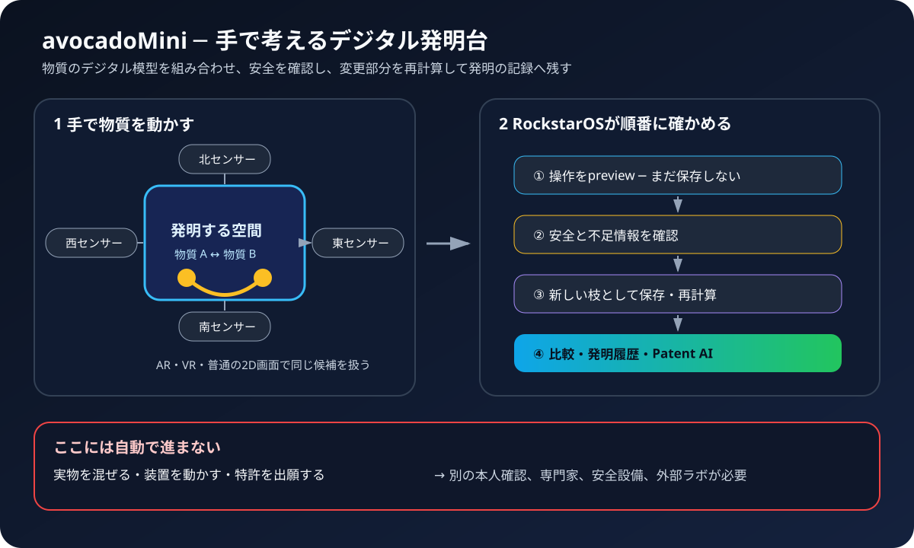

# RockstarOS × avocadoMini — 見て分かる空間発明システム設計書

版: 2.0 / 2026-09-18
状態: 実装チームが同じ製品を作るための正本
注意: 設計が完成した段階。端末、新材料、特許、量産が完成したという意味ではない。

---

# A. まず製品を理解する

## 1. これは何？

**avocadoMiniは、まだ存在しない材料を、手で考えるための「デジタル発明台」である。**

机の中央に、物質のデジタル模型が浮かぶ。利用者は模型を手で持ち、近付け、組み合わせ、離し、割合や作り方を変える。

RockstarOSは操作のたびに、次の四つを行う。

1. 何を変えたか記録する。
2. 危険情報や条件不足を確認する。
3. 変更した部分だけ計算し直す。
4. 有望な案をPatent AIへ渡せる形に整理する。

最初に扱うのは実物ではない。コンピューターの中にある物質の模型である。実物を混ぜたり装置を動かしたりするのは、別の承認を通過した外部ラボだけである。



## 2. 目の前にあるもの

上から見ると、基本形はこうなる。

```text
                         北センサー
                              ↓
                 ┌────────────────────┐
                 │                    │
西センサー  →    │   発明する空間      │    ←  東センサー
                 │  Invention Volume  │
                 │                    │
                 └────────────────────┘
                              ↑
                         南センサー

                    利用者はここへ手を入れる
```

四方向から見る理由は、片方の手や物質模型がもう片方を隠しても、別方向のセンサーで補えるからである。

利用者が見る方法は三つある。

| 方法 | 見え方 | 主な利用場面 |
| --- | --- | --- |
| AR | 現実の机に模型が重なって見える | avocadoMiniの標準体験 |
| VR | 発明空間へ入り、模型を大きく広げて見る | 複雑な候補や共同検討 |
| 2D | 普通の画面でドラッグして操作する | headsetなし、片手操作、確認作業 |

AR、VR、2Dは別製品ではない。同じprojectと同じ候補を、違う見方で操作する。

## 3. 一つの利用例

ここでは「軽くて熱に強い部品材料を考える」を例にする。説明用なので、物質は仮名のAとBを使う。

### 場面1 — 目的を決める

```text
┌─────────────────────────────────────┐
│ 新しい発明project                    │
│                                     │
│ 目標    軽くて熱に強い材料           │
│ 禁止    登録した禁止物質を使わない   │
│ 上限    温度・圧力・費用を設定       │
│ 成功    重さ、耐熱予測、再現性で比較 │
│                                     │
│              [発明空間を開く]        │
└─────────────────────────────────────┘
```

分からない項目をAIが勝手に埋めることはない。必要な条件がなければ、Zemaが質問して止まる。

### 場面2 — 物質を置く

```text
┌─────────────────────────────────────────────┐
│  A                                      B  │
│ [物質A]                               [物質B]│
│ lot A-03                              lot B-11│
│ 安全情報あり                          安全情報あり│
│                                             │
│              ＋ 新しい物質                  │
└─────────────────────────────────────────────┘
```

同じ名前でもlot、純度、由来が違えば別の入力として扱う。

### 場面3 — 手で近付ける

二つを近付けただけでは、まだ保存しない。半透明のpreviewを出す。

```text
     手で移動
 A  ─────────→  B

 [接続の候補]
 意味: 混合 / 積層 / 表面接触  ← どれかを選ぶ
 割合: A 60% / B 40%
 状態: まだ未確定
```

「くっつける」が何を意味するかを確認する。画面上で重なっただけで、化学結合したことにはしない。

### 場面4 — 安全確認

確定前にRockstarOSが確認する。

```text
安全確認
├─ SDSはあるか                         OK
├─ 危険性が不明ではないか             OK
├─ 禁止条件に触れていないか           OK
├─ 割合と単位が比較できるか           OK
├─ 想定温度・圧力が上限内か           OK
└─ 必要な資格や設備が決まっているか   未設定

結果: デジタル候補として保存できる
      実物実験には進めない
```

危険情報が足りない場合は赤い`BLOCKED`になる。警告を消して先へ進む機能は作らない。

### 場面5 — 新しい案として保存する

確定すると、元の案を消さずに枝分かれする。

```text
候補 01  Aだけ
   ├─ 候補 02  A 60% + B 40%  ← 今の案
   ├─ 候補 03  A 40% + B 60%
   └─ 候補 04  AとBを積層
```

失敗した案も消さない。「何を試して駄目だったか」が次の発明材料になるからである。

### 場面6 — 変更部分を再計算する

```text
変更: Bの割合 40% → 45%

再計算するもの
├─ 重さの予測
├─ 耐熱性の予測
└─ 接触面の予測

再計算しないもの
└─ 変更と関係のない候補・測定結果
```

結果には必ず出所を表示する。

| 表示 | 意味 |
| --- | --- |
| 人が入力 | 利用者が直接決めた |
| AI提案 | AIが候補を出した |
| 文献 | 既存資料に書かれている |
| 予測 | simulationが計算した |
| 実測 | 承認された実験で測った |

`予測`を`実測`のように見せてはいけない。

### 場面7 — 案を比べる

```text
┌─────────┬─────────┬─────────┐
│ 候補02   │ 候補03   │ 候補04   │
├─────────┼─────────┼─────────┤
│ 軽さ  A  │ 軽さ  B  │ 軽さ  B  │
│ 耐熱  B  │ 耐熱  A  │ 耐熱  A  │
│ 安全  黄 │ 安全  緑 │ 安全  黄 │
│ 根拠 予測│ 根拠 予測│ 根拠 文献│
└─────────┴─────────┴─────────┘
```

数値だけで自動決定しない。不確かさ、安全、費用、再現性を並べ、人が次の案を選ぶ。

### 場面8 — Patent AIへ渡す

Patent AIは次を一つの下書きにまとめる。

- 解決したい問題
- 選んだ構成と工程
- 人が考えた部分
- AIが提案した部分
- 文献、予測、実測の区別
- 既存技術と違う可能性がある部分
- 公開、共同作業、demoの履歴
- 専門家に確認してほしい点

Patent AIは特許性、法的発明者、権利帰属を決めない。自動出願、電子署名、料金支払もしない。

## 4. できること／できないこと

### できること

- 物質のデジタル模型を手で接続・分離する
- 割合、並び、工程条件を変えて別案を作る
- 危険情報や条件不足を先に見つける
- 変更した部分をsimulationへ渡す
- 人、AI、文献、予測、実測を分けて残す
- 失敗を含む発明過程を版管理する
- Patent AIや外部ラボへ渡す資料を準備する
- headsetがなくても2D画面で同じ仕事を行う

### できないこと

- cameraだけで現実の物質を変化させる
- 手のgestureだけで実験装置を動かす
- 危険情報が不明な案を安全と判定する
- simulation結果を実験成功として扱う
- AIだけで特許性や発明者を確定する
- 本人確認なしに秘密情報を外部へ送る
- 設計段階の端末を完成品として販売する

## 5. 三つの世界を混ぜない

```text
① 考える世界                 ② 計算・整理する世界
avocadoMini / AR / VR / 2D  →  Safety / Simulation / Patent AI
       │                              │
       │ 仮説                         │ 予測・下書き
       └──────────┬───────────────────┘
                  │ 人による別承認
                  ↓
③ 現実で確かめる世界
資格を持つ人 / 適切な設備 / 外部ラボ / 署名付き測定結果
```

この境界が製品の最重要原則である。①と②がどれだけ滑らかでも、③を自動的に許可しない。

---

# B. 操作と画面を設計する

## 6. 手の操作

| 動作 | その場の反応 | 確定後に起きること |
| --- | --- | --- |
| つまむ | 対象が光る | まだ変更しない |
| 持って動かす | 半透明で追従する | まだ変更しない |
| 二つを近付ける | 接続previewを出す | まだ変更しない |
| 一定時間合わせる | 意味と条件を確認する | 新しい候補branchを作る |
| 引き離す | 分離previewを出す | 分離した新branchを作る |
| 手首を回す | 向きや工程をpreviewする | 確認後に新branchを作る |
| 手のひらを向けて止める | 保留中の操作を止める | 候補は変えない |
| undo / redo | 前後の案を表示する | 履歴は削除しない |

手が隠れた、別人の手が入った、暗い、反射が強い、範囲外、センサーが欠けた場合は確定しない。画面には「なぜ確定しなかったか」を普通の言葉で表示する。

## 7. 画面の構成

```text
┌────────────────────────────────────────────────────────┐
│ Project名     保存済み     Offline     camera作動中      │
├────────────┬───────────────────────────┬───────────────┤
│ 物質一覧    │                           │ 今の候補       │
│            │      発明する空間          │ A 60 / B 40   │
│ A          │                           │ 安全: 要確認   │
│ B          │        A  ↔  B            │ 根拠: 予測     │
│ C          │                           │               │
│            │                           │ [比較する]     │
│ +追加      │                           │ [AIへ相談]     │
├────────────┴───────────────────────────┴───────────────┤
│ 履歴: 01 目的設定 → 02 A追加 → 03 B追加 → 04 接続       │
└────────────────────────────────────────────────────────┘
```

常に見える情報:

- 今どのprojectと候補を操作しているか
- 保存済みかpreviewか
- 安全状態
- 情報が人・AI・予測・実測のどれか
- cameraや外部接続が動いているか
- 戻る、止める、2Dへ切り替える方法

## 8. 状態と色

色だけに頼らず、文字と形も一緒に使う。

| 状態 | 表示 | 意味 |
| --- | --- | --- |
| PREVIEW | 点線＋「未確定」 | 手を離しても保存されない |
| READY | 青＋「確定できます」 | 必須情報が揃っている |
| NEEDS_INFO | 黄＋「情報が必要」 | 質問へ答えるまで計算しない |
| BLOCKED | 赤＋停止記号 | 安全上または契約上進めない |
| CALCULATING | 動く輪＋「計算中」 | 操作は続けられる |
| PREDICTED | 紫＋「予測」 | 実測ではない |
| MEASURED | 緑＋「実測」 | receiptの範囲だけ確認済み |
| STALE | 灰＋「古い結果」 | 入力が変わったので使えない |

## 9. 誰も置いていかない操作

- 座ったまま使える
- 片手で使える
- hand、controller、touch、mouse、keyboardを選べる
- 音声内容には字幕を付ける
- 色だけで状態を伝えない
- 動きを減らすmodeを持つ
- 文字倍率と高contrastを選べる
- XRが使えなくても2Dで主要作業を完了できる
- 専門用語にはその場で短い説明を出す

---

# C. 製品の中身を設計する

## 10. 全体のつながり

```text
利用者
  ↓ 目的と手の操作
avocadoMini
  ├─ 四方向sensor
  ├─ 手の位置をまとめるSensor Fusion
  └─ AR / VR / 2D画面
  ↓ 「こう変えたい」という提案だけ
Material Invention Core
  ├─ 物質とlot
  ├─ 候補とbranch
  ├─ 工程条件
  ├─ 安全状態
  └─ 根拠と履歴
  ├────────→ Safety Gate
  ├────────→ Simulation Provider
  ├────────→ Patent AI
  └────────→ 承認された外部ラボ

RockstarOS
  └─ 利用者、権限、仕事、停止、保存、費用、receiptを全体で管理
```

## 11. 各部品の責任

| 部品 | 一言でいう役割 | やってはいけないこと |
| --- | --- | --- |
| RockstarOS | 全体の交通整理と安全管理 | UIやAIの申告だけで権限を与える |
| avocadoMini | 手の動きを操作候補にする | 実験装置を直接動かす |
| Material Invention Core | 発明候補の正しい記録を持つ | 予測を実測へ書き換える |
| Zema | 目的、質問、進捗、結果を一つの仕事にする | 足りない条件を勝手に決める |
| Sky | 材料DB、計算、Patent AI、ラボを接続する | 未確認Providerを安全と表示する |
| Simulation | 性能を予測する | 成功や安全を保証する |
| Patent AI | 発明説明と比較資料を下書きする | 特許性・発明者・権利を確定する |
| 外部ラボ | 承認された実物試験を行う | 承認外の工程や量へ変更する |

## 12. Coreが保存する記録

| 記録 | 普通の言葉 | 最低限必要な内容 |
| --- | --- | --- |
| MaterialRecord | 物質の名札と履歴 | 名前、組成、状態、純度、由来、lot、安全情報 |
| CompositionCandidate | 組み合わせ案 | 物質、割合、関係、元候補、版 |
| ProcessRecipe | 作り方案 | 順番、温度、圧力、時間、設備 |
| SafetyAssessment | 安全確認表 | 不明点、blocker、資格、廃棄、規制 |
| SimulationResult | 計算予測 | model版、入力、予測、誤差、適用範囲 |
| ExperimentReceipt | 実験の受領証 | 実施者、設備、校正、測定、署名 |
| SpatialSceneManifest | 空間表示の設計図 | 候補との結び付き、座標、安全表示 |
| SpatialInteractionEvent | 手操作の記録 | sensor、校正、動作、自信度、対象、提案 |
| InventionEventLedger | 発明過程の時系列 | 人／AI、変更、結果、失敗、共有範囲 |
| PatentAiPacket | 知財整理用の束 | 対象履歴、構成、効果、引用、公開状況 |

## 13. 一回の操作が処理される順番

```text
1. 手を認識
   ↓ 認識できない → 理由を表示して終了
2. previewを表示
   ↓ 利用者が取消 → 保存せず終了
3. project・候補・sceneの版を照合
   ↓ 古い／別project → VIEW_ONLY
4. 「混合・積層・接触」等の意味を確認
5. 新しい候補branchを一時作成
6. 単位・禁止条件・安全情報を検査
   ↓ BLOCKED → 記録だけ残し計算・実験へ進めない
7. 操作eventと候補を保存
8. 影響する計算だけ依頼
9. 結果をPREDICTEDとして保存
10. 比較画面とPatent AI用履歴を更新
```

同じ操作を二重に受け取っても、候補を二重作成しない。通信が切れて結果が分からない場合は、成功・失敗を推測せず`UNKNOWN`で止めて照合する。

## 14. センサー設計

四台の具体的なcamera方式やメーカーはまだ決めない。RGB、depth、IR等をprototypeで比較する。

処理の順番:

1. sensor本体とfirmwareを識別する。
2. 各cameraの特性と四台の位置関係を校正する。
3. frameの時刻を合わせる。
4. 端末内で手のjointを推定する。
5. 四方向の結果を一つにまとめる。
6. confidenceが不足していれば確定しない。
7. gesture候補をCoreへ送る。raw映像は送らない。

prototypeの仮目標:

- 操作範囲: 一辺0.45〜0.8 mの机上
- 手を動かしてから表示反応まで: p95 100 ms以下を目標
- commit confidence: 0.85から試験し、誤操作測定後に決め直す
- 四方向の時刻差: 1 display frame以内を目標
- 一台が見失っても、誤確定より停止を選ぶ

privacy:

- raw camera映像は既定保存しない
- room mesh、eye、hand、voice、身体寸法、正確な位置も既定保存しない
- camera作動中は物理LED等で知らせる
- 物理shutterまたは同等の停止手段を持つ
- 外部送信は対象、目的、送信先、保存期間を表示して別同意を取る

## 15. 安全と権限

次の場合はfail closed、つまり分からないまま進めない。

- SDSがない
- 危険性が不明
- 禁止物質または禁止危険分類
- 割合の単位が一致しない
- 温度、圧力、設備が許可範囲外
- 廃棄、輸送、規制条件が不明
- scene、marker、project、候補の版が一致しない
- sensor校正切れ、時刻ずれ、低confidence

XR、AI、cameraが持たない権限:

- Core DBへの直接書込み
- Walletの直接操作
- 任意shellやroot
- 実験装置の包括制御
- 物理実験の最終承認
- 外部共有の包括承認
- Patent出願、電子署名、料金支払

物理実験へ進むには、候補、量、工程、設備、実施者、停止条件、費用、廃棄、法規、承認内容を固定し、gestureとは別の信頼済み画面で本人確認する。

## 16. Offline、共有、復旧

通信なしで行えること:

- 保存済み物質・候補・工程を見る
- 手または2Dで操作する
- schema、単位、安全条件を検査する
- 端末内modelで可能な計算をする
- annotationと履歴を保存する

外部simulation、特許検索、ラボ予約は`WAITING_FOR_PROVIDER`で止める。再接続後、同じrequestか、結果が改変されていないかを照合する。

共同作業ではviewer、annotator、facilitatorを分ける。司会者をowner、実験承認者、法的発明者へ自動昇格させない。共有するproject、候補、相手、目的、期限を選び、秘密配合を含む公開linkを既定生成しない。

---

# D. 作る人が合流する

## 17. 現在どこまである？

| 項目 | 現在地 | 次の証拠 |
| --- | --- | --- |
| 製品の全体設計 | この文書で統合済み | 利用者5人が説明後に操作を言い直せる |
| 二物質sandbox Core | 実装済み、9 test | Zemaとsimulation fixtureへ接続 |
| XR scene契約 | 設計済み | 同じCore入力から同じsceneを生成 |
| hand event契約 | 設計済み | 合成poseで接続・分離を再現 |
| 四方向sensor | 設計のみ | tabletop prototypeで誤操作を測る |
| AR／VR表示 | 未実装 | view-only prototype |
| 2D fallback | 設計のみ | 同じ主要作業を2Dで完了 |
| simulation接続 | 未実装 | 署名またはhash付き合成receipt |
| Patent AI接続 | 未実装 | sourceを混ぜないpacket |
| 外部ラボ | 未接続 | 資格・設備・安全・契約を独立受入 |
| 新材料・特許・量産 | 未実証 | 実験と専門家判断が必要 |

## 18. 実装の順番

### Phase 1 — 画面だけで理解できる試作品

- 2Dで物質AとBを表示する
- dragで接続previewを出す
- 混合／積層／接触を選ぶ
- 安全状態と根拠を表示する
- branchを作って比較する

合格: 初見の利用者が説明なしで「これは実物操作ではなく仮説作成」と理解できる。

### Phase 2 — Coreと決定的につなぐ（MAT05）

- Core graphから毎回同じscene digestを作る
- lot、工程版、安全状態をsceneへ結び付ける
- 合成poseでconnect、separate、undoを作る
- stale、別project、改変、low confidenceを拒否する

合格: 同じ入力は同じ出力になり、古いsceneから新しい候補を変更できない。

### Phase 3 — 一台cameraから四方向へ（MAT06-A）

- 最初に一台で誤操作を測る
- 次に四方向rig、校正、時刻同期を作る
- 遮蔽、別人、暗さ、反射、手袋、範囲外を試す
- privacy indicatorと物理停止を受け入れる

合格: 速さより、誤確定せず理由を説明して止まれる。

### Phase 4 — 計算とPatent AI（MAT06-B）

- 変更graphから必要な計算だけ選ぶ
- model、版、入力、費用、送信範囲を固定する
- stale、cancel、unknown resultを扱う
- 選択したevent範囲からPatent AI packetを作る

合格: 人、AI、文献、予測、実測を混ぜず、別lotや別modelの結果を流用しない。

### Phase 5 — 外部ラボ

非危険な合成fixtureから始める。契約、資格、設備、校正、事故責任、data保持、知財、廃棄、法規を確認し、物理実験を別gateで受け入れる。

## 19. 役割別の最初の仕事

| 参加する人 | 最初に作るもの | 最初の合格条件 |
| --- | --- | --- |
| Product / UX | 場面1〜8のclickable 2D prototype | 5人中5人が「予測と実測」を区別できる |
| Visual / UI | PREVIEW、BLOCKED、PREDICTED、MEASURED表示 | 色なしでも状態が分かる |
| XR / 3D | 物質2個と安全overlayのview-only scene | Core IDと表示対象が一致する |
| Sensor / CV | 合成four-view pose fixture | sensor欠落・低confidenceを拒否する |
| Core / Backend | graph→scene pure projection | 同じ入力から同じdigest |
| Material / Simulation | model manifestと合成receipt | 適用範囲と誤差を必ず表示する |
| AI / Agent | Zemaの質問と差分計算依頼 | 不足条件を勝手に埋めない |
| Patent / Legal | PatentAiPacket review | 発明者・特許性を断定しない |
| Security / Privacy | camera data flowとthreat model | raw映像が既定保存・送信されない |
| QA / Safety | 正常・異常・停止test matrix | unknown、stale、blockedを成功にしない |

## 20. 初参加者の最初の1時間

1. この文書のAだけを読む。
2. 場面1〜8を、自分の言葉で説明する。
3. [作業ストリーム](workstreams/11-material-invention-avocado-mini.md)を開く。
4. 上の役割表から一つ選ぶ。
5. [現在地](#17-現在どこまである)で未実装を確認する。
6. [安全と権限](#15-安全と権限)を読む。
7. MAT05またはMAT06の小さな成果物を一つ選ぶ。
8. 実装、fixture、simulation、実機、実材料のどこまでを合格させるか先に書く。

## 21. 製品全体の合格条件

### 説明の合格

- 初見の人が「デジタル発明台」と説明できる
- avocadoMiniとRockstarOSの違いを説明できる
- デジタル操作、simulation、実物実験の境界を説明できる
- 設計完成と製品完成を混同しない

### Softwareの合格

- 同じ入力と版から同じ候補・scene digestを作る
- project、owner、lot、工程、modelの取り違えがない
- 二重eventを二重反映しない
- stale、unknown、blockedを成功にしない
- 2Dでも主要作業を完了できる

### Hardware／XRの合格

- 校正切れ、sensor欠落、時刻ずれ、遮蔽を検出する
- 誤確定率、取消率、遅延を実測する
- raw映像が既定保存されない
- cameraが装置を直接制御しない
- privacy表示と物理停止が働く

### Research／Patentの合格

- 予測と実測を分ける
- 実験条件と測定receiptを再現できる
- 人とAIの寄与を追跡できる
- Patent AI出力を専門家がreviewできる
- 未検証の安全性、特許性、量産性を断定しない

## 22. 決まっていること／決まっていないこと

### 決まっている

- OS名はRockstarOS
- 端末concept名はavocadoMini
- Material Invention Coreが記録の正本
- avocadoMiniはCoreの標準操作体験
- 四方向sensorと2D fallbackを持つ
- 操作は仮説branchを作り、元を破壊しない
- simulationは実測ではない
- gestureは物理実験や出願の承認ではない
- Patent AIは補助で、法律判断を確定しない

### prototypeで決める

- sensorの種類、解像度、配置、高さ、メーカー
- AR表示方式とheadset候補
- 手追跡modelとconfidence閾値
- 実際の遅延、誤操作、疲労、酔いの合格値
- 最初のsimulation分野とProvider
- 最初の対象材料、外部ラボ、法域
- 端末価格、販売方法、量産構成

---

# E. 用語と詳細仕様

## 23. 最小用語集

| 言葉 | この設計での意味 |
| --- | --- |
| デジタルツイン | 物質の名前、lot、状態、安全、結果を結び付けたコンピューター上の模型 |
| Core | 正しい記録と規則を持つ中心部分 |
| branch | 元を消さずに作る別案 |
| scene | AR、VR、2Dへ表示する一場面 |
| gesture | 手の形や動きから推定した操作候補 |
| confidence | センサー推定の確からしさ。真実の保証ではない |
| simulation | 現実の振る舞いを計算で予測する仕組み |
| provenance | 情報を誰が、何から、どの版で作ったかという出所 |
| receipt | 実行内容と結果を後から照合する記録 |
| stale | 元データが変わり、古くてそのまま使えない状態 |
| fail closed | 分からない場合、安全側に止めること |
| Patent AI | 発明説明や先行技術比較を助けるAI。法律判断者ではない |

## 24. 変更してはいけない初期境界

- `physicalExecutionAllowed = false`
- `equipmentControlAllowed = false`
- gestureは`HYPOTHESIS_ONLY`
- simulationは実験証明ではない
- Patent AIは特許性・発明者・自動出願を確定しない
- raw cameraとbiometric streamは既定保存・送信しない
- blocked safety overlayを隠さない
- sceneが古い、不一致、追跡不能なら`VIEW_ONLY`へ落とす

## 25. 機械可読契約と詳細設計

- 製品要望: [product-baseline.md](product-baseline.md)
- Material Invention Core詳細: [material-invention-core.md](material-invention-core.md)
- VR／AR共通詳細: [material-invention-xr.md](material-invention-xr.md)
- avocadoMini端末詳細: [avocado-mini-spatial-invention.md](avocado-mini-spatial-invention.md)
- 作業入口: [workstreams/11-material-invention-avocado-mini.md](workstreams/11-material-invention-avocado-mini.md)
- Material sandbox契約: [`contracts/material-invention.json`](../contracts/material-invention.json)
- XR scene契約: [`contracts/material-invention-xr.json`](../contracts/material-invention-xr.json)
- hand event契約: [`contracts/avocado-mini-spatial-interaction.json`](../contracts/avocado-mini-spatial-interaction.json)
- XR安全policy: [`data/material-invention-xr-policy.json`](../data/material-invention-xr-policy.json)

## 26. この文書の使い方

- 初めて知る人: Aだけ読む
- 画面を作る人: AとBを読む
- 技術を作る人: B、C、Dを読む
- 安全・知財担当: 4、5、15、21、24を読む
- project責任者: 全章と作業ストリームを読む

新しい仕様を追加するときは、「利用者のどの場面が変わるか」を先にAへ反映し、その後に画面、Core、契約、test、進捗を更新する。難しい仕様だけが増え、利用者の体験を説明できなくなる変更は受け入れない。
