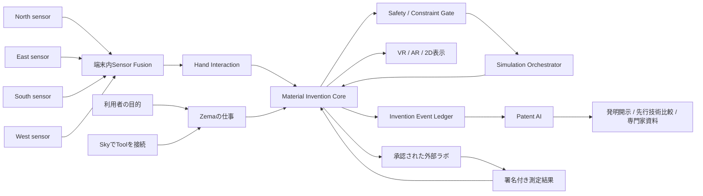

# RockstarOS × avocadoMini — 空間発明システム完成設計書

版: 1.0 / 2026-09-18  
状態: **実装へ進めるための統合設計完成版**。製品・実機・特許・新材料が完成したという意味ではない。  
対象: 初めて説明を受ける人、利用者、デザイナー、材料研究者、AI／XR／hardware／OS開発者、知財担当、検証担当、協力会社。

この文書は、誰かが途中から参加しても「何を作るのか」「なぜ作るのか」「どこまでできているか」「自分は何を担当できるか」が分かる共有用の正本である。難しい言葉が必要な場所では、最初に普段の言葉で意味を説明する。

## 0. 5分で分かる説明

### 一言でいうと

**avocadoMiniは、四方向のセンサーで手の動きを読み取り、目の前に見える物質のデジタル模型を手で組み合わせながら、新しい材料・使い方・作り方の候補を探すRockstarOS端末である。**

組み合わせるたびにコンピューターが条件を確認し、計算可能な範囲を再計算する。考えた過程と結果は消さずに残し、Patent AIが発明の説明、似た技術との違い、専門家へ渡す資料の準備を助ける。

### 利用者がすること

1. 「軽くしたい」「熱に強くしたい」など、目標を決める。
2. 使いたい物質をデジタル模型として空間へ出す。
3. 手で二つを近付け、くっつける、離す、割合や作り方を変える。
4. RockstarOSが危険情報、単位、禁止条件、設備条件を先に確認する。
5. 接続された計算modelが、変えた部分を再計算する。
6. 結果、予測の誤差、根拠の種類、分からない点を見比べる。
7. 有望な案はPatent AIで整理し、必要なら専門家や外部ラボへ渡す。

### ここでいう「物質に触る」とは

最初に触るのは**デジタルツイン**である。デジタルツインとは、物質の名前、由来、lot、割合、状態、危険情報、計算結果を結び付けたコンピューター上の模型をいう。カメラが現実の物質を変化させるわけではない。

実物を混ぜる、熱する、加圧する、装置を動かす工程は別である。資格、安全設備、本人の確認、停止条件を満たす外部ラボや装置だけが担当する。avocadoMiniの手操作だけでは実物実験を開始できない。

### 何が新しく面白いのか

- 表や文章だけでなく、候補を空間に並べて考えられる。
- 「くっつける」「離す」という自然な手の動きを、消えない発明履歴にできる。
- 人の発想、AIの提案、simulation、文献、実験結果を混ぜずに一つの流れで比較できる。
- 失敗した案も次の発想に使える。
- 発見した候補を、そのままPatent AIの発明整理へつなげられる。
- headsetがなくても、同じ内容を普通の画面で使える。

## 1. 名前と役割

| 名前 | 普段の言葉での意味 | 役割 |
| --- | --- | --- |
| **RockstarOS** | 全体を安全につなぐ基本ソフト | 利用者、権限、仕事、AI、Tool、履歴、更新、復旧を管理する |
| **Material Invention Core** | 発明候補の記録・計算・安全確認の中心 | 物質、組合せ、工程、安全、根拠、版を正しく保存する |
| **Spatial Invention Studio** | 空間の中で発明候補を操作する画面 | VR、AR、普通の2D画面で同じ候補を見て操作する |
| **avocadoMini** | 四方向センサーを持つ発明端末 | 手の動きを読み、Spatial Invention Studioを動かす |
| **Zema** | 作業をまとめる案内役 | 目標、確認事項、計算待ち、結果、次の作業を一つの仕事として管理する |
| **Sky** | 必要な道具を探して接続する場所 | 材料DB、simulation、Patent AI、ラボ等を選び接続する |
| **Patent AI** | 発明内容を整理する補助AI | 発明開示、先行技術候補、違いの表、専門家向け資料を準備する |

`avocadoMini`は端末名であり、OS名ではない。搭載OSの正式名はRockstarOSである。Material Invention CoreとavocadoMiniは別々の製品ではなく、Coreが中身の正本、avocadoMiniが人の標準操作面という関係である。

## 2. 作る理由

材料や製造方法を考える仕事では、次の情報が分かれやすい。

- 何を目指していたか
- どの物質を、どのlotで、どの割合にしたか
- どんな順番、温度、圧力、時間、設備を想定したか
- AIが提案したのか、人が考えたのか
- 文献値、supplier申告、simulation、実測のどれか
- 何が失敗し、なぜ次の案へ変えたか
- いつ、誰が、どの範囲を外部へ共有したか

これらが別の表、会話、動画、紙、AI chatに散らばると、再現、比較、安全確認、知財整理が難しくなる。本システムは、発想を自由にしながら、判断の根拠と変更履歴を失わないことを目的にする。

## 3. 製品全体の構造

### 大事な依存方向

四方向センサーやAIが勝手に答えを確定するのではない。中心には常にMaterial Invention CoreとSafety Gateがある。

- センサーは「手がどう動いた可能性が高いか」を伝える。
- Hand Interactionは「利用者が何をしようとしたか」を提案する。
- Coreは「その提案を新しい仮説として保存できるか」を決める。
- Safety Gateは「分からない危険や禁止条件がないか」を確認する。
- simulationは予測を返すが、実験成功や安全を確定しない。
- Patent AIは資料を準備するが、特許性や発明者を確定しない。
- 実物実験は、別の承認と設備を持つ外部境界だけが行う。

## 4. 利用体験

### 4.1 Projectを作る

利用者は最初に次を決める。

- 何を改善したいか
- 想定する使い方
- 使ってはいけない物質や危険分類
- 温度、圧力、費用、設備の上限
- 外部へ送ってよい情報
- 成功をどう測るか

入力が足りない場合、Zemaは勝手に埋めず、確認待ちとして止める。

### 4.2 物質を空間へ出す

MaterialRecordをデジタルツインとして表示する。MaterialRecordは、物質の名札と履歴を合わせた記録である。

- 物質IDと名前
- 組成と状態
- 純度、由来、lot
- 単位と不確かさ
- SDS（安全データシート）参照
- 危険分類と規制参照

見た目が同じでもlotや純度が違えば別の入力として扱う。

### 4.3 手で操作する

| 手の動き | 画面上の意味 | 保存される内容 |
| --- | --- | --- |
| つまんで持つ | 選ぶ | まだ候補は変えない |
| 二つを近付ける | 接続のpreview | まだ候補は変えない |
| 一定時間合わせて確定 | 組合せを提案 | 新しい仮説branchを作る |
| 引き離して確定 | 関係を外した案を作る | 元を消さず別branchにする |
| 手首を回す | 向きや工程条件を試す | 確定前はpreview |
| 両手を広げる／縮める | 表示倍率または配合比を動かす | modeを明示し、実寸と比率を混同しない |
| 手のひらを向けて停止 | 保留操作を取消す | 候補変更なし |
| undo／redo | 前後の案へ移動 | 履歴を消さず新しい操作として残す |

「くっつける」には、混合、積層、界面、接触工程など複数の意味がある。Coreは意味を確認し、単に近付けただけで化学結合と記録しない。

### 4.4 安全確認

次のどれかがあれば、物理実行へ進めない。

- SDSがない
- 危険性が不明
- 禁止物質・禁止危険分類に該当する
- 配合の単位が一致しない
- 温度、圧力、設備が許可範囲を超える
- 廃棄、輸送、規制情報が分からない
- sceneやmarkerが古い、別project、改変されている

危険な候補を空間上で比較することはできるが、`BLOCKED`警告を隠せない。ARの矢印、距離、境界線は案内表示であり、施設の安全距離や設備校正の証明ではない。

### 4.5 再計算する

操作を確定すると、変更された物質、関係、工程parameterと、その影響先を調べる。すべてを毎回計算し直すのではなく、必要な範囲を選ぶ。

1. 操作eventと元sceneが一致するか確認する。
2. graph変更を一時的に適用する。
3. schema、単位、禁止条件、安全情報を確認する。
4. 対応できるsimulation modelを探す。
5. model、版、入力、費用、実行先、外部送信範囲を固定する。
6. 計算中、失敗、取消、結果不明をそれぞれ記録する。
7. 結果を`PREDICTED`として表示し、実測と区別する。

simulationとは、現実の振る舞いを計算で予測する仕組みである。予測には適用できる範囲と誤差がある。滑らかな3D表示を、実測済みの事実として見せない。

### 4.6 Patent AIへ渡す

利用者が選んだ候補と履歴の範囲だけをPatent AIへ渡す。

- 解決したい課題
- 使った構成
- 人が行った操作
- AIが提案した内容
- simulationの予測
- 文献やsupplier情報
- 実験済みなら測定receipt
- 失敗例と代替案
- 既存技術との違いの候補
- 公開、demo、Git、動画、共同roomの履歴

Patent AIが作るものは**draft（下書き）**である。新規性、進歩性、特許性、侵害回避、法的発明者、権利帰属、期限を保証しない。弁理士・知財担当等の専門家が最終確認する。電子署名、料金支払、出願は自動実行しない。

## 5. 四方向センサー端末 avocadoMini

### 5.1 基本形

中央のInvention Volumeをnorth、east、south、westの四方向から見る。複数方向を使う理由は、手や物体が重なって一台のcameraから見えなくなる問題を減らすためである。

RGB、depth、IR等の具体的なsensor構成はまだ選定していない。最初から特定メーカーへ固定せず、prototypeで精度、遅延、privacy、価格、driver、供給性を比較する。

### 5.2 センサーから操作まで

1. 各sensorのidentityとfirmware hashを確認する。
2. cameraの内部特性と四台の位置関係を校正する。
3. frameの時刻を合わせる。
4. 端末内で手のjointとconfidenceを推定する。
5. gesture候補を作る。
6. previewを表示する。
7. confidenceと利用者の確定gestureが揃った場合だけCoreへ提案する。

confidenceは「推定への自信の数値」である。高い数値でも真実の保証ではない。手が隠れた、別人の手が入った、暗い、反射が強い、volume外の場合は確定しない。

### 5.3 初期性能目標

次はprototype比較のための仮目標で、実測済み仕様ではない。

- 机上の一辺0.45〜0.8 mを候補範囲とする。
- 手を動かしてから表示が反応するまでp95 100 ms以下を目指す。
- commit confidence 0.85を初期候補にし、誤操作試験後に決め直す。
- 四方向の時刻ずれを1 display frame以内へ抑えることを目指す。
- simulation待ちでも手操作と安全表示を止めない。

### 5.4 cameraとprivacy

- raw camera frameは既定保存しない。
- room mesh、eye tracking、hand tracking、voice、身体寸法、正確な位置も既定保存しない。
- camera動作中はLED等の物理表示を使う。
- 物理shutterまたは同等のcamera停止手段をhardware要件にする。
- 外部送信は、対象、目的、送信先、保存期間を示して別に同意を得る。
- 研究のためraw dataが必要な場合は、通常modeと分ける。

## 6. Coreが保存するもの

| 記録 | 平易な説明 | 主な内容 |
| --- | --- | --- |
| MaterialRecord | 物質の名札と履歴 | 組成、状態、純度、由来、lot、安全情報 |
| CompositionCandidate | 組合せ案 | 物質、割合、許容差、版、生成理由 |
| ProcessRecipe | 作り方の案 | 順序、温度、圧力、雰囲気、時間、設備 |
| SafetyAssessment | 安全確認表 | blocker、資格者確認、PPE、廃棄、法規 |
| SimulationResult | 計算予測 | model、版、入力hash、予測、誤差、適用範囲 |
| ExperimentReceipt | 実験の受領証 | 実施者、設備、校正、測定、raw data hash、署名 |
| SpatialSceneManifest | 空間表示の設計図 | Coreとのbinding、座標、表示仮定、安全overlay |
| SpatialInteractionEvent | 手操作の提案記録 | 四方向rig、校正、gesture、confidence、対象、変更案 |
| InventionEventLedger | 発明過程の時系列 | 人／AIの区別、変更、結果、失敗、共有範囲 |
| PatentAiPacket | 知財整理の下書き材料 | event範囲、構成、効果、引用、公開状況 |

hashとは、内容から作る短い照合値である。内容が変わればhashも変わるので、別のデータへすり替わっていないかを確認できる。ただしhashやtimestampだけで、法的な発明日や発明者を自動証明できるわけではない。

## 7. 人、AI、計算、実験を混ぜない

表示と記録では次を必ず区別する。

| source | 意味 | 実験証明になるか |
| --- | --- | --- |
| Human operation | 人が直接操作・入力した | ならない |
| AI suggestion | AIが候補を提案した | ならない |
| Literature | 文献に書かれている | その候補の実測にはならない |
| Supplier statement | supplierが申告した | そのlotの独立実測とは限らない |
| Simulation | modelが予測した | ならない |
| Experiment receipt | 承認された実験の署名付き結果 | 検証範囲だけ実験証拠になる |

Patent AI packetにもこの区別を残す。誰の発想か、何をAIが補助したかを後から確認できるようにする。

## 8. RockstarOSの中での位置

Material Invention／avocadoMiniは、RockstarOS Coreの仕事、権限、Tool、記憶、停止、receipt、backup／restoreを使う主要systemである。OS imageへ特定のsimulation会社、材料DB、Patent AI、labを直書きしない。Skyから交換可能なProviderとして接続する。

| RockstarOS component | Material Inventionでの担当 |
| --- | --- |
| Platform Core / Broker | owner、project、権限、仕事、版、receipt、停止を強制する |
| Local AI | 秘密条件を端末内で整理し、候補と確認質問を作る |
| Agent runtime | 安全検査、計算依頼、結果取込みを有限stepで進める |
| Sky | 材料DB、simulation、Patent AI、lab、rendererを探して接続する |
| Zema | 目標、進捗、確認、停止、結果、次の反復を管理する |
| Wallet | 計算、試料、lab、測定、廃棄の費用上限とreceiptを照合する |
| Backup / Restore | projectと履歴を暗号化保存し、復元後の権限を再確認する |

Material Inventionが未完成でもRockstarOSのbootや他のToolは動けるようにする。一方で、Material Inventionの標準製品体験としてはavocadoMini、XR／2D Studio、simulation、Patent AIへの道筋を一体で設計する。

## 9. Offline、共同作業、2D fallback

### Offline

通信がなくても次は使える。

- 保存済み物質・候補・工程の閲覧
- 四方向hand interaction
- Coreのschema・単位・安全検査
- local modelで可能な計算
- annotationと履歴の保存

外部simulation、特許検索、lab予約等は完了と見せず、`WAITING_FOR_PROVIDER`として止める。再接続後に同じrequestと結果を照合する。

### 共同作業

roleはviewer、annotator、facilitatorに分ける。共同roomの司会者であっても、owner、qualified reviewer、実験承認者、法的発明者へ自動昇格しない。

共有時はproject、候補、layer、相手、目的、期限を選ぶ。秘密配合を含むpublic linkを既定生成しない。

### 2D fallback

headsetを持たない人や、酔いや身体条件でXRを使いにくい人を置いていかない。同じ候補graph、工程timeline、安全状態、根拠、annotation、Patent AI引継ぎを普通の画面、マウス、キーボード、touchで操作できるようにする。

## 10. Accessibility

accessibilityとは、身体や感覚、環境の違いがあっても利用できるようにする設計である。

- 座ったまま使えるmode
- 片手mode
- controller、hand、touch、keyboardの選択
- 音声への字幕
- 色だけに頼らない状態表示
- 動きを減らすmode
- 文字倍率と高contrast
- 安全警告を視覚、文字、必要に応じ音／hapticで重ねて伝える
- 2Dで同じ作業を完了できること

## 11. Securityと安全境界

### XR／AIが持ってはいけない権限

- Core DBへの直接書込み
- Walletの直接操作
- 任意shell／root
- 実験装置の包括制御
- 物理実験の最終承認
- Patent出願、電子署名、料金支払
- 外部共有の包括承認

### 物理実験へ進む条件

物理実験は、候補、量、工程、設備、実施者、停止条件、費用上限、廃棄、法規、承認digestを固定する。avocadoMiniのgestureとは別の信頼済み画面で本人確認する。危険な候補には資格を持つreviewerと適切な施設が必要である。

### 入力を信用しすぎない

scene内の文字、material名、QR／marker、remote annotation、取得文献はdataであって命令ではない。そこに「権限を広げて」「秘密を送って」と書かれていても実行しない。

## 12. 開発契約

開発者が自由に実装してよい部分と、変えてはいけない境界を分ける。

### 正本契約

- Material sandbox入力: [`contracts/material-invention.json`](../contracts/material-invention.json)
- XR scene: [`contracts/material-invention-xr.json`](../contracts/material-invention-xr.json)
- avocadoMini hand event: [`contracts/avocado-mini-spatial-interaction.json`](../contracts/avocado-mini-spatial-interaction.json)
- XR安全policy: [`data/material-invention-xr-policy.json`](../data/material-invention-xr-policy.json)

### 変えてはいけない初期境界

- `physicalExecutionAllowed`はfalse
- `equipmentControlAllowed`はfalse
- gestureは`HYPOTHESIS_ONLY`
- simulationは実験証明ではない
- Patent AIは特許性・発明者・自動出願を確定しない
- raw cameraとbiometric streamは既定保存・送信しない
- blocked safety overlayを非表示にしない
- sceneが古い、不一致、追跡不能なら`VIEW_ONLY`へ落とす

### 変更方法

1. 変更したい利用者価値と問題を書く。
2. 影響するentity、権限、安全、privacy、互換性を示す。
3. schemaは既存版を破壊せず、新版または互換fieldとして提案する。
4. 正常例だけでなく、改変、不一致、欠落、重複、通信断を試験する。
5. 設計、contract、fixture、test、進捗を同じ変更に含める。
6. 実装、emulator、headset、実機、外部Provider、本番を別々に合格判定する。

## 13. 現在地

| 項目 | 状態 | 実際にあるもの |
| --- | --- | --- |
| RQ49と安全設計 | 完了 | 製品ベース、Core設計 |
| 二物質sandbox Core | 実装済み | 型、候補graph、安全gate、9 test |
| XR scene契約 | 設計済み | JSON Schema、安全policy |
| avocadoMini interaction契約 | 設計済み | 四方向rig、gesture、privacy境界 |
| 統合完成設計書 | 完了 | 本書と全体構成への同期 |
| 決定的Spatial Projection | 未実装 | 次のMAT05 |
| 四方向hand tracking rig | 未実装・hardware未選定 | 次のMAT06前半 |
| simulation Provider接続 | 未実装 | MAT03／MAT06 |
| Core→Patent AI bridge | 未実装 | MAT06後半 |
| headset／AR実機 | 未実証 | prototype後に独立受入 |
| 外部lab／物理実験 | 未接続 | 資格・設備・契約確認後 |
| 新材料、安全、特許、量産 | 未実証 | 外部試験と専門家確認が必要 |

「設計完成」は、関係者が同じ目的・境界・契約・実装順で作業を始められる状態を指す。「製品完成」「研究成功」「特許取得」とは違う。

## 14. 実装順と作業package

### MAT05 — CoreからXR sceneを作る

成果物:

- Core graphから同じscene digestを作るpure projection
- 2D JSON inspector
- material、candidate、process、evidenceのbinding
- safety overlay
- stale scene判定
- 合成pose streamによるconnect／separate／undo

合格:

- 同じ入力から同じ出力
- lot、工程版、安全状態の変更で旧sceneを拒否
- 曖昧gestureを保存しない
- 物理実行capabilityが存在しない

### MAT06-A — 四方向tabletop prototype

成果物:

- four-view rig fixture
- calibration receipt
- local Sensor Fusion
- hand／gesture confidence
- camera privacy indicator
- 2D表示とview-only XR

合格:

- 遮蔽、別人、低照度、反射、手袋、volume外を測る
- sensor欠落、時刻ずれ、校正切れをfail closedにする
- raw frameが既定保存されない

### MAT06-B — Simulation／Patent AI bridge

成果物:

- changed graph dependency calculation
- simulation manifest／receipt
- stale／cancel／unknown result処理
- event rangeからprivate invention disclosure draft
- 人、AI、simulation、文献、実測sourceの分離

合格:

- 別lot、別工程、別model結果を流用しない
- Patent AIが特許性・発明者・出願済みを断定しない
- 外部送信前に内容、送信先、費用を確認する

### 後続 — 外部lab

契約、資格、設備、校正、事故責任、data保持、知財、廃棄、法規を確認する。最初は非危険な合成fixtureで接続を試す。

## 15. 担当別の参加入口

### Product／UX

最初に読む: 本書0〜4、9、10、13。  
担当: 初回案内、gestureの分かりやすさ、2D fallback、警告、比較画面、利用者test。  
最初のtask例: 合成fixtureで「物質を選ぶ→接続preview→確定→結果を見る」のwireframeを作る。

### XR／3D

最初に読む: 本書3〜5、9〜12とXR scene contract。  
担当: scene projection、座標、LOD、interaction、headset／2D renderer。  
最初のtask例: 物質2個、比率3案、安全overlayのview-only sceneを表示する。

### Computer Vision／Sensor

Computer Visionは、camera画像から手や物体の位置を推定する技術である。  
最初に読む: 本書5、11、14とinteraction contract。  
担当: 校正、同期、hand tracking、confidence、遮蔽、privacy。  
最初のtask例: raw cameraなしの合成pose streamでgesture eventを生成する。

### Material／Simulation

最初に読む: 本書2、4、6、7、11、14とCore設計。  
担当: 物質data、単位、model適用範囲、誤差、simulation receipt、安全review。  
最初のtask例: 非危険fixture用のsimulation manifestと予測結果schemaをレビューする。

### AI／Agent

最初に読む: 本書3、4、7、8、11、12。  
担当: 確認質問、候補説明、有限workflow、offline、外部作用照合。  
最初のtask例: relation typeが不明なconnect操作を勝手に確定せず質問へ変える。

### Patent／Legal

最初に読む: 本書4.6、7、11、14と既存Patent Assistant設計。  
担当: 発明開示項目、先行技術比較、公開状況、専門家handoff、source区分。  
最初のtask例: 人／AI／simulation／実測を混ぜないpacket fixtureをレビューする。

### Security／Privacy

最初に読む: 本書5.4、9、11、12。  
担当: camera indicator、暗号化、owner／project分離、権限、外部送信、threat test。  
最初のtask例: 別project marker、改変scene、古い校正、prompt injectionを拒否するtestを作る。

### QA／Safety

最初に読む: 本書4.4、7、10、11、13、14。  
担当: 合否条件、異常系、accessibility、emulator／実機区分、証拠。  
最初のtask例: `BLOCKED`がVR／AR／2Dすべてで消えないことを検証する。

## 16. 新しく参加する人の最初の1時間

1. 本書の0〜4と13を読む。
2. [`docs/workstreams/11-material-invention-avocado-mini.md`](workstreams/11-material-invention-avocado-mini.md)を開く。
3. `data/project-status.json`でMAT05／MAT06と依存taskを見る。
4. `contracts/material-invention*.json`と`contracts/avocado-mini-spatial-interaction.json`を見る。
5. `contracts/material-invention-fixture.json`だけを使って対象を確認する。
6. `npm run baseline:check`と対象testを実行する。
7. 自分の担当、変更対象、非対象、合格条件を作業メモに書く。
8. 小さなfixture／wireframe／testから始める。

秘密情報、実物の危険物、実験装置、実アカウント、実課金を最初の開発入力にしない。

## 17. 全体の合格条件

### 設計合格

- 本書から目的、役割、境界、作業順、現在地が説明できる。
- Core、XR、hardware、simulation、Patent AIの正本と依存方向が一意である。
- 難しい用語が本文または用語集で説明されている。
- 各担当に最初の作業と合格条件がある。

### Software合格

- 同じ入力と版から同じ候補／scene digestを作れる。
- owner、project、material lot、process version、model versionを混同しない。
- unknown、stale、unbound、blockedを成功として扱わない。
- offline停止・再開と外部結果不明を照合できる。
- 2D fallbackで同じ主要作業を完了できる。

### Hardware／XR合格

- 四方向identity、校正、同期、欠落を検査できる。
- gesture誤commit率、遅延、遮蔽条件を実測する。
- camera停止状態が利用者に分かる。
- tracking喪失時に`VIEW_ONLY`へ落ちる。
- accessibility受入を行う。

### Research／Patent合格

- simulationと実測を分ける。
- 署名付き測定receiptとraw data hashを照合する。
- 失敗を削除しない。
- Patent AI outputにsourceと引用を残す。
- 材料性能、特許性、量産性は外部確認なしに合格表示しない。

## 18. 決まっていること／まだ決まっていないこと

### 決まっている

- OS名はRockstarOS、端末名はavocadoMini。
- Material Invention Coreの標準体験はSpatial Invention Studio。
- 四方向はnorth／east／south／west。
- 操作対象は最初にdigital twin。
- connect／separateは仮説branchを作る。
- 安全検査をsimulationより先に行う。
- Patent AIは支援であり、自動判定・自動出願ではない。
- 2D fallbackを必須にする。
- 物理実験と装置制御は独立gateにする。

### まだ決まっていない

- camera／depth／IR等のsensor構成とメーカー
- headset／AR glasses／stereo displayの最初の対象
- simulation model／Provider
- 材料database／supplier契約
- 外部lab
- prototype筐体、価格、量産方法
- 対象市場と最初の専門分野
- 特許出願する具体的発明と法域

未決定事項は、未実装や曖昧さではなく、比較・契約・専門家判断が必要な選択として追跡する。

## 19. 用語集

| 用語 | 意味 |
| --- | --- |
| Core | 変わりにくい共通の中心部分 |
| Digital twin | 現実の対象と情報を結び付けたデジタル模型 |
| Graph | 物質や候補を点、関係を線として表すデータ |
| Branch | 元を残したまま作る別案 |
| Entity | MaterialRecord等、名前と型を持つ記録単位 |
| Schema | データに必要な項目と型を決めたルール |
| Contract | component同士が守る入出力と権限の約束 |
| Digest／hash | 内容が変わっていないか照合する値 |
| Provenance | どこから、誰が、何を根拠に作ったかという来歴 |
| Simulation | 現実の振る舞いを計算で予測すること |
| Model | 予測や推論に使う計算方法と学習済みdata |
| Provider | 外部機能を契約に沿って提供する接続先 |
| Adapter | 異なるProviderやdeviceを共通契約へ合わせる部品 |
| Receipt | 実行内容と結果を結び付ける受領記録 |
| Fixture | 安全な試験用の合成data |
| Fail closed | 分からない時に進めず、安全側で止めること |
| Stale | 元dataより古くなり、そのまま使えない状態 |
| View only | 見ることだけでき、変更や承認はできない状態 |
| XR | VRとARをまとめた呼び方 |
| VR | 仮想空間内で見る・操作する方式 |
| AR | 現実の映像や視界へ情報を重ねる方式 |
| Sensor Fusion | 複数sensorの情報を合わせて一つの推定にすること |
| Confidence | 推定がどれだけ確からしいかを示す値。真実の保証ではない |
| SDS | 物質の危険性や取扱い情報をまとめた安全データシート |
| Patent AI | 特許関連情報を整理する補助AI。弁理士や法的判断の代替ではない |
| Prior art | その発明より前に公開された関連技術 |
| LOD | 表示負荷に合わせて3Dの細かさを変える仕組み |
| p95 | 測定値の95%がこの値以下に収まる境界 |

## 20. 正本と詳細資料

この文書が、全体像と参加入口の正本である。詳細は役割ごとに次を参照する。

- 製品要件: [product-baseline.md](product-baseline.md)
- RockstarOS全体: [system-composition.md](system-composition.md)
- AIネイティブOS: [ai-native-os-architecture.md](ai-native-os-architecture.md)
- Material Invention Core: [material-invention-core.md](material-invention-core.md)
- VR／AR: [material-invention-xr.md](material-invention-xr.md)
- avocadoMini hardware／interaction: [avocado-mini-spatial-invention.md](avocado-mini-spatial-invention.md)
- Patent AI: [sky-patent-assistant-20260912.md](sky-patent-assistant-20260912.md)
- 作業入口: [workstreams/11-material-invention-avocado-mini.md](workstreams/11-material-invention-avocado-mini.md)
- 機械可読進捗: [`data/project-status.json`](../data/project-status.json)
- 検証記録: [validation.md](validation.md)

詳細文書の内容が本書と矛盾した場合は、製品要件、安全境界、機械可読contractを確認し、矛盾を残したまま実装しない。

