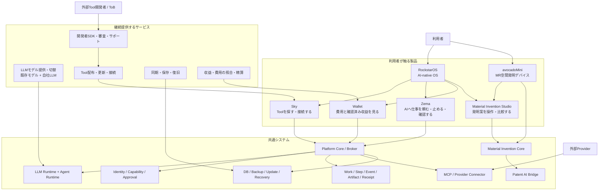
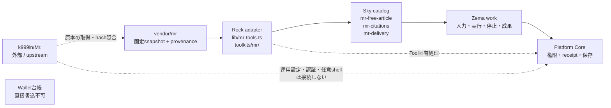
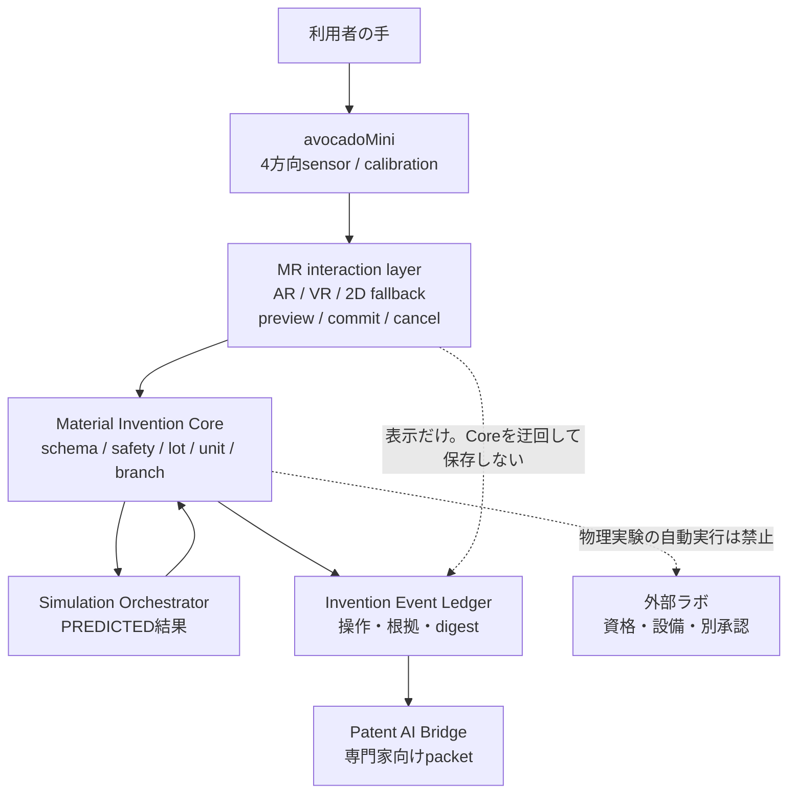
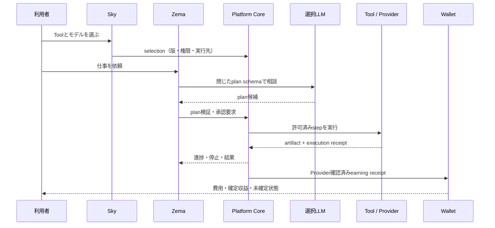

# RockstarOS 製品・サービス・システム関係図

版: 1.0 / 2026-09-19

状態: **正本補助設計**。製品、サービス、内部システム、`Mr.` 由来Tool、MR（Mixed Reality）端末の関係を一つの図で確認するための文書。各コンポーネントのfield単位の契約は表中のリンク先を正本とする。

対外的な製品紹介ではavocadoMiniを主役にし、RockstarOSとLLMを製品を動かす技術基盤として示す。avocadoMiniは設計段階で、実機試作と販売は未実施である。

利用者への入口は、製品紹介とOS導入を兼ねるホームページ、Webアプリ、OS本体の三つ。SkyなどはアプリとOSの中で使うサービスであり、独立した最上位製品入口として並べない。

| 入口 | 現在のURL・状態 | 内側にあるもの |
| --- | --- | --- |
| 製品・導入ホームページ | `/rockstaros`。avocadoMiniとRockstarOSの紹介、OS導入案内への導線 | 製品構想、対応環境、導入情報 |
| Webアプリ | `/`。本人限定Siteで作業画面を提供中、一般公開と最新版同期は未反映 | App Home、Sky、Zema、Wallet、Studioなど |
| OS本体 | `/rockstaros/guide`でDeveloper Previewの導入条件を案内。完成スマートフォンOSは未配布 | App Homeと同じ役割のサービスをOS契約で接続する計画 |

avocadoMiniは「考える時間を、つくる時間に」を製品メッセージとし、希望参考価格41万円のハードウェア構想。高性能LLMを搭載するRockstarOSは製品目標で、現行の実機検証は固定モデルのDeveloper Preview段階である。41万円は確定販売価格でもOS従量料金でもない。

この文書を読めば、次の三つを混同しない。

- RockstarOSは、AIを使うためのOSと共通基盤。
- Sky、Zema、Wallet、Material Invention Studioは、その基盤を使う製品アプリ。
- avocadoMiniはMaterial Invention Studioを手で扱う専用デバイス。OSそのものではない。

## 1. 会社が提供するもの

矢印は「機能を呼び出す／契約を通して接続する」関係を表す。製品アプリがDB、Wallet台帳、外部Providerへ直接書き込むことは許可しない。すべてPlatform Core／Connectorを通す。

図の実線は通常の契約接続、点線は参照関係または「境界があり直接接続しない」関係を表す。

## 2. 何と何が関係するか

| 起点 | 接続先 | 関係 | 接続を担当する正本 | 現在地 |
| --- | --- | --- | --- | --- |
| RockstarOS | Sky / Zema / Wallet | OSが共通の画面、権限、仕事、保存を提供 | [OS全体詳細設計](rockstaros-complete-design.md) | Web / APKの限定検証 |
| Sky | Tool / MCP | Toolの発見、作者・版・権限・実行先の確認、接続 | [全Tool詳細設計](sky-tools-complete-design.md) | ready Tool 12件、provider接続は段階導入 |
| Zema | Platform Core | 依頼、計画、承認、実行、停止、結果確認を一つのworkにする | [Platform Core](platform-core.md) | 共通契約と一部実装 |
| Wallet | Settlement Worker / Provider | 完了した仕事と確定入金を分離し、Receiptで照合する | [Sky billing](sky-billing.md) | fixture / sandbox、実払出しは未接続 |
| LLM Runtime | Agent Runtime | 選択されたLLMがplanを返し、Agentが許可済み手順だけを実行 | [AI-native OS設計](ai-native-os-architecture.md) / [Decision Fabric](jev-local-qwen-decision-fabric-design.md) | Qwen機内モードと固定runtimeを検証中 |
| Platform Core | Local LLM / Cloud LLM / 自社LLM | モデルは交換可能。権限付与とTool実行はモデルの外に残す | [Local AI契約](../contracts/local-ai-runtime.json) | 既存モデルを先に搭載、自社LLMは追加接続 |
| avocadoMini | Material Invention Studio | センサーと表示でdigital twinを操作する専用入力・表示機器 | [avocadoMini設計](rockstaros-avocado-mini-complete-design.md) | 設計 / Bench試作前 |
| Material Invention Studio | Material Invention Core | 物質候補、制約、安全状態、simulation結果をCoreへ保存 | [Material Core](material-invention-core.md) | sandbox実装、物理設備は接続しない |
| Material Invention Core | Patent AI Bridge | 人・AI・文献・予測・実測を分けて発明資料へ整理 | [空間発明設計](rockstaros-avocado-mini-complete-design.md) | 接続設計、特許性・出願の自動判断はしない |

## 3. `Mr.` 由来Toolの位置づけ

`Mr.` はRockstarOSそのものではない。`k999ln/Mr.` の固定snapshotから一部Toolを取り込み、RockstarOSのSky商品として接続している。`Mr.` の運用設定、認証情報、旧Hub全体をOSへ移植していない。

取り込んだToolはRockstarOSの契約、権限、resource制限、成果schema、receiptを通す。`Mr.` の原本とRock adapterはsource、license、hash、入出力が一致しない限り同一実装・同一商品と表示しない。詳細は[Mr.取り込み](mr-integration.md)と[Gitプロジェクト統合方針](git-consolidation.md)を参照する。

## 4. MR（Mixed Reality）とOSの関係

MRはRockstarOSの全体名称ではなく、avocadoMiniの操作方式である。AR、VR、2Dは同じMaterial Invention projectを別の見方で扱う。MR表示が候補を作っても、候補の確定、安全判定、simulation、履歴保存はMaterial Invention Coreだけが行う。

| MRでできること | MRでできないこと |
| --- | --- |
| digital twinを選ぶ、近付ける、接続previewを出す | 実物の材料を混ぜる、加熱する、装置を動かす |
| 候補branchを作る、比率・工程条件を比較する | simulationを実測と表示する |
| 2D fallbackで同じprojectを確認する | gestureだけで特許性、発明者、出願を確定する |

## 5. 利用者の一周とデータの流れ

この一周で、LLMの提案、Toolの実行、成果物、Providerの入金、Walletの精算を別イベントとして保持する。仕事が完了しただけでは売上にしない。

## 6. 正本の読み分け

| 知りたいこと | 正本 |
| --- | --- |
| 会社の製品構成と関係 | 本書（この関係図） |
| OS全体の責任・状態・復旧 | [RockstarOS全体詳細設計](rockstaros-complete-design.md) |
| Sky / Zema / Toolの契約 | [Sky／Zema／全Tool詳細設計](sky-tools-complete-design.md) |
| LLMの交換・判断・権限境界 | [Decision Fabric](jev-local-qwen-decision-fabric-design.md) / [Local AI契約](../contracts/local-ai-runtime.json) |
| `Mr.` からの取り込み範囲 | [Mr.取り込み](mr-integration.md) |
| MR / avocadoMiniの操作・筐体 | [空間発明設計](rockstaros-avocado-mini-complete-design.md) / [Hardware詳細](avocado-mini-hardware-design.md) |
| 発明候補と安全境界 | [Material Invention Core](material-invention-core.md) |
| 費用・収益・払出し | [Sky billing](sky-billing.md) / [Rock Wallet](rock-wallet-production-rail-20260913.md) |

## 7. 設計上の禁止される短絡

- `avocadoMini = RockstarOS` と表示しない。avocadoMiniはOSを搭載する専用デバイス。
- `LLM = Agent = Tool` と表示しない。LLMは提案、Agentは手順、Toolは個別処理を担当する。
- `Mr. = RockstarOS` と表示しない。Mr.は一部Toolの原本・参照元。
- `Tool完了 = 売上` と表示しない。Provider確認済みReceiptが必要。
- `MR表示 = 物理実験` と表示しない。物理設備は別Provider、別資格、別承認。
