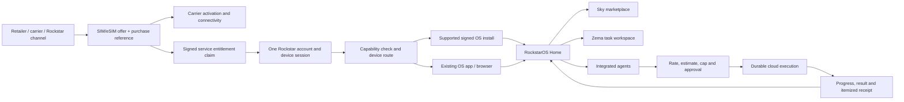

# SIM/eSIM-led RockstarOS service architecture

## 既存端末への機能追加（2026-10-06、HOME01 / SYS01 / WEB14）

利用者の追加指示に基づき、Sky・データ回収・LLMを既存OS上のWeb/PWAから選んで使う。目的は端末交換やOS書込を要求せず同じ入口を提供すること。主担当はWeb / PWA / Sites、ROCK。SIM/eSIMの通信・利用権と、機能の表示設定は独立し、追加操作だけで権限・課金・Provider接続を成立させない。

- 利用体験: Homeの「追加」から `/add` を開く。Skyは標準機能、データ回収とLLMは明示操作でHomeへ追加／解除する。LLMは既存Zema `/chat` の接続・見積・予算・承認を利用し、モデルbinaryを新規導入する操作ではない。
- 入出力と保存: `/add/data` は本人が選択した最大20ファイルとメモ（合計2 MiB、メモ64 KiB以内）だけを読み、AES-256-GCM／PBKDF2-SHA256（310000回）の `.rockdata` を端末へ書き出す。Sky・LLM成果は各画面で取得済みのファイルを手動選択する。自動履歴取得・端末走査・LLMへの自動送信はしない。
- 状態: 機能IDだけを `rockstaros.addons.v1` に保存し、既存の暗号化設定バックアップにも含める。データ本文・パスフレーズはブラウザーのメモリ内だけで処理し、再読込／明示消去で表示を破棄する。追加設定はブラウザー単位でありaccount entitlementではない。
- 失敗と復旧: 保存失敗時は追加表示を成功へ更新しない。容量／形式／名前／重複ID／SHA-256／GCM認証に失敗したarchiveは取り出さない。復元は同じパスフレーズで検証後、ファイル・メモを個別取得する。処理中の消去や画面離脱では遅延結果を表示・ダウンロードしない。パスフレーズ再発行はできない。既存設定backupのv1形式は維持する。
- 承認: ファイル選択・書出し・復元は本人操作。外部送信・有料LLM・Provider権限は既存Workflowの個別承認を維持する。このutilityは新しい仕事実行APIを作らない。
- 合格条件: 追加／解除・再読込・Home反映、暗号化round-trip、誤password／改竄／別形式／容量超過拒否、既存設定backup互換を検証する。全体 `npm run verify` と画面操作は検証記録で区別する。実端末・native OS・local model・production Providerの受入は別gate。
- 未決定: 「回収」の対象を本人へ確認中。外部サービスの自動取得や端末全体backupが必要なら、対象／同意／owner／保存先を確定して既存adapterへ追加する。現段階でその機能を実装済みとはしない。

Status: product direction and implementation contract, 2026-10-02. This document supersedes plans that position eSIM checkout inside RockstarOS as the primary product, or imply that the OS binary is stored on a SIM.

## Product definition

The product is a physical SIM or eSIM offer, sold through Rockstar and partner channels, that includes access to RockstarOS services. The SIM identifies/activates a carrier subscription where applicable; a separate signed purchase entitlement links the purchase to a Rockstar account. The OS binary is delivered through a supported device installation/update channel, or services run in the existing OS app/browser client. A SIM purchase alone neither activates a carrier profile nor installs an OS image.

Users choose the offer for three reasons, in order: fast access to cloud LLMs and agents; transparent usage pricing; integrated access to Sky and Zema with little setup. Cloud LLMs and agents execute remotely and are metered by use. Their charges are itemized separately from carrier connectivity charges.

## System boundaries

Carrier activation, purchase entitlement, Rockstar identity, device installation, cloud execution, and cloud billing are separate records and acceptance gates. Preserve channel-neutral signed claims, owner-scoped device authorization, device capability/attestation, durable A2A/Workflow jobs, recovery, quote and metering infrastructure, and shared budget reservations.

## Onboarding contract

1. At purchase or first launch, show the offer, included RockstarOS service scopes, supported regions/devices, carrier eligibility, and separate connectivity and AI pricing. Support physical SIM and eSIM purchases from more than one channel.
2. Activate eSIM only through an explicit supported carrier flow; for physical SIM, guide insertion and show carrier state when it can be read. Do not infer activation from a service claim.
3. Sign in once to a Rockstar account. Redeem the channel-neutral, one-time signed purchase entitlement and show which services it includes. Do not require separate registration for Sky, Zema, and integrated agents.
4. Read or request a device capability snapshot. Route eligible exact models to a signed, recoverable RockstarOS installation flow only after that model's install path is accepted. Route other devices to the supported existing-OS app/browser. SIM/eSIM support does not imply OS-install support.
5. Land on one Home with direct Sky, Zema, and Agent entry points. Present included/recommended agents as optional ready-to-use services; install or invoke them only under their own reviewed package, permission, and provider constraints. Additional agents remain discoverable through Sky.
6. For paid cloud work, show provider, model/agent, visible rates, estimate, currency, usage meters, user-set maximum spend, and any prompt-sharing disclosure before dispatch. Require explicit authorization. Hold execution at the cap and ask again before any higher spend.
7. Persist the accepted job and consent before dispatch. Cloud execution continues within that accepted scope while the device is offline. On reconnect, retrieve the same job's progress, result and itemized provider usage; never duplicate a task because a response was missed.

## Execution and cost contract

The device UI is a client and approval surface. Cloud workers and contracted providers perform cloud LLM/agent work. Each job binds the authenticated owner, task ID, provider/agent and version, request digest, quote/rate version, budget cap, consent, expiry, and offline-continuation choice. The cloud job ledger is authoritative for progress and recovery. Results and meter events sync to the device by the same job ID.

Before work, display rates and a bounded estimate. During work, display provider-reported usage and current reserved/estimated spend with its provisional status. After work, show itemized metered usage and receipt, and distinguish provider-reported usage from invoice-reconciled or settled amounts. A local fixture or usage row is not a bill. Enforce user caps in the shared reservation and dispatch layer; exceeding a cap requires a new quote and explicit approval.

The device can queue a new local task offline only when it is clearly labeled local. It cannot reach a cloud provider while the device has no route. Previously accepted cloud work can continue because the cloud already has the durable job, input and authorization.

## Device and service interface

- Shared Rockstar identity/session across the installed client and RockstarOS services; Sky, Zema and agents do not each create accounts.
- Home provides direct routes to Sky discovery, Zema work, agent task submission, active jobs, results and spending.
- Capability-based routing describes model, memory, storage, OS/bootloader, network and trust features. It recommends an install or client path based on exact accepted compatibility records; it never exploits or overrides a device.
- eSIM/SIM modules handle supported provisioning/activation integrations only. They do not contain the RockstarOS image or authorize arbitrary device control.
- Offline continuity UI distinguishes cloud jobs already accepted, unsent drafts, local-only work, and actions waiting for approval.

## Audit and backlog

| Priority | Work | Existing assets | Acceptance still needed |
|---|---|---|---|
| P0 | Finish one-time purchase claim and short onboarding across purchase channels | signed channel-neutral entitlement claim, issuer SDK, encrypted/idempotent seller-to-Rockstar delivery API, `/connect`, common identity/device session, Home routes | connect seller checkout to claim issuance and the seller's buyer-delivery channel; validate expiry/resend/refund/reissue in a contracted sandbox; carrier activation readback and end-to-end customer acceptance |
| P0 | Make cloud execution and pricing user-trustworthy | durable A2A jobs/recovery, signed quotes, budget holds, meter/receipt verifiers, itemized UI, explicit consent, [operator stop/recovery procedure](sky-cloud-operations-runbook.md), Android Shell source path for quote review → separate device-credential Wallet approval → exact quote-bound hold → Broker proof → explicit Cloud approval → same-ID recovery | compile and run Android Core/AIDL/APK/instrumentation on an equipped CI/device host; accept real Provider contract and sandbox, live rates/meters, invoice reconciliation, funded settlement |
| P0 | Route across device families | capability snapshot/attestation, Android client/core source, browser app | exact-SKU compatibility matrix; Android build/APK/Binder/device tests; supported iOS/PC clients; signed OS install and recovery acceptance per exact model |
| P1 | Integrate Sky, Zema and packaged agents | shared identity, direct Home entry, Package review/handoff, signed runtime binding, Provider-declared Package invocation extension, controlled local executor/result/receipt fixture, sequential Node-to-Python A2A handoff fixture, Zema UI to prepare a completed/retrieved result as an untrusted-data draft for a second separately quoted sibling Agent task, persisted owner/parent-scoped predecessor→successor edge after result capture, one successor per reviewed result, maximum redelegation depth 1 enforced in the store/API and D1, Cloudflare Worker/D1 fixture executing two separately approved sibling delegations on distinct Agent origins under one shared parent budget with encrypted handoff and restart/no-replay checks, read-only parent controller snapshot, cloud-agent Zema plan step records bound by delegation ID and server-checked against the saved signed quote or terminal captured result plus usage receipt, one-minute scheduled deadline sweep that expires pre-send work/releases its hold and requests cancellation of overdue remote tasks, versioned persisted Zema plan v1 with pre-work objective editing and immutable server-derived quote/Wallet/Cloud-approval/result-receipt gates | Extensible multi-step authoring and operator recovery runbooks; production Provider deadline/cancel semantics and interoperability; production output-schema/receipt semantics; reviewed default offer profiles |
| P1 | Add distribution and activation adapters | eSIM provider fixtures, channel-neutral signed-claim SDK and encrypted/idempotent seller delivery API, entitlement APIs | partner contracts and production keys, physical SIM fulfillment, carrier/eSIM activation, returns/refunds, operational support |

The eSIM bootstrap toolkit remains an eSIM integration fixture, not the product distribution restriction. Local tests verify only the behavior named in their evidence. They do not prove production billing, actual carrier activation, physical SIM fulfillment, successful OS installation, or supported-device acceptance.

2026-10-02 implementation audit follow-up: the native quote-to-Wallet-to-Cloud approval source path is now connected through Shell API v18 and the stable delegation ID. The earlier correction artifact listed that handoff as missing before the follow-up integration; current source-contract and shared Node/Cloud canonical-vector tests pass. Android Core Java/JUnit, AIDL generation, APK build, device-credential/reconnect instrumentation have not run on this host, so the native flow is implemented in source and locally contract-checked but not Android-runtime accepted. Real Provider execution, prices/invoices, funded settlement, SIM fulfillment/activation, and exact-SKU installation remain separate gates. See [follow-up evidence](evidence/sim-led-product-correction-followup-20261002.json).

## Evidence categories

- Implemented in source: the reusable infrastructure named above and Web/Android source paths as recorded in the workstream.
- Locally verified: automated tests with synthetic claims, keys, quotes, meters, D1 rows, and Worker jobs. These are local behavior evidence only.
- Production/device acceptance required: seller and carrier connections, real Provider contracts and invoices, production D1 deployment/readback, funded billing, Android/APK/device behavior, and exact-model OS installation and recovery.
