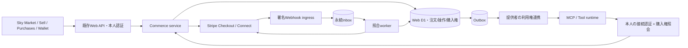

# Sky Market 決済・Wallet 統合詳細設計

版: Design 1.0 / 作成日: 2026-10-01 / 設計対象: `k999ln/rock`

対象ソース: `b3e2676abd8ae2a0b3f78f48483e067b429d9bc8`。本書は既存実装に対する設計差分であり、以下の新しい契約・状態・テーブルは、明記した既存部分を除き未実装である。主担当は Wallet / Billing / Providers、既存task `BIL02`。ROCKの設計・ローカル検証とJOINTのStripe sandbox受入を区別する。

### 2026-10-05 main統合時の接続条件

本書の既存コード監査と51/32/103件の結果は2026-10-01の上記SHAに対する履歴である。mainへの保存時は `08a624b93bffa8ce81df2319f156ec1f284fdf04` を基準に再照合し、[統合検証記録](evidence/sky-commerce-main-integration-validation.json)へ今回の結果を分離する。設計のv2 runtime・正式migrationは今回も追加しない。後続mainの実装を取り消したり、過去の全体verify失敗を現在の結果へ転用しない。

- 現行のSIM/eSIM service entitlementに含まれるPackageへの重複購入拒否を、v2のquote発行・購入確定でも維持する。`lib/sky-commerce.ts` の `isIncludedInActiveServiceOffer` と `lib/rockstar-service-offers.ts` を再利用し、service accessと個別購入権を区別する。
- `lib/request-auth.ts` の端末用 `Bearer rock_session_` はD1で期限・失効を検証して既存ownerへ解決する。新principalはこの検証済み本人への明示的な対応付けを維持し、ブラウザ用Origin検査だけへの置換や別ownerの自動生成をしない。
- `rockstar-sky-package-runtime-binding/2` の署名検証、binding ID/digest、Package/manifest hash、Provider/key tupleへpaid-access sidecarを結び付ける。実行bindingの信頼と購入資格は別に検査し、並列の信頼台帳を作らない。
- CSVの50円専用Checkout、`purpose=csv_trial_50`、専用Webhookは別経路。CSV内部の旧来 `quote_minor=5000` をJPYの5,000円として流用せず、Connectの10%やMarketplace返金処理へ混ぜない。限定CSV実決済の既存証拠を、本設計のConnect・Wallet受入へ転用しない。
- Stripe transportの `redirect: 'manual'`、秘密を含まない診断、`shared/stripe.mjs` の共有署名検証と `shared:check` を保持する。A2A/直接LLMの内部予算・使用量・合成予約は入金済みWallet残高ではない。

## 1. 決定と対象

既存の `SkyToolPackage`、`CommerceOrder`、Web D1、`/api/sky/commerce/[action]`、Stripe Checkout / Connectを拡張する。購入者はSkyで条件を確認し、Stripeでカード決済し、同じSkyアカウントの端末から購入Toolへ接続する。提供者は自分の審査済み商品を販売し、売上・返金・銀行払出しの状態を個別に確認する。

対象は審査有効なAI・自動化Tool/LLM Packageの円建て買い切り。既存の販売手数料10%、登録・接続・公開・基本利用0円を継承する。月額8.88 USD案は利用者の2026-10-01の指示により本設計の対象外。ハードウェア予約、ファンド、ゲーム通貨交換、任意送金をこの決済に混ぜない。

既存コードの決済経路は既にある。今回作るべきものは、型の一致、返金・紛争の回復、永続的な通知受信、購入権の実行側への接続、運用照合である。汎用EC基盤への全面置換は行わない。

### 設計で固定する条件

- 一注文一Package版、一提供者、一通貨JPY、一回払い。数量1。カード情報はStripe Hosted Checkoutで入力する。
- `amountMinor` はJPYでは円の整数。50〜99,999,999円の既存境界を継承する。別通貨を暗黙に100分の1へ変換しない。
- 手数料は `floor(amountMinor * 1000 / 10000)`。10,000円なら1,000円、提供者分配予定は9,000円。処理費用控除前の額であり銀行着金や純利益を意味しない。
- 購入者ID、提供者ID、宛先、額、通貨、手数料、審査hashはサーバーが決める。ブラウザが送るのは商品識別子と表示条件の版、確認トークンだけ。
- 支払い・返金・紛争・購入権・Tool実行・銀行払出しを別の状態として保持する。
- 結果不明は失敗扱いして再購入させない。新しいidempotency keyを発行する前に既存処理を照合する。
- 購入権はアカウント単位。端末数だけで追加購入を発生させない。別アカウントへ自動共有しない。

### 販売開始前に残る商品判断

初期対象を国内・JPY・カード・オンライン接続型の審査済みPackageとする案で進める。販売主体、税込表示の内訳、返金条件、提供開始時期、ライセンスの版更新範囲は提供者の条件として確定する。既存の買い切りを無期限のクラウド計算量や無料の将来版更新と解釈しない。これらの入力不足は設計作業を止めず、該当商品の販売有効化条件として表現する。

## 2. 既存資産と接続点

`lib/sky-tool-package.ts` の `SkyToolPackage` と `sky-tool-package/1` は商品・権限・実行先・価格方式の正本。`packageKey` は `id@version`。Package parserは未知のキーを拒否するため、決済固有フィールドをそのままmanifestへ足さない。

`lib/sky-commerce-store.ts` の `CommerceMode`、`CommerceStatus`、`CommerceSeller`、`CommerceOffer`、`CommerceOrder` を互換境界とする。既存4表 `sky_commerce_sellers/offers/orders/events` と migration `0018_sky_commerce.sql` を保持し、追加表・追加列を段階的に導入する。

`lib/sky-commerce.ts` は購入者/提供者の本人分離、価格revision、審査hash、注文snapshot、Stripe照合を持つ。`lib/sky-stripe.ts` はserver-onlyのHTTP adapter、15秒timeout、redirect拒否、API版固定を持つ。これらを共通の型、provider error、照合serviceへ分割する。

`components/sky-commerce.tsx`、`/sky/marketplace`、`/sky/sell`、`/sky/purchases` が既存UX。市場カードと購入履歴への接続は維持し、注文番号・次の操作・最終確認時刻を表示する。

Web Walletの手入力帳簿、旧USD精算、native合成Walletは別domain。Sky購入・売上はJPYの読み取りprojectionとしてWalletへ表示し、既存残高へ単純加算しない。Toolの実行receiptは入金証拠ではない。

## 3. 現状確認と設計課題

現状の良い境界は継承する。価格/宛先のserver snapshot、同一購入者・Package・modeのactive unique key、Stripeへの固定idempotency key、raw body署名、Session/PaymentIntent/Chargeの再取得と照合、test/live分離、返金後の遅着paid拒否は既に実装されている。

### 再現した型と状態の不一致

1. 販売情報の `active` はDBで0/1、UIでboolean。同じJSONが型変換なしで返り、チェックを操作せず価格を保存すると `active:1` を再送しboolean検証で400になる。共有DTOと明示変換で解消する。
2. `refund_pending` の注文に外部部分返金が発生しても、状態遷移ガードがUPDATE全体を拒否し、`refundedMinor` も更新されない。金銭事実を更新する処理と購入権の停止を分ける。
3. 受取アカウントの `payouts_enabled=false` で `active:false` の販売停止まで409となる。停止は本人権限のみで実行し、Stripeの稼働や資格に依存させない。
4. 同一Webhook IDの再送中にProvider状態が変わると注文は更新されるが、既存event行は初回のまま。受信重複と新しい照合観測を別IDで記録し、状態更新と監査が対応するようにする。

再現はソースSHA固定のローカルSQLiteとmock Provider。実Stripeでの資金移動を行った証拠ではない。故意の保守的な利用権停止と、表示・回復の欠落を区別する。

### 追加設計が必要な点

- Refund IDとその状態が保存されず、失敗・取消・保留からの回復を追えない。
- `disputed` から紛争勝訴後の回復を表せない。単一statusの優先順位では履歴と現在の利用可否が混ざる。
- Webhook内で複数のStripe APIを同期呼出しする。受信前後のクラッシュ、通知不達、Provider障害からの自動復旧が不足する。
- APIエラーを一律502にするため、安全な再試行、確定拒否、結果不明、手動照合を識別できない。
- 購入済みの接続URL表示だけでは、第三者MCPの有料アクセス認可・返金後の失効を強制できない。
- 本番の本人ヘッダを付与するgateway、直Workerの閉鎖、匿名Webhook到達は配備先での検証が必要。

## 4. システム構成

Commerce DBが購入の正本。Stripeは決済・返金・接続アカウント・払出しの外部事実の正本。両方を一つの分散transactionに見せかけず、操作記録・idempotency・照合・outboxで接続する。LLMは説明・購入候補の提示まで。注文の本人・価格確定、返金、権限付与をモデル出力だけで実行しない。

### 配備方式の判定

第一案は既存Web APIとWeb D1を維持する。本人用routeでは信頼gateway以外の到達を閉じ、Webhook routeだけはraw署名を保った匿名POSTを受ける。実配備で両条件を証明してから本番を有効化する。

Sites側でこの例外を提供できない場合は専用の公開Webhook受信Workerを設ける。ただし別WorkerがSites D1を当然に共有できるとは仮定しない。同一アカウント・DB binding・アクセス権が確認できれば同じinboxへ書く。確認できない場合はCommerce専用Worker/D1へ決済4表と追加表を移し、既存Webを認証済みBFFにする案を個別移行として採用する。BFFからの本人情報は署名済み短命assertionにして、ブラウザの任意ヘッダを信用しない。二つのDBを同時に注文正本にしない。

## 5. 型契約

設計用の型定義を `docs/contracts/sky-commerce-v2.ts` に置く。これは実装用の参照契約で、本番のAPIへ登録されたコードではない。共有DTOの最終配置は `lib/sky-commerce-contract.ts`。DB row、Provider raw object、公開DTOを別名にし、境界で変換・検証する。

型の原則:

- `CommerceMode` と既存ID、時刻millisecondを維持する。DTOの `active` はboolean、DBはinteger。
- 初期DTOの通貨はliteral `jpy`。`number`だけで金額の意味を曖昧にせず `JpyMinor` とparse関数を設ける。
- 内部状態を公開しすぎず、利用者向けには `payment`、`refund`、`dispute`、`access`、`nextAction` を返す。
- v1の `status/access/endpointUrl` は互換projection。v2の認可を旧 `access` booleanだけで判断しない。
- Provider JSONは `unknown` からparseし、TypeScriptの `as` だけで検証済みにしない。
- `SkyToolPackage/1` は変更せず、決済・利用権の提供条件はversion付きsidecarへ置く。

### 永続journalからDTOへの変換

注文のpayment/dispute/access enumはSQLとTSで一致させる。entitlementの内部初期値inactiveだけは公開access=pendingへ写す。操作journalはProvider objectの状態と異なるため、castせず次の全写像を用いる。

| 保存対象・内部state | DTO | 条件 |
|---|---|---|
| seller account prepared | requested | 外部送信前 |
| seller account submitting | submitting | 固定key/bodyで送信中 |
| seller account unknown / manual_review | unknown | manual_reviewは要対応も表示 |
| seller account acknowledged | succeeded | 口座作成の成功のみ。本人確認/受取資格readyとは別 |
| seller account failed | failed | 確定拒否の証拠あり |
| refund journal prepared / submitting | requested / submitting | Provider Refund未対応 |
| refund journal unknown / manual_review | unknown | 対応関係未確定なら予約を保持 |
| refund journal acknowledged / succeeded | 現在のProvider Refund status | objectが無ければunknown＋要照合。API受付を返金成功へ写さない |
| refund journal failed / canceled | failed / canceled | Provider照合で裏付け。既知Refundがあればその現在状態を優先 |

`OrderObservation` は一回の再照合集合、SQL observationsは個々のobjectの証拠行。集合digest・Stripe Request-Id群・order revision/fenceをapply監査へ束縛する。`AccountObservation` はmode/platform/source account/currency/evidence kindごとのCASで、別種類の新観測を根拠に古い残高のasOfを更新しない。

## 6. 購入・返金・権利の状態

支払い: `unpaid / processing / paid / canceled`。DBとDTOは同じenumを使う。失効・確定拒否・取消の根拠は `paymentClosureReason: expired / rejected / canceled / null` に分離し、結果不明は終端理由を付けずoperationで管理する。Provider固有のraw statusは観測に保存し、そのまま内部enumへcastしない。

返金: 返金操作ごとに `requested / submitting / unknown / pending / requires_action / succeeded / failed / canceled`。集計は成功額、保留額、結果不明の有無を別々に持つ。Chargeの返金総額だけから購入者への返金成功を推定しない。

紛争: `none / needs_response / under_review / won / lost`。Providerのdispute IDと状態を保存し、最新の再照合観測だけが回復を許可する。Webhookの作成時刻を全オブジェクトに共通の順序番号として使わない。

購入権: `pending / active / suspended / revoked`。決済成功、販売契約のhash、Package審査有効、提供者の購入権検査機能の受入を満たした場合のみactive。ここでの提供者連携は販売側の対応機能であり、購入者自身のOAuth接続完了とは別。購入者未接続なら「購入済み・接続待ち」と表示して追加購入させない。全額返金成功・紛争敗訴はrevoked、返金中・一部返金・紛争中・危険なPackage失効はsuspended。返金失敗/取消・紛争勝訴後はサーバーが現在の全条件を再評価する。返金caseが存在する場合は明示的な契約復帰判断も必要で、caseの終了だけでは復帰しない。部分返金後に権利を残す商品の条件が未指定なため、初期案は停止しサポートで扱う。

購入権とTool実行権限は別。activeであっても、接続認証、scope、実行先、費用上限、外部変更の本人承認を省略しない。

## 7. データと不変条件

実行用migrationの前段として `docs/contracts/sky-commerce-v2.sql` にDDL草案を置く。`drizzle/`へ直接追加して自動配備対象にはしない。既存4表に追加するsidecarは、注文状態、操作、Refund、通知inbox、照合観測、利用権、失効outbox、提供者連携、subject link、見積/販売条件確認、nonce、監査、seller口座作成journalである。Account残高/Payoutの観測はorderを必須にせず、account scope・revision・fenceを持つ別domainで保存する。実装ではDDLと `db/schema.ts` を同じ変更単位で生成・確認する。

### 不変条件 I01〜I16

1. **I01 本人:** 注文buyerとsellerは認証済みprincipalへ束縛され、bodyで選択できない。サポート権限は独立scope。
2. **I02 環境:** mode、platform account、connected account、通貨がすべて一致する。testとliveを集計しない。
3. **I03 価格:** 注文の価格・手数料・宛先・Package hash・販売条件hashは確定後不変。
4. **I04 注文:** 同一buyer・Package版・modeの新規購入可能slotは一つ。多端末が同じslotへ収束する。
5. **I05 操作:** 同じoperation IDは同じrequest digest・同じProvider key。内容を変えて再利用しない。
6. **I06 成功:** redirect query、UI表示、usage event、LLM発言からpaidへ遷移させない。
7. **I07 金銭:** captured、成功返金、保留返金、fee、transfer、payoutを別の事実とする。元売上行を消さない。
8. **I08 返金:** 新規返金の受付では成功返金＋保留＋未解決予約＋要求額が元捕捉額以下であることをCAS検査する。外部Dashboardの確認済み事実はこの受付条件で捨てず、予約との重複可能性を要照合として保存・停止する。
9. **I09 受信:** 同一Provider event IDを重複受信しても金銭効果・権利発行・送信効果は増えない。
10. **I10 順序:** 古い観測を新しい状態へ上書きしない。order revisionとlease fenceを両方照合する。
11. **I11 回復:** Refund失敗や紛争勝訴は単独で復活命令にならない。全refund集合・全紛争・Package審査と返金caseの明示的な契約復帰判断を再評価する。
12. **I12 再購入:** 返金済みO1の遅着通知が新規O2の権利を失効させない。buyer/Packageの有効注文pointerを条件付きで更新する。
13. **I13 権利:** buyer/Package/modeの権利revisionは再購入でも単調増加する。注文ごとに0へ戻さない。
14. **I14 停止:** 販売停止は新規販売の停止。既購入者の権利剥奪には別の失効理由・権限・記録が必要。
15. **I15 監査:** 適用状態、権利revision、監査、outboxは同じtransactionで確定する。CAS不成立時にoutboxだけ出さない。
16. **I16 Wallet:** 決済の表示projectionを手入力帳簿や別通貨残高へ再計上しない。不明額を0へ置換しない。

### 既存statusの互換projection

v1の8状態は、v2状態の表示用projectionとして残す。全額返金成功は `refunded`、紛争中/敗訴は `disputed`、返金操作保留は `refund_pending`、一部返金成功は `partially_refunded`、支払い成功は `paid`。支払い期限切れ/確定拒否はそれぞれ `expired/failed`。表示優先度は全額返金→紛争→返金保留/未解決case→一部返金→paid→expired→failed→pendingと固定し、参照変換を `legacyStatus()` に示す。現行enumにない確定取消はv1ではfailedへ写す。実際の金銭・権利の全情報はv2応答で返す。v1 `refundedMinor` は成功返金額へ定義を固定するため、既存値の無条件copyをせずProviderで再照合する。

## 8. 購入フローと同時実行

### 8.1 表示条件の固定

提供者が価格・返金・販売条件を変更すると新しいoffer revisionを作る。URLだけでなく、実際に表示する販売者情報、ライセンス、総額、提供開始、返品/返金文面を不変artifactとして保存しhashを計算する。任意URLをサーバーから取りに行って規約として信用せず、提供者が入力/確認した本文をsanitizeして固定する。既存URLは補足リンクとして保持する。

`quote` は本人、mode、Package/hash、offer revision、総額、条件digest、期限を保存する。初期提案のquote有効期間は15分。これは新しい購入意思を受付できる期間であり、既に受理した注文の支払い結果を破棄する期限ではない。

### 8.2 注文とSession作成

1. gatewayから本人を確定し、入力をparseする。最初にquote→受理済みorderを本人・mode・request digestで探す。同じ意思の再送なら現在の注文を返す。既存注文のあるquoteに期限切れ/使用済み/後日の価格変更を再適用しない。同じquoteの異なる内容は409、別本人の照会は存在を漏らさず拒否する。
2. 未受理quoteだけ、サーバーが現在の提供者資格をStripeから取得する。DB上でquote本人/mode/期限/未使用、offer revision/active、現在のPackage/hashと審査期限を同時に条件検査し、orderを一つ予約する。チェック後に無条件INSERTする構成を避ける。
3. 注文snapshotと `create_checkout` operation、固定request digest/keyを保存する。競合した同じquoteは既存注文へ収束する。返金後の再購入には新しいquote/orderが必要で、旧quoteの再送は旧注文を返す。
4. transactionを閉じてからStripeを呼ぶ。DB transactionをネットワーク待ちの間保持しない。
5. 成功応答のSession IDをCASでattachし、Checkout URLを返す。timeoutはunknownを保存し、同じ注文の確認画面へ戻す。
6. 購入者がStripeで支払いを行う。Webhookまたはサーバー照合でpaidを確認して権利を有効化する。

Checkoutの既定有効期間24時間と既存20時間の自動再試行上限を維持する案。request bodyを固定し、時刻を含むparameterをretryごとに変えない。再試行上限はoperationの最初の送信時刻で管理する。20時間経過やProvider key保持期限を越えたら新keyで押し直さずread-only照合へ移る。[StripeのSession作成](https://docs.stripe.com/api/checkout/sessions/create)、[idempotency](https://docs.stripe.com/api/idempotent_requests)。

### 8.3 販売停止と未完了のSession

販売停止操作は本人と商品所有だけで実行可能にし、Provider資格チェックを要求しない。新しい注文/Session発行を止める。既存のopen Sessionは、対応する操作記録を作ってStripeへ失効を依頼し、結果を再取得する。失効と支払いが競合したら支払い事実を消さず、成立した注文の履行または返金caseにする。即時に全外部支払いを取り消せるとは表示しない。

ブラウザのcancel URLは単なる戻り先。注文の取消、カードの返金、Session失効のどれも証明しない。購入画面を閉じた後も履歴に注文を残す。

### 8.4 Session IDを保存できなかった場合

通知からmetadataのorder IDを照合してSessionをattachできる既存経路は維持する。通知不達時は、対象platform account/mode/作成時刻の範囲を絞り、Stripeの一覧をpaginationして `client_reference_id` とmetadataを確認する。metadataでの高速検索APIが必ず存在するとは仮定しない。候補1件なら注文全条件を検証してattach、0件でも不在を確証できなければunknown維持、複数候補は隔離する。運用者が手入力したSession IDも同じ照合を通す。

## 9. Webhookと照合worker

### 9.1 受信transaction

raw bodyを上限付きで読み、署名・時刻・mode・既知event型・対象account scopeを検証する。署名確認前のJSONを資金事実として扱わない。正規化したevent envelope、object ID、raw digest、受信時刻、API versionをinboxへ保存し、jobを同じbatchで永続化してから2xxを返す。保存失敗は5xx。受信重複は既存状態を確認して2xxにできるが、同じIDで異なるpayloadは隔離して監査する。

Queueはworkerを起こす通知経路として使えるが、未処理inbox/jobはDBを正本とする。DB commit後Queue送信前に落ちても定期sweepで回収する。`waitUntil`だけでは永続受信を保証しない。[Stripe Webhooks](https://docs.stripe.com/webhooks)、[Workers context](https://developers.cloudflare.com/workers/runtime-apis/context/)、[Queues配信保証](https://developers.cloudflare.com/queues/reference/delivery-guarantees/)。

### 9.2 対象event

既存の `checkout.session.completed/async_payment_succeeded/async_payment_failed/expired`、`charge.refunded`、`charge.dispute.*` に `refund.created/updated/failed` を追加する。connected account状態とpayout観測は別scopeの `account.updated`、`payout.*` を登録し、platform向け支払い通知と混同しない。未知eventは「無視した理由」を保存してackする。未知orderは再照合候補として期限付きで保持する。

### 9.3 新鮮な状態の適用

workerはorder単位のleaseを取得し、単調なfenceと現在revisionを記録する。Stripeから現在のSession/PaymentIntent/Charge/Refund/Disputeを再取得して、注文snapshotと合致するnormalized observationを作る。ページングがあるRefund一覧は全関連項目を取得し、途中取得を完全な集合と扱わない。

適用batchは `WHERE order_revision = expected AND lease_fence = acquired` の条件付きUPDATE、同じmutation tokenを条件にした監査/outbox、inbox処理済み更新をまとめる。UPDATEが0行でもD1 batchはSQLエラーにならないため、後続INSERTを無条件で実行しない。古いGETが後から戻った場合は適用せず、新たなleaseで再取得する。外部APIとDBを原子的にできない残りの競合は、単調な不利情報・権利TTL・再照合で収束させる。[D1 Database API](https://developers.cloudflare.com/d1/worker-api/d1-database/)。

現行コードはD1 Sessionsを使っておらず、この調査でreplicaの不具合を確認したわけではない。将来read replicaを導入しても決済・権利判定はprimary/read-your-writeを要求し、Walletの非権威的な履歴表示だけを遅延許容にする。

### 9.4 エラーの意味

- GETのtimeout/429/一時5xx: バックオフして再取得。過去の確認時刻を表示する。
- POSTのtimeout/通信切断/5xx: side effect不明。operationをunknownにし、新しいkeyを作らない。
- 確定validation拒否: 元request digestと安全なcodeを保存し、条件修正後に別の意思として再作成する。
- 同じkeyの競合/429: Providerのretry hintと期限を守り同じkey/bodyで処理する。
- 20時間上限/不一致/複数候補: operator caseへ。運用者の「支払済み」手入力では権利を与えない。

ログは注文ID、operation ID、Stripe Request-Id、安全なerror code、試行回数、digestを残す。生のProvider error本文、認証token、カード情報を画面や一般ログへ出さない。[Stripe低水準エラー処理](https://docs.stripe.com/error-low-level)。

## 10. 返金、紛争、資金照合

### 10.1 返金operationと外部Refund

Skyでの返金意思を `RefundOperation`、Stripeに存在する返金を `ProviderRefund` として分離する。DashboardやStripe自動処理由来のRefundにはSky operationが存在しないため、operation IDはnullable。sourceを記録し、未知の返金を捨てない。

返金要求では最新の全Refund集合と注文revisionを確認し、返金可能残額を一度だけ予約する。同じcommand IDは同じ金額。初版の売主UIは既存と同じ「未返金残額を全額返す」を基本とし、任意部分額の入力UIは追加しない。外部Dashboardからの部分返金は必ず取り込む。後の部分返金UIは、固定額の再確認と独立operation IDを追加して受け入れる。

結果不明のSky返金予約10,000円がある間に、Dashboard成功返金5,000円を観測することがある。このとき内部予約との和が元注文を超えることだけでProvider観測を拒否しない。成功5,000円は保存して表示し、未照合予約10,000円も勝手に減額/成功変換せず別項目で保持する。これは二つの額を合計した確定負債や残高ではない。overlapの要照合caseを作り、利用権、新規返金、再購入を停止する。追加のProvider事実から同一operationとの対応または確定失敗を判定して解消する。新規予約の受付と外部事実の取り込みには異なるguardを用いる。

Providerへ `reverse_transfer=true`、`refund_application_fee=true` を付ける既存方針は維持する。返金の受付、処理中、成功、失敗/取消と、Transfer reversal、ApplicationFee refundは別の事実として保存する。手数料返戻額を注文の10%から毎回再計算して加算せず、Providerの実際のfee refund ID/額を照合する。[Destination charges](https://docs.stripe.com/connect/destination-charges?platform=web&ui=stripe-hosted)、[Refund object](https://docs.stripe.com/api/refunds/object)。

### 10.2 復旧条件

返金操作を受理した時点で利用権を一時停止し、同じtransactionで失効outboxを記録する。Refundが確定失敗/取消になっても、成功済み返金0・未解決操作0・開いた紛争0・審査有効に加え、返金caseが解決/撤回され、`refundEntitlementDisposition=restore` が明示的に確定したことを確認するまで復帰しない。返金を約束した取引ではProviderの失敗だけでその義務は消えない。成功額が一部残れば一部返金として停止、全額成功ならrevoked。charge集計の `MAX()` だけで現在の返金状態を表現しない。

caseは `refundCaseState: none/open/resolved/withdrawn`、契約への処置は `refundEntitlementDisposition: undecided/restore/keep_revoked` と分ける。代替返金済みや契約終了でcaseを閉じる場合はkeep_revoked。復帰は本人意思・販売条件・証拠を結び、`commerce.refund_case.resolve` のサポート権限を持つ担当者がexpected case/order revision付きで決定する。金銭projectionの訂正はこの決定を待たず反映し、判断者・理由・証拠参照・時刻を監査する。売り手がcaseを単に閉じるだけでは復帰できない。

Refundの成功後に銀行側から返却されて `failed` になる場合を受け入れる。新しいfenceで再取得した元Refund、金額、Charge、`failure_balance_transaction` を検証し、現在の金銭projectionを訂正するとともに過去の成功観測に対応する補償記録を追記する。O1の全額返金後にO2を再購入していた場合、O1の返金再対応caseを作り、O2の購入権をO1の訂正で自動変更しない。[Stripe返金失敗](https://docs.stripe.com/refunds#handle-failed-refunds)。

紛争中は利用権を止めて支払い事実は保持する。勝訴は支払い/返金/審査を再照合して復帰可能、敗訴は権利失効と資金調整を記録する。係争中の返金は二重補償を防ぐため標準UIから拒否し、Providerの可否と担当者の確認を経る。紛争後の送金戻しや再分配を自動推測しない。

### 10.3 差異の管理

注文の支払い成功、Connected AccountへのTransfer、利用可能残高、銀行payoutを別に照合する。日次の照合caseには対象mode/account/currency、内部額、Provider額、差額、対象期間、最後の確認、原因、担当、次の操作を保存する。許容差はJPYの確認済み金額では0円。Provider処理費が未取得なら差額0と判断せず未照合にする。

台帳の修正は原事実を削除せず、参照付き調整として追記する。決済DBをbackupから戻してもStripeの取引は戻らないため、送信を停止し、復元時刻以降の外部objectとoperationを再照合してから再開する。

## 11. 認証と購入権の実行側連携

### 11.1 同じ本人を安定して識別する

現行 `requestUser` は `oai-authenticated-user-id` を優先し、無い場合はメールhashを返す。この値をそのまま別サービスへ無条件に複製しない。設計上のcanonical principalは `(issuer, subject)` とし、既存userIdとの対応をverified aliasとして保存する。メール文字列が同じだけで購入履歴を統合しない。native owner ID、device ID、SDK installation IDとも自動一致させない。

専用Commerce serviceへ分離する場合は `aud=sky-commerce`、scope、本人subject、route/method/body digest、有効期限、key ID、jtiを持つ短命assertionをBFFが生成する。旧billing tokenのaudienceを流用しない。署名BFFの入口自身も信頼gatewayで保護されていなければならない。POSTのOrigin照合は別のCSRF境界として維持する。

### 11.2 Provider認可

Provider側のMCP OAuthを保ち、Provider serverが自身の認証contextからsubjectを得てSkyへserver-to-server照会する。Skyの購入権receiptをMCP用Bearer tokenとして使わない。Rock側の汎用remote OAuth clientが既に完成しているとは扱わず、接続adapter受入を実装項目に含める。[MCP Authorization](https://modelcontextprotocol.io/specification/2025-11-25/basic/authorization#token-handling)。

一度の連携操作で、Sky本人sessionとProvider本人認証を双方検証し、nonce付きでsubject linkを作る。利用者OAuth tokenをSkyの購入権APIへ転送しない。Provider credentialは照会できるprovider/package scopeを限定し、秘密はsidecar manifestへ格納しない。

新sidecar `sky-paid-access/1` はPackage/hash、Provider resource URI、issuer、subject namespace、license scope、binding revision、照会方式を固定する。Package parserの互換を壊さず別審査を行う。resource/issuer/送信先変更は再審査と必要な本人再同意の対象。

### 11.3 失効と複数端末

購入権はbuyer/Package/mode単位でrevisionを増やす。返金済みO1の後にO2を再購入した場合、古いO1観測はO1の資金履歴を更新してもO2を指す現在の権利pointerを消せない。更新条件にsource orderを含める。

Providerのread-only判定cacheは最大60秒という提案値。review期限、subject link期限を超えない。negative invalidationを受けたrevision以下の古いallowを拒否する。financial/external_writeはcache不可で、毎回fresh照会と別のBroker exact approvalを要求する。開始済みの処理は新規開始と区別し、失効が過去の外部副作用やダウンロード済み成果物を消すとは約束しない。

cache keyはmode・Provider/account scope・subject link・Package/hash・操作scopeを含む。応答のrecovery epochが独立authorityと一致し、entitlement/packageReview/subjectLinkの各revisionが受信済み値より小さくない場合のみ候補にする。revisionは辞書順ではなく各成分の部分順序で比較する。同じrevision vectorの矛盾はdeny優先で再照合する。審査更新や再連携は該当revisionを増やし、新しいfresh判定で復帰する。単なる通信障害は権利revisionを進める根拠にせず、許されたread-onlyの既存TTL範囲以外ではfail closedとする。高水位の永続scopeは安定したProvider/mode/subjectLink/Package/hashであり、runId/requestDigestごとにリセットしない。runId/requestDigestは個別要求への応答束縛として別に照合する。ローカル待ち時間や応答到着時刻でvalidUntilを延長しない。

失効通知が不達でも元TTLを延長しない。Providerがこの契約を強制できない商品は「有料アクセス保護済み」として販売を有効化しない。購入者が未連携なら権利は保有したまま接続待ちを示す。

## 12. Walletの統合

ユーザーの追加指示により、Walletを決済と同じ設計対象とする。詳細は本書と対になる `docs/wallet-commerce-design.md` に定義する。第一案は外部Providerの支払い、返金、販売者売上、残高、受取、履歴と照合をまとめるWallet。ユーザーによるチャージ・自社預り金・暗号資産での購入は、既存の型と責任を確認した別能力として扱い、カード決済から暗黙に有効化しない。

WalletはCommerceの正本を参照する。売上9,000円予定を現金残高としてSpend可能にせず、`pending / available / payout_in_transit / paid / failed / reconciliation_required` を区別する。外部費用・負残高・未取得額・確認時刻を明示し、購入者画面と販売者画面で同じ取引IDを追えるようにする。

## 13. 画面と利用体験

### 購入者

MarketのPackage詳細で「何を買うか、版、対応環境、税込総額、買い切り、提供開始、返金条件、提供者」を確認する。主操作は「条件を確認して支払いへ」。Stripeから戻ると、まず「支払い確認中」、確認後「購入済み」、未接続なら「提供者へ接続」と表示する。未知結果を「失敗・もう一度購入」と表示しない。

購入履歴は長いUUIDの一部だけでなく、コピー可能な完全な注文番号、最終確認時刻、領収書、返金番号、サポート先を持つ。ページングは安定cursorで追加し、100件制限で過去の購入が見えなくなる状態を避ける。別タブ/別端末からの更新はrevisionを見て反映する。

### 提供者

受取先登録、商品条件入力、審査/利用権adapter受入、販売開始を段階表示する。Stripeへ登録して戻ったこと自体を準備完了にしない。販売停止は常に本人操作で可能。売上カードの9,000円は「分配予定」とし、銀行着金と混ぜない。返金画面では未返金額・対象注文・失効の影響を固定して最後の操作を行う。

### 全画面共通

test表示を明確にし、liveへの自動fallbackを持たない。入力エラーは該当欄、処理中は重複送信防止、結果不明は履歴への復帰を用意する。読み上げ用status、キーボード順、狭幅320/390px、長い名称、失敗後のfocus復帰を受け入れる。内部enumやStripe IDを主要操作名に使わない。

### 販売条件表示

日本の販売では、販売価格、支払時期/方法、提供時期、申込み条件、撤回/解除、販売者情報、ソフトウェア動作環境等を適切な画面/表示へ対応づける。最終確認に表示した本文を注文へ固定する。税率・法的販売主体・返品特約の適用は商品と販売者条件によるため、この技術設計で一律に決めない。根拠は消費者庁の[通信販売ガイド](https://www.no-trouble.caa.go.jp/what/mailorder/)と[申込み段階の表示ガイドライン](https://www.caa.go.jp/policies/policy/consumer_transaction/specified_commercial_transactions/assets/consumer_transaction_cms101_2401119_03.pdf)。

## 14. APIと移行互換

共有DTOを先に抽出し、DB rowから明示的に変換する。seller offersの `active` はbooleanへ修正する。public DTOはsellerUserId、account ID、内部mode設定、署名情報を余分に返さない。`Purchase.status` の無制限stringを共有unionへ置き換える。

v1の読み取りrouteとレスポンス形は維持する。注意点として現行 `reconcile` は `{purchase}`、現行 `refund` はPurchase本体を直接返しており、抽出時に無断統一しない。v2は明示versionヘッダ `X-Sky-Commerce-Version: 2` を用い、CORS対象を信頼originへ限定する。version未指定はv1。新UIとAPIを同じリリース単位で移す。v2 writerへの切替後、v1の新規checkout/refundは409 `CLIENT_UPDATE_REQUIRED` と再読込み案内で拒否し、旧UIからサーバーが同意quoteを捏造しない。既存注文のGET/reconcileは残す。v1に同一意思を識別できるquote/command IDが無い場合は新規writeと見なし拒否する。v2の同一command再送は既存結果へ戻す。

提案route（prefix `/api/sky/commerce`）:

- `GET /offers`: 匿名の安全な販売DTO。販売可否はcheckout時に再検証。
- `GET /seller`, `POST /seller`: 本人の受取先状態・登録。銀行情報はStripeへ。
- `POST /offers`: 本人の価格・条件公開。v2はexpected revisionを要求。停止だけはProvider不要。
- `POST /quote`: 本人向け不変条件snapshotを作る。画面表示・条件変更確認に使う。
- `POST /checkout`: quote＋package＋offer revisionで注文。未知結果はv2だけ202とnextAction。切替後のv1 writeはCLIENT_UPDATE_REQUIRED。
- `GET /purchases`: 本人の購入履歴。v2はcursor/limitと四軸状態。
- `POST /reconcile`: 本人の注文を照合enqueue。v2は202/job情報、v1は現在のsnapshotを既存の `{purchase}` 形で返す。新たな金銭操作はしない。
- `POST /refund`: 本人sellerと注文revision/command IDで未返金残額を要求。v2の処理中は202で同じoperationへ戻す。切替前のv1応答は既存Purchase直返しを維持し、切替後のv1新規返金は拒否する。
- `POST /webhook`: 本人認証例外、Stripe署名のみ。永続受信後ack。
- `POST /access/introspect`: Provider専用credential、subject linkから本人解決。ブラウザ公開APIではない。
- `POST /access-links/start`, `POST /access-links/complete`: 本人とProvider双方のnonce付き連携。取引所有権の譲渡ではない。
- Walletの本人projectionは別prefix `/api/wallet/commerce/summary` と `/api/wallet/commerce/activity` を使用する。Commerceの金銭操作を重複実装せず、未照合値とasOfを返す。

現在は `[action]` が一階層routeなので `access/introspect` のような追加経路は専用routeファイルを新設する。文字列actionを追加するだけで動くとは扱わない。運用者APIも別の認証・role・監査を持つrouteへ分離する。

## 15. 運用・復旧・監視

提案の運用目標は、Webhook永続受信p95 2秒以内、通常購入権反映p95 10秒以内、read-only利用権失効60秒以内。これは測定前の目標であり現状性能ではない。Provider障害中は別のdegraded状態として計測する。

監視対象は未処理inbox最古年齢、unknown operation数/最古時刻、20時間期限の接近、Providerエラー率、CAS競合再試行、outbox不達、返金不一致、payout差異、認証拒否、秘密ローテーション期限。例としてinboxが5分を超える、outboxが60秒超過、資金差異が1件でも残る場合に担当者caseへ上げる。閾値はsandboxの実測から調整する。

### Runbook A: Provider障害

新規Checkout/返金受付を機能flagで止め、署名Webhookの保存と履歴閲覧は継続する。実行中operationのkey/bodyを保持する。復旧後に未処理観測とunknownを先に照合してから新規受付を戻す。カード情報を代替フォームで収集しない。

### Runbook B: 返金結果不明

元operation・Provider request ID・作成時刻を確認し、Refund一覧を再取得する。該当RefundがあればIDをattachしてstatusを追跡。見つからないことが未実行の証明にならない間は予約と停止を維持する。期限後の新keyによる自動再送は禁止。確定失敗後の新規返金は新しい本人意思と残額検査で作る。

### Runbook C: DB復元

決済writeとconsumerを停止し、復元対象と外部取引期間を記録する。復元DBの最後の観測以降をStripeから再照合し、注文、refund、権利revision、inbox/outboxを再構成する。使用済みkeyを忘れた状態でPOSTを再開しない。権利revisionの巻戻りがProvider cacheを復活させないよう、復元対象DB外の運用authorityでrecovery epochを上げて再認可させる。DB内のepoch列だけを上げる設計では復元で巻き戻るため不十分。起動時とintrospectionで外部authorityと一致しない間はallowを返さない。[D1 Time Travel](https://developers.cloudflare.com/d1/reference/time-travel/)。

### Runbook D: 秘密/Provider credential失効

secretをserver bindingで差し替え、key IDと検証用の重複期間を管理する。署名検証を無効化して移行しない。漏えいしたProvider credentialのscopeを失効し、関連subject linkとcacheを再認可する。既に成立した支払いは消さず、購入者のサポート経路を保つ。

原文Webhookの保持は最小化し、必要なら暗号化・短期保存にする。正規化した取引証跡・販売条件・同意記録の保持期間は対象国/販売主体と整合させる。提案の運用ログ30日やpayload7日を税務記録の法定期間と同一視しない。

### Runbook E: 受取先作成の結果不明

Connect Account作成は注文operationとは別のseller予約journalへ保存し、opaqueなseller reservation IDをmetadataへ付ける。応答を失った場合に新しいAccountを作り続けず、mode/platform/作成期間/metadataでread-only候補を照合してから既存sellerへattachする。現行のmetadata無しaccountは確定できなければ運用caseへ。口座の付け替えを本人確認の代替にしない。

## 16. 実装の分割と完了条件

1. **型と既存欠陥**: 共有DTO、active変換、販売停止、v1 wrapperの互換。既存commerce/stripe回帰と不具合再現が通る。
2. **永続処理**: additive schema、operations/inbox/observations/outbox、CAS/fence、safe error分類。クラッシュ位置別に再実行して二重effect0。
3. **返金と紛争**: 個別Refundと四軸projection。failed/canceled/won、Dashboard操作、順序逆転を照合できる。
4. **購入権連携**: sidecar、subject link、Provider introspection、失効。未購入のread-only含めhandler前に拒否する。
5. **Wallet**: 本人の購入/販売/残高/受取/履歴・差異projection。計算元が購入画面と一致し未知額を0にしない。
6. **実sandbox縦断**: 本物のStripe test資格情報で登録→購入→利用→返金→失効→照合。gateway/匿名Webhook/Provider実行を含む。
7. **限定live受入**: 実アカウント・販売条件・対象額を固定したうえで支払い、返金、銀行受取を個別に記録。sandbox成功を本番成功へ転用しない。

schema→後方互換コード→v2 shadow projection→差分照合→新UI→v2 writerの順で切り替える。v1 writerとv2 writerを同時に正本へ書かせない。rollbackは新規write停止、旧readerへ戻す範囲に限り、破壊的down migrationや外部決済巻戻しを行わない。既存行のpaid/返金状態をbackfillで自動昇格せず、Provider参照が足りなければneeds_reviewにする。

### 既存注文の移行と同意の由来

新規注文は `acceptance_kind=quote` とし、quote IDと表示した条件snapshotを必須にする。既存注文は信頼された移行jobだけが `acceptance_kind=legacy_import` で取り込み、元注文・元event・Provider照合の証拠参照を残す。旧URLから今の本文を取得して「購入時に同意済み」とみなすquoteを生成しない。legacy importのquoteはnull、当時の条件本文が無ければ未取得と明示する。

importは金銭履歴の継承であり、新しいMCP提供条件への同意や有料アクセスadapterの受入ではない。既存利用者の契約を変える場合は別の説明/確認を要する。新規HTTP入力からlegacy_importを選択することは禁止。切替前に対象件数・注文ID・成功返金額・未知件数を旧readerとshadow projectionで照合し、差異が残る注文をneeds_reviewへ隔離する。各表のimport watermarkと元source digestを記録し、再実行を重複にしない。

### 実装時のファイル対応

| 変更先 | 実装する責務 | 受入の要点 |
|---|---|---|
| `lib/sky-commerce-contract.ts`（新規） | 共有DTO、整数金額、enum、v1表示変換 | DB activeの0/1をbooleanへ変換、unknown JSONをparse |
| `lib/sky-commerce-store.ts` / `db/schema.ts` | 追加sidecar、予約、CAS/fence、監査/outbox | 0行UPDATEから効果を発行しない、旧4表の履歴を保持 |
| `lib/sky-commerce.ts` | quote受付、本人scope、v1/v2切替、売主停止 | 期限超過後の同一quote再送、新規v1 write拒否 |
| `lib/sky-stripe.ts` | error分類、Refund/Account/Balance/Payout読取り | response-lossをunknown、固定key/body、account/mode照合 |
| `app/api/sky/commerce/[action]/route.ts` と新専用route | version境界、永続Webhook受信、Provider照会 | raw署名、body上限、匿名受信と本人route分離 |
| `components/sky-commerce.tsx` | 条件確認、処理中/不明/復旧、v2 DTO | 古いタブから同意を省略しない、複数端末の収束 |
| `app/api/wallet/commerce/*`（新規）と既存Wallet画面 | read-model、期間集計、cursor、取引詳細 | 本人/role別、負残高と未確認、取引を重複計上しない |
| Provider adapter / SDK authorize境界 | OAuth subject連携、readを含む有料認可 | handler前に判定、金融/外部変更はfresh＋本人承認 |
| `tests/sky-commerce.test.mjs` 等 | 既存回帰＋状態/クラッシュ/互換試験 | 本書17節を実際のservice/storageへ置換して検証 |

`docs/contracts` の草案をそのまま本番migrationにコピーしない。Walletの論理read-model表はW5に定義し、物理schema・保持期間・projection再構築jobを第5段階で具体化する。設計モデルとSQLiteの確認は、実装後のD1 transaction/HTTP/SDK縦断試験の代わりにならない。

## 17. 受入設計

受入はローカルmodel、実装fixture、実Stripe sandbox、配備gateway、外部MCP、live、銀行確認に分ける。各証拠にはsource SHA、時刻、環境、mode、case ID、実行command、期待、結果、対象外を残す。

必須の失敗系:

- 同一本人2端末/2タブの購入競合でOrder/Session/chargeが一つ。
- 別本人、test/live、通貨、宛先、manifest、quote改変を拒否。
- 価格変更/停止/審査期限切れがquoteとorder予約の間に起きる。
- POST前、Provider成功後DB保存前、inbox保存後Queue前、適用batch中、outbox送信後ack前の停止。
- 重複Webhook、異なるpayload同event ID、未知order、順逆転、古いProvider GET。
- Refund pending/failed/canceled/requires_action、一部返金、全額返金、Dashboard返金、複数Refundの競合。
- 紛争開始/勝訴/敗訴と返金の競合。
- 旧O1返金→O2再購入→旧O1通知でO2権利を保持。
- negative revision後の古いallow、review失効、OAuth解除、Provider障害とTTL超過。
- 未購入read-only Tool、購入済みだが金融承認なし、他Providerへのtoken/decision流用。
- Walletの同一取引二重加算なし、費用不明、負残高、銀行払出し失敗、複数通貨・mode混入拒否。
- backup復元後のunknown保持、idempotency復旧、recovery epoch更新、offlineからの新規金銭操作拒否。
- 正規gateway経由の本人2人と、直origin/preview/custom domain偽装ヘッダを実配備で検査。

モデル検証は金融サービスの実動作証明ではない。有限に選んだ状態・順序の性質だけを確認する。実際の外部API timeout、D1実配備、秘密管理、実銀行受取は別の受入を要する。

## 18. 設計上の未決と決め方

国内JPY/cardを最初のProvider受入候補とするが、販売者の所在地・契約・税表示はアカウントごとに確認する。最低限一つの実商品、審査済みPackage、Providerアクセスadapter、売主の販売条件を用意してsandbox縦断を行う。返金期限や追加利用料を設計者が一律の商用条件として作らない。

Walletのチャージ残高、暗号資産購入、送金指図、複数通貨は能力を分け、利用者の希望とProvider契約に応じて追加する。初版の状態管理・型・照合は拡張できる構成にし、未対応能力のボタンを「利用可能」と表示しない。

## 19. 根拠・成果物・検証記録

根拠は本書対象SHAの `lib/sky-commerce.ts`、`lib/sky-commerce-store.ts`、`lib/sky-stripe.ts`、`lib/request-auth.ts`、`lib/sky-tool-package.ts`、`components/sky-commerce.tsx`、`db/schema.ts`、`drizzle/0018_sky_commerce.sql` と、既存Wallet/SDKの型。詳細な行番号と検証結果は `docs/evidence/sky-commerce-design-validation.json` にまとめる。

外部仕様は2026-10-01に公式Stripe、Cloudflare、MCP、消費者庁資料を確認した。Stripe APIは既存 `2026-08-26.dahlia` を維持し、最新版への無条件変更を避ける。Webhook endpoint版と照会版をsandboxで合わせる。[Stripe versioning](https://docs.stripe.com/api/versioning)、[Dahlia changelog](https://docs.stripe.com/changelog/dahlia)。
