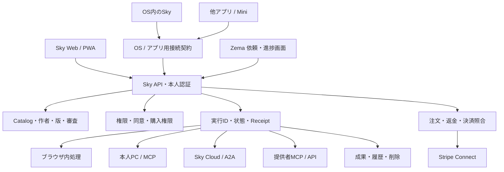

## Sky focused公開判定の修正（2026-10-02）

ROCK/WEB04: 2026-10-02: 既存Sky v28（source cb55411549649bd57429fa1afeb974139fc024da）公開成功。CSV専用Stripeはliveで、既存JPY50円受付はcompleted/stripe_verified/attempt1/revision3を公開D1で再確認した。新しい決済はしていない。一般MarketplaceのStripe/Connect受入とは別。クラウドProvider keyと信頼料金は未設定、pricing gateはfalse、production Cloud executionは0件。Pixelは接続済みだがロック中。保存回答管理と会話引継ぎの合成受入を本番owner/実AIの証明にしない。

`focused` stageを追加し、既存basic条件に実Cloud AIの応答・所要時間・項目別usage/cost・上限/timeout、同じ公開sourceのdesktop/Pixel顧客導線、全34 Toolの個別分類、対応端末のApple Payを加えた。既存paid-marketplace/clients scopeを省略せず独立して保持する。`node scripts/check-sky-launch.mjs --require-stage focused` は不足が残る限りexit 1で、設定キーの存在やmockだけでは合格にしない。検査自体の整合は`npm run verify`へ追加した。必要stage/gateの削除、基本受入の省略、合成環境のpassed、根拠欠落、依存cycle、未完了でのlaunch claimを7件の試験で拒否する。

# Sky サービス設計とローンチ受入 v1.0

設計日: 2026-10-01。対象: `k999ln/rock` のSky。公開先: `https://sky-marketplace.noellesugar1.chatgpt.site`。利用者の指示に基づき、既存デザインを維持する。これはサービスの実装・受入設計であり、全機能の本番合格を宣言する文書ではない。

## 1. 結論と製品の中心

Skyは、利用者がTool・LLMを探し、利用条件を確認し、接続して成果を受け取るマーケットプレイスである。作者には既存の自動化を登録・試験・公開・更新する入口を提供する。OS・Mini・他のアプリはSkyの顧客であり、Skyの利用にOSの導入を要求しない。

2026-10-02 authoritative direction: SIM/eSIM purchase through multiple channels includes access to RockstarOS and its integrated services. Sky is a direct Home entry and agent/tool marketplace within that offering, not the primary SIM storefront. The offer is chosen for quick cloud LLM/agent access, transparent usage-based charges, and low-setup access to Sky and Zema. The OS binary is delivered by a device-supported installation channel or service client; it is not stored on the SIM. Carrier activation and Rockstar service entitlement remain separate. The current Sky Package checkout does not include SIM entitlement, carrier charges or Cloud LLM usage, and its fixtures do not prove external connectivity or production payment. See the [SIM/eSIM-led product architecture](sim-led-product-architecture.md).

最初の価値は、文章・出典・案件条件・CSV等の具体的な仕事を、利用者が数分で完了して成果を持ち帰れること。その上で、作者のToolを同じ条件で使える市場を成立させる。掲載件数や接続先の多さを、実行可能数・収益・需要の証拠にしない。

採用する構成は、既存のWeb・API・D1・R2を用いたモジュール分割。カタログ、作者公開、実行契約、購入権限を同じサービス内で扱い、外部実行先だけadapterで分ける。初期段階でマイクロサービスへ全面分割すると本人性・権限・履歴の不整合と運用負担が増えるため、既存の境界と試験を維持する。Cloudの長時間実行は既存A2A Workerへ別接続し、短い文章処理をそれに依存させない。

## 2. 入口と責任の構成

Skyは選択・公開・アクセス判断の正本。Zemaは既存APIに結び付いた依頼・進捗画面。Walletは購入・費用・確定した金融記録を扱い、実行成功を売上へ換算しない。LLMは処理の提案と生成を行い、本人権限、審査合格、購入済み、外部操作の成功を決めない。

WebとOSに同じコードがあることと、同じDB・履歴・購入権限を共有することは別である。公開Skyは独立したSite/DBを持つ。OS側の既存DBを無断移行しない。同一originにマウントされたWeb入口は既存APIを使う。別origin・nativeクライアントの共通利用は、下記の本人確認契約の実装・受入後に有効にする。

## 3. 利用者の体験

1. サインイン前に、目的・カテゴリ・対応環境から探せる。
2. カード・詳細で「何ができるか」「現在の利用条件」「作者と版」「処理場所」「送信先」「費用」「データ保存」を確認する。
3. サインインする。ChatGPTのサインイン、モデルAPI契約、作者サービスの認証を別々に扱う。
4. サンプルを試すか、自分の入力を入れる。外部へ送信する場合はその時点で同意を取る。高影響の外部作用は実行直前に内容を確認する。
5. 一意な実行IDを発行し、進捗・停止要求・失敗・結果不明を表示する。
6. 成果を確認し、コピー・ファイル保存・明示的な端末保存を選ぶ。原文のサーバー保存を初期値にしない。
7. 履歴から使用Tool版・実行場所・完了状態を確認できる。成果本文を履歴メタデータと混同しない。

合格例は、初回利用者が出典整理を選び、サンプルの重複URLを整理し、Markdownを持ち帰り、再読込後に本人の履歴を確認できること。CSVは受付から変換・独立検査・成果物取得まで別の受入例を持つ。

## 4. 作者の体験と公開契約

既存NodeコードへのSDK追加、HTTPS API、MCPのいずれかで接続する。任意のコードをSkyサーバーで直接走らせる共通shellは作らない。提供者MCPは提供者が運営し、Skyは宣言・認証・能力一覧・権限・結果契約を照合する。

作者の状態は `draft → submitted → inspection → verified → published`。不足は `changes_requested`、権利・危険性等の不適合は `rejected`、更新で再審査、事故や鍵失効で `suspended/revoked`。現在のDBにあるstatusと審査Receiptを再利用し、これらは利用者体験上の状態に写像する。新しい名前だけをDBへ一斉追加しない。

必要情報はPackage ID、作者の認証登録、version、manifest SHA-256、配布元、license/terms/support URL、入力・出力Schema、接続方式、実行先、timeout、権限、副作用、送信先、料金、成功確認、停止・再試行方法。作者署名は同一性の証拠であって安全性保証ではない。

審査は申告の正確性、接続と能力一覧、料金・送信先・権限差分、停止・失敗・曖昧な結果、秘密情報の扱いを確認する。審査Receiptは現在のmanifest hashへ結び付ける。更新された版を古い審査で公開しない。公開Registryは有効なverified版だけを返す。

作者による登録と第三者による利用を別本人で試験する。作者が自分のToolを動かしただけでは市場の受入にならない。初回公開の作者は権利と配布条件を満たす実在の1件を選び、fixtureを一般向け商品として掲載しない。

## 5. 掲載と利用可能状態を分ける

状態は次の独立した軸で表す。

- 掲載: built-in / candidate / verified external。
- 接続: 未接続 / 設定あり / 実接続確認 / 利用不可。
- 実行能力: browser / PC / Cloud / provider、端末の機能と制約。
- 本人アクセス: 未サインイン / 同意待ち / 外部認証待ち / 購入待ち / 有効 / 失効。
- 品質証拠: 単体試験 / 結合fixture / provider sandbox / 本番受入。

設定があるだけで「本番稼働」と表示しない。公開の状態APIは秘密、キー名・値、本人ID、私有データを返さず、DB利用可否と必要接続の設定有無のみを返す。疎通・資格情報・商品権限は実行時に再確認する。状態APIに到達できなければ未知のまま扱い、成功状態へ補完しない。

法務・特許は外部AIがなくても標準ガイド／決定論的整理が利用できるので、全停止にせず「標準ガイドのみ・AI接続待ち」と表示する。Jevは接続と明示同意が必要。CSVはDBとファイル保存の条件が必要。PC接続はheartbeatと同じdevice sessionを確認し、登録済みというだけで接続中にしない。

## 6. 本人認証と他アプリの接続

現行WebはSites gatewayが設定する本人headerとsame-origin検証を使う。ブラウザや外部アプリが自称する本人headerを信頼しない。公開Workerへ直接到達する経路は、gatewayによるheader除去・再設定と直アクセス拒否を受入で確認する。

別origin/native用には、将来短命でaudienceをSkyに固定したtokenと、本人・client・scope・期限・nonce/replay防止・失効の契約を設ける。発行元の署名をserverで検証し、必要scopeだけを付与する。refreshや鍵はOSの安全な保存に置く。CORSを全originへ広げたり、Site cookieを他アプリへコピーしたりして共通化しない。HTTP MCP OAuthはMCP標準のresource/audienceとPKCEに合わせる。

Miniは端末能力snapshotから画面・音声・入力・メモリ・network・local runtimeを判定し、能力不明を対応済みにしない。同じTool契約の表示・音声・承認adapterを用いる。Web/PWAが動くことをMini実機対応の証拠にしない。nativeの権限強制は既存Brokerを通す。

### Miniで必要なOS機能と受入

| OS側の機能 | Skyとの接点 | 必要な受入 |
| --- | --- | --- |
| カタログ/目的検索 | 同じPackage IDと版を表示。音声・小さい表示はadapterが変換 | 未接続/候補/料金/送信先が省略されない |
| 安全な本人認証 | OSの安全な鍵保存、Sky向け短命token、client登録と失効 | 別clientや期限切れtokenを拒否。Site cookieのコピーはしない |
| 権限Brokerと承認 | 選択ファイル、network、外部アカウント、副作用ごとの承認 | 表示/音声で確認可能。承認できない環境では実行を止める |
| 実行/通知/停止 | 同じjob ID、revision、receiptを照合。停止要求と停止完了を別表示 | 切断/復帰/重複通知/結果不明から安全に再開する |
| 成果取得/持出し/削除 | 能力と容量に応じた表示、ファイル取得、明示的な保存 | 別本人拒否、容量超過、削除と期限切れを実機で確認 |
| Runtime選択 | browser/PC/cloud/providerの必要能力に照合する | 端末能力不明を実行可能にしない。PC向けToolをMini内で無理に走らせない |

APIのclient契約は、protocol version、入力/表示方式、利用できる実行先、artifact容量、network状態、承認方式を宣言する案とする。実機の確定能力を受けて仕様を固定し、存在しない端末機能を宣言しない。R5の製造・表示機構の合否はSkyのWebローンチと別の受入に保つ。

### 購入権限を外部Toolへ渡す境界

Skyへのtokenと提供者へのtokenを分離する。提供者へは、そのresourceをaudienceとする短命の権限、本人/商品/manifest hash/期限/失効照合の契約を用いる。Sky用tokenをそのまま別MCPへ転送しない。提供者は自分の認証と権限照合によりアクセスを強制する。JWTの署名が正しいだけで返金や審査失効を見逃さない。照合不能なら新規の有料実行を止め、既存の実行/返金はreceiptで照合する。

発行・照会・失効の具体APIは未実装。最初の作者1件と本人A/B、未購入、返金、版変更、期限、provider不達を受け入れた後にSDKへ固定する。SDKに秘密鍵を配る方式やカタログのendpointを隠すだけの方式は採用しない。

## 7. 実行と再開

既存jobs/workflow/CSV/A2Aの状態機械を再利用する。画面上は `受付 → 承認待ち → 実行中 → 完了 / 失敗 / 停止 / 結果不明` と整理するが、APIごとの実状態・revision・lease・receiptを正本にする。

各受付にjob IDとidempotency keyを発行する。価格・権限・manifest hash・実行先・入力hashのsnapshotを固定し、条件が変われば再承認する。タイムアウトは完了ではない。非冪等の投稿・請求・送信は結果不明時に再実行せず、provider照会とreceiptで照合する。停止要求とprovider停止確認を区別する。

ブラウザ処理は有限のテキスト変換とし、画面離脱時の条件を明示する。Cloudへ自動fallbackしない。Cloud継続は既存A2Aの事前承認・予算・期限・停止契約を受入後に提供する。外部作用ごとの確認が必要な仕事は、圏外中に新しい承認を推測しない。

## 8. データ、保存、削除、復元

現在の文章Toolは原文と成果をブラウザ内で処理し、serverに実行メタデータを残す。成果の端末保存は明示操作、20件・各150,000文字まで。同一ブラウザの別利用者が読めることを明示し、共有端末にはファイル保存を案内する。旧保存を無断アップロードしない。

現在のココナラ案件管理は別境界で、案件名・条件・担当者・報酬・制作/支払いの記録を本人別D1へ保存する。旧案件チェックのブラウザ変換と混同しない。汎用の成果同期を追加する前に、既存の私有業務データの保存・削除を統一的な案内へ反映する。

端末間の成果同期は次段階。利用者が「クラウドに保存」を選んだ成果だけを本人別に保存する。原文は原則保存せず、content type・byte limit・owner・tool version・revision・retention・deleteを持つ。移行する既存端末成果は本人が選択して取り込む。アカウント切替時の表示分離、削除、バックアップ上の残存期間を決めてから有効化する。

CSVは私有R2に入力・成果・検査報告を置き、D1に所有者・hash・状態・期限を保存する。既存の取得期限7日を維持する。期限切れは取得を拒否するが、物理削除は現行の次回照合に依存する。一般運用には定期cleanupと削除失敗の再送を追加し、未訪問ユーザーの期限切れファイルも処理する。metadataと成果物の整合を復元試験で確認する。

DBバックアップは本人データの取得権限と保管先を決め、最小権限・暗号化・保持期間・削除を運用契約にする。目標値は、注文・購入権限の変更を失わない照合と、重要データの復元を優先する。未測定のRPO/RTOを保証値として公表しない。復元時間と欠損を試験で測ってから目標を固定する。

## 9. 販売と料金

現行確定方針は基本登録・接続・公開・基本利用0円、検証済みTool売上にSky手数料10%。外部API、モデル、cloud、決済処理費用は別。旧8.88 USD成功報酬案を新しい請求へ戻さない。

現行Stripe Connect/Checkout、注文snapshot、署名Webhook、provider再照合、冪等な全額/部分返金を使う。作者の受取先と本人確認、価格・JPY・手数料・返金条件・商品版を購入前に固定し、戻りURLで購入済みにしない。銀行着金と注文paidを区別する。

重要な不足は有料Tool側のアクセス強制。購入済み表示だけではMCP/APIへの権限は付与されない。提供者が短命の購入権限または公式のentitlement照会を検証し、本人・商品・版・期限・返金/紛争失効を反映する必要がある。提供者との受入がない有料商品は販売開始しない。

testとliveの設定・データ・通知を分離する。sandboxで支払い成功・取消・認証失敗・通知不達/再送/順序逆転・受取先停止・返金・購入者違いを試験し、その後に本人の実決済受入へ進む。契約・本人確認・課金はAIだけで完了できない。

## 10. 運用と安全

一般利用の入口に利用方法・保存場所・削除・対応環境・接続状態を置く。障害時に原文や秘密情報を公開Issueへ送らせない。私有の問い合わせ窓口、サービス利用規約、プライバシー方針、事業者表示・返金条件は運営者が実事業条件に合わせて確定する。生成した文案を法的受入済みにしない。

監視するのは受付成功、実行完了、結果不明、API失敗、provider timeout、保存失敗、決済通知照合遅延、失効の反映。原稿・token・CSV本文をログへ入れず、job ID・error code・durationで追う。失敗率や新規利用の指標は実利用を集めてから評価し、fixture回数を利用者数にしない。

すでに存在する本文サイズ制限、job作成の120件/時、AI20件/分、CSV10MB、revision競合判定を維持する。一般運用ではユーザー/経路の上限、timeout、R2総容量、同時実行、作者申請、公開読み取りの過負荷を照合する。入力制限があることを費用上限全体の保証にしない。

事故対応は①新規受付/購入の停止、②影響版の失効、③注文・実行の照合、④利用者への案内、⑤修復と再開証拠の順。新しい版を旧版へ戻すだけでDB変更も元に戻ったとは扱わない。

## 11. 配備・更新・rollback

GitHub main、作業ソース、Site source commit、保存version、公開deploymentを別々に記録する。Sky専用Siteは既存製品サイトと旧OS Siteを更新しない。avocado製品サイトへの案内追加は、そのSiteの編集権限と最新ソースを得てから行う。

現行のSky専用DB bootstrapは新規DB向け。version=1 markerと164 schema定義・26 guardsを使う。既存DBのupgrade engineではなく、新しいテーブル・列を追加しても既存markerだけでは更新されない。今回の改善はDB schemaを変更しない。今後は明示的version N migration、適用前バックアップ、兼用可能なcode deploy、旧codeの読取互換を試験してからschemaを更新する。guardを削除して配備エラーを回避しない。

## 12. ローンチ段階と合格証拠

**基本利用ローンチ:** 初回サインイン、記事無料版・出典整理・法務/特許の標準ガイドの実行・保存・再読込、CSVの変換・検査・取得・削除、本人A/Bの分離、スマホ/PC、保存失敗・再試行、案内/データ説明、障害停止と復元が公開環境で合格する。

**外部Tool市場ローンチ:** さらに実在作者1件の申請・審査・版更新・公開・第三者接続・利用・停止・失効・秘密保護が合格する。PC/MCPは公開Webから本人PCへの接続を実際に受け入れる。localhostでだけ通る接続を合格にしない。

**有料市場ローンチ:** さらにStripe sandbox・実決済受入、提供者本人確認、購入権限の実強制、返金/失効、紛争と売上照合、契約とサポートが合格する。

**OS/他アプリ共通利用:** 共通APIの本人確認・scope・失効・履歴/購入権限の整合を別clientで受け入れる。Mini/nativeは端末ごとの能力と実機受入を追加する。これらをWeb公開の完成率に混ぜない。

本番未設定の有料市場を「完全ローンチ」と呼ばない。一方、候補22件・eSIM・自社衛星・Mini製造・OS image完成を基本Webサービスの必須条件にはしない。候補は段階的に審査して公開する。

## 13. 今日の実装順と担当

ROCK: 設定状態APIとカードの正確化 → Sky内のヘルプ・戻り導線 → 公開sourceに対する回帰 → 配備と状態readback → 初回利用の本番受入。

ROCK: 作者公開・失効の既存コードと試験を再確認し、実在Toolの公開手順、最小必要secret、審査Receipt、利用者/作者A/Bの受入表を用意する。fixture-onlyの成功を外部提供者の成功としない。

JOINT: 外部MCP OAuth、PC relay、モデルAPI、Stripe sandbox、provider entitlement、通知・返金・売上照合。

OWNER: 本番サインイン操作、外部アカウント契約/本人確認、モデル利用の予算、販売者の実情報と商品条件、私有サポート連絡先、製品サイト編集権限。秘密値はchat・Git・原稿へ貼らず管理面で登録する。

未決定事項は担当・条件・試験を持つ: 有料Tool1件は権利/提供者認証/価格/返金条件を満たす作者を選ぶ。クラウド成果保存の保持期間は利用者の扱うデータと削除/復元試験で決める。外部モデルの予算はjobあたり/日あたりの上限と超過停止を決める。私有問い合わせは運営者が読める宛先を設定して疎通する。これらを仮の値で一般契約へしない。

運用担当が実行する手順と現在の在庫は [ローンチ運用・受入](sky-launch-operations.md) にまとめた。機械判定は `npm run sky:launch:check`。`--require-stage basic` 等を付けた判定は必要な同一候補の受入が不足すると失敗し、未受入の公開を完成扱いにしない。既存の`completeLaunchClaim`はstandalone Webの`paid`段階に対する履歴判定として保持する。全体の最終判定は`--require-stage complete`で有料市場・OS/Mini/他アプリ共通利用・focused顧客導線の3段階を要求し、任意の`integratedLaunchClaim`もこの同一候補の判定と照合する。Webだけの初回公開判断は`basic`・`paid`で別途行い、全体完成へ転用しない。

## 14. 根拠

コード: `lib/catalog.ts`, `lib/sky-tool-ui.ts`, `lib/operations.ts`, `lib/csv-job-store.ts`, `lib/request-auth.ts`, `lib/sky-tool-package-store.ts`, `lib/sky-tool-review.ts`, `lib/sky-commerce.ts`, `lib/sky-stripe.ts`, `lib/sky-result-library.ts`。設計: `docs/sky.md`, `docs/sky-mcp-architecture.md`, `docs/sky-billing.md`, `docs/sky-cloud-continuity.md`, `docs/workstreams/02-sky-mcp.md`。

外部標準: [MCP Authorization](https://modelcontextprotocol.io/specification/2025-11-25/basic/authorization)、[Stripe API keysとtest/live](https://docs.stripe.com/keys)、[OWASP API Security Top 10](https://api-security.owasp.org/editions/2023/en/0x11-t10/)。これらは設計の基準であり、Skyが認証・決済・安全性の認定を受けた根拠ではない。

## 同一候補の最終受入と履歴試験の分離

既存の17 gate（基本・市場・有料・clientの12件とfocusedの5件）を保持し、`complete` stageは`paid`・`clients`・`focused`のすべてに依存する。既存の技術・初回公開判断の分割、未完了の親task、r46の22項目再評価は変更しない。`scripts/sky-launch-validation.mjs`は既存の履歴監査に加えて、gateの削除や依存削除による完成扱いを拒否する。

現在の候補には本番受入用の`candidate`をまだ設定しない。過去の公開入口・runtime部分確認・限定CSV決済のstatusとevidenceは既存reportのまま保持し、移動・再分類しない。`acceptanceEvidence`で同一候補へ結び付いていないpassed記録は履歴のみとして表示し、候補の合格件数には含めない。通常の構造検査は未完了reportでも成功するが、`--require-stage`による受入要求は不足があれば失敗する。過去の合格証拠を捨てたり、現在の本人認証・実接続を推測したりしない。

passedのgateを同一候補の合格へ算入するには、gateのevidenceに含まれるJSON実受入記録を`acceptanceEvidence`へ指定する。記録はschema `sky-launch-acceptance/1`、対象gateId、result `passed`、execution `actual`、実試験environment、observedAtを持ち、sourceCommit・buildSha256・deploymentId・siteVersionの4項目すべてがreportの`candidate`と一致する。mock/fixture、別環境、別gate、候補と異なるsource/build/deployment/versionは拒否する。文書や試験ソースの存在だけでは候補の合格にしない。この構造検査は実顧客導線を実行・認定するものではなく、宣言した候補が実際の配備対象であることと、記録が示す受入範囲の独立確認も必要である。

保存済みR1の監査試験fixture修正は、実配備設定と記録済みの旧本人限定監査を混同しないため、テスト内だけへ限定統合する。現在のpackage-lockに対応する948/911/49の検査は保持。実設定を読むrelease CLI、validator、本番Sites identity、既存アクセス制御は変更しない。35単体試験の合格は本番readbackではなく、公開判定は引き続き未合格。
