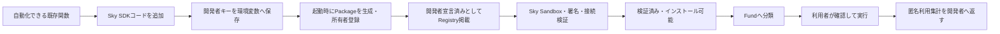

# Sky Tool SDK / Rock Studio — 自動化をSky商品へする標準導線

最終更新: 2026-09-15

## 目的

開発者が「この処理は自動化できる」と気づいた時、既存コードの作り直しではなく、Skyの雛形へ関数を接続するだけでLLMが安全に選べるToolへ変換する。Stripeの決済SDKのように、Sky Tool SDKをコードへ組み込むことで登録、MCP公開、匿名利用集計までを同じ定義から行う。

Sky Tool SDKそのものを自動化Toolの標準雛形として周知する。SDKを導入しただけで検証済みになるのではなく、開発者の宣言、Sky側の検証、利用者の実行時承認を分離する。

## 開発者の最短導線



通常はPCの`/studio`を開き、SDKの導入コマンドと組込みコードをコピーして既存ツールへ追加する。Rock Studioで一度だけ開発者キーを発行し、コードへ直書きせず`SKY_DEVELOPER_TOKEN`環境変数へ保存する。ツールを起動すると、SDKが同じ定義から`sky-tool-package/1`を生成し、所有者登録、宣言公開、MCP公開、匿名利用記録を行う。既存ツールのソース本文はSkyへ送らない。

CLIから新規Toolを作る場合は、次のコマンドも利用できる。

```sh
node toolkits/sky-tool-sdk/bin/create-sky-tool.mjs init work/my-sky-tool \
  --developer your-developer-id \
  --app-id com.example.my-tool
```

生成された`index.mjs`の`handler`を既存関数の呼び出しへ置き換える。既存プロジェクトでは`createSkyToolApp()`と`sky.tool()`を直接追加してもよい。同じTool定義が以下の正本になる。

- LLM向けの目的、使う場面、禁止場面
- JSON Schemaの入力と出力
- 権限、副作用、接続、料金、開発者受取人
- timeout、最大試行1回、成功確認方法
- Fund分類と検索タグ
- MCP `tools/list` / `tools/call`
- Sky登録用の不変なPackageとSHA-256

## PCでの登録

`/studio`は消費者向けSkyとは分けたSDK組込み用の開発者画面である。SDK配布物、コピー可能な組込みコード、開発者キー発行、登録後のSky確認を一画面にまとめる。ブラウザから既存ツールのコードやファイルを送らず、SDKが生成したPackageだけをRegistry APIへ送る。

Sky Tool SDKは同じTool定義から次を生成する。

| 分類 | 生成する内容 |
| --- | --- |
| 発見 | Tool名、説明、LLM向け用途、使う場面、禁止場面、Fund分類、タグ |
| 契約 | 入出力Schema、Adapter、接続先、必要権限、online/offline、実行先 |
| 安全 | 副作用、timeout、最大試行、idempotency、確認方式、成功確認、テスト候補 |
| 商流 | 無料・有料の方式、料金説明、開発者受取人ID、ライセンス、サポートURL |
| 由来 | 開発者ID、source URL、Package ID、semver、canonical SHA-256 |

生成値は推定であり、開発者が権利、価格、副作用、Schema、試験を確認してから登録する。SDKから登録する場合も、同じPackage parserを通る。

## 状態と公開範囲

| 状態 | 意味 | Skyから自動導入 |
| --- | --- | --- |
| `submitted` | 所有者領域へ保存。ID・版・SHAを固定 | 不可 |
| `published_declared` | 開発者の宣言として公開Registryに掲載 | 不可 |
| `verified` | Sky側のSandbox、作者、権限差分、接続、試験に合格 | 可 |
| `rejected` / `revoked` | 検査不合格または失効 | 不可 |

現在実装したのは`submitted`と`published_declared`までである。一般開発者向けの署名局、任意コードSandbox、審査操作、失効配信、公開remote MCP/OAuthの本番受入は未実装なので、宣言済みToolを検証済み・自動導入可能とは表示しない。

## APIと保存データ

| API | 認証 | 用途 |
| --- | --- | --- |
| `POST /api/sky/developer-tokens` | ブラウザ本人 | SDK用キーを発行。平文は一度だけ表示 |
| `POST /api/sky/tool-packages` | 開発者キーまたはブラウザ本人 | Packageを所有者領域へ登録 |
| `POST /api/sky/tool-publications` | 開発者キーまたはブラウザ本人 | exact Package ID・版・SHAを宣言公開 |
| `GET /api/sky/tool-registry` | 公開 | 公開Packageと導入可否を取得 |
| `POST /api/sky/tool-events` | 開発者キー | 匿名利用イベントを記録 |
| `GET /api/sky/tool-events` | ブラウザ本人 | 自分のToolの集計だけを表示 |

開発者キーはSHA-256だけをD1へ保存し、失効できる。利用イベントはPackage ID、Tool名、匿名Installation ID、結果区分、処理時間、実行時刻だけを受け付ける。入力、出力、会話、APIキー、Wallet残高は送信・保存しない。

## MCPと実行安全

SDKはNode.js内にMCP `initialize`、`notifications/initialized`、`tools/list`、`tools/call`、`/health`を提供する。入力とhandlerの出力を宣言Schemaへ照合し、timeoutを成功にしない。外部書込みまたは金融副作用があるToolは`authorize` callbackがなければ定義を拒否する。

SDK単体の`authorize`は承認UIではない。Sky Connectorから実行する場合は、引数に結び付いた一回限りのExecution Covenantをcallbackで検証する。送信後timeoutは`outcome_unknown`とし、自動再試行しない。SDKのhandlerは開発者プロセスで動くため、任意コードSandboxの代替ではない。

## Fundとの関係

Toolは単独でもMCPとして利用できる。Fundは複数Toolを目的別に束ね、LLMが順序、停止条件、成果確認を計画する商品面である。`fund.categories`と`fund.tags`はFund候補を探す情報であり、権限を増やしたり承認を省略したりしない。有料Toolの対価はPackageの開発者受取人へ帰属し、ToBのSky登録料・基本利用料・Sky売上手数料は0の既存方針を維持する。決済・払出しProviderの本番受入までは実売上や送金を開始しない。

## 完了条件

- 雛形を空のdirectoryへ安全に生成でき、既存ファイルを上書きしない。
- 一つの定義からPackage登録、MCP discovery、Tool実行ができる。
- 不正入力と不正出力をhandler境界で拒否する。
- 外部変更・金融操作は承認callbackなしで起動できない。
- 同一Package ID・版を別内容で上書きできない。
- 宣言公開と検証済み公開を区別し、前者を自動導入させない。
- 開発者キーの発行・利用・失効と、本文を含まない利用集計を確認できる。
