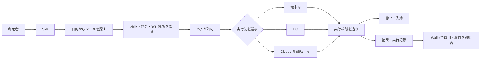

# Sky — 自動化を選び、許可し、動かし、止め、結果を受け取る場所

最終更新: 2026-09-12

## Skyとは

Skyは単なるツール一覧やアプリストアではない。自動化ツールを仕事として安全に使うために、探す → 権限・料金を確認 → 端末・PC・Cloudへ届ける → 実行・停止 → 結果・実行記録を受け取る、という操作を一つの入口へまとめる。

全商品に「実行パスポート」を付ける。実行場所、接続経路、CloudとCodexの要否、データ保存先、単独運転可否を商品画面に常時表示し、開発者の申告とSkyが現在確認した接続状態を分ける。

利用者に見える製品名はすべて **Sky** とする。保存済み履歴、SQLiteテーブル、JSON応答、画面ルーティングに残る `hub` / `Hub` は既存データと通信契約を壊さないための内部互換名で、新しい製品名ではない。

## 現在Skyにあるツール

### Web / PCで現在使える6件

| ツール | 実行場所 | 現在できること | 明示的な限界 |
| --- | --- | --- | --- |
| Instagram運用・受注型ブランド管理 | PC / MCP | 目標から広告・接客・受注・制作・改善を38操作で管理 | 初期値はmock。Autopilotは外部作用を直接実行せず、実Provider・実投稿・実請求は未接続 |
| サブスク顧問 | RockstarOS端末 / PCフォールバック / OS管理MCP | 契約、更新日、支払い失敗、通貨別月額をローカル台帳から確認 | CloudとCodexは不要。自家発電装置との接続は未確認。解約、支払い、税務申告は自動実行しない |
| ココナラ案件チェック | Webブラウザ | 依頼文と提案文の条件の食い違いを確認 | 自動応募・返信・入金確認はしない |
| 記事の無料版メーカー | Webブラウザ | 完全版原稿から無料紹介用の文章を作る | 自動執筆・投稿・販売はしない |
| 出典整理ツール | Webブラウザ / PC接続 | Markdownの出典URLを整理 | 出典内容の真偽確認はしない |
| 納品記録の照合 | PC / Python | 契約・成果物・制作記録・別レビューの不一致を探す | 品質や秘密情報の不在を保証しない |

この6件は `lib/catalog.ts` で `ready` とされる。Fashion Brand Opsはstdio/HTTP MCP接続、サブスク顧問はローカルPC台帳、納品記録の照合はPC接続が必要。既存の3件はWebブラウザだけで完結する。Fashion Brand Opsの価格変更、外部生成、投稿・広告、DM送信、請求、返金、通知は個別承認が必要である。

### Skyに表示する導入候補3件

| 候補 | 目的 | 現在の状態 |
| --- | --- | --- |
| faster-whisper | 音声の文字起こし | 候補。Skyからの自動導入・実行は未接続 |
| Transformers.js | ブラウザ内AI | 候補。モデル選定・配布・実行は未接続 |
| Playwright | 許可されたWeb操作とテスト | 候補。第三者サイトの無人操作は未許可 |

候補は「使えるツール数」に含めない。

### native OS開発版に内蔵する6種類・9バージョン

| 署名済み開発ツール | 内蔵版 | 用途 |
| --- | --- | --- |
| 共有用チェックリスト | 1.0.0 / 2.0.0 | 行をMarkdownチェックリストへ変換 |
| 引用整理 | 1.0.0 | 明示された出典を一覧へ整理 |
| 提案下書き | 1.0.0 / 1.1.0 | 募集条件から送信前の提案下書きを作る |
| 文章を整える | 1.0.0 / 2.0.0 | 空白と空行を整理 |
| リストの重複を整理 | 1.0.0 | 重複行の除去と並べ替え |
| 入力テキストのSHA-256 | 1.0.0 | 入力した文字列のUTF-8 hashとサイズを計算 |

これらは `systems/rock-star-os/examples/registry/` からBuildroot imageへコピーされる開発署名パッケージ。すべて端末内の有限テキスト処理で、権限は `text.input` と `text.output`、価格は0 USD。公開RFCテスト鍵を使うため、本番配布の作者本人性や信頼を証明するものではない。

## Skyの優位性

個々の自動化処理だけなら、iPhoneアプリ、Webサービス、PCスクリプトでも代替できる。SkyがOSと組み合わさる意味は、処理内容そのものではなく、異なる実行先の自動化を同じ制御契約で扱うことにある。

- 実行前: 作者・版・権限・送信先・料金を同じ形式で確認する。
- 実行中: 端末内、PC、Cloudのどこで動いても同じ仕事IDで状態を追い、停止できる。
- 実行後: 結果、失敗、使用版、費用の記録を同じ履歴へ戻す。
- 更新時: Tool packageの追加・更新ではOS全体を再buildせず、署名、失効、rollbackをTool単位で扱う。
- 障害時: 再起動や接続切れを「成功」にせず、中断・不明・再確認を区別する。

現在この価値はQEMUと開発用のWeb/PC経路で部分的に検証済み。実端末、実Cloud provider、実課金、一般公開を完了したという意味ではない。

## RockstarOSハードウェア単独運転

目標形は `Sky → RockstarOS端末 → OS管理MCP → ツール` で、計算・保存・停止・結果確認を一台に閉じる構成である。サブスク顧問はこの実行契約を持ち、CloudもCodexも必須にしない。PCは実機前のフォールバックであり、正式な端末ではOSの専用IPCへ置き換わる。

「端末単独で計算できる」と「自家発電で電力を賄える」は別である。現時点の電力源は端末バッテリーまたは外部電源として扱う。将来は発電入力、蓄電量、消費電力、予測稼働時間をOSのEnergy serviceで観測し、必要処理能力と照合する。発電ハードウェアと実測がない状態では自給運転済みと表示しない。

## 正本と互換境界

- 製品名・画面名: `Sky`
- OS全体: `RockstarOS`
- 金融記録: `Wallet`
- 内部互換名: `hub` / `Hub`
- Webカタログ正本: `lib/catalog.ts`
- native内蔵カタログ正本: `systems/rock-star-os/examples/registry/`
- native package仕様: `systems/rock-star-os/docs/TOOL-SDK.md`
- ToB掲載・ToC Timeline・MCP接続設計: `docs/sky-mcp-architecture.md`
