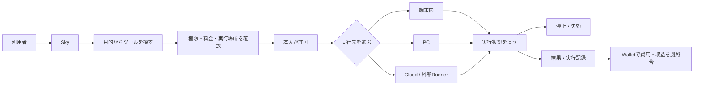

# Sky — 自動化を選び、許可し、動かし、止め、結果を受け取る場所

最終更新: 2026-09-20

## Skyとは

Skyは単なるツール一覧やアプリストアではない。自動化ツールを仕事として安全に使うために、探す → 権限・料金を確認 → 端末・PC・Cloudへ届ける → 実行・停止 → 結果・実行記録を受け取る、という操作を一つの入口へまとめる。

利用者に見える製品名はすべて **Sky** とする。保存済み履歴、SQLiteテーブル、JSON応答、画面ルーティングに残る `hub` / `Hub` は既存データと通信契約を壊さないための内部互換名で、新しい製品名ではない。

## Zemaとの連携

SkyはToolを探して接続する場所、Zemaは選択後の依頼、実行、進捗、結果、履歴を扱う場所とする。Skyの自然文受付で担当が決まると、Tool IDと依頼をZemaへ引き継ぐ。依頼本文はURLやD1へ保存せず、同一tabのsession storageへ最大2,000文字・10分だけ置き、Zemaが対象Toolとして一度受け取ると削除する。これにより法務、特許、原稿等の依頼本文を新しいserver保存対象へ広げない。

Zema内で実行したjobは、受付、開始、完了、失敗をbrowser eventで即時表示し、本人別D1を3秒または15秒で再照合する。browser eventだけを完了証拠にはしない。CSV、Mercari、Market等の専用画面を持つToolはZemaに担当カードを表示し、専用画面で入力・確認した後、保存済みjob／receiptの進捗をZemaへ戻して確認する。

## 接続情報の登録と再利用

### IP Studio — SNS・ゲーム運用

Skyのアプリ一覧に `IP Studio — SNS・ゲーム運用` を登録した。参考画像と「何をしたいか」を入力するIP制作室を、Skyの接続・承認・停止状態から1タップで開ける。IP Studio側ではキャラクター／スキンの制作、Higgsfieldでの画像・動画生成、ゲーム別の導入記録、Instagram・YouTubeの投稿案、Makeへの送信までを同じIPの履歴で扱う。

Skyが保持するのは本人、仕事、接続参照、承認、停止、次の作業であり、IP Studioが保持するのは素材と生成・投稿案の参照である。Higgsfield APIキー、Make webhook token、Instagram／YouTubeのログイン情報はSkyの本文やIP Studioの入力欄へ保存しない。外部生成、投稿、広告、DM、ゲームへの提出は毎回確認してから実行する。

ローカル版では、Skyで `IP Studio — SNS・ゲーム運用` を選び「1タップでSkyに登録」→登録完了後「IP Studioを開く」の順で、同じ端末のIP Studio（`http://127.0.0.1:18767/`）へ移動する。Higgsfield、Make、Instagram、YouTube、Roblox、GTAの接続情報はSkyの「サービス接続を管理」から先に登録できる。

Skyの「サービス接続を登録」からInstagram、YouTube、Higgsfield、Make、Stripe、Roblox、GTA／FiveMの設定を保存できる。Toolを選んだときに未登録のProviderがあれば同じ画面を開き、「あとで続ける」か「登録して使う」を選ぶ。保存するのはアカウント名、チャンネル、公開URL、ワークスペースなどの再入力を減らすための設定で、パスワード、APIキー、アクセストークン、秘密鍵は保存しない。

Providerルーティングでは、用途ごとに実行する接続先を差し替えられる。画像生成、動画生成、文章・LLM、ワークフロー、SNS公開、ゲーム導入を個別に選び、HiggsfieldをRunway・Kling・Replicate・OpenAI互換アダプタ・ローカルモデルへ置き換えるような構成を保存する。Make、Instagram、YouTube、Roblox、GTA／FiveMも同じ選択枠で扱う。未接続の候補も先に選択を保存でき、実行時には必要なConnectorの登録へ戻す。これによりTool側はProvider名を固定せず、同じ入出力契約を満たすアダプタへ仕事を渡せる。

実際の仕事ではZemaの処理カードにある「この仕事のProviderを変更」から、今回だけの上書きを行う。Skyの既定ルーティングは残したまま、動画だけKling、文章だけローカルモデルという指定ができ、選択は同じProvider設定へ保存される。

SkyからZemaへ渡る仕事の既定実行器はOS内のローカルLLM（Local Action Assistant / Qwen）である。ローカルLLMが依頼の整理、手順、確認を進め、画像・動画生成やSNS公開など外部作用が必要な時だけ、Zemaで選んだProvider Connectorへ処理を渡す。外部LLMへ切り替える場合は、ZemaのProvider選択と別に明示的なremote同意を要求する。

内蔵の `Qwen3-0.6B-Q8_0-GGUF` は軽量な既定値で、品質を上げたい場合はZemaのモデルID欄から、接続済みのOllamaに `qwen3:8b`、`qwen3:14b`、`gemma3:12b`、`llama3.1:8b` などを指定できる。未導入モデルを選んでも自動で外部へ送らず、Ollamaまたは対応するローカルConnectorの接続待ちで止まる。

接続状態は `未登録`、`設定済み`、`再接続が必要` に分ける。Toolの利用許可は `sky_connections`、Providerの設定は `sky_provider_connections` に分けて保存し、設定済みなら次回から再入力を省略する。実際のOAuthや外部作用の成功を意味する状態ではない。

## 現在Skyにあるツール

### Web / PCで現在使える12件

| ツール | 実行場所 | 現在できること | 明示的な限界 |
| --- | --- | --- | --- |
| CSV整形・検査・納品 | Sky Cloud / Webブラウザ | CSV 1ファイルの受付、指定変換、独立検査、私有成果物、7日取得期限を管理 | 外部市場の出品・連絡・入金・返金は本人操作。手入力入金はWallet収益にせず、buyer直接共有と独立queueは未接続 |
| RockstarOS Markets | Webブラウザ / 公開市場API / PC offline backtest | 公開ライブ確率・出来高・流動性を表示し、固定commitのPolymarket bot backtest reportを検証 | 市場は読取専用、botはbacktest専用。秘密鍵・LIVE切替・注文・Wallet移動は無効。simulation PnLを収益にしない |
| メルカリ収益スターター | Webブラウザ / Shops Connector | 出品原稿、実費後の見込み利益、承認、出品・取引完了の進捗を管理 | 個人版は本人が公式画面で操作。Shopsの自動連携と検証済み売上は固定IP Connector・契約・Token接続前は無効 |
| Instagram運用・受注型ブランド管理 | PC / MCP | 写真の候補取込から広告・接客・受注・制作・改善を41操作で管理 | 初期値はmock。Meta確認前の候補とAutopilotは外部作用を直接実行せず、実Provider・実投稿・実請求は未接続 |
| サブスク顧問 | PC / MCP | 契約、更新日、支払い失敗、通貨別月額をローカル台帳から確認 | 読み取り専用。解約、支払い、税務申告は自動実行しない |
| ココナラ案件チェック | Webブラウザ | 依頼文と提案文の条件の食い違いを確認 | 自動応募・返信・入金確認はしない |
| 記事の無料版メーカー | Webブラウザ | 完全版原稿から無料紹介用の文章を作る | 自動執筆・投稿・販売はしない |
| 出典整理ツール | Webブラウザ / PC接続 | Markdownの出典URLを整理 | 出典内容の真偽確認はしない |
| 納品記録の照合 | PC / Python | 契約・成果物・制作記録・別レビューの不一致を探す | 品質や秘密情報の不在を保証しない |
| 法務受付 | Webブラウザ | 相談内容を整理し、公式情報と無料窓口を案内 | 法的助言・期限・受任を保証せず、自動連絡しない |
| 特許アシスタント | Webブラウザ | 発明情報から調査候補と出願書類ドラフトを作る | 特許性・登録を保証せず、提出・支払を自動化しない |
| Jev品質評価 | Sky Cloud / AI Gateway | 確認済みの最小出力を根拠性・安全性・有用性の観点で評価する | 評価は助言のみ。個人情報・法務相談・未公開発明を送らず、権限や成功判定に使わない |

この12件は `lib/catalog.ts` で `ready` とされる。ここでの`ready`はSkyの商品UIと安全な縮退経路が利用可能というcatalog状態であり、外部credential設定済み、provider接続確認済み、実機OS合格、本番合格を意味しない。法務受付と特許アシスタントはSkyの正規Toolとして端末内処理を標準にし、オンライン検索は本人が明示許可した場合だけ行う。Jevはroute・同意UI・closed rubric・Evaluation Receiptまで実装済みだが、`AI_GATEWAY_API_KEY`設定、provider条件・料金確認、sandbox／本番受入は別gateとして残る。CSV仕事はSky Cloudで受付・変換・検査・私有保存を行うが、販売・決済・buyer共有は別gateである。RockstarOS Marketsは互換商品名として残る公開ライブ市場の読取専用Toolで、取得失敗時にサンプル値で補完しない。外部Polymarket botは固定commit・clean treeのoffline backtestだけを利用し、秘密鍵と注文runtimeは接続しない。Fashion Brand Opsはstdio/HTTP MCP接続、サブスク顧問はローカルPC台帳、納品記録の照合はPC接続が必要。メルカリ個人版はWeb内で原稿と進捗を管理し、外部操作は公式画面へ引き継ぐ。Fashion Brand Opsの価格変更、外部生成、投稿・広告、DM送信、請求、返金、通知は個別承認が必要である。

Jevは[LLM・評価モデル設計](llm-evaluation-architecture.md)に従うSkyの任意remote evaluatorで、法務受付・特許アシスタントとは別Tool・別provider同意で動く。

### Skyに表示する導入候補21件

| 候補 | 目的 | 現在の状態 |
| --- | --- | --- |
| faster-whisper | 音声の文字起こし | 候補。Skyからの自動導入・実行は未接続 |
| Transformers.js | ブラウザ内AI | 候補。モデル選定・配布・実行は未接続 |
| Playwright | 許可されたWeb操作とテスト | 候補。第三者サイトの無人操作は未許可 |

旧Mr. Automation Hub由来の11件もSkyの導入候補に追加した。提案文、受託ワークフロー、依頼整理、YouTube台本、SEO、LP、商談返信、顧客インタビュー、予定、Telegram通知、外部ツール発見を含む。各候補の実行器、本人の外部アカウント接続、料金・結果照合は未受入である。[候補ごとの受入条件](sky-mr-automation-candidates.md)を参照。

自動化として接続可能性のあるJev周辺7件も候補に加えた。ブラウザ操作2件、PC画面操作、Android操作、コードレビュー、モデル振分け、市場のPAPER試験である。資料集とモデル研究2件は実行する自動化ではないため含めない。外部送信・書込み・購入・実取引は承認と結果確認の受入前に有効化しない。

候補は「使えるツール数」に含めない。

PC内でSky Tool SDK 0.1.2から起動したAppは、所有者専用の接続定義をConnectorが検出した場合だけSky一覧に表示する。カードから接続するとMCP初期化と機能一覧を確認し、その後の実行は内容別の一回承認を要する。停止時は一覧から除き、古い承認を失効させる。公開HTTPS URLと開発者キーはPC内専用起動には不要で、公開登録時だけ必要。これはWeb／PC経路であり、native OSのRegistry導入とは別の受入である。

### native OS開発版に内蔵する6種類・9バージョン

| 署名済み開発ツール | 内蔵版 | 用途 |
| --- | --- | --- |
| 共有用チェックリスト | 1.0.0 / 2.0.0 | 行をMarkdownチェックリストへ変換 |
| 引用整理 | 1.0.0 | 明示された出典を一覧へ整理 |
| 提案下書き | 1.0.0 / 1.1.0 | 募集条件から送信前の提案下書きを作る |
| 文章を整える | 1.0.0 / 2.0.0 | 空白と空行を整理 |
| リストの重複を整理 | 1.0.0 | 重複行の除去と並べ替え |
| 入力テキストのSHA-256 | 1.0.0 | 入力した文字列のUTF-8 hashとサイズを計算 |

これらは `systems/rock-star-os/examples/registry/` からBuildroot imageへコピーされる開発署名パッケージ。すべて端末内の有限テキスト処理で、権限は `text.input` と `text.output`、価格は0 USD。公開RFCテスト鍵を使うため、本番配布の作者本人性や信頼を証明するものではない。

## Skyの優位性

個々の自動化処理だけなら、iPhoneアプリ、Webサービス、PCスクリプトでも代替できる。SkyがOSと組み合わさる意味は、処理内容そのものではなく、異なる実行先の自動化を同じ制御契約で扱うことにある。

- 実行前: 作者・版・権限・送信先・料金を同じ形式で確認する。
- 実行中: 端末内、PC、Cloudのどこで動いても同じ仕事IDで状態を追い、停止できる。
- 実行後: 結果、失敗、使用版、費用の記録を同じ履歴へ戻す。
- 更新時: Tool packageの追加・更新ではOS全体を再buildせず、署名、失効、rollbackをTool単位で扱う。
- 障害時: 再起動や接続切れを「成功」にせず、中断・不明・再確認を区別する。

現在この価値はQEMUと開発用のWeb/PC経路で部分的に検証済み。実端末、実Cloud provider、実課金、一般公開を完了したという意味ではない。

## 開発者が自動化を追加する場所

開発者はPCの`/studio`またはSky Tool SDKを使う。SDKは自動化したい既存関数を`handler`へ接続する雛形であり、用途、禁止場面、入出力Schema、Adapter、権限、副作用、料金、timeout、成功確認、Fund互換情報を一つの定義からPackageとMCPへ変換する。これにより「Sky専用に全コードを書き直す」のではなく、「自動化できる処理へSkyの契約を被せる」導線にする。

登録したToolは最初に所有者領域へ入り、開発者の宣言としてRegistryへ掲載できる。ただし、宣言公開とSky検証済み公開を分ける。現在のDeveloper PreviewではSandbox・作者署名・公開remote接続の検証は未実装なので、自動インストールは無効のままである。SDKの匿名利用集計はPackage ID、Tool名、結果、処理時間だけを扱い、入力・出力・会話・秘密情報を送らない。詳細は[Sky Tool SDK / Rock Studio](sky-tool-sdk.md)を正本とする。

## 正本と互換境界

## Telegramからの有効化

Rock Studioまたは`/sky`画面で、`published_declared`または`verified`の自作Toolを選び、Telegram用の有効化コードを発行できる。コードは`SKY-XXXX-XXXX-XXXX-XXXX`形式の不透明な値で、D1にはSHA-256だけを保存する。発行者は使用回数、期限、失効を設定できる。

Telegramでは`/sky_build 自作コード`でコードを解析し、PackageのManifestと一回用の有効化コードを発行できる。発行された`/sky CODE`を送ると、BotはSkyの内部Bridgeでコードを検証し、Telegram利用者IDにTool PackageへのGrantを結び付ける。`/sky_tools`で有効化済みToolを確認できる。同じ利用者が同じToolを再送してもGrantは増えず、入力ソースは保存せず、コードはログへ出さない。

このコードはソースコードをBotへ送ってビルド・実行する仕組みではない。既存関数をSky Tool SDKでPackage化し、Sky側で公開した後に、Telegramから利用権だけを渡す設計である。外部書込み、決済、送信などの副作用はPackageの宣言と実行時確認を別に要求する。`LM_SKY_URL`と`LM_SKY_TELEGRAM_BRIDGE_SECRET`をBot側、`SKY_TELEGRAM_BRIDGE_SECRET`をSky側へ設定する。

- 製品名・画面名: `Sky`
- OS全体の現行表示名: `avocadoOS`
- OS内部識別子: `dev.rock`
- 互換商品名・path・package prefix: `RockstarOS` / `rockstaros-*` / `/rockstaros`
- 金融記録: `Wallet`
- 内部互換名: `hub` / `Hub`
- Webカタログ正本: `lib/catalog.ts`
- native内蔵カタログ正本: `systems/rock-star-os/examples/registry/`
- native package仕様: `systems/rock-star-os/docs/TOOL-SDK.md`
- ToB掲載・ToC Timeline・MCP接続設計: `docs/sky-mcp-architecture.md`
- 開発者SDK・PC登録・Package・公開状態: `docs/sky-tool-sdk.md`
