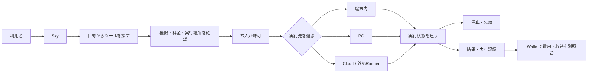

# Sky — 自動化を選び、許可し、動かし、止め、結果を受け取る場所

最終更新: 2026-09-19

## Skyとは

Skyは単なるツール一覧やアプリストアではない。自動化ツールを仕事として安全に使うために、探す → 権限・料金を確認 → 端末・PC・Cloudへ届ける → 実行・停止 → 結果・実行記録を受け取る、という操作を一つの入口へまとめる。

利用者に見える製品名はすべて **Sky** とする。保存済み履歴、SQLiteテーブル、JSON応答、画面ルーティングに残る `hub` / `Hub` は既存データと通信契約を壊さないための内部互換名で、新しい製品名ではない。

## Zemaとの連携

SkyはToolを探して接続する場所、Zemaは選択後の依頼、実行、進捗、結果、履歴を扱う場所とする。Skyの自然文受付で担当が決まると、Tool IDと依頼をZemaへ引き継ぐ。依頼本文はURLやD1へ保存せず、同一tabのsession storageへ最大2,000文字・10分だけ置き、Zemaが対象Toolとして一度受け取ると削除する。これにより法務、特許、原稿等の依頼本文を新しいserver保存対象へ広げない。

Zema内で実行したjobは、受付、開始、完了、失敗をbrowser eventで即時表示し、本人別D1を3秒または15秒で再照合する。browser eventだけを完了証拠にはしない。CSV、Mercari、Market等の専用画面を持つToolはZemaに担当カードを表示し、専用画面で入力・確認した後、保存済みjob／receiptの進捗をZemaへ戻して確認する。

## 現在Skyにあるツール

### Web / PCで現在使える12件

| ツール                            | 実行場所                                        | 現在できること                                                                           | 明示的な限界                                                                                               |
| --------------------------------- | ----------------------------------------------- | ---------------------------------------------------------------------------------------- | ---------------------------------------------------------------------------------------------------------- |
| CSV整形・検査・納品               | Sky Cloud / Webブラウザ                         | CSV 1ファイルの受付、指定変換、独立検査、私有成果物、7日取得期限を管理                   | 外部市場の出品・連絡・入金・返金は本人操作。手入力入金はWallet収益にせず、buyer直接共有と独立queueは未接続 |
| RockstarOS Markets                | Webブラウザ / 公開市場API / PC offline backtest | 公開ライブ確率・出来高・流動性を表示し、固定commitのPolymarket bot backtest reportを検証 | 市場は読取専用、botはbacktest専用。秘密鍵・LIVE切替・注文・Wallet移動は無効。simulation PnLを収益にしない  |
| メルカリ収益スターター            | Webブラウザ / Shops Connector                   | 出品原稿、実費後の見込み利益、承認、出品・取引完了の進捗を管理                           | 個人版は本人が公式画面で操作。Shopsの自動連携と検証済み売上は固定IP Connector・契約・Token接続前は無効     |
| Instagram運用・受注型ブランド管理 | PC / MCP                                        | 写真の候補取込から広告・接客・受注・制作・改善を41操作で管理                             | 初期値はmock。Meta確認前の候補とAutopilotは外部作用を直接実行せず、実Provider・実投稿・実請求は未接続      |
| サブスク顧問                      | PC / MCP                                        | 契約、更新日、支払い失敗、通貨別月額をローカル台帳から確認                               | 読み取り専用。解約、支払い、税務申告は自動実行しない                                                       |
| ココナラ案件チェック              | Webブラウザ                                     | 依頼文と提案文の条件の食い違いを確認                                                     | 自動応募・返信・入金確認はしない                                                                           |
| 記事の無料版メーカー              | Webブラウザ                                     | 完全版原稿から無料紹介用の文章を作る                                                     | 自動執筆・投稿・販売はしない                                                                               |
| 出典整理ツール                    | Webブラウザ / PC接続                            | Markdownの出典URLを整理                                                                  | 出典内容の真偽確認はしない                                                                                 |
| 納品記録の照合                    | PC / Python                                     | 契約・成果物・制作記録・別レビューの不一致を探す                                         | 品質や秘密情報の不在を保証しない                                                                           |
| 法務受付                          | Webブラウザ                                     | 相談内容を整理し、公式情報と無料窓口を案内                                               | 法的助言・期限・受任を保証せず、自動連絡しない                                                             |
| 特許出願アシスタント              | Webブラウザ                                     | 発明情報から調査候補と出願書類ドラフトを作る                                             | 特許性・登録を保証せず、提出・支払を自動化しない                                                           |
| Jev評価                           | Webブラウザ / remote evaluator                  | 本人同意を受け、閉じた評価基準による結果とEvaluation Receiptを表示する                   | 接続credentialとprovider受入は未完了。結果を権限・承認・Tool成功に昇格させない                            |

この12件は `lib/catalog.ts` で `ready` とされる。ここでの`ready`はSkyの商品UIと安全な縮退経路が利用可能というcatalog状態であり、外部credential設定済み、provider接続確認済み、実機OS合格、本番合格を意味しない。法務受付と特許出願アシスタントはOpenAI未設定時に503を返し、決定論的な案内・draft部分だけを継続する。CSV仕事はSky Cloudで受付・変換・検査・私有保存を行うが、販売・決済・buyer共有は別gateである。RockstarOS Marketsは互換商品名として残る公開ライブ市場の読取専用Toolで、取得失敗時にサンプル値で補完しない。外部Polymarket botは固定commit・clean treeのoffline backtestだけを利用し、秘密鍵と注文runtimeは接続しない。Fashion Brand Opsはstdio/HTTP MCP接続、サブスク顧問はローカルPC台帳、納品記録の照合はPC接続が必要。メルカリ個人版はWeb内で原稿と進捗を管理し、外部操作は公式画面へ引き継ぐ。Fashion Brand Opsの価格変更、外部生成、投稿・広告、DM送信、請求、返金、通知は個別承認が必要である。

Jevは[LLM・評価モデル設計](llm-evaluation-architecture.md)に従う任意remote evaluatorとして、route、同意UI、rubric、receiptまで実装した。接続credential、provider受入、本番での有効性は未完了であり、`ready`はこれらの合格を意味しない。

### Skyに表示する導入候補22件

| Tool ID | 候補 | 目的 | 現在の状態 |
| --- | --- | --- | --- |
| `rockstar-ip-studio` | IP Studio — SNS・ゲーム運用 | 参考画像と「何をしたいか」からキャラクター・スキンを制作し、Instagram・YouTube・Roblox・GTAなどへの導線を一つの運用フローで管理します。 | このPCのIP Studio / Skyで接続状態と承認を管理。Sky実行と外部接続は検証後 |
| `faster-whisper` | faster-whisper | 音声から、編集できるテキストへ。PCで使える文字起こしエンジン。 | PC / Python。CPUまたは対応GPU。Sky実行と外部接続は検証後 |
| `transformers-js` | Transformers.js | ブラウザでモデルを実行。分類・要約などのワークフローの土台に。 | 対応ブラウザ / JavaScript・WebGPU等。Sky実行と外部接続は検証後 |
| `playwright` | Playwright | 許可されたWeb操作を再現。確認作業や繰り返しのテストを効率化。 | PC / Node.js・対応ブラウザ。Sky実行と外部接続は検証後 |
| `jev-ultrafast` | Jev Ultrafast | Web画面の操作候補を番号付きで整理し、AIが許可された一手を選ぶ高速ブラウザエージェント。 | 本人PC / Python 3.12以上・uv・Chrome remote debugging・Browser Harness・TypeSafe API・text model API。Sky実行と外部接続は検証後 |
| `jev-trader` | Jev Trader | order bookから売買方向を選ぶJev実験を、RockstarOSのPAPER市場で検証する候補。 | 隔離PC / Bun・TypeSafe API。RockstarOSではPAPER／replay限定。Sky実行と外部接続は検証後 |
| `typesafe-computer-use` | TypeSafe Computer Use | Mac画面を決定的に読み取り、Jevが次の操作を選ぶcomputer-use候補。 | 隔離したmacOS account / Python・uv・OCR・TypeSafe API・画面操作権限。Sky実行と外部接続は検証後 |
| `jev-review` | Jev Review | Git差分または指定scopeのcodebaseを、段階的なJev判断でreviewする候補。 | 本人PC / Node.js 24以上・Git・TypeSafe API。dashboardはloopback限定。Sky実行と外部接続は検証後 |
| `jev-router` | Jev Router | Codex／Claude Codeの各turnを、速いmodelまたは強いmodelへ振り分ける候補。 | 本人PC / Node.js 20.12以上・対応CLI・TypeSafe API。Sky実行と外部接続は検証後 |
| `jev-browser` | Jev Browser | 既存browser toolの観測・操作・検証loop内で、Jevが画面要素を選ぶruntime候補。 | 本人PC / Node.js 22以上・対応browser tool・TypeSafe API。Sky実行と外部接続は検証後 |
| `mobile-jev` | Mobile Jev | Mobilerun経由のAndroid端末で、Jevが次のmobile操作を選ぶagent候補。 | 隔離Android試験端末 / Node.js 22.16以上・pnpm 10.30.1・Mobilerun API・TypeSafe API。Sky実行と外部接続は検証後 |
| `coconala-proposal-draft` | ココナラ提案文の下書き | 案件条件から提案文と確認リストを作る既存の端末内処理。 | 既存コード・設計あり / Sky実行器は未接続。Sky実行と外部接続は検証後 |
| `gig-workflow` | 受託案件ワークフロー | 応募・交渉・制作・納品・売上確認の既存処理を段階ごとに支援。 | 既存コード・設計あり / Sky実行器は未接続。Sky実行と外部接続は検証後 |
| `coconala-inbox` | ココナラの依頼・添付整理 | 本人の依頼文と添付を整理する既存処理。 | 既存コード・設計あり / Sky実行器は未接続。Sky実行と外部接続は検証後 |
| `youtube-script-writer` | YouTube台本 | タイトル案、冒頭、台本、撮影キューを作る既存Service Cell。 | 既存コード・設計あり / Sky実行器は未接続。Sky実行と外部接続は検証後 |
| `seo-blueprint` | SEO・記事構成 | 検索意図、キーワード、構成案を整理する既存Service Cell。 | 既存コード・設計あり / Sky実行器は未接続。Sky実行と外部接続は検証後 |
| `landing-page-sprint` | LP・販売ページ制作 | 情報設計、コピー、画面と公開前確認を扱う既存Service Cell。 | 既存コード・設計あり / Sky実行器は未接続。Sky実行と外部接続は検証後 |
| `sales-objection-reply-builder` | 商談返信・見積り支援 | 正式な商品条件から返信文と確認事項を作る既存Service Cell。 | 既存コード・設計あり / Sky実行器は未接続。Sky実行と外部接続は検証後 |
| `user-interview-synthesizer` | 顧客インタビュー分析 | 発言をテーマ、根拠、仮説と次の検証に整理する既存Service Cell。 | 既存コード・設計あり / Sky実行器は未接続。Sky実行と外部接続は検証後 |
| `calendar-coordination` | 予定・カレンダー連携 | 既存Coreの予定解釈とカレンダー連携処理。 | 既存コード・設計あり / Sky実行器は未接続。Sky実行と外部接続は検証後 |
| `telegram-notifications` | Telegram通知・承認 | 既存Botの依頼受付、通知、進捗確認をSkyの仕事につなぐ処理。 | 既存コード・設計あり / Sky実行器は未接続。Sky実行と外部接続は検証後 |
| `producthunt-discovery` | 外部ツール候補の発見 | Product Hunt公式API向けの候補検索処理。 | 既存コード・設計あり / Sky実行器は未接続。Sky実行と外部接続は検証後 |

候補は「使えるツール数」に含めない。

Jev ecosystemの役割、権限、保存、停止、外部作用、受入条件は[Jev ecosystem全体詳細設計](jev-ecosystem-integration-design.md)を正本とし、Jev Ultrafast固有契約は[Jev Ultrafast統合設計](jev-ultrafast-integration-design.md)で補う。

### native OS開発版に内蔵する6種類・9バージョン

| 署名済み開発ツール    | 内蔵版        | 用途                                     |
| --------------------- | ------------- | ---------------------------------------- |
| 共有用チェックリスト  | 1.0.0 / 2.0.0 | 行をMarkdownチェックリストへ変換         |
| 引用整理              | 1.0.0         | 明示された出典を一覧へ整理               |
| 提案下書き            | 1.0.0 / 1.1.0 | 募集条件から送信前の提案下書きを作る     |
| 文章を整える          | 1.0.0 / 2.0.0 | 空白と空行を整理                         |
| リストの重複を整理    | 1.0.0         | 重複行の除去と並べ替え                   |
| 入力テキストのSHA-256 | 1.0.0         | 入力した文字列のUTF-8 hashとサイズを計算 |

これらは `systems/rock-star-os/examples/registry/` からBuildroot imageへコピーされる開発署名パッケージ。すべて端末内の有限テキスト処理で、権限は `text.input` と `text.output`、価格は0 USD。公開RFCテスト鍵を使うため、本番配布の作者本人性や信頼を証明するものではない。

## Skyの優位性

個々の自動化処理だけなら、iPhoneアプリ、Webサービス、PCスクリプトでも代替できる。SkyがOSと組み合わさる意味は、処理内容そのものではなく、異なる実行先の自動化を同じ制御契約で扱うことにある。

- 実行前: 作者・版・権限・送信先・料金を同じ形式で確認する。
- 実行中: 端末内、PC、Cloudのどこで動いても同じ仕事IDで状態を追い、停止できる。
- 実行後: 結果、失敗、使用版、費用の記録を同じ履歴へ戻す。
- 更新時: Tool packageの追加・更新ではOS全体を再buildせず、署名、失効、rollbackをTool単位で扱う。
- 障害時: 再起動や接続切れを「成功」にせず、中断・不明・再確認を区別する。

現在この価値はQEMUと開発用のWeb/PC経路で部分的に検証済み。実端末、実Cloud provider、実課金、一般公開を完了したという意味ではない。

## 開発者が自動化を追加する場所

開発者はPCの`/studio`またはSky Tool SDKを使う。SDKは自動化したい既存関数を`handler`へ接続する雛形であり、用途、禁止場面、入出力Schema、Adapter、権限、副作用、料金、timeout、成功確認、Fund互換情報を一つの定義からPackageとMCPへ変換する。これにより「Sky専用に全コードを書き直す」のではなく、「自動化できる処理へSkyの契約を被せる」導線にする。

登録したToolは最初に所有者領域へ入り、開発者の宣言としてRegistryへ掲載できる。ただし、宣言公開とSky検証済み公開を分ける。現在のDeveloper PreviewではSandbox・作者署名・公開remote接続の検証は未実装なので、自動インストールは無効のままである。SDKの匿名利用集計はPackage ID、Tool名、結果、処理時間だけを扱い、入力・出力・会話・秘密情報を送らない。詳細は[Sky Tool SDK / Rock Studio](sky-tool-sdk.md)を正本とする。

## 正本と互換境界

- 製品名・画面名: `Sky`
- OS全体の現行表示名: `avocadoOS`
- OS内部識別子: `dev.rock`
- 互換商品名・path・package prefix: `RockstarOS` / `rockstaros-*` / `/rockstaros`
- 金融記録: `Wallet`
- 内部互換名: `hub` / `Hub`
- Webカタログ正本: `lib/catalog.ts`
- native内蔵カタログ正本: `systems/rock-star-os/examples/registry/`
- native package仕様: `systems/rock-star-os/docs/TOOL-SDK.md`
- ToB掲載・ToC Timeline・MCP接続設計: `docs/sky-mcp-architecture.md`
- 開発者SDK・PC登録・Package・公開状態: `docs/sky-tool-sdk.md`
