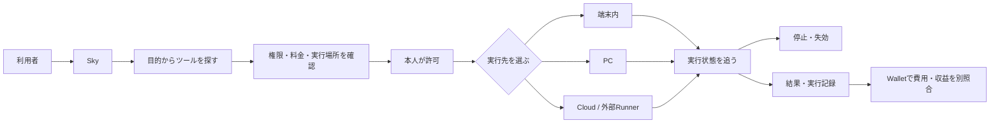

# Sky — 自動化を選び、許可し、動かし、止め、結果を受け取る場所

最終更新: 2026-09-27

> **この文書の読み方（2026-10-07整理）** — Skyの役割 → 提供形態 → Zemaとの連携 → 接続情報 → いまあるツール → 開発者向け → 利用時の注意、の順に並べ直しました。表題より上に追記されていた3節は本文の該当位置へ移し、過去の統合で落ちていた「接続情報の登録と再利用」「Telegramからの有効化」「導入候補22件のID付き表」を復元しています。何をどこから戻したかは[統合で失われた情報の監査](merge-loss-audit-20261007.md)にあります。ツールとエージェントの全体像は[エージェント・Tool総覧](agents-and-tools.md)を見てください。

## Skyとは

Skyは単なるツール一覧やアプリストアではない。自動化ツールを仕事として安全に使うために、探す → 権限・料金を確認 → 端末・PC・Cloudへ届ける → 実行・停止 → 結果・実行記録を受け取る、という操作を一つの入口へまとめる。

```mermaid
flowchart LR
  U[利用者] --> S[Sky]
  S --> F[目的からツールを探す]
  F --> C[権限・料金・実行場所を確認]
  C --> A[本人が許可]
  A --> D{実行先を選ぶ}
  D --> L[端末内]
  D --> P[PC]
  D --> R[Cloud / 外部Runner]
  L --> J[実行状態を追う]
  P --> J
  R --> J
  J --> X[停止・失効]
  J --> O[結果・実行記録]
  O --> W[Walletで費用・収益を別照合]
```

利用者に見える製品名はすべて **Sky** とする。保存済み履歴、SQLiteテーブル、JSON応答、画面ルーティングに残る `hub` / `Hub` は既存データと通信契約を壊さないための内部互換名で、新しい製品名ではない。

## 単独アプリとOS内の共通マーケットプレイス

2026-10-01の利用者指示により、SkyはOS導入を必須としない独立サービスとしても提供する。同じcatalog・Tool・本人認証・履歴・実行条件を共有し、OSからは既存のSky入口、単独Webでは `/sky/marketplace` から利用する。Sky配下のPWA manifestはSky専用identityと `/sky/marketplace` 起動、`/sky/` scopeを持つ。OS全体のmanifestは従来のまま。既存画面のデザイン、API認証、課金gate、未接続Toolの表示は維持する。installされたアプリの実端末受入と公開URLの配備は別条件で、manifest追加だけで合格とはしない。オンライン実行が前提で、オフライン実行の保証は追加しない。Miniからの利用はdevice capability契約と実機受入を別途通す。

## Zemaとの連携

SkyはToolを探して接続する場所、Zemaは選択後の依頼、実行、進捗、結果、履歴を扱う場所とする。Skyの自然文受付で担当が決まると、Tool IDと依頼をZemaへ引き継ぐ。引継ぎだけでは依頼本文をURLやD1へ保存せず、同一tabのsession storageへ最大2,000文字（AMCだけ8,000文字）・10分だけ置き、Zemaが対象Toolとして一度受け取ると削除する。これにより法務、特許、原稿等の依頼本文を新しいserver保存対象へ広げない。AMCではその後、本人がGoal・意図を確認して保存した場合だけ、依頼原文を含むGoalを本人別D1のWorkJobへ保存する。

Zema内で実行したjobは、受付、開始、完了、失敗をbrowser eventで即時表示し、本人別D1を3秒または15秒で再照合する。browser eventだけを完了証拠にはしない。CSV、Mercari、Market等の専用画面を持つToolはZemaに担当カードを表示し、専用画面で入力・確認した後、保存済みjob／receiptの進捗をZemaへ戻して確認する。

AMCは専用画面`/amc`に加えてZemaのカード内でも直接使う。32部隊の正本snapshotは読み取り専用、依頼から作るGoalは別の本人用記録である。AMCは会話LLMを呼ばず、計画の保存や着手記録をAIの起動・仕事完成と表示しない。

## Skyクラウド回答の取得と会話からの仕事引継ぎ（2026-10-02）

会話の現在の依頼文だけをcomponent memoryで仕事画面へ引き継ぎ、仕事選択・見積・承認は本人の操作とする。URL/新しいbrowser storage/D1へ依頼本文を追加保存せず、reloadで未送信の下書きは消える。保存済み回答は本人認証付きMarkdown attachment（private/no-store）で取得でき、未保存/削除済み/別本人は拒否する。本文削除は対象と不可逆性をdialogで確認し、state・usage・予算台帳は保持する。共有予算の確定額は請求書照合済みと表示しない。ローカルbuilt Siteの合成アカウントで引継ぎ/再読込/削除dialog取消/135byteのダウンロード一致を確認、Worker/D1で24項目合格。実AI/本番ownerログイン/Apple Payは未受入、追加課金なし。正本の全verifyと同一Site公開は次の検証。
証拠: [local results verification](evidence/sky-cloud-results-verification.json)。

> 次の「接続情報の登録と再利用」は2026-09-20の統合（merge `a3a24b8b`）で落ちていた節です。`963027cf` から本文をそのまま復元しました（2026-10-07）。

## 接続情報の登録と再利用

### IP Studio — SNS・ゲーム運用

Skyのアプリ一覧に `IP Studio — SNS・ゲーム運用` を登録した。参考画像と「何をしたいか」を入力するIP制作室を、Skyの接続・承認・停止状態から1タップで開ける。IP Studio側ではキャラクター／スキンの制作、Higgsfieldでの画像・動画生成、ゲーム別の導入記録、Instagram・YouTubeの投稿案、Makeへの送信までを同じIPの履歴で扱う。

Skyが保持するのは本人、仕事、接続参照、承認、停止、次の作業であり、IP Studioが保持するのは素材と生成・投稿案の参照である。Higgsfield APIキー、Make webhook token、Instagram／YouTubeのログイン情報はSkyの本文やIP Studioの入力欄へ保存しない。外部生成、投稿、広告、DM、ゲームへの提出は毎回確認してから実行する。

ローカル版では、Skyで `IP Studio — SNS・ゲーム運用` を選び「1タップでSkyに登録」→登録完了後「IP Studioを開く」の順で、同じ端末のIP Studio（`http://127.0.0.1:18767/`）へ移動する。Higgsfield、Make、Instagram、YouTube、Roblox、GTAの接続情報はSkyの「サービス接続を管理」から先に登録できる。

Skyの「サービス接続を登録」からInstagram、YouTube、Higgsfield、Make、Stripe、Roblox、GTA／FiveMの設定を保存できる。Toolを選んだときに未登録のProviderがあれば同じ画面を開き、「あとで続ける」か「登録して使う」を選ぶ。保存するのはアカウント名、チャンネル、公開URL、ワークスペースなどの再入力を減らすための設定で、パスワード、APIキー、アクセストークン、秘密鍵は保存しない。

Providerルーティングでは、用途ごとに実行する接続先を差し替えられる。画像生成、動画生成、文章・LLM、ワークフロー、SNS公開、ゲーム導入を個別に選び、HiggsfieldをRunway・Kling・Replicate・OpenAI互換アダプタ・ローカルモデルへ置き換えるような構成を保存する。Make、Instagram、YouTube、Roblox、GTA／FiveMも同じ選択枠で扱う。未接続の候補も先に選択を保存でき、実行時には必要なConnectorの登録へ戻す。これによりTool側はProvider名を固定せず、同じ入出力契約を満たすアダプタへ仕事を渡せる。

実際の仕事ではZemaの処理カードにある「この仕事のProviderを変更」から、今回だけの上書きを行う。Skyの既定ルーティングは残したまま、動画だけKling、文章だけローカルモデルという指定ができ、選択は同じProvider設定へ保存される。

SkyからZemaへ渡る仕事の既定実行器はOS内のローカルLLM（Local Action Assistant / Qwen）である。ローカルLLMが依頼の整理、手順、確認を進め、画像・動画生成やSNS公開など外部作用が必要な時だけ、Zemaで選んだProvider Connectorへ処理を渡す。外部LLMへ切り替える場合は、ZemaのProvider選択と別に明示的なremote同意を要求する。

内蔵の `Qwen3-0.6B-Q8_0-GGUF` は軽量な既定値で、品質を上げたい場合はZemaのモデルID欄から、接続済みのOllamaに `qwen3:8b`、`qwen3:14b`、`gemma3:12b`、`llama3.1:8b` などを指定できる。未導入モデルを選んでも自動で外部へ送らず、Ollamaまたは対応するローカルConnectorの接続待ちで止まる。

接続状態は `未登録`、`設定済み`、`再接続が必要` に分ける。Toolの利用許可は `sky_connections`、Providerの設定は `sky_provider_connections` に分けて保存し、設定済みなら次回から再入力を省略する。実際のOAuthや外部作用の成功を意味する状態ではない。

## 現在Skyにあるツール

### Web / PCで現在使える14件

- `rockstar-spider`: SPIDER。Skyで選び、Zema内でコード／テキストをローカル静的検査する。外部送信・保存なし。

| ツール                            | 実行場所                                        | 現在できること                                                                           | 明示的な限界                                                                                               |
| --------------------------------- | ----------------------------------------------- | ---------------------------------------------------------------------------------------- | ---------------------------------------------------------------------------------------------------------- |
| CSV整形・検査・納品               | Sky Cloud / Webブラウザ                         | CSV 1ファイルの受付、指定変換、独立検査、私有成果物、7日取得期限を管理                   | 外部市場の出品・連絡・入金・返金は本人操作。手入力入金はWallet収益にせず、buyer直接共有と独立queueは未接続 |
| RockstarOS Markets                | Webブラウザ / 公開市場API / PC offline backtest | 公開ライブ確率・出来高・流動性を表示し、固定commitのPolymarket bot backtest reportを検証 | 市場は読取専用、botはbacktest専用。秘密鍵・LIVE切替・注文・Wallet移動は無効。simulation PnLを収益にしない  |
| メルカリ収益スターター            | Webブラウザ / Shops Connector                   | 出品原稿、実費後の見込み利益、承認、出品・取引完了の進捗を管理                           | 個人版は本人が公式画面で操作。Shopsの自動連携と検証済み売上は固定IP Connector・契約・Token接続前は無効     |
| Instagram運用・受注型ブランド管理 | PC / MCP                                        | 写真の候補取込から広告・接客・受注・制作・改善を41操作で管理                             | 初期値はmock。Meta確認前の候補とAutopilotは外部作用を直接実行せず、実Provider・実投稿・実請求は未接続      |
| サブスク顧問                      | PC / MCP                                        | 契約、更新日、支払い失敗、通貨別月額をローカル台帳から確認                               | 読み取り専用。解約、支払い、税務申告は自動実行しない                                                       |
| ココナラ案件チェック              | Webブラウザ                                     | 依頼文と提案文の条件の食い違いを確認                                                     | 自動応募・返信・入金確認はしない                                                                           |
| 記事の無料版メーカー              | Webブラウザ                                     | 完全版原稿から無料紹介用の文章を作る                                                     | 自動執筆・投稿・販売はしない                                                                               |
| 出典整理ツール                    | Webブラウザ / PC接続                            | Markdownの出典URLを整理                                                                  | 出典内容の真偽確認はしない                                                                                 |
| 納品記録の照合                    | PC / Python                                     | 契約・成果物・制作記録・別レビューの不一致を探す                                         | 品質や秘密情報の不在を保証しない                                                                           |
| 法務受付                          | Webブラウザ                                     | 相談内容を整理し、公式情報と無料窓口を案内                                               | 法的助言・期限・受任を保証せず、自動連絡しない                                                             |
| 特許出願アシスタント              | Webブラウザ                                     | 発明情報から調査候補と出願書類ドラフトを作る                                             | 特許性・登録を保証せず、提出・支払を自動化しない                                                           |
| Jev品質評価                       | Sky Cloud / 明示同意後のremote evaluator         | 閉じた評価基準に対するEvaluation Receiptを作る                                          | provider設定が必要。評価は助言であり、権限・Tool成功・仕事完了を決めない                                    |
| AMC — 部隊とGoalの管理             | Webブラウザ / 本人別D1                           | 32部隊を閲覧し、依頼・Goal・意図から共通計画を作り、承認・進捗・検収を手動記録する       | LLM・AI実作業・自動送信は未接続。正本32部隊と本人用Goalを別管理し、自己申告を外部実証にしない              |

この14件は `lib/catalog.ts` で `ready` とされる。導入候補22件と合わせてcatalogは36件である。ここでの`ready`はSkyの商品UIと安全な縮退経路が利用可能というcatalog状態であり、外部credential設定済み、provider接続確認済み、実機OS合格、本番合格を意味しない。法務受付と特許出願アシスタントはOpenAI未設定時に503を返し、決定論的な案内・draft部分だけを継続する。CSV仕事はSky Cloudで受付・変換・検査・私有保存を行うが、販売・決済・buyer共有は別gateである。RockstarOS Marketsは互換商品名として残る公開ライブ市場の読取専用Toolで、取得失敗時にサンプル値で補完しない。外部Polymarket botは固定commit・clean treeのoffline backtestだけを利用し、秘密鍵と注文runtimeは接続しない。Fashion Brand Opsはstdio/HTTP MCP接続、サブスク顧問はローカルPC台帳、納品記録の照合はPC接続が必要。メルカリ個人版はWeb内で原稿と進捗を管理し、外部操作は公式画面へ引き継ぐ。Fashion Brand Opsの価格変更、外部生成、投稿・広告、DM送信、請求、返金、通知は個別承認が必要である。Jev品質評価は明示同意後のremote evaluatorとして評価Receiptを返すが、権限判定や仕事完了を決めない。

Jev ecosystemの他候補はroute、同意UI、rubric、receipt、credential、provider受入が揃うまで、この14件と`ready`件数には含めない。

### Skyに表示する導入候補22件

| 候補                    | 目的                                         | 現在の状態                                                                          |
| ----------------------- | -------------------------------------------- | ----------------------------------------------------------------------------------- |
| faster-whisper          | 音声の文字起こし                             | 候補。Skyからの自動導入・実行は未接続                                               |
| Transformers.js         | ブラウザ内AI                                 | 候補。モデル選定・配布・実行は未接続                                                |
| Playwright              | 許可されたWeb操作とテスト                    | 候補。第三者サイトの無人操作は未許可                                                |
| Jev Ultrafast           | 構造化された候補から一手を選ぶブラウザ操作AI | 候補。専用profile・許可site・直前承認・独立検証を設計済み。source取得と実行は未実施 |
| OpenJev                 | 公開modelによるlocal typed decision          | 候補。GPU／model／license／calibration未受入                                        |
| Jevlike                 | 小型option-scoring modelの研究               | 候補。AI Lab限定。業務判断へ未接続                                                  |
| Jev Trader              | order bookの売買判断研究                     | 候補。固定replayとPAPER限定。LIVE・秘密鍵は禁止                                     |
| Awesome Jev by TypeSafe | Jev patternのcommunity資料集                 | reference-only。実行Toolではない                                                    |
| TypeSafe Computer Use   | OCRとJevによるMac画面操作                    | 候補。隔離accountのobserve試験前                                                    |
| Jev Review              | Git差分／codebase review                     | 候補。自動修正・commit・push・mergeは禁止                                           |
| Jev Router              | Codex／Claude Codeのmodel routing            | 候補。既存session・権限・認証を維持する設計のみ                                     |
| Jev Browser             | 既存browser toolの連続操作loop               | 候補。専用profileとowned siteの試験前                                               |
| Mobile Jev              | Mobilerun経由のAndroid操作                   | 候補。wipe可能な隔離試験端末だけ。個人端末は禁止                                    |

候補は「使えるツール数」に含めない。

Jev ecosystem 10件の役割、権限、保存、停止、外部作用、受入条件は[Jev ecosystem全体詳細設計](jev-ecosystem-integration-design.md)を正本とし、Jev Ultrafast固有契約は[Jev Ultrafast統合設計](jev-ultrafast-integration-design.md)で補う。

#### 22件すべてのTool ID・用途・実行環境（2026-09-20の表を復元）

> 上の表は第三者由来の候補と資料・研究用の3件（OpenJev、Jevlike、Awesome Jev by TypeSafe）を載せています。`lib/catalog.ts` に登録されている導入候補22件（IP Studio 1件、旧Mr.由来11件、第三者由来10件）をTool IDつきで並べた表は、2026-09-20の統合（merge `df1f2000`）で落ちていたため、`5ee96a47` から復元しました。状態の書き方は当時のままです。現在の実行範囲は[全Tool詳細設計 16節](sky-tools-complete-design.md#16-導入候補22件)を優先します。

| Tool ID | 候補 | 目的 | 現在の状態 |
| --- | --- | --- | --- |
| `rockstar-ip-studio` | IP Studio — SNS・ゲーム運用 | 参考画像と「何をしたいか」からキャラクター・スキンを制作し、Instagram・YouTube・Roblox・GTAなどへの導線を一つの運用フローで管理します。 | このPCのIP Studio / Skyで接続状態と承認を管理。Sky実行と外部接続は検証後 |
| `faster-whisper` | faster-whisper | 音声から、編集できるテキストへ。PCで使える文字起こしエンジン。 | PC / Python。CPUまたは対応GPU。Sky実行と外部接続は検証後 |
| `transformers-js` | Transformers.js | ブラウザでモデルを実行。分類・要約などのワークフローの土台に。 | 対応ブラウザ / JavaScript・WebGPU等。Sky実行と外部接続は検証後 |
| `playwright` | Playwright | 許可されたWeb操作を再現。確認作業や繰り返しのテストを効率化。 | PC / Node.js・対応ブラウザ。Sky実行と外部接続は検証後 |
| `jev-ultrafast` | Jev Ultrafast | Web画面の操作候補を番号付きで整理し、AIが許可された一手を選ぶ高速ブラウザエージェント。 | 本人PC / Python 3.12以上・uv・Chrome remote debugging・Browser Harness・TypeSafe API・text model API。Sky実行と外部接続は検証後 |
| `jev-trader` | Jev Trader | order bookから売買方向を選ぶJev実験を、RockstarOSのPAPER市場で検証する候補。 | 隔離PC / Bun・TypeSafe API。RockstarOSではPAPER／replay限定。Sky実行と外部接続は検証後 |
| `typesafe-computer-use` | TypeSafe Computer Use | Mac画面を決定的に読み取り、Jevが次の操作を選ぶcomputer-use候補。 | 隔離したmacOS account / Python・uv・OCR・TypeSafe API・画面操作権限。Sky実行と外部接続は検証後 |
| `jev-review` | Jev Review | Git差分または指定scopeのcodebaseを、段階的なJev判断でreviewする候補。 | 本人PC / Node.js 24以上・Git・TypeSafe API。dashboardはloopback限定。Sky実行と外部接続は検証後 |
| `jev-router` | Jev Router | Codex／Claude Codeの各turnを、速いmodelまたは強いmodelへ振り分ける候補。 | 本人PC / Node.js 20.12以上・対応CLI・TypeSafe API。Sky実行と外部接続は検証後 |
| `jev-browser` | Jev Browser | 既存browser toolの観測・操作・検証loop内で、Jevが画面要素を選ぶruntime候補。 | 本人PC / Node.js 22以上・対応browser tool・TypeSafe API。Sky実行と外部接続は検証後 |
| `mobile-jev` | Mobile Jev | Mobilerun経由のAndroid端末で、Jevが次のmobile操作を選ぶagent候補。 | 隔離Android試験端末 / Node.js 22.16以上・pnpm 10.30.1・Mobilerun API・TypeSafe API。Sky実行と外部接続は検証後 |
| `coconala-proposal-draft` | ココナラ提案文の下書き | 案件条件から提案文と確認リストを作る既存の端末内処理。 | 既存コード・設計あり / Sky実行器は未接続。Sky実行と外部接続は検証後 |
| `gig-workflow` | 受託案件ワークフロー | 応募・交渉・制作・納品・売上確認の既存処理を段階ごとに支援。 | 既存コード・設計あり / Sky実行器は未接続。Sky実行と外部接続は検証後 |
| `coconala-inbox` | ココナラの依頼・添付整理 | 本人の依頼文と添付を整理する既存処理。 | 既存コード・設計あり / Sky実行器は未接続。Sky実行と外部接続は検証後 |
| `youtube-script-writer` | YouTube台本 | タイトル案、冒頭、台本、撮影キューを作る既存Service Cell。 | 既存コード・設計あり / Sky実行器は未接続。Sky実行と外部接続は検証後 |
| `seo-blueprint` | SEO・記事構成 | 検索意図、キーワード、構成案を整理する既存Service Cell。 | 既存コード・設計あり / Sky実行器は未接続。Sky実行と外部接続は検証後 |
| `landing-page-sprint` | LP・販売ページ制作 | 情報設計、コピー、画面と公開前確認を扱う既存Service Cell。 | 既存コード・設計あり / Sky実行器は未接続。Sky実行と外部接続は検証後 |
| `sales-objection-reply-builder` | 商談返信・見積り支援 | 正式な商品条件から返信文と確認事項を作る既存Service Cell。 | 既存コード・設計あり / Sky実行器は未接続。Sky実行と外部接続は検証後 |
| `user-interview-synthesizer` | 顧客インタビュー分析 | 発言をテーマ、根拠、仮説と次の検証に整理する既存Service Cell。 | 既存コード・設計あり / Sky実行器は未接続。Sky実行と外部接続は検証後 |
| `calendar-coordination` | 予定・カレンダー連携 | 既存Coreの予定解釈とカレンダー連携処理。 | 既存コード・設計あり / Sky実行器は未接続。Sky実行と外部接続は検証後 |
| `telegram-notifications` | Telegram通知・承認 | 既存Botの依頼受付、通知、進捗確認をSkyの仕事につなぐ処理。 | 既存コード・設計あり / Sky実行器は未接続。Sky実行と外部接続は検証後 |
| `producthunt-discovery` | 外部ツール候補の発見 | Product Hunt公式API向けの候補検索処理。 | 既存コード・設計あり / Sky実行器は未接続。Sky実行と外部接続は検証後 |

旧Mr. Automation Hub由来の11件もSkyの導入候補に追加した。提案文、受託ワークフロー、依頼整理、YouTube台本、SEO、LP、商談返信、顧客インタビュー、予定、Telegram通知、外部ツール発見を含む。各候補の実行器、本人の外部アカウント接続、料金・結果照合は未受入である。[候補ごとの受入条件](sky-mr-automation-candidates.md)を参照。

自動化として接続可能性のあるJev周辺7件も候補に加えた。ブラウザ操作2件、PC画面操作、Android操作、コードレビュー、モデル振分け、市場のPAPER試験である。資料集とモデル研究2件は実行する自動化ではないため含めない。外部送信・書込み・購入・実取引は承認と結果確認の受入前に有効化しない。

PC内でSky Tool SDK 0.1.2から起動したAppは、所有者専用の接続定義をConnectorが検出した場合だけSky一覧に表示する。カードから接続するとMCP初期化と機能一覧を確認し、その後の実行は内容別の一回承認を要する。停止時は一覧から除き、古い承認を失効させる。公開HTTPS URLと開発者キーはPC内専用起動には不要で、公開登録時だけ必要。これはWeb／PC経路であり、native OSのRegistry導入とは別の受入である。

### native OS開発版に内蔵する6種類・9バージョン

| 署名済み開発ツール    | 内蔵版        | 用途                                     |
| --------------------- | ------------- | ---------------------------------------- |
| 共有用チェックリスト  | 1.0.0 / 2.0.0 | 行をMarkdownチェックリストへ変換         |
| 引用整理              | 1.0.0         | 明示された出典を一覧へ整理               |
| 提案下書き            | 1.0.0 / 1.1.0 | 募集条件から送信前の提案下書きを作る     |
| 文章を整える          | 1.0.0 / 2.0.0 | 空白と空行を整理                         |
| リストの重複を整理    | 1.0.0         | 重複行の除去と並べ替え                   |
| 入力テキストのSHA-256 | 1.0.0         | 入力した文字列のUTF-8 hashとサイズを計算 |

これらは `systems/rock-star-os/examples/registry/` からBuildroot imageへコピーされる開発署名パッケージ。すべて端末内の有限テキスト処理で、権限は `text.input` と `text.output`、価格は0 USD。公開RFCテスト鍵を使うため、本番配布の作者本人性や信頼を証明するものではない。

## Skyの優位性

個々の自動化処理だけなら、iPhoneアプリ、Webサービス、PCスクリプトでも代替できる。SkyがOSと組み合わさる意味は、処理内容そのものではなく、異なる実行先の自動化を同じ制御契約で扱うことにある。

- 実行前: 作者・版・権限・送信先・料金を同じ形式で確認する。
- 実行中: 端末内、PC、Cloudのどこで動いても同じ仕事IDで状態を追い、停止できる。
- 実行後: 結果、失敗、使用版、費用の記録を同じ履歴へ戻す。
- 更新時: Tool packageの追加・更新ではOS全体を再buildせず、署名、失効、rollbackをTool単位で扱う。
- 障害時: 再起動や接続切れを「成功」にせず、中断・不明・再確認を区別する。

現在この価値はQEMUと開発用のWeb/PC経路で部分的に検証済み。実端末、実Cloud provider、実課金、一般公開を完了したという意味ではない。

## 開発者が自動化を追加する場所

開発者はPCの`/studio`またはSky Tool SDKを使う。SDKは自動化したい既存関数を`handler`へ接続する雛形であり、用途、禁止場面、入出力Schema、Adapter、権限、副作用、料金、timeout、成功確認、Fund互換情報を一つの定義からPackageとMCPへ変換する。これにより「Sky専用に全コードを書き直す」のではなく、「自動化できる処理へSkyの契約を被せる」導線にする。

登録したToolは最初に所有者領域へ入り、開発者の宣言としてRegistryへ掲載できる。ただし、宣言公開とSky検証済み公開を分ける。現在のDeveloper PreviewではSandbox・作者署名・公開remote接続の検証は未実装なので、自動インストールは無効のままである。SDKの匿名利用集計はPackage ID、Tool名、結果、処理時間だけを扱い、入力・出力・会話・秘密情報を送らない。詳細は[Sky Tool SDK / Rock Studio](sky-tool-sdk.md)を正本とする。

> 次の「Telegramからの有効化」も同じ統合（merge `a3a24b8b`）で落ちていた節です。`963027cf` から復元しました（2026-10-07）。Sky側の検証は `lib/sky-telegram-bridge-auth.ts`、Bot側の `/sky_build`・`/sky`・`/sky_tools` はこのリポジトリの外にあります。

## Telegramからの有効化

Rock Studioまたは`/sky`画面で、`published_declared`または`verified`の自作Toolを選び、Telegram用の有効化コードを発行できる。コードは`SKY-XXXX-XXXX-XXXX-XXXX`形式の不透明な値で、D1にはSHA-256だけを保存する。発行者は使用回数、期限、失効を設定できる。

Telegramでは`/sky_build 自作コード`でコードを解析し、PackageのManifestと一回用の有効化コードを発行できる。発行された`/sky CODE`を送ると、BotはSkyの内部Bridgeでコードを検証し、Telegram利用者IDにTool PackageへのGrantを結び付ける。`/sky_tools`で有効化済みToolを確認できる。同じ利用者が同じToolを再送してもGrantは増えず、入力ソースは保存せず、コードはログへ出さない。

このコードはソースコードをBotへ送ってビルド・実行する仕組みではない。既存関数をSky Tool SDKでPackage化し、Sky側で公開した後に、Telegramから利用権だけを渡す設計である。外部書込み、決済、送信などの副作用はPackageの宣言と実行時確認を別に要求する。`LM_SKY_URL`と`LM_SKY_TELEGRAM_BRIDGE_SECRET`をBot側、`SKY_TELEGRAM_BRIDGE_SECRET`をSky側へ設定する。

## Skyサービスのローンチ設計

[Skyサービス設計とローンチ受入](sky-launch-design.md)を、独立Sky・OS/他アプリ接続・作者公開・有料市場の実用化設計として追加。既存のデザインと状態機械・本人認証・課金gateを維持し、設定状態と本番合格を分離する。設定状態APIは秘密や本人情報を返さず、必要サービスの利用条件を各画面へ反映する。利用者向け入口は `/sky/help`。

## 利用時の注意と復旧（READMEに置かれていた案内）

> この節は、2026-10-05時点の `main`（`624124cf`）の `README.md` 冒頭と末尾に置かれていた日本語の利用案内です。同日の統合（merge `ecb4b2af`）でREADMEごと古い版へ戻って消えていたため、2026-10-07にここへ移して復元しました。本文は当時のままで、リンクだけこの文書からの相対パスに直しています。`<!-- … -->` の印も元のまま残しています。READMEは英語の入口に保ち、利用時の細かい注意はこの節へ集めます。

### 接続確認とサインイン切れ

<!-- sky-access-recovery:start -->
Skyが接続を確認している間や、通信失敗・サインイン切れの間は実行を停止します。画面を開いたまま別タブでサインインし、戻って「接続を確認」してから改めて実行してください。再確認だけでは再実行や課金をしません。未保存入力は開いている画面に保持されますが、再読み込みでは消える場合があります。接続設定の復旧時も編集した入力を保持し、保存済み設定を読み直せない間は保存できません。
<!-- sky-access-recovery:end -->

### Skyの公開判定

`npm run sky:launch:check`で不足を確認できます。`node scripts/check-sky-launch.mjs --require-stage focused`は、既存の本人隔離・復旧条件に加え、実クラウドAI、公開版の両端末試験、全Tool分類、Apple Payが未受入なら失敗します。CSVの既存50円決済成功は、これら全部の合格を意味しません。

### Skyサービスの利用とローンチ設計

Skyの単独マーケットは `/sky/marketplace`、利用方法・保存/削除・接続状態・対応環境は `/sky/help`。OS導入は必須ではありません。外部AIや購入/販売は必要な接続設定と本人の条件が揃ってから利用できます。[サービス設計と受入](sky-launch-design.md)・[段階別の受入記録](../data/sky-service-launch.json)・[運用と作者/決済の受入手順](sky-launch-operations.md)を参照してください。設定あり・コード試験・本番合格は別の状態です。

### Skyの回答取得・会話引継ぎ（v28配備、実AIは準備中）

OpenAIを選んだ会話で「この依頼文を仕事へ引き継ぐ」を押し、仕事を選んで見積を確認します。この操作だけではAI送信や課金は始まりません。保存した回答にはMarkdown取得と本文削除の確認画面を用意しました。未送信の依頼文はreloadで消えるため、必要な内容は手元に保持してください。実AIの接続は準備中です。

<!-- sky-cloud-text-preview:start -->
Zemaの「仕事」からクラウドAIの依頼準備・見積履歴を確認できます。仕事は再読込後も同じURLへ戻り、認証期限切れは同じ仕事へのサインインを案内します。回答のクラウド保存は初期offです。現在、実Provider資格情報・信頼済み料金・請求照合は未受入のため、AI実行は準備中です。入力してもAIへの送信や課金は始まりません。料金未設定時は見積もりも保存できません。
<!-- sky-cloud-text-preview:end -->

### Skyの文章ツール

Sky／Marketで文章ツールを選び、サインインして実行します。「この端末に保存」で成果を同じツールから開き直せます。保存はこのブラウザだけ（全体20件）で、共有端末の他利用者も閲覧可能です。別端末へ移す場合はMarkdownで保存してください。本番配備は公開範囲の確定待ちです。

### AMCの有限実行をローカルで試す

AMCは [Goalと部隊の画面](../app/zema/amc/page.tsx) と [Codex用3役・起動口](../toolkits/amc-agent/README.md) を備えます。Webの自律実行・同期と実モデル完走は未受入です。

AMCの開発用CLIは、OSの導入なしでNode.jsから実行できます。`npm run amc:autonomy:fixture -- help`で操作を表示します。新しい私有ディレクトリに固定の算術Goalを作り、子Taskの実行・ファイル検査・保存・再開・停止を試せます。[設計と実行手順](amc-autonomy-fixture.md)を参照してください。実際の仕事、Codexや外部AI、Sky/ZemaのWeb画面へは未接続で、最後は本人の検収待ちになります。

### PAPER市場・ココナラ・CSV・法務/特許・IP Studio・クラウドAIの個別の注意

- PAPER市場は検証用です。提案後に同じ画面で内容を承認し、実行したレシートは「PAPER実行履歴」から再読込後も確認できます。サンプル価格は実売買の実績ではありません。
- ココナラの案件管理では、サインイン切れ時も開いている入力画面を保持します。ダイアログの別タブでサインインし、「サインイン後に接続を確認」してから保存します。再確認だけで案件を再送しません。

<!-- sky-service-recovery:start -->

- CSV受付の完了結果・検査・ダウンロードは `/csv` の同じ画面で確認できます。認証が切れた場合はサインイン表示から `/csv` へ戻り、保存済み受付を再取得してください。Stripe診断はHTTP status・許可済みerror code・request IDのみを記録し、秘密値・入力本文・Provider messageを記録しません。50円本番CSV試験は支払い照合・成果物保存・再取得まで確認済みです。クラウドAIの実接続は未受入です。
- 法務・特許の端末内処理は、任意チェックで本文を含まない実行履歴を保存できます。未ログインや履歴保存失敗でもローカル結果を保持し、別タブのサインインから復旧します。
- 履歴保存の失敗時は固定の診断コードと、完了通知の場合は受付IDを表示します。本文や元例外の内容を診断へ送らず、ローカル計算の例外を自動再実行しません。
- IP StudioはPCで起動してから専用画面を開きます。スマートフォンからPCへの接続は準備中のため、PC内アドレスへのボタンは表示しません。
- ココナラの案件管理は、17項目の案件内容と変更履歴を本人別にサーバーへ保存します。実機で下書きの作成・編集・再読込を確認済みですが、ココナラへの契約送信や送金を代行しません。
- 発注前の案件は「下書きを削除」で対象を確認してから削除できます。担当開始後の案件は削除せず、通信失敗時は一覧を再読込して結果を確認します。
- クラウドAIは料金見積・支出上限・利用明細の接続まで実行を停止します。オンライン法務・特許には20秒の通信上限を用意し、結果不明時に自動再送しません。実Providerの応答・使用額は未受入です。
- 接続状態は一般商品の購入・販売とCSV専用50円試験を分けて表示します。CSV決済の設定を、一般商品の販売開始とみなしません。
- クラウド文章生成の料金表v2は通常入力・キャッシュ読込・キャッシュ作成・出力を分けます。見積は最高入力単価を使い、実使用量やtierが不明なら費用確定を止めます。本文を含まないrequest-bound quote、親jobで共有する予算予約、一度だけの送信claim、利用明細と任意成果保存は正本ローカルで接続しました。会話UI・公開環境への接続と実Provider受入は残り、クラウド実送信は無効です。内部予算は入金済みWallet残高ではありません。
- Toolのサインイン切れでは、元の画面を開いたまま別タブでサインインし、「サインイン後に接続を確認」を押してください。接続確認だけでは実行せず、未保存の入力を保持します。
- 掲載候補の下書きは、入力を添えた定型テンプレートです。AI分析や外部サービスの実行ではありません。顧客インタビューと予定調整は、根拠・テーマ・日時などを本人が確認して記入します。候補の本文・結果はサーバーへ保存しないため、必要な内容はMarkdownで手元へ保存してください。

<!-- sky-service-recovery:end -->

## 正本と互換境界

- 製品名・画面名: `Sky`
- OS全体の現行表示名: `avocadoOS`
- OS内部識別子: `dev.rock`
- 互換商品名・path・package prefix: `RockstarOS` / `rockstaros-*` / `/rockstaros`
- 金融記録: `Wallet`
- 内部互換名: `hub` / `Hub`
- Webカタログ正本: `lib/catalog.ts`
- native内蔵カタログ正本: `systems/rock-star-os/examples/registry/`
- native package仕様: `systems/rock-star-os/docs/TOOL-SDK.md`
- ToB掲載・ToC Timeline・MCP接続設計: `docs/sky-mcp-architecture.md`
- 開発者SDK・PC登録・Package・公開状態: `docs/sky-tool-sdk.md`
