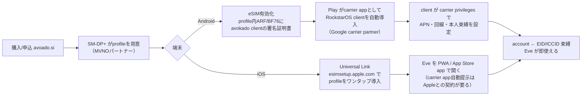

# 03 eSIM — 「eSIMを入れる手間だけでRockstarOSが入る」の設計

現行位置づけ（2026-11-20本人確認）: SIM/eSIMはOS導入時に使う仕組み。主商品はmii、最小構成はNoah。以下は導入方式の設計であり、実回線発行・自動導入・全OS受入の実績ではない。料金・provider条件は既存の個別gateで確認する。

**2026-11-21 の決め（0章）が、この文書の1〜7章より優先する。** 1〜7章は消さずに残し、0章と食い違う所には「→ 0章」と印を付けた。

## 0. 載せる先と回線の型（2026-11-21）

### 0.1 一言で

**eSIM（とSIM）は、人のスマホに売らない。RockstarOS が載る自社の端末（mii の Hub・専用端末・車）に内蔵する、自社クラウドへ届くための回線と鍵にする。** スマホは Noah・Eve を URL で開いて頼む所（リモコン）にする。

### 0.2 何が SIM に入り、何が入らないか

| 物 | 大きさ | eSIM に入るか |
| --- | --- | --- |
| eUICC（eSIM のチップ）全体の記憶域 | 約 400KB〜1MB（製品の公開値: ST33j 420KB、ST33j1m 1MB、Soracom industrial 最大 400kB） | — |
| 回線の profile（IMSI・ICCID・鍵・網の設定・小さな SIM アプリ） | 数十 KB | 入る |
| 端末アプリの署名の hash（Android の carrier privileges。ARA-M／ARF の規則 1 件は 20〜32 バイトの hash ＋ 8 バイトの権限） | 数十バイト | 入る |
| RockstarOS 本体・client・Agent・モデル | MB〜GB | **入らない** |
| 「plugin」 | — | 入るのは**利用権と鍵**だけ。Agent 本体は Hub・クラウドで動く |

### 0.3 載せる先ごとの判定

| 載せる先 | eSIM で起きること | 判定 |
| --- | --- | --- |
| mii の Hub・専用端末・車（自社の端末） | Wi-Fi の設定なしで、箱から出してすぐ自社クラウドへつながる。端末の本人性。更新と Agent の配信。回線の遠隔切替（SGP.32） | **やる**。回線つきは別モデルか option（[avocado-mini-cellular.md](../avocado-mini-cellular.md) の 10-10 の決めのまま） |
| Android のスマホ | SIM に署名を入れたアプリが回線の権限を持てる。標準の Android は「アプリを入れますか」の案内と通知（既定 24 時間後）から Play を開く所まで | **やらない** |
| iPhone | iOS 17.4 以降、URL 1 つで eSIM の追加画面が開く。入るのは回線だけ | **やらない** |

スマホをやらない理由（3 つ）:

1. **手数が減らない。** スマホは URL を開いてパスキーで入る形（PWA）が一番少ない。eSIM は「回線を追加する」手順が 1 つ増える。OS の書き込みは eSIM では代われない（0.2）。「入れる手間を無くす」は、**入れ済みの端末（mii・Pixel）を売る**ことで満たす。
2. **鍵はパスキーで足りる。** スマホの本人性は、今のパスキー（`lib/jennifer-passkey.ts`）で足りる。
3. **契約の重さが出ない。** 重さを作るのは、音声つきの主回線と、口座振替・キャリア決済という請求の方法。データだけの副回線を Stripe のカードで売ると、未払い時の強さはアプリの月額と同じ。主回線を売るには本人確認・サポート・値下げ競争が要り、今の体制ではやらない。10-07・10-10 の「eSIM は解約しにくい」は、この理由で**取り下げる**（07 の 2026-11-21）。

### 0.4 Hub の回線の型

| 項目 | 決め | 理由 |
| --- | --- | --- |
| 回線 | 国内 LTE、IoT 向けデータ専用、SMS なし。試作はカード、量産はチップ型で SGP.32 対応 | 10-10 の決めのまま |
| 通信先 | **自社クラウド（RockstarOS の制御・Agent・音声）だけ**に絞る（私設 APN か、端末側の宛先制限）。OS・モデルの更新、映像は Wi-Fi | 500MB に収まる。下の届出と本人確認で「他人の通信を媒介しない」側に寄せられる |
| 原価の目安 | 500MB を含んで月 385 円（SORACOM plan-K2 K2-500MB の定価・税込、使用中）。準備完了・休止中は月 192.5 円。初期費用はチップ型 1,111 円 | 2026-11-21 取得。卸値は見積りで変わる |
| 請求 | 回線料は機器のサービス料に含め、別の明細にしない（10-10 のまま）。決済は Stripe のカード | キャリア決済は通信会社と組む時だけ |
| 付ける順 | Wi-Fi が無い所（引渡し前の建築、車、工場、屋外、施設）から | 家庭は Wi-Fi があり、回線の価値が小さい |

### 0.5 制度（確かめていない。専門家と総合通信局に確認する）

- **電気通信事業の届出。** 総務省の参入マニュアル（追補版）は、回線の料金や条件を自分で決めて提供すると届出・登録が要り、変えずに機器と一緒に提供するだけなら要らない、通信を媒介しない IoT サービス（位置管理など）は要らない、と整理している。Hub の通信先を自社クラウドに絞り、回線料を機器のサービス料に含める形がどちらに当たるかは、総合通信局に聞く。
- **本人確認（改正携帯電話不正利用防止法）。** 2026-05-22 成立・05-29 公布、公布から 1 年以内に施行。データ専用 SIM が対象に入る。総務省の制度整備の方向性（2026-07）は、SMS つきを対象にし、IoT 向けは対象外とする方向で検討中（範囲は未定）。**SMS なし・自社クラウド行きだけ**の Hub 回線は外れる側に寄せる。政令・省令が出たら確かめ直す。1〜7 章の「音声回線でなければ軽い」（§7）はこの改正で古くなる。

### 0.6 iPhone の人の入口

URL 1 つ（Noah・Eve の PWA）。App Store のアプリは作らない（10-16「携帯はリモコン感覚。アプリは作らなくてよい」と同じ）。iPhone の Web の通知はホーム画面に追加した時だけ届くので、初回に「ホーム画面に追加」を 1 回だけ案内する（task 90 の通知と同じ扱い）。

### 0.7 既存コードの扱い

消費者向け eSIM のコード（`app/api/esim/**`、`lib/esim-*.ts`、`lib/esimgo-*.ts`、`toolkits/esim-bootstrap/`）は消さない。発行の gate（`providerDebitEnabled`）は既定で閉じたまま。Hub の回線は、端末の接続状態（[avocado-mini-cellular.md](../avocado-mini-cellular.md) の状態）と、account への端末束縛（`lib/rockstar-entitlement-*.ts`）で扱う。ICCID・EID を束縛キーに足す計画（02 §3）はそのまま。

### 0.8 この決めが変わる条件

- 有料の利用者が 1,000 人を超え、継続率が出た後に、通信会社から「主回線に RockstarOS を付けて売る」組み方の申し出がある時（スマホの eSIM を考え直す）。
- 政令で、SMS なし・IoT 向けも本人確認の対象になった時（Hub の回線にも本人確認の流れが要る）。
- 総合通信局の答えが「届出が要る」だった時（届出をしてから付ける。届出自体は登録より軽い）。

## 1. eSIMは何で、何ではないか

| | 決定 |
| --- | --- |
| 何のためか | **すでに持っているスマホに RockstarOS（＝Eve・Sky・本人の仕事）を入れる最短の手段。** OSをダウンロードして設定する手間を、「eSIMを入れる」一回に置き換える（→ 0章。スマホには売らない。自社の端末の回線と鍵にする） |
| 売るもの | **RockstarOS の回線付き利用権**。月額。データ残量（GB）は売らない。通信は RockstarOS のcloudに届くための最小限で、GBで数えない |
| 売らないもの | 旅行用データeSIM、通話番号、他社回線の再販 |
| プロバイダと契約する理由 | 技術的に不可避だから（eSIM profileはMNO/MVNOのSM-DP+からしか出せない）。特にiOSは、Appleの規約上、アプリから直接eSIMを書くには通信事業者としての契約が要る |
| 契約の強さ | （→ 0.3 の 3。データだけの副回線では重さが出ないので、この理由は取り下げた）回線契約と同じ重さ（カード/口座引落し、未払い時は回線停止）。**これを売り文句にはしない**。ユーザーには「使い続けたくなる価値」を見せる（2026-10-10 YouTube Premium型の結論を維持） |
| OS本体をeSIMに入れるか | **入れない。** eSIM profile は数十KBで、鍵・回線設定・アクセス規則しか入らない。OSの実体はcloud（RockstarOS runtime）とスマホ側のclient。eSIMは「鍵と回線」 |

導入の目標は、**eSIMをRockstarOSの鍵付き回線として使い、適合確認後にEveへ進めること**。自動導入は下記のprovider・端末・配布条件が整った場合に限る。

## 2. 条件付きの導入設計（Android / iOS）

```mermaid
flowchart LR
  A[購入/申込 avoado.si] --> B[SM-DP+ がprofileを用意<br/>（MVNOパートナー）]
  B --> C{端末}
  C -->|Android| D[eSIM有効化<br/>profile内ARF/BF76に<br/>avokado clientの署名証明書]
  D --> E[Play がcarrier appとして<br/>RockstarOS clientを自動導入<br/>（Google carrier partner）]
  E --> F[client が carrier privileges で<br/>APN・回線・本人束縛を設定]
  C -->|iOS| G[Universal Link<br/>esimsetup.apple.com で<br/>profileをワンタップ導入]
  G --> H[Eve を PWA / App Store app で開く<br/>（carrier app自動提示はAppleとの契約が要る）]
  F --> I[account ← EID/ICCID 束縛<br/>Eve が即使える]
  H --> I
```

- **Android**: eSIM profile のアクセス規則（ARF / BF76）に avokado client の署名証明書を入れると、client は *carrier privileges* を得る（APN・回線設定・`EuiccManager` 操作）。Google の carrier partner になると、SIM検出時に Play がその carrier app を自動導入する。これが「入れるだけでOSが入る」の実体。**（2026-11-21 訂正）** AOSP の公開資料と標準のコード（`InstallCarrierAppTrampolineActivity`）で確かめられたのは、SIM 検出時に「アプリを入れますか」の画面を出し、入れていなければ既定 24 時間後に通知し、押すと Play のページを開く所まで。**無言の自動導入は確認できていない**（Google との個別契約や OEM の実装次第で、未確認）。「入れるだけでOSが入る」とは書かない。Pixel向け native RockstarOS（GrapheneOSベース）は別系統で、eSIMはそちらにも同じ鍵を渡す。
- **iOS**: アプリ内でeSIMを書く `CTCellularPlanProvisioning` は Apple の entitlement（通信事業者契約が前提）が要る。無くても iOS 17.4+ の universal link（`esimsetup.apple.com/esim_qrcode_provisioning?carddata=LPA:1$...`）でワンタップ導入できる。導入後の「OS」は Eve の PWA または App Store app。iOSは client を深く入れられないので、**eSIMが本人と回線を束ね、Eveはcloud側で動く**。
- **共通**: account が正本（2026-10-15決定を維持）。eSIMは account に EID/ICCID を束ねる「鍵」。機種変更・mii・Pro・将来のロケットでも、同じ account の続きから動く（Apple の iCloud と同じ役割）。

## 3. これが成り立つ条件（Codexに調べさせる・決めさせない）

| 条件 | 現状 | 誰が決める |
| --- | --- | --- |
| profile metadata に自社証明書（ARF/BF76）を入れられる MVNE/MVNO | 未確認。esim-go のような再販APIでは普通できない。候補: 日本 IIJ（自社SM-DP+）, SORACOM, 海外 1GLOBAL/Truphone, Telna, Kigen, Thales | Codex task 10 で候補比較表 → 本人が選ぶ |
| Google carrier partner（Playの自動導入） | 未申請 | 本人 |
| Apple carrier entitlement（任意。無くても universal link で可） | 未申請 | 本人 |
| 電気通信事業の届出（日本: 届出電気通信事業者。米国: MVNOのFCC登録/CPNI/USF） | 未着手 | 本人（法務） |
| 私設APN / 通信をRockstarOS cloudに限定する設計（GBを売らない根拠） | 設計なし | Codex task 10 |
| 月額の請求と未払い停止（Stripe or carrier billing） | services/sky-billing に月次・後払いの骨格あり | Codex task 11 |

## 4. 現行コードとの対応

| 役割 | 現行 | 扱い |
| --- | --- | --- |
| カタログ/注文/発行/QR/導入証明/端末利用権/照合/webhook | app/api/esim/**, lib/esim-*.ts, lib/esimgo-*.ts（esim-go前提） | 骨格は再利用。**esim-go は「profileを出せる相手」としては暫定**。provider adapter 境界（lib/esimgo-provider.ts）を `lib/esim/providers/<name>.ts` に切り直し、ARF対応providerに差し替えられる形にする |
| 端末束縛・利用権 | lib/rockstar-entitlement-*.ts, lib/esim-device-entitlement*.ts, lib/esim-attested-device-activation.ts（Android key attestation） | 維持。eSIMの EID/ICCID を entitlement の束縛キーに追加 |
| 利用開始UI | app/connect, components/esim-purchase-setup.tsx, components/rockstar-service-setup.tsx | 文言を本定義に合わせる（「データ」「GB」を出さない） |
| 旧定義の文書 | docs/service-design/08-*, docs/native-os-integration.md の「通信＋si利用権bundle」節 | 本ファイルを正本にし、旧節は「2026-10-15版」と明記して残す |

## 5. 料金

候補額・月額・仕事の収益からの天引きは[05-business.md](05-business.md)を正本とする。ここで別の料金を定義しない。既存Wallet/settlement契約を使い、商品料金・通信・si使用料・外部実費を分ける。データ残量の販売を主商品にしない。

## 6. OS導入系統の検証順

製品全体の最初の受入は[00 全体像](00-overview.md#1-一言で)の本人Mac上のNoah。以下はその前提条件にはしない。

1. 準備済みsandboxで、発行・導入案内・Eveへの導線・account束縛を個別に確認。実回線発行や端末自動導入の合格へ読み替えない。
2. task10でproviderへの質問票と適合条件を整理。契約・申込・問い合わせの送信は本人の明示許可が必要。
3. provider・配布条件が確定してから対応adapterとAndroid/iOSの導入経路を検証する。
4. 請求・利用権・回線停止は既存課金契約とproviderの個別受入を通す。

## 7. 法務・規約の注意（売り文句にしない理由）

- 「解約しにくい」を売りにすると、日本の特定商取引法・電気通信事業法の説明義務、米国の州消費者保護法（自動更新・解約容易性）に抵触しやすい。設計上は普通の回線契約と同じ重さで良いが、**UIと広告では「いつでも解約できる」を明記**する。
- 回線を提供する時点で、日本では届出電気通信事業者（届出のみ、免許不要）。本人確認は音声回線でなければ軽い（→ 0.5。2026-05 の法改正でデータ SIM も対象に入る。この文は古い）。米国はMVNOとしてFCC登録・CPNI義務。これらは provider との契約形態（再販か、自社MVNOか）で変わる。
